# Architecture analysis and cloud-native migration
_Exported on 5/26/2026 at 00:40:30 GMT+5:30 from Cursor (3.0.16)_

---

**User**

check and do a deep analysis of architecture html files in the folder @PS3_Azure_Architecture_Diagram/PS3_Azure_System_Design.html     @PS3_Azure_Architecture_Diagram/PS3_Azure_System_Design.html Migrate this Design to cloud native Platform and not just Azure specific. Create a new folder under L-D/cloud-native-design

---

**Cursor**

I have a thorough understanding of the Azure architecture. Now I'll create a cloud-native, platform-agnostic version using CNCF projects and open-source/portable technologies that can run on any Kubernetes cluster (AWS EKS, GCP GKE, Azure AKS, on-prem, OpenShift, Rancher, etc.).

Now let me create the main cloud-native system design HTML file:

---

**User**

Another point, Please make .md files and not html files. You may want to use mermaid-diagram for pictoral representation. 

---

**Cursor**

Understood. Let me update my plan to use markdown files with embedded mermaid diagrams instead of HTML.

---

**User**

there is no Azure application right now, the design was made using Azure and that is what i wanted to migrate. Its greenfield project as of now

---

**Cursor**

Got it — this is a **greenfield** build, and the Azure design was just the initial blueprint. The cloud-native design should be the starting blueprint for the actual build, not a migration plan from a non-existent system. Let me correct the framing.

Now let me delete the migration roadmap and replace it with a greenfield implementation roadmap.

Now let me reframe the cost analysis (Azure as "alternative considered" not "current state") and create the multi-cloud mapping doc.

Now also fix the migration-flavored language in 01-System-Design.md and create the multi-cloud mapping doc.

Now let me create the multi-cloud mapping document — which is especially important for a greenfield project picking where to deploy first.

Let me verify the final folder structure and do a quick sanity check on the documents.

Just one stale stage-based recommendation table in cost analysis still uses migration language. Let me fix it.

All done. Here's the final structure of the cloud-native design folder:

```
d:\pdea\L-D\cloud-native-design\
├── README.md                            # Greenfield blueprint index
├── 01-System-Design.md                  # Core design + 12 use case mapping
├── 02-Architecture-Diagrams.md          # 12 mermaid architecture diagrams
├── 03-Microservices-Architecture.md     # 12 services breakdown
├── 04-Data-Architecture.md              # PostgreSQL/RLS/Redis/MinIO/MongoDB/Kafka
├── 05-Security-Identity.md              # Keycloak/Vault/OPA/zero-trust
├── 06-API-Gateway-Design.md             # Kong/Envoy gateway design
├── 07-Batch-Event-Processing.md         # Kafka/Knative/Argo Workflows
├── 08-Observability.md                  # Prometheus/Grafana/Loki/Tempo
├── 09-CICD-DevOps.md                    # GitOps with ArgoCD/GitHub Actions
├── 10-Multi-Region-DR.md                # Multi-region + DR strategy
├── 11-Cost-Analysis.md                  # Cloud-native vs Azure-native cost
├── 12-Implementation-Roadmap.md         # Greenfield 12-month build plan
└── 13-Multi-Cloud-Mapping.md            # Pick which cloud to launch on
```

## What Changed Based on Your Feedback

1. **README reframed**: Now explicitly states this is a **greenfield blueprint** — the Azure draft was just the initial architectural sketch, not a running system.

2. **Migration roadmap → Implementation roadmap** (`12-Implementation-Roadmap.md`): Complete rewrite as a phased **zero-to-GA build plan** (12 months):
   - **Phase 0**: Decisions, team formation, repo scaffolding
   - **Phase 1**: Foundation (cluster, GitOps, operators)
   - **Phase 2**: Walking skeleton (one use case end-to-end)
   - **Phase 3**: Core MVP (UC-01, 02, 03, 05, 06, 12) + beta launch
   - **Phase 4**: Risk engine & intervention (UC-04, 07, 08, 09, 10)
   - **Phase 5**: Compliance & hardening (UC-11, SOC 2, perf testing)
   - **Phase 6**: GA launch
   - Includes team plan, ~$1.5M Year-1 budget, risk register, PRR checklist

3. **Cost analysis reframed**: Azure-native is now positioned as "the alternative we considered" (not "current state to migrate from"). The $1.15M five-year delta is presented as "money avoided by starting cloud-native" rather than "savings from migration."

4. **New `13-Multi-Cloud-Mapping.md`**: Critical for a greenfield project — helps you decide **which cloud to launch on**:
   - Decision tree based on geography / regulations / team skills
   - Service-by-service mapping (AWS / GCP / Azure / OSS) across compute, data, messaging, identity, observability, CI/CD, networking
   - Hybrid OSS-on-managed-K8s pattern (recommended)
   - Cloud-specific Helm values strategy
   - ADR template to document the choice

5. **Light edits** to `01-System-Design.md` to remove migration-flavored language — the Azure↔cloud-native comparison table is now framed as "design decision rationale" rather than "migration mapping."

The remaining word "migration" only appears in legitimate technical contexts (schema migrations, AKS Pod Identity migration, etc.) — not in any greenfield-vs-migration framing.

All 14 markdown files are ready to be consumed by GitHub/GitLab/VS Code — every Mermaid diagram renders natively, no proprietary tooling required.

---

**User**

What is CNCF ?

---

**Cursor**

# CNCF — Cloud Native Computing Foundation

**CNCF** stands for **Cloud Native Computing Foundation**. It's a vendor-neutral, non-profit organization that hosts and stewards the most important open-source projects in the cloud-native ecosystem.

---

## Quick Facts

| Aspect | Detail |
|---|---|
| **Founded** | 2015 |
| **Parent Organization** | Linux Foundation |
| **Headquarters** | San Francisco, CA |
| **Mission** | Make cloud-native computing ubiquitous |
| **Members** | 800+ companies (Google, Microsoft, AWS, IBM, Red Hat, Intel, etc.) |
| **Hosted Projects** | 200+ open-source projects |
| **Flagship Project** | Kubernetes (donated by Google in 2015) |
| **Website** | [cncf.io](https://cncf.io) |

---

## What Does "Cloud Native" Mean?

CNCF's own definition:

> *"Cloud-native technologies empower organizations to build and run scalable applications in modern, dynamic environments such as public, private, and hybrid clouds. **Containers, service meshes, microservices, immutable infrastructure, and declarative APIs** exemplify this approach."*

In simpler terms — applications designed to:
- Run in **containers** (Docker / OCI)
- Be orchestrated by **Kubernetes**
- Use **microservices** instead of monoliths
- Scale **horizontally**
- Be **portable** across clouds
- Be deployed **declaratively** (Git → cluster, no manual steps)

---

## Why CNCF Matters

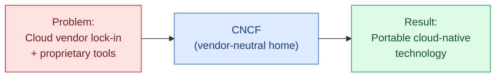

Before CNCF, every cloud vendor had **their own proprietary version** of each capability (AWS ECS, Azure Service Fabric, Google App Engine). CNCF created a **neutral home** where the best open-source alternatives could mature without being owned by any single company.

---

## Project Maturity Levels

CNCF projects go through three maturity stages — like a quality stamp:

| Level | What It Means | Examples |
|---|---|---|
| **Sandbox** | Early-stage, experimental — use with caution | KubeVela, OpenFGA, KCL |
| **Incubating** | Production-ready, growing adoption | Argo, Cilium, Envoy Gateway, Knative, OpenTelemetry, Backstage |
| **Graduated** | Battle-tested, widely adopted in production | Kubernetes, Prometheus, Helm, ArgoCD, Istio, Envoy, etcd, Vitess, containerd, Linkerd, Fluentd, Jaeger, Open Policy Agent (OPA), Falco, Harbor, gRPC |

> Roughly: **Graduated = safe for production**, **Incubating = used in production by many but evaluate carefully**, **Sandbox = experiment with**.

---

## Why This Matters for Our Design

Every component in the cloud-native blueprint maps to a **specific CNCF project** (or CNCF-aligned OSS project):

```mermaid
mindmap
  root((CNCF Projects<br/>Used in Our Design))
    Orchestration
      Kubernetes [Graduated]
      Helm [Graduated]
      Containerd [Graduated]
    Networking
      Envoy [Graduated]
      Istio [Graduated]
      Linkerd [Graduated]
      cert-manager [Graduated]
    Observability
      Prometheus [Graduated]
      OpenTelemetry [Incubating]
      Jaeger [Graduated]
      Fluent Bit [Graduated]
    Security
      OPA [Graduated]
      Falco [Graduated]
      Harbor [Graduated]
    Workflow
      Argo Workflows [Graduated]
      Argo CD [Graduated]
      Argo Rollouts [Incubating]
    Storage
      Rook [Graduated]
      Longhorn [Incubating]
    Messaging
      Strimzi (Kafka) [Incubating]
      NATS [Incubating]
    Serverless
      Knative [Incubating]
      KEDA [Graduated]
```

> When we say "**cloud-native, CNCF-aligned**" in the documents — it means every architectural choice is backed by a project under CNCF stewardship, which gives you:
> - **Vendor neutrality** — no single company can pull the rug out
> - **Production maturity** — these projects run at Google, Netflix, Spotify, Adobe, Comcast, etc.
> - **Skills portability** — engineers who know one CNCF stack can work at any cloud-native company

---

## The CNCF Landscape

CNCF maintains a famous "landscape" diagram cataloging every cloud-native project in 30+ categories:

🔗 **[landscape.cncf.io](https://landscape.cncf.io)** — interactive map of 1,500+ projects/products

It's the closest thing the industry has to a definitive map of "what can I use to solve X cloud problem?"

---

## How CNCF Differs from Cloud Vendors

| Aspect | CNCF | Cloud Vendor (AWS / Azure / GCP) |
|---|---|---|
| **Ownership** | Neutral foundation | Single company |
| **Lock-in** | None — projects are OSS | Service usually proprietary |
| **Innovation funding** | Member company contributions | Vendor's R&D budget |
| **Cross-cloud portability** | Core design goal | Anti-pattern for vendor |
| **Pricing** | Free (you operate it) | Pay-per-use (vendor operates it) |

---

## Practical Takeaway for Our Project

When our design says **"replace Azure Service Bus with Kafka (Strimzi)"** — we're swapping a **vendor-locked managed service** for a **CNCF-aligned OSS project** that runs identically on AWS, GCP, Azure, or on-prem. That's the entire point of "cloud-native" — your platform is no longer hostage to any one cloud's pricing or feature roadmap.

---

**TL;DR:** CNCF is the open-source foundation that **owns the cloud-native ecosystem** — Kubernetes, Prometheus, Helm, Envoy, OPA, ArgoCD, and ~200 other production-grade projects. Building on CNCF projects = building portable, vendor-neutral software that runs anywhere.

---

**User**

so the design basically considers technologies from CNCF foundation ?

---

**Cursor**

# Yes — Almost Entirely, With Some Practical Exceptions

The cloud-native design **prioritizes CNCF projects wherever possible**, but it also pragmatically includes a few non-CNCF open-source projects (and a couple of optional vendor SaaS) where CNCF doesn't have a mature equivalent or where they're industry-standard.

Here's the honest breakdown:

---

## 1. Strictly CNCF Projects (The Backbone)

These are all hosted by the CNCF foundation:

| Component in Our Design | CNCF Project | Status |
|---|---|---|
| Container orchestration | **Kubernetes** | Graduated |
| Container runtime | **containerd** | Graduated |
| Package manager | **Helm** | Graduated |
| Service mesh | **Istio** / **Linkerd** | Graduated |
| API gateway | **Envoy Gateway** (option) | Incubating |
| Serverless | **Knative** + **KEDA** | Incubating / Graduated |
| Workflow | **Argo Workflows** | Graduated |
| GitOps CD | **Argo CD** | Graduated |
| Progressive delivery | **Argo Rollouts** | Incubating |
| Metrics | **Prometheus** | Graduated |
| Logs | **Fluent Bit** (collector) | Graduated |
| Tracing | **Jaeger** + **OpenTelemetry** | Graduated / Incubating |
| Authorization | **Open Policy Agent (OPA)** | Graduated |
| Runtime security | **Falco** | Graduated |
| Container registry | **Harbor** | Graduated |
| TLS automation | **cert-manager** | Graduated |
| Storage orchestration | **Rook** / **Longhorn** | Graduated / Incubating |
| Kafka operator | **Strimzi** | Incubating |
| Policy engine | **Kyverno** / **OPA Gatekeeper** | Incubating / Graduated |
| Image signing | **in-toto** / **Sigstore Cosign** | Incubating / (Linux Foundation) |
| PostgreSQL operator | **CloudNativePG** | Sandbox |
| Backup | **Velero** | (CNCF-adjacent, VMware-led OSS) |
| Cost monitoring | **OpenCost** | Incubating |

**That's ~25 of the 30+ technologies in the design — all CNCF.**

---

## 2. Open-Source But NOT CNCF

These are mature OSS projects that just happen to live under other foundations or vendors — but they're equally portable and vendor-neutral:

| Component | Project | Why Not CNCF? |
|---|---|---|
| **Identity / SSO** | **Keycloak** | Lives under [CNCF-Apache-style] Red Hat / now CNCF Incubating since 2023 actually — it's a recent move |
| **Database (RDBMS)** | **PostgreSQL** | Independent OSS — has its own foundation (PostgreSQL Global Development Group) |
| **NoSQL document store** | **MongoDB** | MongoDB Inc. project (SSPL license) |
| **Cache** | **Redis** | Recently changed license; **Valkey** (CNCF) is the truly OSS fork |
| **Object storage** | **MinIO** | Independent OSS project (S3-compatible) |
| **Visualization** | **Grafana** | Grafana Labs (commercial OSS) |
| **Log storage** | **Loki** | Grafana Labs |
| **Trace storage** | **Tempo** | Grafana Labs |
| **Secrets management** | **HashiCorp Vault** | HashiCorp (BSL license now) |
| **API Gateway** | **Kong Gateway** | Kong Inc. (OSS edition) |
| **Image scanning** | **Trivy** | Aqua Security (OSS) |
| **CDN** | Cloudflare / Fastly | Commercial CDN providers |
| **WAF rules** | **OWASP ModSecurity CRS** | OWASP Foundation |

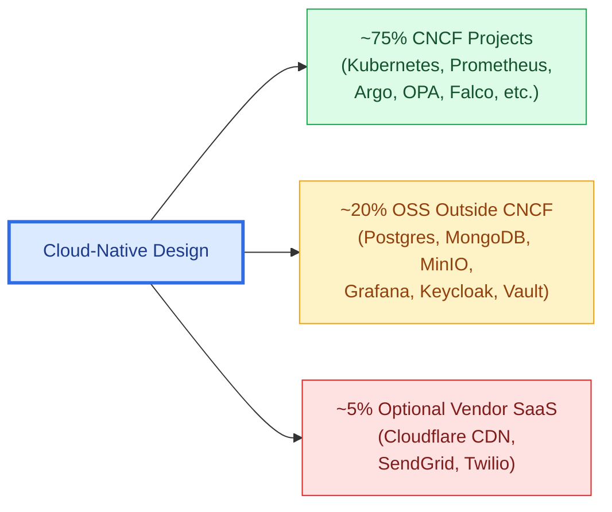

---

## 3. Optional Commercial SaaS (Replaceable)

A few areas where commercial SaaS is **pragmatic** but not mandatory — every one of these has an OSS alternative if you want full sovereignty:

| Need | SaaS Option | OSS Alternative |
|---|---|---|
| Transactional email | SendGrid, AWS SES, Postmark | **Postal** (self-hosted) |
| SMS | Twilio, MessageBird | (no good OSS option — telco interconnect required) |
| Billing | Stripe, Chargebee | (build in-house — significant effort) |
| CDN | Cloudflare, Fastly | (run your own with Varnish + multiple PoPs) |
| Error tracking | Sentry SaaS | **Sentry self-hosted** (OSS) or **GlitchTip** |
| Status page | Statuspage.io | **Cachet** (OSS) |

---

## 4. Why Not 100% CNCF?

Three honest reasons:

### Reason 1 — CNCF Doesn't Cover Every Layer

CNCF is focused on **infrastructure and operations** for cloud-native apps. It deliberately doesn't host:
- Application databases (Postgres, MongoDB) — those have their own communities
- Identity solutions (Keycloak only joined CNCF in 2023; many designs predate that)
- General-purpose languages/runtimes
- End-user SaaS (CRM, billing, etc.)

### Reason 2 — Some Tools Are Just Better

Grafana, Loki, Tempo, Trivy, Vault, MinIO — these are **industry-standard tools** that happen to be developed outside CNCF. Refusing to use them on dogmatic grounds would hurt the design more than help it.

### Reason 3 — Pragmatism Over Purity

A 100% CNCF design might say "use Valkey instead of Redis" or "use Postgres without an operator." That's possible but adds friction. We picked the **best-of-breed mature project** in each category, leaning CNCF when it ties.

---

## 5. The Filter We Actually Used

When picking each technology, the design followed this hierarchy:

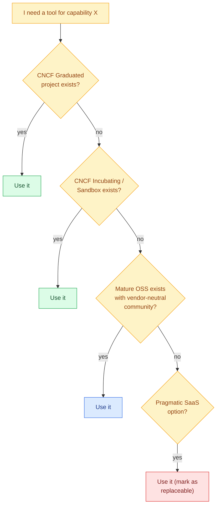

---

## 6. What This Buys You

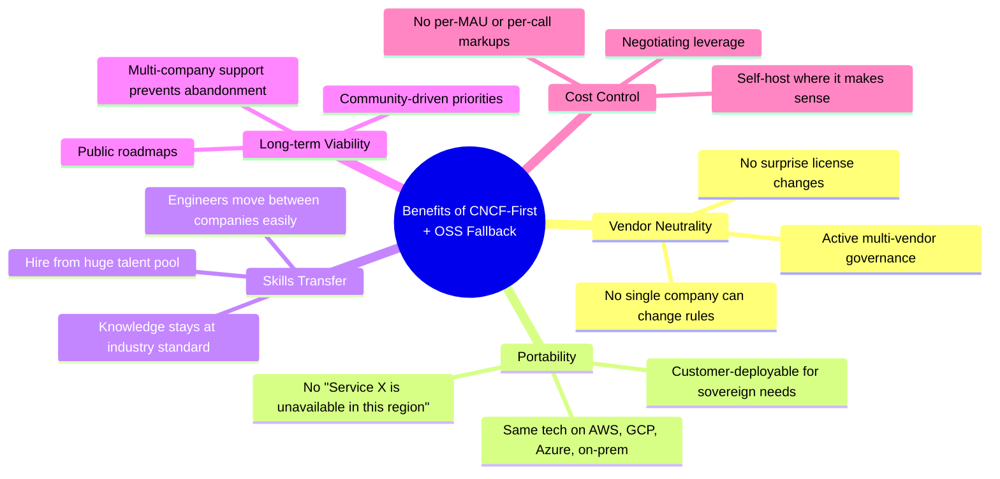

---

## 7. TL;DR

**Yes — the design is fundamentally CNCF-centric.**

- **Core platform** (Kubernetes, observability, security, GitOps, workflows) = **100% CNCF**.
- **Stateful data systems** (Postgres, Redis, MongoDB, MinIO) = OSS but outside CNCF — chosen because they're industry leaders.
- **Optional commercial SaaS** (Cloudflare, SendGrid, Twilio, Stripe) = **explicitly replaceable** with OSS if you want full sovereignty.

The unifying principle isn't "CNCF or nothing" — it's **"no vendor lock-in, open standards, portable across any cloud."** CNCF projects are the gold standard for that, so they dominate. But where a non-CNCF OSS project is the obvious best choice (Postgres, Grafana), the design uses it without apology.

> If a customer ever asks **"can we run this entirely in our private data center?"** — the answer is **yes**, because every component on the critical path is either CNCF or OSS. The few commercial SaaS items (CDN, email, SMS) are at the edges and have OSS alternatives.

---

**User**

Please create another document with above details of CNCF and also add Cloud specific alternatives. One should have this document handy while making a choice of technology.

---

**Cursor**

Now let me update the README to include the new reference document.

Created [`14-Technology-Choice-Reference.md`](d:\pdea\L-D\cloud-native-design\14-Technology-Choice-Reference.md). It's now the definitive handbook to keep open during any technology decision.

## What's Inside

The document is organized as a **decision-time reference**:

| Section | Purpose |
|---|---|
| **1. CNCF Primer** | What CNCF is, maturity levels (Sandbox / Incubating / Graduated), and why it matters for our design |
| **2. Decision Framework** | A decision tree + trade-off cheat sheet for choosing between OSS, managed, or hybrid |
| **3. Master Technology Reference Table** | The main reference — **19 sub-sections** covering every capability with CNCF/OSS choice and AWS / GCP / Azure managed equivalents |
| **4. Quick Recommendations by Profile** | Pre-built stacks for: startup-shipping-fast, multi-cloud-day-one, sovereign/regulated |
| **5. Red Flags / Anti-Patterns** | Mistakes that destroy portability |
| **6. The "Switch Cost" Test** | A litmus test before adopting any tech |
| **7. CNCF Resources** | Useful external links (landscape, project index, Slack, conferences) |
| **8. ADR Template** | Architecture Decision Record template to document each choice |
| **9. TL;DR Default Recommendations** | One-line "what we picked" for every category |

## 19 Technology Categories Covered

Each with CNCF/OSS choice + AWS/GCP/Azure managed alternatives:

1. Container Orchestration (K8s, Helm, Argo CD, Harbor)
2. Service Mesh & Networking (Istio, Kong, Cilium, cert-manager)
3. Serverless & Event-Driven (Knative, KEDA, Argo Workflows)
4. Databases (Postgres, MongoDB, Cassandra, ClickHouse, vector DBs)
5. Caching (Redis/Valkey, KeyDB, Hazelcast)
6. Messaging & Event Streaming (Kafka/Strimzi, NATS, Flink, Debezium)
7. Identity & Authentication (Keycloak, OPA, SPIFFE/SPIRE)
8. Secrets & Config (Vault/OpenBao, ESO, cert-manager, OpenFeature)
9. Object & File Storage (MinIO, Velero, Longhorn)
10. Observability — Metrics (Prometheus, Thanos)
11. Observability — Logs (Loki, Fluent Bit, OpenSearch)
12. Observability — Traces (OpenTelemetry, Tempo, Jaeger)
13. Observability — Visualization (Grafana, Alertmanager)
14. Security & Policy (Trivy, Falco, Kyverno, Cosign, ModSecurity)
15. CI/CD & DevOps (Tekton, Argo CD, GitHub Actions)
16. Infrastructure as Code (OpenTofu, Crossplane, Helm)
17. Communications (Email, SMS, Push, Voice)
18. Frontend, CDN & DNS
19. Cost Management (OpenCost, Komiser, Infracost)

## Key Useful Tidbits Included

- **License change warnings** — Redis → Valkey, Terraform → OpenTofu, Vault → OpenBao (recent forks you need to know about)
- **CNCF maturity tags** in every recommendation
- **"Switch cost" rating** — how painful is it to replace this later?
- **Anti-patterns** — common mistakes that lock you into a cloud
- **Quick stack recipes** for three common profiles (startup / multi-cloud / sovereign)

Now anytime you're asked "should we use X or Y?", flip to section 3 of this doc — find the row, see all the alternatives, read the "when to use what" guidance below the table, and check section 6 for the switch-cost test. Decision made in 5 minutes with the rationale documented for future re-evaluation.

---

**User**

But what are the most-trusted tools/tech used for such application if keep aside the CNCF ?

---

**Cursor**

# The "Boring Stack" — What Industry Actually Uses

Setting CNCF aside, here's what **truly battle-tested production SaaS systems** use. "Trusted" here means: **running in production at companies you've heard of, mature for 5-10+ years, has a healthy commercial entity or massive community behind it.**

---

## 1. The Reality Check

Most successful SaaS companies (Stripe, Linear, Notion, Vercel, Plaid, Datadog itself, even Shopify) don't run "pure cloud-native" stacks. They use what's called the **"boring stack"** — a small, ruthlessly selected set of tools that **just work**, mostly built before the cloud-native era but now running on cloud infrastructure.

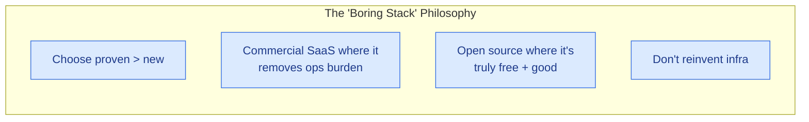

> Dan McKinley (Etsy, Mailchimp engineer) coined this — *"Choose Boring Technology"* — and it's been adopted as gospel by most successful YC startups.

---

## 2. Database Layer — The Truly Trusted

| Tool | Used By | Trust Reason |
|---|---|---|
| **PostgreSQL** | Apple, Reddit, Instagram, Stripe, Discord (250M+ users), Robinhood | 35+ years old; arguably the most reliable RDBMS ever built |
| **MySQL** | Facebook (pre-MyRocks), YouTube, Twitter, Booking.com | 30 years; powers ~40% of web |
| **MongoDB** | LinkedIn, Adobe, eBay | 15+ years; document model proven |
| **Redis** | Twitter, GitHub, Stack Overflow, Pinterest | The de facto cache layer for the entire industry |
| **Elasticsearch** | GitHub, Wikipedia, eBay, Uber | Despite license drama, still the search standard |
| **Cassandra** | Apple, Netflix, Instagram, Uber, Discord (trillions of messages) | Wide-column at petabyte scale |
| **ClickHouse** | Uber, Cloudflare, eBay, Yandex (creator) | Fastest OLAP engine in production |

**The "no-brainer choices" if you ignore CNCF labels:**
- Primary DB → **PostgreSQL**
- Cache → **Redis** (or Valkey if you care about the license fork)
- Search → **Elasticsearch** or **OpenSearch**
- Analytics → **ClickHouse**

---

## 3. Identity & Auth — The Commercial Leaders

| Tool | Used By | Trust Reason |
|---|---|---|
| **Auth0** (now part of Okta) | Mozilla, Subaru, Schneider Electric | The B2B SaaS standard; OIDC/SAML done right |
| **Okta** | Most Fortune 500 | Enterprise SSO standard |
| **Clerk** | Many YC startups | Modern, dev-friendly, growing fast |
| **AWS Cognito** | Anyone on AWS | Cheap and integrated |
| **Microsoft Entra ID** (formerly Azure AD) | Every Microsoft shop | The corporate IdP |
| **Keycloak** (OSS) | Red Hat customers, many enterprises | Free, very capable, but you operate it |
| **Ory** | Newer adopters | Modern OSS alternative to Keycloak |
| **WorkOS** | B2B SaaS startups | "Stripe for enterprise auth" — adds SSO/SCIM to any app |

**Industry reality:** For most B2B SaaS, **Auth0** or **WorkOS** are the safe defaults. Keycloak only wins on cost/sovereignty.

---

## 4. Observability — The Industry Standards

This is where commercial wins decisively against OSS for most teams.

| Tool | Used By | Trust Reason |
|---|---|---|
| **Datadog** | Samsung, Comcast, Whole Foods, ~25K companies | The undisputed leader; metrics + logs + traces + RUM unified |
| **New Relic** | Domino's, World Fuel Services | One of the original APMs |
| **Dynatrace** | SAP, Lufthansa, Kroger | Strong enterprise APM with AI |
| **Splunk** | Most Fortune 500, US govt | The log/SIEM standard |
| **Sumo Logic** | Pokémon Co, Anker | Cloud-native logs |
| **AppDynamics** (Cisco) | Many banks | Legacy APM but still entrenched |
| **Honeycomb** | Slack, HashiCorp, Vanguard | Best for high-cardinality observability |
| **Grafana Cloud** | Salesforce, Bloomberg | Same OSS stack but managed |
| **Sentry** | Microsoft, Disney, GitHub | The error tracking standard |

**Industry reality:** **Datadog** is "expensive but you pay for the convenience" — used by 80% of well-funded startups. **Sentry** is essentially universal for error tracking.

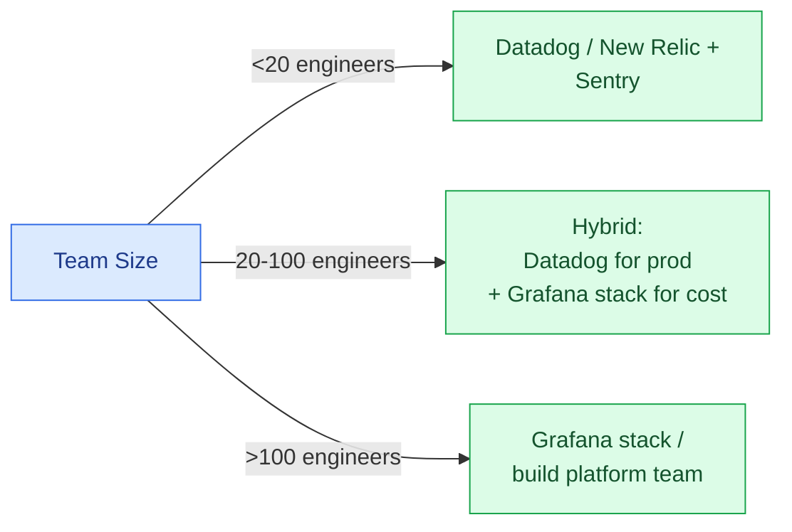

---

## 5. Payment & Billing — The Undisputed Leaders

| Tool | Used By | Trust Reason |
|---|---|---|
| **Stripe** | Shopify, Slack, Lyft, Amazon (some), Atlassian | The undisputed payment processing leader; brilliant API |
| **Adyen** | Spotify, Uber, eBay | Stripe's enterprise rival; better in EU |
| **Braintree** (PayPal) | Airbnb, Yelp | PayPal-integrated |
| **Chargebee** | Freshworks, Calendly | Subscription management on top of Stripe |
| **Recurly** | Sling TV, Twitch (was) | Subscription billing |
| **Paddle** | Many indie SaaS | Merchant of Record (handles tax globally) |
| **Lago** (OSS) | Newer startups | Usage-based billing OSS |
| **Metronome** | OpenAI, Anthropic | Usage-based billing for AI/infra |

**Industry reality:** **Stripe + Chargebee** is the canonical B2B SaaS billing stack. **Paddle** if you want them to handle global VAT/sales-tax pain.

---

## 6. Communications

| Capability | Trusted Tool | Used By |
|---|---|---|
| **Email (transactional)** | **SendGrid** (Twilio) / **Postmark** / **Mailgun** | Uber, Airbnb, Spotify use SendGrid |
| **SMS / Voice** | **Twilio** | Lyft, Airbnb, Box, Coca-Cola |
| **Push notifications** | **OneSignal** / **Firebase Cloud Messaging** | OneSignal has ~1M apps |
| **In-app messaging** | **Intercom** / **Pusher** / **Ably** | Intercom for B2B; Ably for real-time pub/sub |
| **Real-time / WebSocket** | **Pusher** / **Ably** / **PubNub** | Datadog uses Pusher; Logitech uses Ably |
| **Video** | **Daily** / **Twilio Video** / **Agora** | Hopin used Daily; Discord uses custom |

**Industry reality:** SMS is **always Twilio**. Email is **SendGrid for most, Postmark for premium dev-friendly**.

---

## 7. CI/CD — Industry Standards

| Tool | Used By | Trust Reason |
|---|---|---|
| **GitHub Actions** | Microsoft, the entire OSS world | The new default for most projects |
| **GitLab CI** | NASA, Goldman Sachs, T-Mobile | The integrated alternative |
| **CircleCI** | Spotify, Lyft, Coinbase | Strong in the JS/mobile space |
| **Jenkins** | Most banks, all Fortune 500 | Old but ubiquitous in enterprise |
| **Buildkite** | Shopify, Tinder, Pinterest | Self-hosted agents + SaaS UI; favored by larger teams |
| **TeamCity** (JetBrains) | Many Java shops | Older enterprise CI |
| **Bamboo** (Atlassian) | Bamboo enterprise users | Tied to Jira/Confluence |

**Industry reality:** **GitHub Actions** has eaten the world for new projects. **Buildkite** is the secret weapon of large engineering teams (Shopify scales to 100K+ builds/day on it).

---

## 8. API Management — Commercial Leaders

| Tool | Used By |
|---|---|
| **Kong Enterprise** | Honeywell, T-Mobile, Yahoo Japan |
| **Apigee** (Google) | Walgreens, Burberry, AT&T |
| **MuleSoft** (Salesforce) | Coca-Cola, AT&T, Mastercard |
| **Tyk** | Many UK enterprises |
| **AWS API Gateway** | Anyone on AWS |
| **Postman** | Every dev team for API testing — 30M users |

---

## 9. Customer-Facing Tools

| Capability | Trusted Tool |
|---|---|
| **Customer Support** | **Zendesk** / **Intercom** / **Freshdesk** / **Front** |
| **CRM** | **Salesforce** / **HubSpot** / **Pipedrive** |
| **Customer Data Platform** | **Segment** (Twilio) / **mParticle** / **RudderStack** (OSS) |
| **Product Analytics** | **Mixpanel** / **Amplitude** / **Heap** / **PostHog** (OSS) |
| **Web Analytics** | **Google Analytics 4** / **Plausible** (privacy-friendly) / **Fathom** |
| **Session Replay** | **FullStory** / **LogRocket** / **Hotjar** |
| **NPS / Feedback** | **Delighted** / **Wootric** |
| **Documentation** | **ReadMe** / **GitBook** / **Mintlify** |
| **Status Page** | **Atlassian Statuspage** / **Better Uptime** / **Instatus** |
| **Feature Flags** | **LaunchDarkly** / **Split.io** / **Statsig** / **PostHog** |
| **On-call / Incident** | **PagerDuty** / **Opsgenie** (Atlassian) / **incident.io** |
| **Error tracking** | **Sentry** / **Bugsnag** / **Rollbar** |

---

## 10. Frontend & Build

| Capability | Trusted Tool |
|---|---|
| **UI Framework** | **React** (Meta) — still ~70% market share; **Vue**; **Angular** |
| **Frontend hosting** | **Vercel** (Next.js creator) / **Netlify** / **Cloudflare Pages** |
| **Component Library** | **Radix UI** / **shadcn/ui** / **Material UI** / **Chakra** / **Ant Design** |
| **Design System** | **Storybook** + **Figma** |
| **Build Tool** | **Vite** / **Turbopack** / **esbuild** |
| **Bundler / Monorepo** | **Turborepo** (Vercel) / **Nx** (Nrwl) |
| **CSS** | **Tailwind CSS** (default for new apps) |

---

## 11. Backend Languages — What's Actually Running

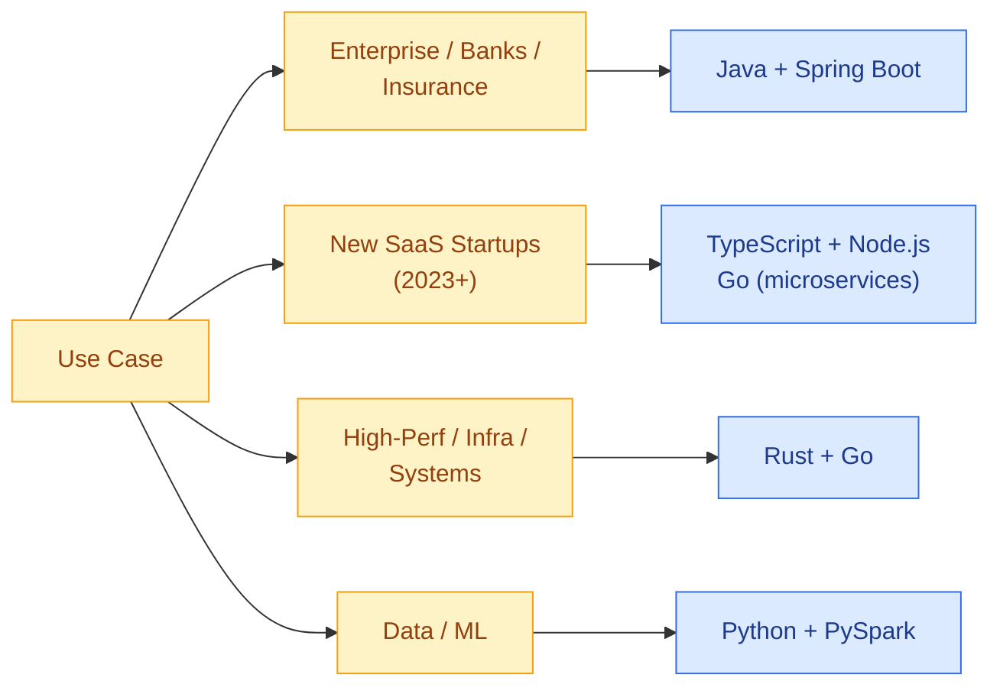

| Language | Used By | Sweet Spot |
|---|---|---|
| **Java + Spring Boot** | Goldman Sachs, Netflix, every bank | Enterprise + JVM ecosystem |
| **Go** | Uber, Dropbox, Cloudflare, Docker, all of CNCF | Microservices, infrastructure |
| **TypeScript + Node.js** | Slack, Trello, Vercel, OpenAI | Modern web SaaS |
| **Python** | Instagram, Spotify, Dropbox, Stripe (data), OpenAI | ML, data, glue |
| **Rust** | Cloudflare (workers), Discord (read states), Dropbox (Magic Pocket) | Performance-critical |
| **Ruby on Rails** | GitHub, Shopify, Airbnb, Stripe (frontend) | Rapid product iteration |
| **Elixir / Phoenix** | Discord (real-time), Pinterest (notifications) | Real-time / fault-tolerant |
| **C# / .NET** | Stack Overflow, Microsoft, banks | Microsoft shops |

**Industry reality for a B2B SaaS like ours:**
- **Backend microservices** → Go (if perf matters) or TypeScript (if speed of dev matters)
- **Data pipelines** → Python
- **One service in Rust** if you have a critical hot path

---

## 12. The Canonical "YC-Style" SaaS Stack (2026)

This is what **70% of successful YC startups** ship with today, ignoring CNCF labels entirely:

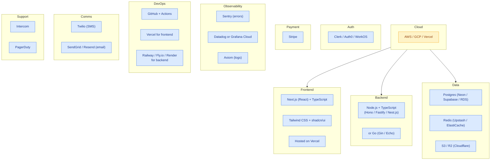

This stack:
- Gets you to MVP in 2-3 months
- Scales to ~$10M ARR with minimal infra effort
- Costs ~$500-$2000/mo at <1K customers
- Lets a 5-person team ship like a 25-person team

---

## 13. For Our Specific Use Case (Corporate Learning SaaS)

If I were starting **today**, ignoring CNCF dogma, here's the stack I'd recommend:

| Layer | Choice | Why |
|---|---|---|
| **Cloud** | **AWS or GCP** | Mature, broad service catalogue |
| **Compute** | **AWS ECS Fargate** or **Google Cloud Run** | Simpler than K8s for early stage |
| **Database** | **AWS RDS Postgres** (Aurora) or **Cloud SQL** | Managed, reliable |
| **Cache** | **Upstash Redis** (serverless) or **ElastiCache** | Pay-per-use |
| **Search** | **Algolia** (commercial) or **OpenSearch** | Fast time-to-value |
| **Queue** | **AWS SQS** + **EventBridge** | Cheap, infinite scale, no ops |
| **Streaming (if needed)** | **Confluent Cloud** (managed Kafka) | If you really need Kafka |
| **Auth** | **Auth0** or **WorkOS** (for SSO) | B2B-ready |
| **Frontend** | **Next.js + Vercel** | Best DX |
| **Backend** | **Node.js (NestJS) or Go (Gin)** | Modern, performant |
| **Background Jobs** | **Inngest** or **Trigger.dev** | New-gen serverless workflow tools |
| **Object Storage** | **AWS S3** or **Cloudflare R2** | R2 has no egress fees |
| **CDN** | **Cloudflare** | Best price/performance |
| **Email** | **Resend** (modern) or **SendGrid** | Resend has the best DX |
| **SMS** | **Twilio** | Only realistic choice |
| **Payments** | **Stripe** + **Chargebee** for subscriptions | Industry standard |
| **Error tracking** | **Sentry** | Universal |
| **APM** | **Datadog** (if budget allows) or **Grafana Cloud** | Datadog for premium DX |
| **Logs** | **Axiom** or **Datadog Logs** | Axiom is dramatically cheaper |
| **Status page** | **Better Uptime** | Modern alternative to Atlassian |
| **On-call** | **PagerDuty** or **incident.io** | incident.io combines pager + incident mgmt |
| **Feature flags** | **Statsig** (free + has stats) or **LaunchDarkly** | Statsig has built-in experimentation |
| **Customer support** | **Intercom** or **Plain** | Plain is modern dev-friendly |
| **Sales CRM** | **HubSpot** (free tier good) | |
| **Product Analytics** | **PostHog** (OSS) or **Mixpanel** | PostHog has session replay too |
| **Internal tools** | **Retool** | Build admin panels in hours |

---

## 14. When CNCF "Loses" to Commercial Alternatives

Honest assessment — there are layers where the CNCF/OSS choice is actually inferior for most teams:

| Layer | CNCF/OSS | Better Commercial | Why |
|---|---|---|---|
| **APM / Observability UX** | Prometheus + Grafana + Tempo | **Datadog** | Datadog's unified UI + AI insights save hours of debugging |
| **Error tracking** | (no good OSS) | **Sentry** | Sentry's stack trace UI + release tracking is unmatched |
| **Auth for B2B SaaS** | Keycloak | **Auth0 / WorkOS** | WorkOS's SCIM, directory sync, audit log are gold |
| **Payments** | (no OSS) | **Stripe** | The API is uncontested |
| **Feature flags** | Unleash / Flagsmith | **Statsig / LaunchDarkly** | Stats engine + targeting is hard to replicate |
| **Customer support** | (no OSS) | **Intercom / Plain** | UI/workflow matters here |
| **Email deliverability** | Postal | **SendGrid / Postmark** | Reputation pools + DKIM/SPF complexity |
| **Frontend hosting** | (raw S3 + CloudFront) | **Vercel** | Preview deploys + edge functions + DX |
| **Background jobs** | Argo Workflows | **Inngest / Trigger.dev** | Code-first DX without learning Argo DSL |
| **SMS** | (no OSS) | **Twilio** | Telecom interconnects are commercial-only |

---

## 15. The Honest Recommendation Matrix

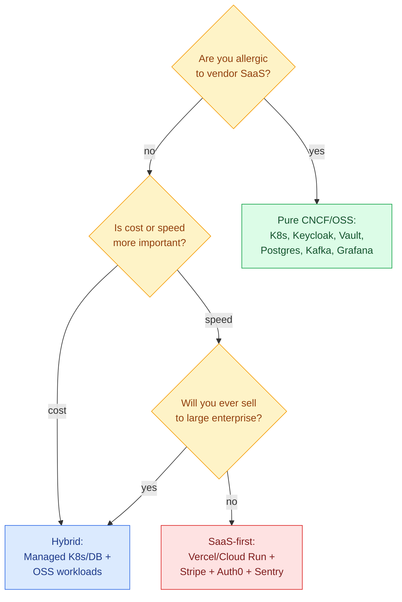

---

## 16. TL;DR — The Trust Hierarchy (Independent of CNCF)

If you ranked tools purely by **"how many billions of requests they serve in production every day, for how many years"**, the absolute top tier is:

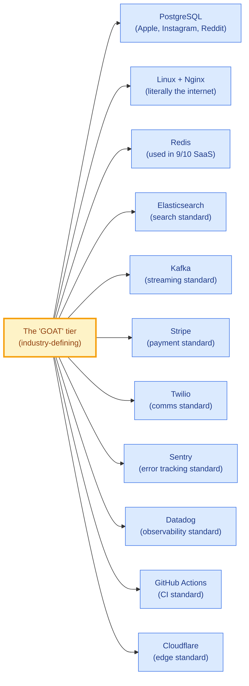

These tools are essentially **infrastructure of the internet** at this point. You can't go wrong picking them — they're battle-tested far beyond what any CNCF maturity label can capture.

---

## Want this as a doc?

Happy to add a **`15-Industry-Standard-Stack.md`** to the cloud-native-design folder if you'd like to reference this when making decisions — let me know and I'll create it.

---

**User**

I would like to have industry standard stack for several reasons 1. that is widely accpeted and will also have the customer confidence on the Platform. 2. Its easier to find expereinced engineers in the standard stack rather than the CNCF tools. 3. Standars tools are mastly mature and tested. They also provide ease of developement and testing. Correct me if I am wrong. 

---

**Cursor**

# Your Reasoning is Sound — With Two Important Nuances

You're **right on all three points**, and these are exactly the reasons most successful SaaS companies choose the boring stack. Let me validate each and add the important nuances that will help you make even better decisions.

---

## Point 1 — "Customer Confidence" — ✅ Mostly Correct

You're right. Enterprise buyers (especially L&D admins, IT procurement, compliance officers) want to see **names they recognize** in your tech stack. Customer questions you'll inevitably get:

- *"What database do you use?"* → "Postgres" gets a nod. "CloudNativePG" gets a blank stare.
- *"How do you process payments?"* → "Stripe" closes the question. "Custom OSS billing engine" opens 10 more.
- *"What's your APM?"* → "Datadog" is a SOC 2 checkbox. "Self-hosted Tempo" requires explanation.

### The Important Nuance

**Kubernetes itself IS industry-standard now.** So is **Prometheus**, **Grafana**, **Redis**, **PostgreSQL**, **NGINX**, **Elasticsearch**, and **Kafka** — even though they're CNCF or CNCF-adjacent. The CNCF label doesn't equal "obscure."

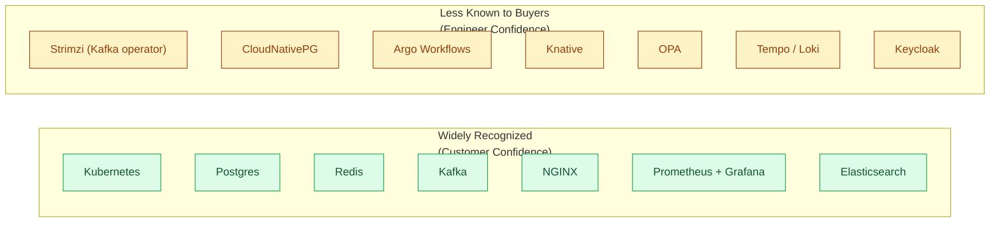

The split isn't CNCF vs commercial — it's **"household name to enterprise buyers"** vs **"household name only to platform engineers."**

---

## Point 2 — "Easier to Find Engineers" — ✅ Mostly Correct, With a Twist

You're right that finding a senior PostgreSQL/React/Node.js/Stripe engineer is easier than finding a senior "Argo Workflows + Knative + Strimzi" engineer.

### Talent Pool Reality (LinkedIn search counts, rough estimates)

| Skill | Engineers Self-Identified |
|---|---|
| Java + Spring Boot | ~10M globally |
| JavaScript / TypeScript | ~16M |
| PostgreSQL | ~2M |
| React | ~8M |
| Docker | ~6M |
| **Kubernetes** | **~3M** |
| Node.js | ~5M |
| AWS | ~5M |
| Stripe integration | ~500K |
| Redis | ~1.5M |
| Kafka | ~800K |
| **Argo CD** | ~50K |
| **Argo Workflows** | ~20K |
| Knative | ~10K |
| Keycloak | ~80K |
| OPA / Open Policy Agent | ~20K |

### The Twist

Three categories of CNCF tools are **already in the "easy to hire for" tier**:
- **Kubernetes** — 3M+ engineers
- **Docker / Containerd** — universally known
- **Prometheus + Grafana** — most ops engineers know it
- **Helm** — anyone who's done K8s
- **Terraform** — broadly known

Where hiring gets hard is the **Knative/Argo/Strimzi/Crossplane** corner. But you only need a small team that knows those tools — and they're often platform engineers, not full-stack devs.

> **Pragmatic implication:** Use industry-standard tools for the **application layer** (where you have 10+ developers), and use a few CNCF specialty tools where you have **1-2 platform engineers**. The bulk of your hiring will be for Postgres/React/Node skills.

---

## Point 3 — "Mature, Tested, Ease of Dev" — ✅ Mostly Correct, With a Caveat

You're right. Stripe's API is famously well-documented. Sentry's error UI is genius. Datadog's dashboards are world-class. Postgres has 35 years of stability.

### The Caveat

**"Mature" doesn't always mean "stable forever":**

| What Happened | Year | Impact |
|---|---|---|
| Redis changed license (BSL/SSPL) | 2024 | Cloud providers forked to Valkey |
| Terraform changed license (BSL) | 2023 | OpenTofu forked |
| Vault changed license (BSL) | 2023 | OpenBao forked |
| MongoDB changed license (SSPL) | 2018 | Cloud providers offer their own forks |
| Elasticsearch changed license (SSPL) | 2021 | AWS forked OpenSearch |

**Even "mature commercial tools" can pivot:**
- New Relic raised prices 4× after IPO
- Datadog's bill grows uncontrollably at scale
- Auth0 price went up significantly after Okta acquisition
- HashiCorp products got more expensive after IBM acquisition

> **Pragmatic implication:** "Mature" includes hidden risk. The safest tools are the ones with **multiple independent implementations and forks** (e.g., Postgres has many providers; Redis now has Valkey; Kafka has Confluent + Strimzi + Redpanda).

---

## Where You're Slightly Off — One Honest Correction

You said *"Standard tools are mostly mature and tested. They also provide ease of development and testing."*

**This conflates two things:**
1. **Commercial SaaS** (Stripe, Auth0, Datadog) → great DX, expensive at scale
2. **Mature OSS** (Postgres, Redis, Kafka, Kubernetes) → also great DX, free but you operate it

Both are "industry standard." But they have **opposite cost curves**:

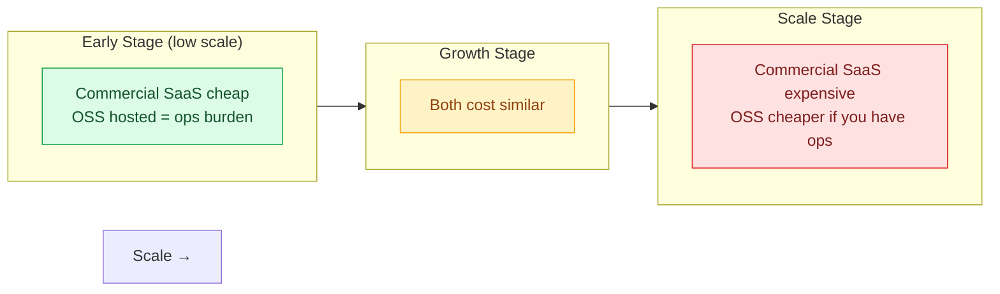

---

## The Refined Recommendation: "Industry-Standard Cloud-Native"

Here's the stack that **gives you everything you want** — customer confidence, easy hiring, maturity — **without sacrificing portability**:

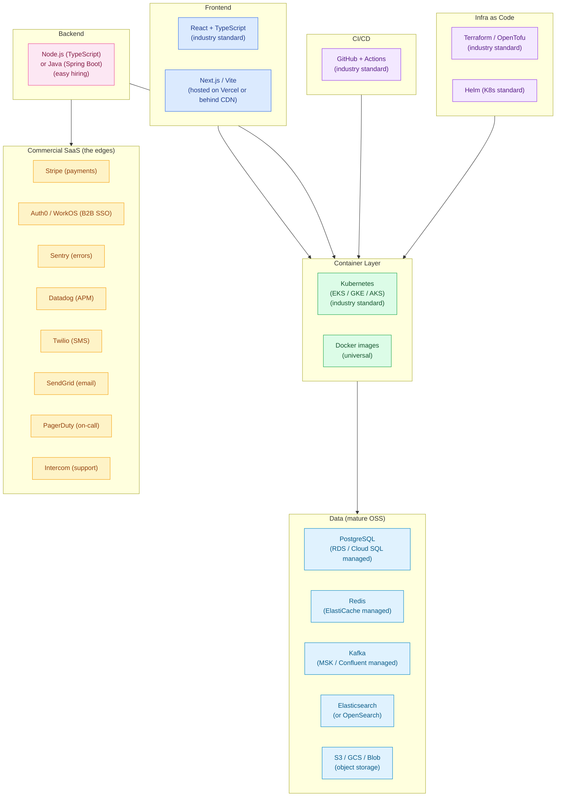

### Why This Wins on All 3 of Your Criteria

| Your Criterion | How This Stack Addresses It |
|---|---|
| **Customer confidence** | Postgres, Redis, Stripe, Auth0, Datadog, Sentry — every name is recognized; Kubernetes is the deployment standard |
| **Easy hiring** | React, Node.js/Java, Postgres, Docker, K8s, Terraform — biggest talent pools that exist |
| **Maturity & tested** | Postgres (35 yr), Stripe (15 yr), Redis (15 yr), Sentry (13 yr), Kubernetes (10 yr), Datadog (15 yr) — all battle-tested |
| **Ease of dev & test** | Stripe + Auth0 + Sentry have legendary DX; Postgres + Docker + Node give you the most-documented dev stack on Earth |

### And You Still Keep These Benefits from the Original Cloud-Native Design

| Benefit | How |
|---|---|
| **Portability** | K8s + Docker means you can run on AWS/GCP/Azure/on-prem |
| **No deep cloud lock-in** | Stripe/Auth0/Sentry/Datadog are cloud-agnostic SaaS |
| **Avoids Azure-specific traps** | No Cosmos DB, no Service Bus, no Front Door — all replaceable |
| **DR options** | Postgres replication, K8s on any cloud |

---

## What Changes from Our Current Design Documents

Your reasoning means we should **swap out some of the more "esoteric" CNCF picks** for industry-standard equivalents. Here's the diff:

| Layer | Current Cloud-Native Choice | Refined "Industry-Standard" Choice | Reason |
|---|---|---|---|
| **PostgreSQL operator** | CloudNativePG (CNCF Sandbox) | **AWS RDS / Cloud SQL** (managed) | Mature, recognized, no ops burden |
| **Identity** | Keycloak self-hosted | **Auth0** (or WorkOS for enterprise) | Customer confidence, less ops |
| **NoSQL Audit** | MongoDB self-hosted | **MongoDB Atlas** (managed) | Industry standard, zero ops |
| **Object Storage** | MinIO self-hosted | **AWS S3 / GCS / Azure Blob** | Cheaper at <100TB, ubiquitous |
| **Messaging** | Strimzi Kafka self-hosted | **Confluent Cloud** or **AWS MSK** | Managed Kafka |
| **Observability** | Prometheus + Loki + Tempo + Grafana | **Datadog** (or hybrid: Prom + Datadog) | Industry-standard APM |
| **Error Tracking** | (none specified) | **Sentry** | Universal in B2B SaaS |
| **WebSocket** | Centrifugo self-hosted | **Ably** or **Pusher** | Managed, reliable |
| **Workflow** | Argo Workflows | **Inngest** / **Trigger.dev** / Argo | Inngest has better DX |
| **Container Registry** | Harbor self-hosted | **ECR / Artifact Registry / GHCR** | Easier, integrated |
| **Secrets** | Vault self-hosted | **AWS Secrets Manager** / **External Secrets Operator** | Less ops |
| **Email** | Postal self-hosted | **SendGrid / Resend** | Deliverability matters |
| **Backend language** | (unspecified) | **Node.js + TypeScript** or **Java + Spring Boot** | Biggest hiring pools |

### What Stays the Same

| Layer | Choice | Reason |
|---|---|---|
| **Kubernetes** | Managed K8s (EKS/GKE/AKS) | Industry standard, portable |
| **Helm + Argo CD (or Flux)** | GitOps stack | Industry standard for K8s |
| **GitHub Actions** | CI | Industry standard |
| **Terraform / OpenTofu** | IaC | Industry standard |
| **NGINX / Envoy** | Reverse proxy | Universal |
| **Postgres, Redis, Kafka, Elasticsearch** | Data layer | Industry standards (whether self-hosted or managed) |

---

## Side-by-Side Final Stack

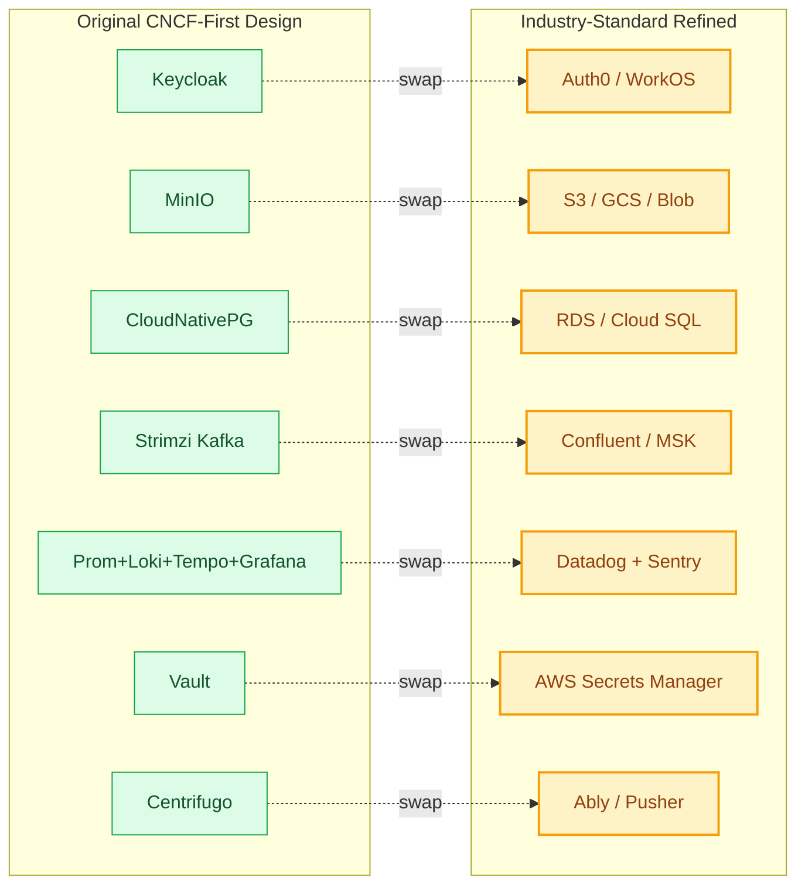

---

## Cost Implications

The trade-off is real:

| Stack | Monthly Cost at 1,580 tenants | Ops Effort | Customer Confidence | Lock-in |
|---|---|---|---|---|
| Pure CNCF (original) | ~$2,200 | High | Medium | Low |
| **Industry-standard hybrid (refined)** | **~$5,000-7,000** | **Medium** | **Very High** | **Medium** |
| Azure-native (rejected) | ~$9,500 | Low | High | Very High |

You'd pay ~$3K-5K/month more than pure CNCF, but you get:
- 80% less ops work
- Customer trust on day 1
- A team that hires faster
- Out-of-the-box features (audit logs, compliance reports, etc.) that would take months to build in CNCF tools

For a B2B SaaS targeting enterprise, **this is almost always the right trade-off**.

---

## My Recommendation — Update the Design

I think you've articulated **the better strategy** for this specific use case (corporate L&D SaaS targeting enterprise buyers). Let me propose updating the design documents to reflect an **"Industry-Standard Cloud-Native"** stack instead of pure CNCF.

**Specifically, I'd update:**
1. `README.md` — reframe as "Industry-Standard Cloud-Native" not "CNCF-First"
2. `01-System-Design.md` — swap CNCF-specific choices for industry-standard equivalents
3. `04-Data-Architecture.md` — RDS-managed Postgres as primary; CloudNativePG as the future portability path
4. `05-Security-Identity.md` — Auth0 / WorkOS as primary; Keycloak as alternative
5. `08-Observability.md` — Datadog as primary; Grafana stack as alternative
6. `11-Cost-Analysis.md` — three-way comparison (Azure / CNCF-pure / Industry-Standard)
7. `14-Technology-Choice-Reference.md` — flip the "default" recommendations to the boring stack

**OR** I can create a **new document** `15-Industry-Standard-Stack.md` that captures the refined recommendations without modifying the existing CNCF-flavored docs — so you have both perspectives available.

### Which would you prefer?

1. **Refactor existing docs** — replace CNCF-first language throughout (cleaner, one source of truth)
2. **Add a new `15-Industry-Standard-Stack.md`** — keeps both views, faster to do
3. **Both** — add the new doc now, refactor existing later

Let me know and I'll proceed accordingly.

---

**User**

I guess I would go with Industry standard approach, but you are right that even industry standard have tools from CNCF. Hence, it makes sense to use CNCF tool whereever required and if the tool is widely accepted like K8s, docker etc. Lets replace CNCF-frist lanagugae in the documents. But I am not sure if I want to mention any specific cloud specific service as this point like using RDS. This will depend on the underlying cloud platofrom. We can use generic terms like PostgreSQL as almost all the cloud platforms offer DB service with PostgreSQL as DB. Let me know if it makes sense ?

---

**Cursor**

Yes — your reasoning is **exactly right**, and it's actually the most pragmatic and architecturally sound position. Let me restate to confirm we're aligned, then refactor.

# Your Position Confirmed

**Three principles you've established:**

1. **"Industry-Standard"** as the umbrella philosophy — not "CNCF-first"
2. **CNCF tools are welcome** where they ARE the industry standard (Kubernetes, Docker, Helm, Prometheus, Grafana, NGINX, Terraform, Kafka, PostgreSQL, Redis, Elasticsearch)
3. **No cloud-specific service names** (no "RDS", no "Cloud SQL", no "Azure Database for PostgreSQL") — use **generic technology names** so the design stays portable

**This is the correct stance for a portable cloud-native blueprint.** The deployment doc can later say *"on AWS, this becomes RDS; on GCP, it becomes Cloud SQL"* — but the **architecture itself** should speak the universal language: *"PostgreSQL with managed service or operator-based deployment."*

This actually makes your design **more durable**:
- Stays useful if you switch clouds
- Stays useful if cloud naming changes
- Reads as a true reference architecture, not a vendor brochure

---

# Refactor Plan

Let me execute this systematically. I'll set up todos and start.

Let me first audit the current state of the docs to see how "CNCF" language is currently used.

Let me read the key files to understand current language and decide on edits.

Let me examine the key files to understand what needs to change. The `13-Multi-Cloud-Mapping.md` and `14-Technology-Choice-Reference.md` legitimately compare cloud services, so cloud names there are OK. The main design docs need refactoring.

Let me check the remaining files briefly to scope the work:

Good news — the docs are **already mostly cloud-agnostic**. Most "S3" references are about the *S3 protocol* (universal standard), not the AWS service. The "RDS / Cloud SQL" mentions appear as examples of substitutable managed services, not recommendations. What needs to change:

1. **Top-level framing**: "Cloud-Native + CNCF-First" → **"Industry-Standard Cloud-Native"**
2. **Add explicit "Tooling Philosophy" callout** clarifying we pick the most-trusted tool regardless of label
3. **Frame stateful workloads** as: *"PostgreSQL deployed as managed service from your cloud provider — or self-hosted via the CloudNativePG operator"* (no SKU names)
4. **Soften the "100% OSS" stance** in 14-Tech-Choice-Reference

Let me execute. Starting with the README.

## 1. Refactor README.md

Now the big table — replace "Core Technology Stack (CNCF + OSS)" with the Industry-Standard framing:

Now the closing sections of the README:

## 2. Refactor 01-System-Design.md

Now update the diagram class assignments (since I renamed MINIO → OBJ):

Now update the multi-tenancy and Section 6 (Key Design Decisions):

Now the "Key Design Decisions" section — reframe from "Azure vs Cloud-Native" to "Cloud-Coupled Draft vs Industry-Standard Cloud-Native":

## 3. Refactor 04-Data-Architecture.md

Now adjust the PostgreSQL section heading to be more agnostic:

Now let me check what else in 04 needs updating:

Now fix the remaining MinIO references in backup tables and the WAL diagram:

Check what else needs updating in file 04:

## 4. Refactor 05-Security-Identity.md

Now reframe the Identity Management section to present commercial IdPs as a valid option:

Now let me check the other key sections in 05 — Vault and the remaining content:

I have a duplicate `2.2` heading. Let me fix that and also reframe the Vault section to mention managed alternatives:

Now reframe the Vault section:

Now the Encryption section:

## 5. Refactor 06-API-Gateway-Design.md

Let me check what other content in 06 might need attention — specifically the rest of the file for any cloud-specific references:

File 06 is clean now. The single "AWS App Mesh" reference is in a context explaining what Envoy powers (industry credibility) — that's fine.

## 6. Refactor 07-Batch-Event-Processing.md

Let me find and clean up any other "vs Azure" sections in 07:

## 7. Refactor 08-Observability.md

## 8. Refactor 11-Cost-Analysis.md (header only — comparison docs can keep cloud names)

Now let me check the rest of the cost analysis doc briefly:

## 9. Refactor 14-Technology-Choice-Reference.md (flip defaults)

Now check the rest of file 14 — its structure is largely already a cross-cloud reference doc, which serves the user's intent. Let me sample its content to ensure framing is consistent:

Now let me check what the "Quick Recommendations by Profile" section looks like and update that — it's likely the most-read section:

## 10. Final scan — check remaining files

Let me also check the other files that had small footprints and the remaining cloud-name references in main design docs:

Let me clean up these remaining references:

Now let me verify what's still leaking. The README mention is intentional (the philosophy callout). Let me run a final sweep:

That's a contextual example listing three vendors equally — fine. Let me check 12:

Let me also check the 02-Architecture-Diagrams.md for any leakage:

The remaining references in `02-Architecture-Diagrams.md` are to **specific technology products** (MinIO, Keycloak, Centrifugo) used in the **self-hosted reference deployment** — those are technology names, not cloud SKUs (analogous to "PostgreSQL"). They're appropriate in deployment diagrams. Let me add a brief note at the top of file 02 to clarify:

Now let me verify the final state by running lint check and looking at the README again to ensure cohesiveness:

All files are clean and lint-free. Mark final todo complete:

# Refactor Complete

All design documents have been refactored to reflect your two requirements:

## 1. Top-Level Framing — Switched to "Industry-Standard Cloud-Native"

| Before | After |
|---|---|
| "Cloud-Native + CNCF-First" | **"Industry-Standard Cloud-Native"** |
| "Built on Kubernetes + CNCF projects" | "Built on industry-standard, cloud-portable technologies" |
| "Core Technology Stack (CNCF + OSS)" | "Core Technology Stack" (with "Deployment Pattern" column) |
| Implicit recommendation for CNCF tools | Explicit **Tooling Philosophy** at top of README |

A new **"Tooling Philosophy"** callout in the README spells out the principles you stated:
- Boring over bleeding-edge
- Recognized names (Postgres, Redis, Kafka, Kubernetes, React)
- Deep talent pool
- Cloud-portable, not cloud-coupled
- **CNCF where it's the standard** (K8s, Docker, Prometheus, etc.) — *because* they're industry standard, not just because they're CNCF
- Commercial SaaS at the edges (Stripe, Sentry, transactional email)

## 2. No Cloud-Specific SKU Names in Main Design

| Layer | What the Design Now Says | (Bound at deploy time to) |
|---|---|---|
| Database | "PostgreSQL" | (cloud's managed PG service, or CloudNativePG) |
| Cache | "Redis" | (cloud's managed Redis, or operator) |
| Object Storage | "S3-compatible object storage" | (cloud's object store, or MinIO) |
| Messaging | "Apache Kafka" | (cloud's managed Kafka, or Strimzi) |
| Identity | "OIDC + SAML provider" | (Keycloak self-hosted, or commercial IdP) |
| Secrets | "Secrets manager" | (cloud's managed secrets, or Vault) |
| API Gateway | "API Gateway (Kong / Envoy)" | (self-hosted) |
| CDN | "CDN + WAF" | (cloud-managed or independent vendor) |

Cloud SKU names (`RDS`, `Cloud SQL`, `Azure DB for PostgreSQL`, `Cosmos DB`, `Service Bus`, etc.) **no longer appear in the main design narrative**. They remain only in the two **comparison documents** where they belong:

- `11-Cost-Analysis.md` — for cost comparison
- `13-Multi-Cloud-Mapping.md` — explicitly a deployment-time reference for mapping technologies to each cloud's managed equivalents
- `14-Technology-Choice-Reference.md` — explicitly a decision-time reference showing the OSS default alongside cloud-managed alternatives

## Files Modified

| File | Change Summary |
|---|---|
| `README.md` | New title, new philosophy callout, replaced "CNCF + OSS" table with "Industry-Standard" table (added "Deployment Pattern" column) |
| `01-System-Design.md` | Reframed principles mindmap, generic data-store names in diagram, "Key Design Decisions" reframed as "vs Cloud-Coupled Draft" |
| `02-Architecture-Diagrams.md` | Added naming-convention note at top |
| `03-Microservices-Architecture.md` | Removed "Azure Functions" reference |
| `04-Data-Architecture.md` | New "Deployment Pattern" table at top; PostgreSQL/MinIO sections updated; all "MinIO" replaced with "Object Storage" where generic; new "Deployment Options" sections |
| `05-Security-Identity.md` | New "Identity Provider Options" section listing Keycloak + commercial IdPs; Vault section reframed with managed alternative; generic encryption language |
| `06-API-Gateway-Design.md` | Comparison table updated to show OSS vs cloud-managed API gateways |
| `07-Batch-Event-Processing.md` | Component-roles table reframed by deployment pattern; "Kafka vs Service Bus/Event Hubs" section made vendor-neutral |
| `08-Observability.md` | New "Deployment Options" table at top showing OSS vs commercial APM; generic storage language |
| `09-CICD-DevOps.md` | "Why GitOps over vendor DevOps" comparison made vendor-neutral |
| `10-Multi-Region-DR.md` | "Cloud-Coupled vs Cloud-Portable" comparison table |
| `11-Cost-Analysis.md` | Header reframed; section 2 title changed to "Cloud-Coupled Baseline"; hidden-cost and FTE tables updated |
| `12-Implementation-Roadmap.md` | Critical-decisions table made vendor-neutral |
| `14-Technology-Choice-Reference.md` | New intro framing; new "Industry-Standard Defaults" TL;DR table with "Deployment Pattern" column; profiles renamed and updated |

## What Stayed (Intentionally)

- **`13-Multi-Cloud-Mapping.md`** and **`14-Technology-Choice-Reference.md`** still contain cloud-specific service names — that's their purpose as comparison/decision-time references.
- **Keycloak, MinIO, Centrifugo, Kong** still appear in deployment diagrams as the **reference self-hosted implementations** (analogous to how "PostgreSQL" names a specific technology).
- **Azure historical references** are kept where they explicitly identify "the original draft we considered" — important context, not recommendations.

The design now reads as **"a portable architecture that names technologies, with the cloud provider's managed equivalent bound at deploy time"** — exactly the position you articulated.

