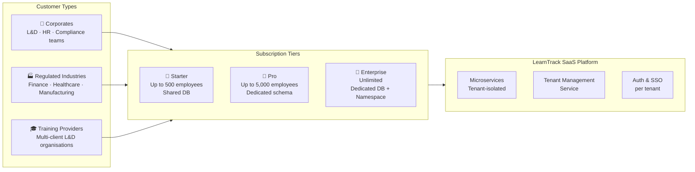

# Executive Summary

# Executive Summary

## Project Overview

The **Corporate Learning Progress, Intervention & Compliance Tracking System** is a **multi-tenant SaaS platform** that consolidates fragmented employee learning data — training attendance, assessment results, and competency milestones — into a single, actionable system. It enables organisations to proactively identify employees who are falling behind on required competencies, assign targeted interventions, and produce compliance-ready reports for regulatory bodies and industry standards authorities.

The platform is **not** a full corporate LMS. It is a lightweight aggregation, analytics, and workflow layer that sits on top of existing LMS platforms, assessment systems, and trainer notes. It is delivered as a **microservices-based SaaS** offering, catering to multiple corporate customers simultaneously — each operating in full data isolation.

---

## SaaS Delivery Model

---

## Business Objectives

| Objective | Target |
|---|---|
| Early risk detection | Identify at-risk employees 4–6 weeks before compliance failure |
| Intervention effectiveness | ≥ 70 % of employees show measurable competency improvement |
| Training completion rate improvement | + 25 % year-over-year |
| Compliance reporting | 100 % on-time, accurate submissions to regulatory bodies |
| Tenant onboarding speed | New organisation live in < 5 minutes (automated provisioning) |
| Platform availability | ≥ 99.9 % uptime (Enterprise) · ≥ 99.5 % (Pro / Starter) |
| User adoption per tenant | ≥ 90 % of target users active within first month |

---

## Key Capabilities

- **Multi-tenant isolation** — row-level, schema-per-tenant, or dedicated DB based on plan
- **Automated tenant provisioning** — new corporate customer onboarded and live in < 5 minutes
- **Employee learning profile aggregation** — consolidates training attendance, assessment scores, and competency milestones per employee
- **Configurable rule-based risk engine** — per-organisation JSON/YAML rules on attendance %, score thresholds, and competency progression
- **Automated at-risk classification** — four severity levels: Critical, High, Medium, Low
- **Intervention lifecycle management** — remedial training, coaching & mentoring assignment, session tracking, outcome measurement
- **Compliance & audit reporting** — templated, scheduled, with full immutable audit trail for regulatory bodies
- **Role-based dashboards** — Trainers, L&D Administrators, L&D Managers, and Employees
- **White-label branding** — custom domain, logo, and colours per organisation (Pro / Enterprise)
- **SSO / SAML integration** — per-tenant corporate identity provider (Enterprise)
- **Metered billing** — usage tracked per tenant, integrated with Stripe / Zuora

---

## Microservices Architecture Summary

| Service | Responsibility | Own Database |
|---|---|---|
| **Tenant Management** | Onboarding, config, billing, feature flags | `tenant-db` |
| **Auth / Identity** | OAuth2, JWT, SSO, RBAC | `auth-db` |
| **Ingestion** | Training attendance, assessment scores, competency milestone intake | `ingestion-db` |
| **Employee Profile** | Learning profile aggregation, competency analytics, trend calculation | `profile-db` |
| **Risk Engine** | Rule execution, at-risk classification, alerts | `risk-db` |
| **Rule Management** | Rule CRUD, versioning, testing sandbox | `rules-db` |
| **Intervention** | Remedial training & coaching workflow, session tracking, outcomes | `intervention-db` |
| **Reporting** | Compliance reports, L&D dashboards, exports | `reporting-db` |
| **Notification** | Email, SMS, in-app alerts (stateless) | None |
| **Audit** | Immutable event log across all services | `audit-db` |

---

## Technology Stack

| Layer | Technology |
|---|---|
| **Backend services** | Spring Boot 3.x (Java) · FastAPI (Python) · ASP.NET Core 8 |
| **Primary database** | PostgreSQL 15+ (JSONB for competency rules & risk factors) |
| **Caching** | Redis 7.x — tenant context, profile snapshots, session tokens |
| **Event bus** | Apache Kafka — tenant-scoped topics |
| **Search** | Elasticsearch 8.x |
| **Frontend** | React 18+ · Angular 17+ · Vue 3+ |
| **Charting** | Chart.js · D3.js · ApexCharts |
| **Container orchestration** | Kubernetes (multi-namespace per tenant tier) |
| **API Gateway** | Kong / AWS API Gateway — tenant routing + rate limiting |
| **CI/CD** | GitHub Actions · GitLab CI · ArgoCD |
| **Monitoring** | Prometheus + Grafana (per-tenant dashboards) |
| **Logging** | ELK Stack — tenant-tagged structured logs |
| **Schema registry** | Confluent Schema Registry — event contract versioning |
| **Billing** | Stripe / Zuora — metered usage per tenant |
| **Object storage** | AWS S3 / Azure Blob — reports, imports, archives |

---

## Subscription Plans

| Feature | 🥉 Starter | 🥈 Pro | 🥇 Enterprise |
|---|:---:|:---:|:---:|
| Max employees | 500 | 5,000 | Unlimited |
| DB isolation | Shared (row-level) | Schema-per-tenant | Dedicated DB |
| K8s isolation | Shared namespace | Shared namespace | Dedicated namespace |
| Custom competency rules | 5 | 50 | Unlimited |
| Notification channels | Email only | Email + SMS + In-app | All channels |
| Compliance reporting | Standard | Custom templates | Full suite + regulatory formats |
| Employee self-service portal | ❌ | ✅ | ✅ |
| White-label branding | ❌ | ✅ | ✅ |
| Custom domain | ❌ | ✅ | ✅ |
| SSO / SAML | ❌ | ❌ | ✅ |
| API access | ❌ | ✅ | ✅ |
| ML-based risk scoring | ❌ | ❌ | ✅ |
| SLA guarantee | 99.5 % | 99.5 % | 99.9 % |
| Support | Community | Business hours | 24/7 dedicated |

---

## Key System Performance Targets

| Metric | Target |
|---|---|
| API response time (P95) | < 200 ms |
| Dashboard load time | < 2 s |
| Employee profile generation | < 500 ms per employee |
| Risk engine batch (1,000 employees) | < 2 min |
| Compliance report generation | < 30 s |
| Tenant provisioning | < 5 min (automated) |
| Training data sync latency | < 1 hour |
| Tenant context resolution (cached) | < 5 ms |

---

## Terminology Reference

| Corporate L&D Term (used throughout) | Replaced |
|---|---|
| Employee | ~~Student~~ |
| Trainer | ~~Teacher~~ |
| L&D Administrator | ~~School Administrator~~ |
| L&D Manager | ~~Counsellor / Dean~~ |
| Line Manager | ~~Parent~~ |
| Department / Business Unit | ~~Grade level / Class~~ |
| Competency milestone | ~~Curriculum milestone~~ |
| Training module / Course | ~~Subject~~ |
| Competency score | ~~GPA / Grade~~ |
| Regulatory body / Industry standards | ~~Education board~~ |
| Onboarding / Registration | ~~Enrolment~~ |
| Certification / Completion | ~~Graduation~~ |
| Remedial training session | ~~Remedial class~~ |
| Coaching & mentoring | ~~One-on-one tutoring~~ |
| GDPR / SOC 2 / HR data policy | ~~FERPA~~ |
| Organisation / Company | ~~School~~ |
| Training calendar | ~~Academic calendar~~ |

---

## Project Delivery Timeline (20 Weeks)

| Phase | Weeks | Focus |
|---|---|---|
| Phase 1 | 1 – 4 | Foundation, tenant provisioning, training data integration |
| Phase 2 | 5 – 8 | Employee profile service, risk engine service |
| Phase 3 | 9 – 12 | Intervention service (remedial training & coaching workflows) |
| Phase 4 | 13 – 16 | Compliance reporting service, role-based L&D dashboards |
| Phase 5 | 17 – 20 | Multi-tenant hardening, testing, go-live |
