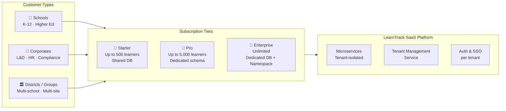

# Executive Summary

# Executive Summary

## Project Overview

The **Corporate Learning Progress, Intervention & Compliance Tracking System** is a **multi-tenant SaaS platform** that consolidates fragmented learning data — training attendance, assessment results, and competency milestones — into a single, actionable system. It enables organisations (schools, corporates, training bodies) to proactively identify at-risk learners, assign targeted interventions, and produce compliance-ready reports for regulatory bodies.

The platform is delivered as a **microservices-based SaaS** offering, catering to multiple customer types simultaneously — K-12 schools, higher education institutions, and corporate L&D departments — each operating in full data isolation.

---

## SaaS Delivery Model

---

## Business Objectives

| Objective | Target |
|---|---|
| Early risk detection | Identify at-risk learners 4–6 weeks before critical failure |
| Intervention effectiveness | ≥ 70 % of learners show measurable improvement |
| Learner success rate improvement | + 25 % year-over-year |
| Compliance reporting | 100 % on-time, accurate submissions |
| Tenant onboarding speed | New tenant live in < 5 minutes (automated provisioning) |
| Platform availability | ≥ 99.9 % uptime (Enterprise) · ≥ 99.5 % (Pro/Starter) |
| User adoption per tenant | ≥ 90 % of target users active within first month |

---

## Key Capabilities

- **Multi-tenant isolation** — row-level, schema-per-tenant, or dedicated DB based on plan
- **Automated tenant provisioning** — new customer onboarded and live in < 5 minutes
- **Real-time learner profile aggregation** — consolidates attendance, scores, and milestones
- **Configurable rule-based risk engine** — per-tenant JSON/YAML rules, versioned and auditable
- **Automated at-risk classification** — four severity levels: Critical, High, Medium, Low
- **Intervention lifecycle management** — assignment → approval → sessions → outcome measurement
- **Compliance & audit reporting** — templated, scheduled, with full immutable audit trail
- **Role-based dashboards** — Teachers, Administrators, Counsellors, Parents / Employees
- **White-label branding** — custom domain, logo, and colours per tenant (Pro/Enterprise)
- **SSO / SAML integration** — per-tenant identity provider (Enterprise)
- **Metered billing** — usage tracked per tenant, integrated with Stripe / Zuora

---

## Microservices Architecture Summary

| Service | Responsibility | Own Database |
|---|---|---|
| **Tenant Management** | Onboarding, config, billing, feature flags | `tenant-db` |
| **Auth / Identity** | OAuth2, JWT, SSO, RBAC | `auth-db` |
| **Ingestion** | Attendance, assessments, milestones intake | `ingestion-db` |
| **Learner Profile** | Aggregation, analytics, trend calculation | `profile-db` |
| **Risk Engine** | Rule execution, risk classification, alerts | `risk-db` |
| **Rule Management** | Rule CRUD, versioning, testing sandbox | `rules-db` |
| **Intervention** | Workflow, scheduling, session tracking, outcomes | `intervention-db` |
| **Reporting** | Compliance reports, dashboards, exports | `reporting-db` |
| **Notification** | Email, SMS, in-app alerts (stateless) | None |
| **Audit** | Immutable event log across all services | `audit-db` |

---

## Technology Stack

| Layer | Technology |
|---|---|
| **Backend services** | Spring Boot 3.x (Java) · FastAPI (Python) · ASP.NET Core 8 |
| **Primary database** | PostgreSQL 15+ (JSONB for rules & risk factors) |
| **Caching** | Redis 7.x — tenant context, profile snapshots, session tokens |
| **Event bus** | Apache Kafka — tenant-scoped topics |
| **Search** | Elasticsearch 8.x |
| **Frontend** | React 18+ · Angular 17+ · Vue 3+ |
| **Charting** | Chart.js · D3.js · ApexCharts |
| **Container orchestration** | Kubernetes (multi-namespace per tenant tier) |
| **API Gateway** | Kong / AWS API Gateway — tenant routing + rate limiting |
| **CI/CD** | GitHub Actions · GitLab CI · ArgoCD |
| **Monitoring** | Prometheus + Grafana (per-tenant dashboards) |
| **Logging** | ELK Stack — tenant-tagged structured logs |
| **Schema registry** | Confluent Schema Registry — event contract versioning |
| **Billing** | Stripe / Zuora — metered usage per tenant |
| **Object storage** | AWS S3 / Azure Blob — reports, imports, archives |

---

## Subscription Plans

| Feature | 🥉 Starter | 🥈 Pro | 🥇 Enterprise |
|---|:---:|:---:|:---:|
| Max learners | 500 | 5,000 | Unlimited |
| DB isolation | Shared (row-level) | Schema-per-tenant | Dedicated DB |
| K8s isolation | Shared namespace | Shared namespace | Dedicated namespace |
| Custom risk rules | 5 | 50 | Unlimited |
| Notification channels | Email only | Email + SMS + In-app | All channels |
| Compliance reporting | Standard | Custom templates | Full suite + board formats |
| Parent / Employee portal | ❌ | ✅ | ✅ |
| White-label branding | ❌ | ✅ | ✅ |
| Custom domain | ❌ | ✅ | ✅ |
| SSO / SAML | ❌ | ❌ | ✅ |
| API access | ❌ | ✅ | ✅ |
| ML risk scoring | ❌ | ❌ | ✅ |
| SLA guarantee | 99.5 % | 99.5 % | 99.9 % |
| Support | Community | Business hours | 24/7 dedicated |

---

## Key System Performance Targets

| Metric | Target |
|---|---|
| API response time (P95) | < 200 ms |
| Dashboard load time | < 2 s |
| Learner profile generation | < 500 ms per learner |
| Risk engine batch (1,000 learners) | < 2 min |
| Report generation | < 30 s |
| Tenant provisioning | < 5 min (automated) |
| Data sync latency | < 1 hour |
| Tenant context resolution (cached) | < 5 ms |

---

## Project Delivery Timeline (20 Weeks)

| Phase | Weeks | Focus |
|---|---|---|
| Phase 1 | 1 – 4 | Foundation, tenant provisioning, data integration |
| Phase 2 | 5 – 8 | Learner profile service, risk engine service |
| Phase 3 | 9 – 12 | Intervention service, workflow automation |
| Phase 4 | 13 – 16 | Reporting service, role-based dashboards |
| Phase 5 | 17 – 20 | Multi-tenant hardening, testing, go-live |
