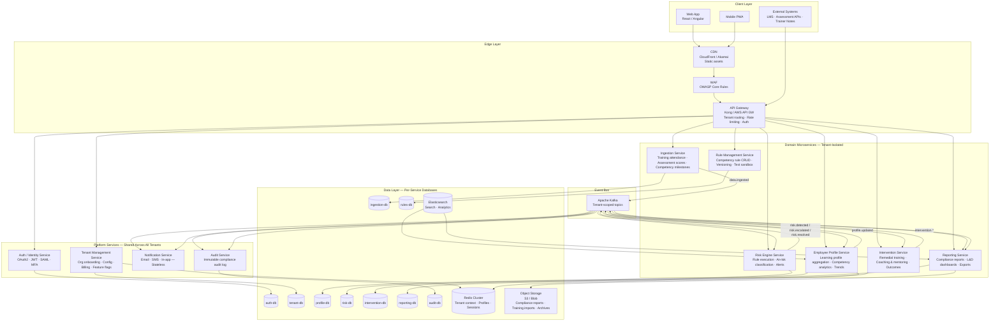
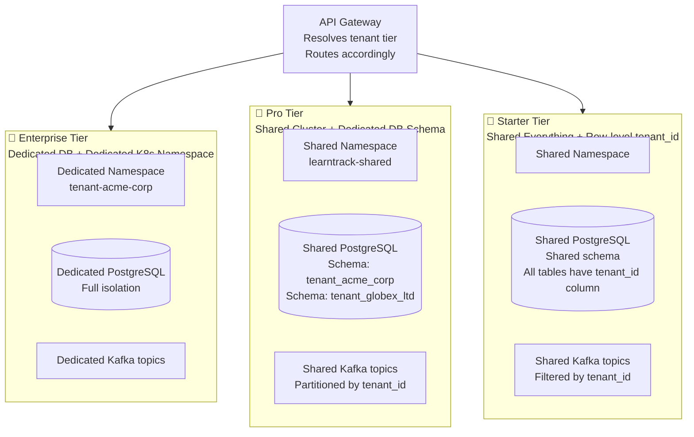
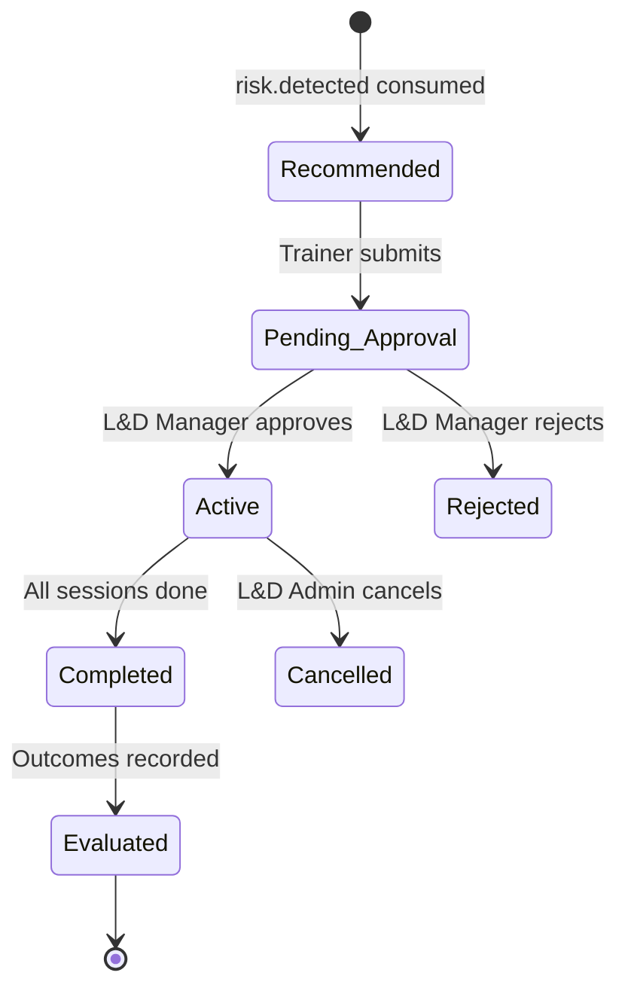
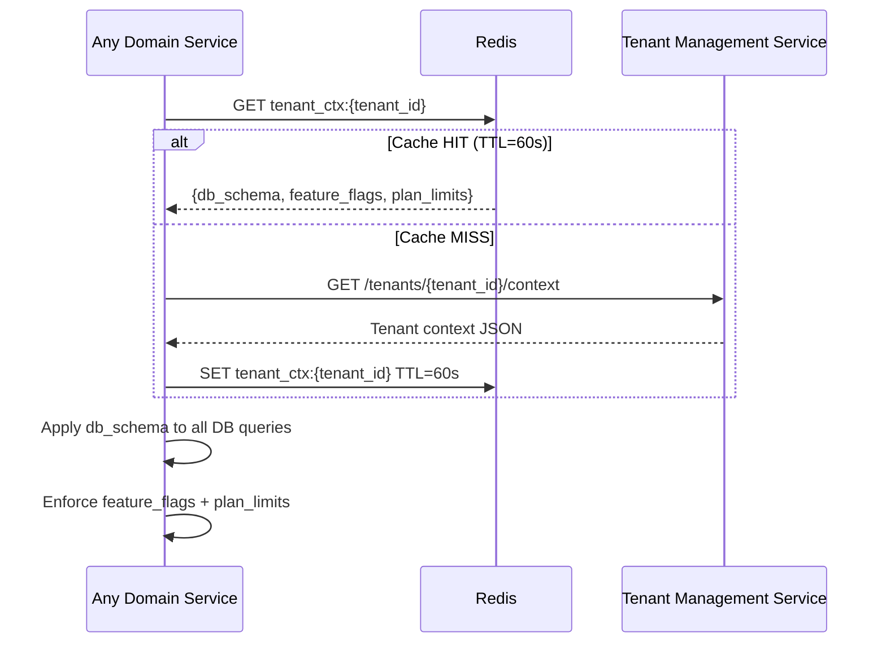

# System Architecture

# System Architecture — Corporate L&D SaaS Multi-Tenant Microservices

## High-Level Architecture



---

## Tenant Isolation Models



| Isolation Aspect | Starter | Pro | Enterprise |
|---|---|---|---|
| Database | Shared — row-level `tenant_id` | Shared DB — separate schema | Dedicated DB instance |
| Kubernetes | Shared namespace | Shared namespace | Dedicated namespace |
| Kafka topics | Shared — filtered by `tenant_id` | Shared — partitioned by `tenant_id` | Dedicated topics |
| Redis keyspace | Prefixed by `tenant_id` | Prefixed by `tenant_id` | Dedicated Redis cluster |
| Data breach blast radius | Entire shared tier | Schema-level | Fully isolated |

---

## Service Responsibilities & Ownership

### Auth / Identity Service
**Owns:** Users, roles, sessions, SSO configurations per organisation
**Key capability:** Supports per-tenant corporate SSO (SAML 2.0 / OIDC) enabling employees to log in with their existing corporate credentials (Azure AD, Okta, etc.)

---

### Tenant Management Service
**Owns:** Organisation registry, subscription plans, feature flags, branding, usage metering
**Critical role:** Every domain service reads tenant context from this service (via Redis cache) on every request to resolve the correct DB schema, feature flags, and plan limits

---

### Ingestion Service
**Owns:** Raw validated training attendance, assessment score, and competency milestone records
**Data sources ingested:**
- Employee training attendance records (from LMS or HR systems via API)
- Periodic assessment scores (from assessment platforms)
- Competency-level learning milestones (from competency frameworks or LMS)

**Key rule:** Never calls Employee Profile Service directly — publishes `data.ingested` events only

---

### Employee Profile Service
**Owns:** Aggregated employee learning profiles, competency performance metrics, trend history

**Calculated metrics per employee:**
- Training attendance percentage (rolling 30-day, current period, all-time)
- Assessment average per competency / training module
- Score trend direction (improving / stable / declining)
- Competency milestone completion rate
- Peer comparison index (anonymised, within same department / role)

**Key rule:** Never reads raw attendance or assessment data directly — consumes `data.ingested` events and builds its own aggregated view

---

### Risk Engine Service
**Owns:** Risk assessment records, risk scoring logic
**Supported risk rule types:**

| Rule Type | Example |
|---|---|
| Attendance-based | Training attendance < 75 % in last 30 days |
| Score-based | Two consecutive failing assessments in a competency |
| Trend-based | 20 % score decline over 60 days |
| Milestone-based | Critical competency milestone not met by required date |
| Composite | Low attendance AND low assessment scores simultaneously |
| Compliance deadline | At-risk flag within 4 weeks of regulatory certification deadline |

---

### Rule Management Service
**Owns:** Competency risk rule definitions, rule versions, rule audit trail
**Separated from Risk Engine** so L&D Administrators can edit, test, and version rules without touching execution logic

**Sample rule definition (JSON):**
```json
{
  "ruleId":      "COMP_001",
  "ruleName":    "Multiple High-Risk Competency Factors",
  "severity":    "CRITICAL",
  "conditions": {
    "operator":  "AND",
    "criteria": [
      {
        "metric":   "training_attendance_percentage",
        "period":   "30_days",
        "operator": "less_than",
        "value":    80
      },
      {
        "metric":   "competency_average_score",
        "period":   "30_days",
        "operator": "less_than",
        "value":    60
      }
    ]
  },
  "actions": {
    "alert":        ["trainer", "ld_manager", "line_manager"],
    "intervention": ["remedial_training", "coaching_assignment"]
  },
  "applicableTo": {
    "departments":  "all",
    "competencies": "all"
  }
}
```

---

### Intervention Service
**Owns:** Interventions, training sessions, coaching assignments, outcomes

**Intervention types supported (per problem statement):**
- Remedial training sessions
- Coaching and mentoring assignments



---

### Reporting Service
**Owns:** Compliance report templates, generated report metadata, L&D reporting aggregates

**Report types:**
- Employee competency progress reports
- At-risk employee lists with risk factors and competency gaps
- Intervention effectiveness summary (remedial training vs coaching)
- Training attendance compliance reports
- Competency achievement reports by department / role
- Regulatory certification readiness reports
- Executive L&D performance summary

---

## Cross-Cutting Concerns

### Tenant Context Resolution (Every Request)



---

### Security Architecture

| Layer | Control |
|---|---|
| Edge | WAF (OWASP rules), DDoS protection, TLS 1.3 |
| API Gateway | JWT validation, tenant resolution, per-tenant rate limiting |
| Service-to-service | mTLS via Istio / Linkerd service mesh |
| Database | Schema-level or row-level isolation, pgaudit logging |
| Data at rest | AES-256 encryption, column-level encryption for employee PII |
| Secrets | HashiCorp Vault — no secrets in env vars or code |
| Compliance | GDPR · SOC 2 Type II · HR data privacy regulations per jurisdiction |

---

### Role Permissions Matrix

| Feature | Trainer | L&D Administrator | L&D Manager | Employee |
|---|:---:|:---:|:---:|:---:|
| View own employees' profiles | ✅ | ✅ | ✅ | ✅ (own only) |
| View all employee profiles | ✅ | ✅ | ✅ | ❌ |
| Define / edit competency risk rules | ❌ | ✅ | ❌ | ❌ |
| Assign remedial training / coaching | ✅ | ✅ | ✅ | ❌ |
| Approve interventions | ❌ | ✅ | ✅ | ❌ |
| Generate compliance reports | ❌ | ✅ | ❌ | ❌ |
| View L&D dashboards | ✅ | ✅ | ✅ | ✅ (limited) |
| Manage users / roles | ❌ | ✅ | ❌ | ❌ |
| Configure tenant settings | ❌ | ✅ | ❌ | ❌ |
