# System Architecture

# System Architecture — SaaS Multi-Tenant Microservices

## High-Level Architecture

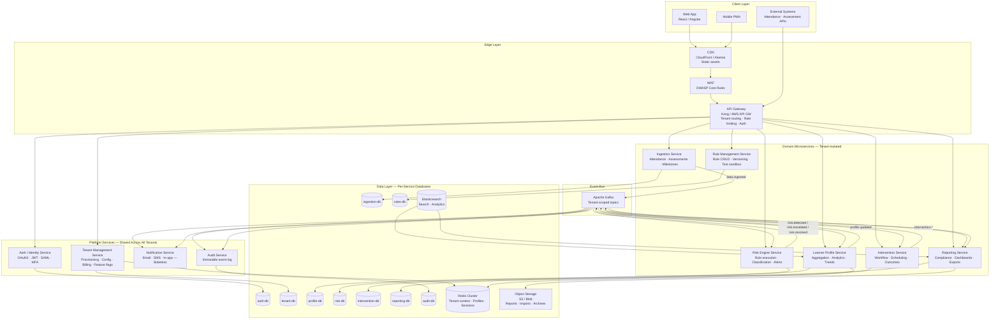

---

## Tenant Isolation Models

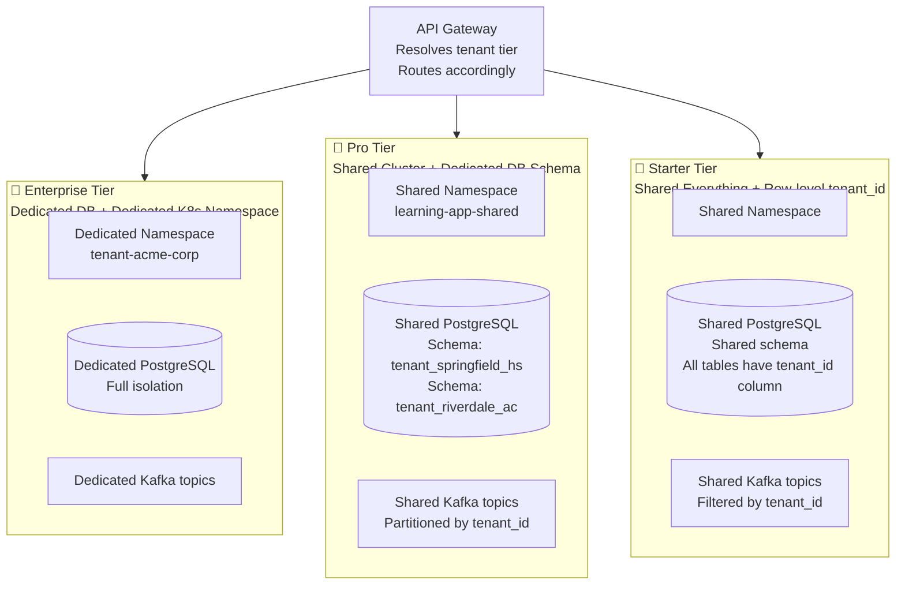

| Isolation Aspect | Starter | Pro | Enterprise |
|---|---|---|---|
| Database | Shared — row-level `tenant_id` | Shared DB — separate schema | Dedicated DB instance |
| Kubernetes | Shared namespace | Shared namespace | Dedicated namespace |
| Kafka topics | Shared — filtered by `tenant_id` | Shared — partitioned by `tenant_id` | Dedicated topics |
| Redis keyspace | Prefixed by `tenant_id` | Prefixed by `tenant_id` | Dedicated Redis cluster |
| Data breach blast radius | Entire shared tier | Schema-level | Fully isolated |

---

## Service Responsibilities & Ownership

### Auth / Identity Service
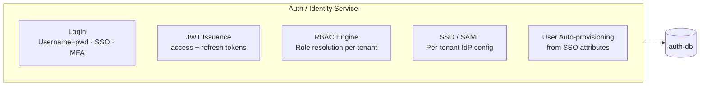

**Owns:** Users, roles, sessions, SSO configurations
**Does NOT own:** Tenant configuration (that's TMS), learner profiles (that's Profile Service)

---

### Tenant Management Service
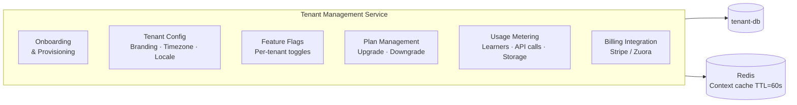

**Owns:** Tenant registry, plans, feature flags, branding, usage metrics
**Critical role:** Every domain service reads tenant context from this service (via Redis cache) on every request

---

### Ingestion Service
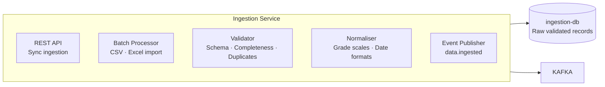

**Owns:** Raw attendance, assessment, and milestone records post-validation
**Key rule:** Never calls Profile Service directly — publishes events only

---

### Learner Profile Service
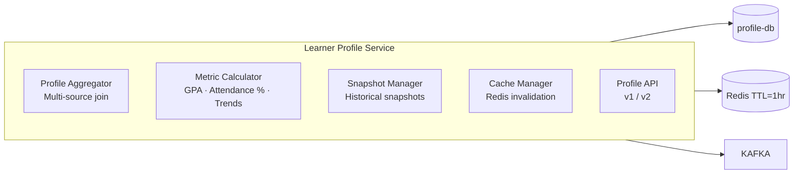

**Owns:** Aggregated learner profiles, performance metrics, trend history
**Key rule:** Never reads raw attendance/assessment data directly — consumes `data.ingested` events

---

### Risk Engine Service
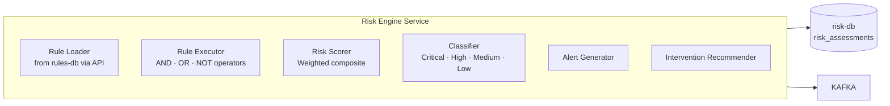

**Owns:** Risk assessment records, risk scoring logic
**Key rule:** Reads rule definitions from Rule Management Service API (not directly from rules-db)

---

### Rule Management Service
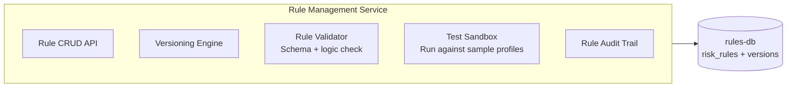

**Owns:** Rule definitions, rule versions, rule audit trail
**Separated from Risk Engine** so rules can be edited, tested, and versioned without touching execution logic

---

### Intervention Service
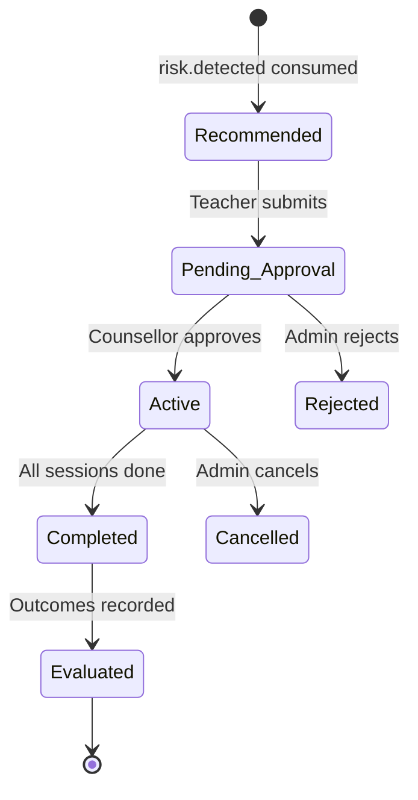

**Owns:** Interventions, sessions, outcomes
**Publishes:** `intervention.assigned`, `intervention.approved`, `intervention.completed`

---

### Reporting Service
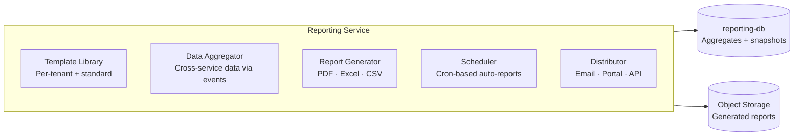

**Owns:** Report templates, generated report metadata, reporting aggregates
**Key design:** Builds its own read-optimised aggregates from consumed events — never joins across other services' databases

---

## Cross-Cutting Concerns

### Tenant Context Resolution (Every Request)
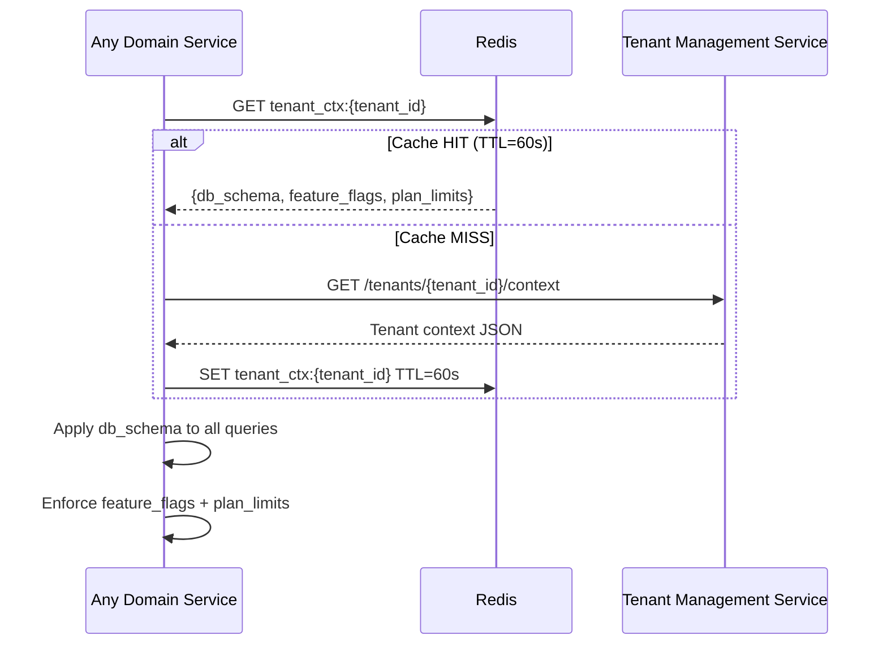

### Security Architecture

| Layer | Control |
|---|---|
| Edge | WAF (OWASP rules), DDoS protection, TLS 1.3 |
| API Gateway | JWT validation, tenant resolution, rate limiting per tenant |
| Service-to-service | mTLS via Istio / Linkerd service mesh |
| Database | Schema-level or row-level isolation, pgaudit logging |
| Data at rest | AES-256 encryption, column-level encryption for PII |
| Secrets | HashiCorp Vault — no secrets in env vars or code |
| Compliance | FERPA (schools), GDPR (EU tenants), SOC 2 Type II |
