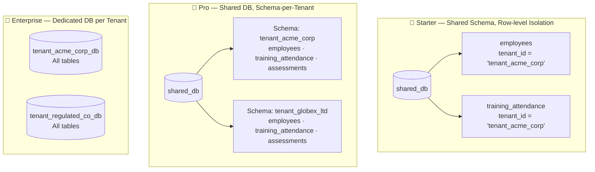
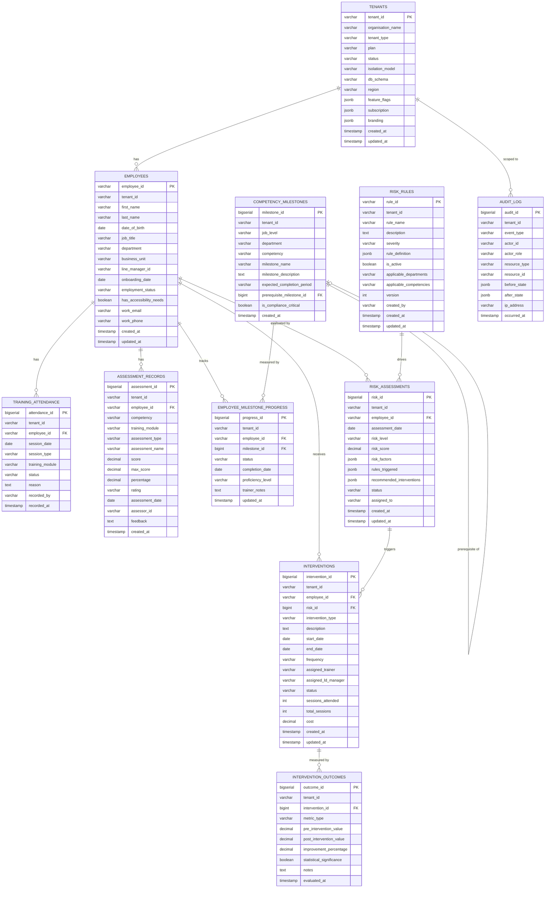
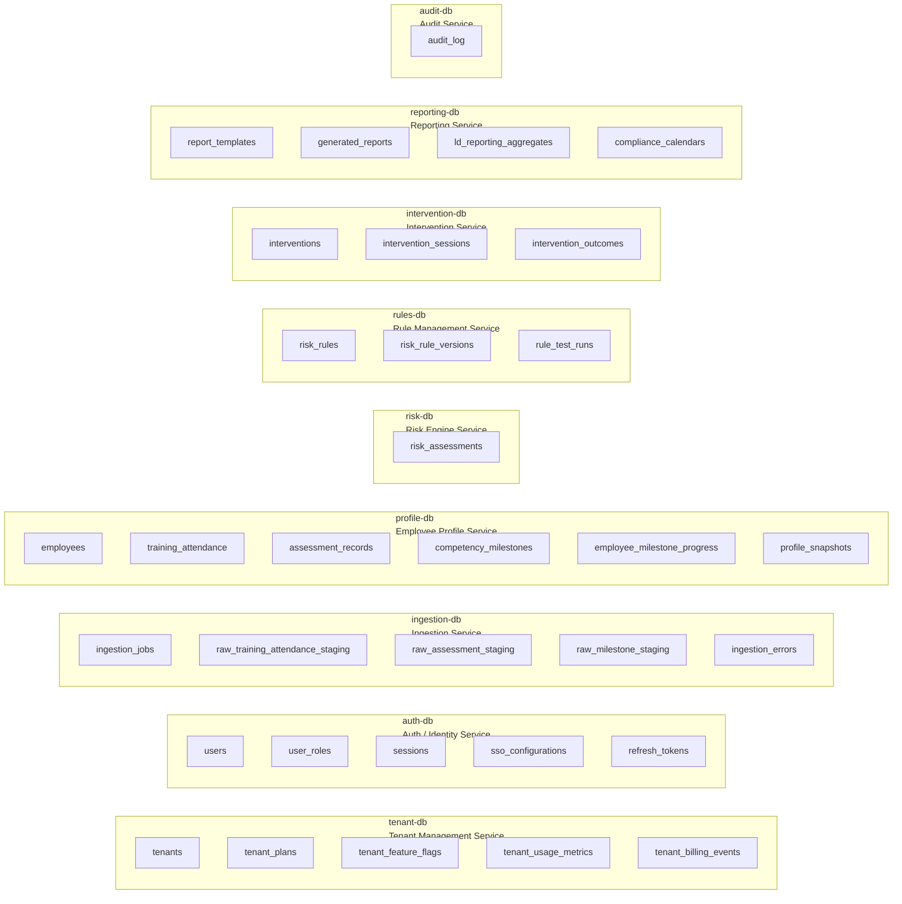

# Database & Data Structure

# Database Architecture — Corporate L&D SaaS Multi-Tenant

## Multi-Tenant Database Strategy



---

## Entity-Relationship Diagram (Per-Tenant Schema)



---

## Database-per-Service Ownership



---

## Key Table Notes

### `employees`
Central master record. `department` and `business_unit` replace grade/class. `line_manager_id` enables manager notifications. `has_accessibility_needs` flags differentiated learning support.

### `training_attendance`
Records attendance per training session. `session_type` values: `Instructor_Led`, `Virtual`, `Self_Paced`, `Workshop`, `Webinar`. `training_module` links to the relevant competency area.

### `assessment_records`
Stores every scored assessment normalised to a `percentage` column. `competency` and `training_module` columns replace subject/grade-level fields. `rating` values: `Exceeds_Expectations`, `Meets_Expectations`, `Needs_Improvement`, `Unsatisfactory`.

### `competency_milestones`
Defines the corporate competency framework tree. `is_compliance_critical` flags milestones required for regulatory certification. `job_level` and `department` replace grade level.

### `employee_milestone_progress`
Tracks each employee's progress against the competency framework. `proficiency_level` values: `Novice`, `Developing`, `Proficient`, `Expert`.

### `interventions`
`intervention_type` values (per problem statement): `Remedial_Training_Session`, `Coaching_Assignment`, `Mentoring_Assignment`. `assigned_trainer` and `assigned_ld_manager` replace teacher/counsellor.

---

## Tenant Isolation at Query Level

### Starter — Row-level Security
```sql
ALTER TABLE employees ENABLE ROW LEVEL SECURITY;

CREATE POLICY tenant_isolation ON employees
    USING (tenant_id = current_setting('app.current_tenant_id'));

SET app.current_tenant_id = 'tenant_acme_corp';
```

### Pro — Schema-per-Tenant
```sql
CREATE SCHEMA tenant_acme_corp;
CREATE TABLE tenant_acme_corp.employees ( ... );
CREATE TABLE tenant_acme_corp.training_attendance ( ... );
SET search_path TO tenant_acme_corp;
```

### Enterprise — Dedicated Database
```
Host:     pg-tenant-acme-corp.internal
Database: tenant_acme_corp_db
User:     svc_acme_corp_app
```

---

## Key Indexes

```sql
CREATE INDEX idx_employees_tenant         ON employees                   (tenant_id, employment_status);
CREATE INDEX idx_attendance_tenant        ON training_attendance          (tenant_id, employee_id, session_date);
CREATE INDEX idx_assessments_tenant       ON assessment_records           (tenant_id, employee_id, competency, assessment_date);
CREATE INDEX idx_milestones_tenant        ON competency_milestones        (tenant_id, job_level, department, is_compliance_critical);
CREATE INDEX idx_milestone_progress       ON employee_milestone_progress  (tenant_id, employee_id, status);
CREATE INDEX idx_risk_tenant              ON risk_assessments             (tenant_id, employee_id, risk_level, assessment_date);
CREATE INDEX idx_interventions_tenant     ON interventions                (tenant_id, employee_id, status, intervention_type);
CREATE INDEX idx_rules_tenant             ON risk_rules                   (tenant_id, is_active, severity);
CREATE INDEX idx_audit_tenant             ON audit_log                    (tenant_id, occurred_at DESC);
```

---

## Redis Keyspace Design

| Key Pattern | TTL | Content |
|---|---|---|
| `tenant_ctx:{tenant_id}` | 60 s | Tenant context (db_schema, flags, limits) |
| `profile:{tenant_id}:{employee_id}` | 1 hr | Aggregated employee learning profile snapshot |
| `rules:{tenant_id}:active` | 5 min | Active competency risk rules list |
| `dash:{tenant_id}:{role}:{hash}` | 5 min | L&D dashboard aggregate cache |
| `session:{token_hash}` | JWT expiry | User session data |
| `ratelimit:{tenant_id}:{endpoint}` | 1 min | API rate limit counter |

---

## Data Retention Policy

| Table | Active Retention | Archive After | Purge After |
|---|---|---|---|
| `training_attendance` | Current training year | 3 years | Per org contract |
| `assessment_records` | Current training year | 5 years | Per org contract |
| `employee_milestone_progress` | Employment lifetime | 5 years | Per org contract |
| `risk_assessments` | 2 years | 5 years | Per org contract |
| `interventions` | 2 years | 5 years | Per org contract |
| `intervention_outcomes` | 3 years | 5 years | Per org contract |
| `risk_rules` (versions) | Forever | — | — |
| `audit_log` | 7 years | Cold storage | Per regulation |
| `profile_snapshots` | 3 years | Cold storage | Per org contract |

> **Right-to-erasure (GDPR):** On `tenant.deprovisioned` or employee deletion request, a purge job runs against all service databases, archiving to cold storage and issuing a signed deletion certificate.
