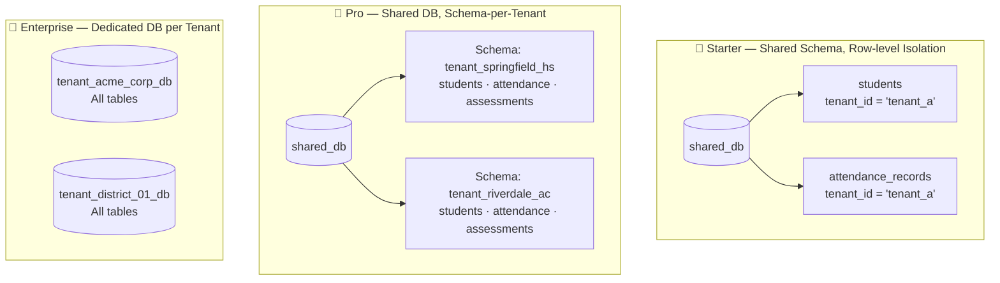
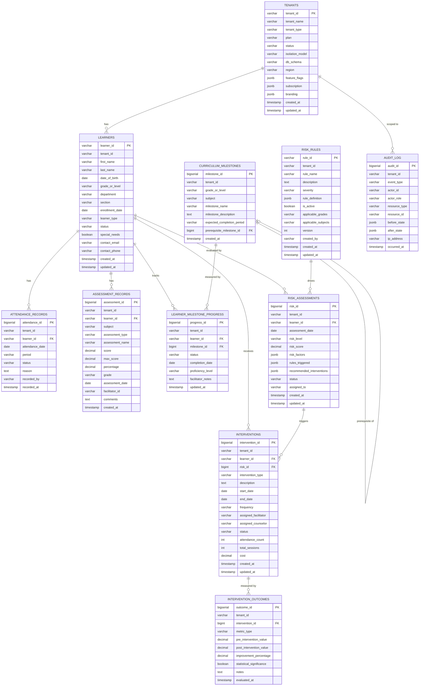
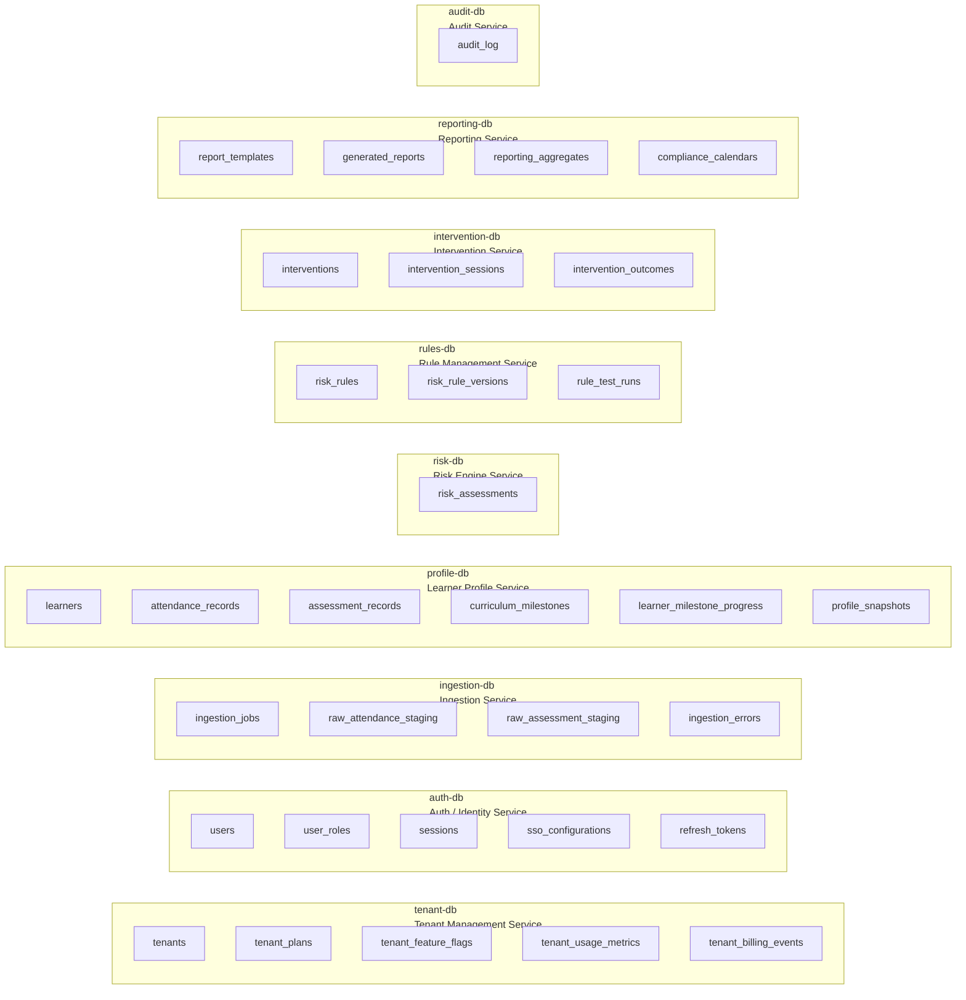

# Database & Data Structure

# Database Architecture — SaaS Multi-Tenant

## Multi-Tenant Database Strategy



---

## Entity-Relationship Diagram (Per-Tenant Schema)



---

## Database-per-Service Ownership

Each microservice owns its own database. No service ever queries another service's database directly.



---

## Tenant Isolation at Query Level

### Starter Plan — Row-level Policy (PostgreSQL Row Security)

```sql
-- Enable Row Level Security on every shared table
ALTER TABLE learners ENABLE ROW LEVEL SECURITY;

-- Policy: each service can only see rows matching its tenant JWT claim
CREATE POLICY tenant_isolation ON learners
    USING (tenant_id = current_setting('app.current_tenant_id'));

-- Set tenant context at connection time
SET app.current_tenant_id = 'tenant_springfield_hs_a1b2';
```

### Pro Plan — Schema-per-Tenant

```sql
-- Each tenant gets their own schema
CREATE SCHEMA tenant_springfield_hs_a1b2;

-- All tables created inside tenant schema
CREATE TABLE tenant_springfield_hs_a1b2.learners ( ... );
CREATE TABLE tenant_springfield_hs_a1b2.attendance_records ( ... );

-- Service sets search_path on connection
SET search_path TO tenant_springfield_hs_a1b2;
```

### Enterprise Plan — Dedicated Database

```
Host:     pg-tenant-acme-corp.internal
Database: tenant_acme_corp_db
User:     svc_acme_corp_app
Schema:   public
```

---

## Key Schema Additions for Multi-Tenancy

### `tenant_id` on All Domain Tables

Every table in the domain schema carries `tenant_id` as the **first non-PK column** and is indexed:

```sql
-- Composite index: tenant_id + most common filter column
CREATE INDEX idx_learners_tenant       ON learners           (tenant_id, status);
CREATE INDEX idx_attendance_tenant     ON attendance_records  (tenant_id, learner_id, attendance_date);
CREATE INDEX idx_assessments_tenant    ON assessment_records  (tenant_id, learner_id, assessment_date);
CREATE INDEX idx_risk_tenant           ON risk_assessments    (tenant_id, learner_id, risk_level, assessment_date);
CREATE INDEX idx_interventions_tenant  ON interventions       (tenant_id, learner_id, status);
CREATE INDEX idx_rules_tenant          ON risk_rules          (tenant_id, is_active, severity);
CREATE INDEX idx_audit_tenant          ON audit_log           (tenant_id, occurred_at DESC);
```

---

### `risk_rule_versions` — Rule Versioning Table

```sql
CREATE TABLE risk_rule_versions (
    version_id      BIGSERIAL PRIMARY KEY,
    tenant_id       VARCHAR(100) NOT NULL,
    rule_id         VARCHAR(50)  NOT NULL,
    version         INT          NOT NULL,
    rule_definition JSONB        NOT NULL,
    change_summary  TEXT,
    changed_by      VARCHAR(100),
    changed_at      TIMESTAMP    NOT NULL DEFAULT NOW(),
    UNIQUE (tenant_id, rule_id, version)
);
```

### `profile_snapshots` — Historical Profile Storage

```sql
CREATE TABLE profile_snapshots (
    snapshot_id   BIGSERIAL PRIMARY KEY,
    tenant_id     VARCHAR(100) NOT NULL,
    learner_id    VARCHAR(50)  NOT NULL,
    snapshot_date DATE         NOT NULL,
    profile_data  JSONB        NOT NULL,  -- full profile at point in time
    created_at    TIMESTAMP    NOT NULL DEFAULT NOW(),
    UNIQUE (tenant_id, learner_id, snapshot_date)
);
```

### `tenant_usage_metrics` — Metered Billing Data

```sql
CREATE TABLE tenant_usage_metrics (
    metric_id     BIGSERIAL PRIMARY KEY,
    tenant_id     VARCHAR(100) NOT NULL,
    metric_date   DATE         NOT NULL,
    learner_count INT          NOT NULL DEFAULT 0,
    api_calls     BIGINT       NOT NULL DEFAULT 0,
    storage_gb    DECIMAL(10,4)NOT NULL DEFAULT 0,
    reports_generated INT      NOT NULL DEFAULT 0,
    recorded_at   TIMESTAMP    NOT NULL DEFAULT NOW(),
    UNIQUE (tenant_id, metric_date)
);
```

---

## Redis Keyspace Design (Multi-Tenant)

| Key Pattern | TTL | Content |
|---|---|---|
| `tenant_ctx:{tenant_id}` | 60 s | Tenant context (db_schema, flags, limits) |
| `profile:{tenant_id}:{learner_id}` | 1 hr | Aggregated learner profile snapshot |
| `rules:{tenant_id}:active` | 5 min | Active risk rules list |
| `dash:{tenant_id}:{role}:{hash}` | 5 min | Dashboard aggregate cache |
| `session:{token_hash}` | JWT expiry | User session data |
| `ratelimit:{tenant_id}:{endpoint}` | 1 min | API rate limit counter |

---

## Data Retention Policy (Per Tenant)

| Table | Active Retention | Archive After | Purge After |
|---|---|---|---|
| `attendance_records` | Current year | 3 years | Per tenant contract |
| `assessment_records` | Current year | 5 years | Per tenant contract |
| `learner_milestone_progress` | Enrolment lifetime | 5 years | Per tenant contract |
| `risk_assessments` | 2 years | 5 years | Per tenant contract |
| `interventions` | 2 years | 5 years | Per tenant contract |
| `intervention_outcomes` | 3 years | 5 years | Per tenant contract |
| `risk_rules` (versions) | Forever | — | — |
| `audit_log` | 7 years | Cold storage | Per regulation |
| `profile_snapshots` | 3 years | Cold storage | Per tenant contract |

> **Right-to-erasure:** On `tenant.deprovisioned` event, a data purge job runs against all service databases, archiving to cold storage and issuing a signed deletion certificate.
