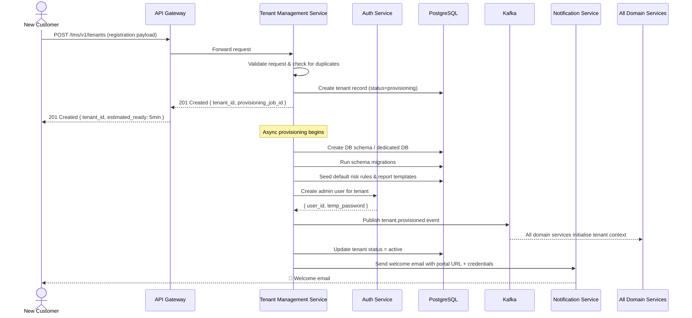
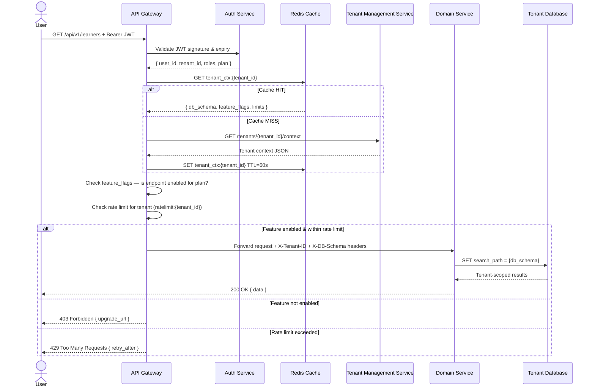
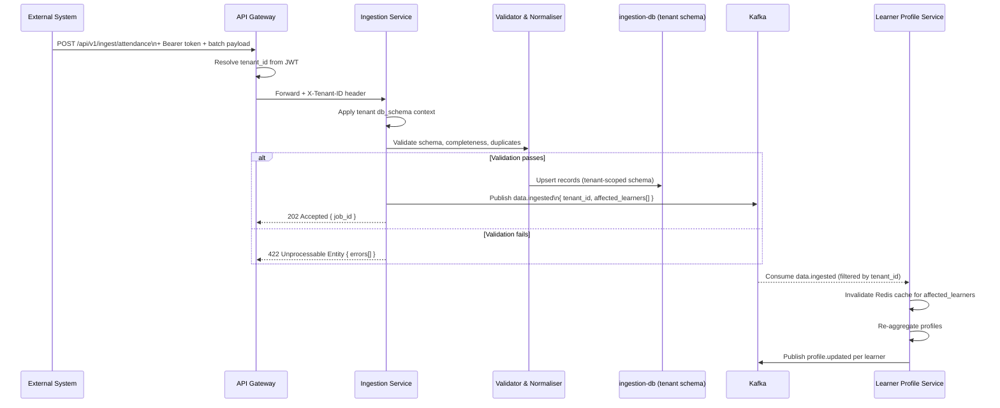
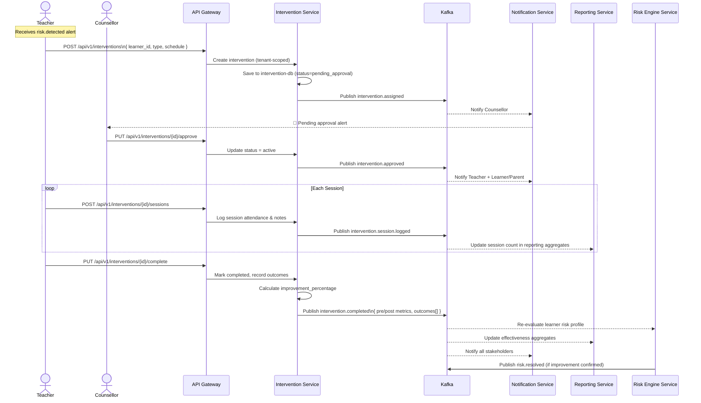
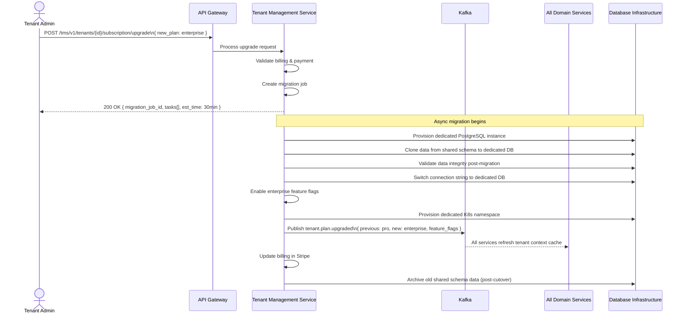
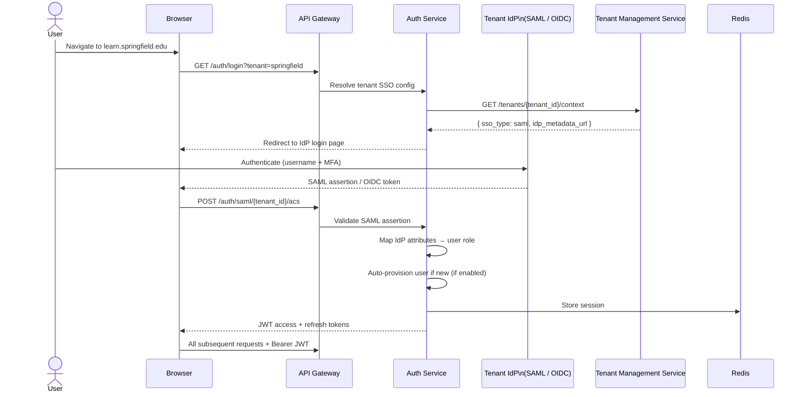
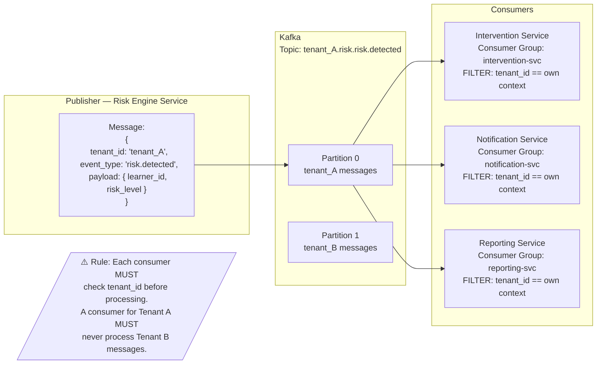

# Technical Flows

# Technical Flows — SaaS Multi-Tenant Microservices

## 1. Tenant Onboarding & Provisioning Flow



---

## 2. Multi-Tenant Request Routing Flow



---

## 3. Data Ingestion Flow (Tenant-Aware)



---

## 4. Risk Detection Flow (Tenant-Isolated)

```mermaid
flowchart TD
    A([profile.updated event\n{ tenant_id, learner_id, profile_snapshot }]) --> B[Risk Engine Consumer]
    B --> C[Load active rules for tenant\nfrom rules-db via Rule Mgmt API]
    C --> D[Rules cached in Redis?\nrules:{tenant_id}:active — TTL=5min]
    D -->|Cache hit| E[Execute rule engine\nagainst profile snapshot]
    D -->|Cache miss| F[Fetch from rules-db\nCache result]
    F --> E

    E --> G{Any rules matched?}
    G -->|No rules matched| H[Risk Level = NONE\nUpdate risk_assessments record]
    G -->|Rules matched| I[Compute weighted risk score]
    I --> J{Classify risk level}
    J -->|Score ≥ 85| K[CRITICAL]
    J -->|Score 65–84| L[HIGH]
    J -->|Score 40–64| M[MEDIUM]
    J -->|Score < 40| N[LOW]

    K & L & M & N --> O[Persist to risk-db\nwith tenant_id]
    O --> P{Risk ≥ HIGH?}
    P -->|Yes| Q[Publish risk.detected\n{ tenant_id, learner_id, risk_level }]
    P -->|CRITICAL| R[Publish risk.escalated\n{ tenant_id, immediate_action=true }]
    P -->|No| S([End])

    Q --> T[Intervention Service\nrecommends interventions]
    Q --> U[Notification Service\nalerts teacher + counsellor + parent]
    Q --> V[Reporting Service\nupdates at-risk aggregates]
    R --> W[Notification Service\nurgent alerts to all targets]
```

---

## 5. Intervention Lifecycle Flow (Multi-Tenant)



---

## 6. Compliance Report Generation Flow (Tenant-Scoped)

```mermaid
flowchart TD
    A([Scheduled trigger\nCron or Manual]) --> B[Reporting Service\nLoad tenant report config]
    B --> C[Select report template\nTenant custom or standard]
    C --> D[Read from reporting-db\ntenant-scoped aggregates]
    D --> E{Data fresh enough?\nLast sync < 1hr ago?}
    E -->|Stale| F[Trigger data refresh\nfrom event-sourced aggregates]
    E -->|Fresh| G[Assemble report dataset]
    F --> G
    G --> H[Render report\nPDF / Excel / CSV]
    H --> I[Validate report\nChecksum + accuracy check]
    I --> J{Validation passed?}
    J -->|Yes| K[Store in object storage\ns3://tenant-reports/{tenant_id}/]
    J -->|No| L[Emit error alert\nHalt generation]
    K --> M[Persist metadata to reporting-db]
    M --> N[Publish report.generated event]
    N --> O[Notification Service\nEmail + portal notification]
    N --> P[Audit Service\nLog: who · when · what · checksum]
```

---

## 7. Tenant Plan Upgrade Flow



---

## 8. Authentication Flow — Multi-Tenant SSO (Enterprise)



---

## 9. Event Bus — Tenant Isolation Guarantee


