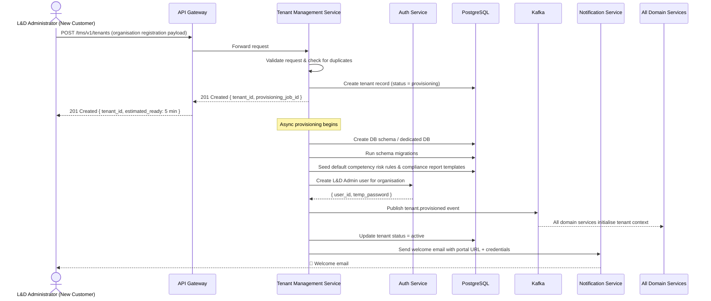
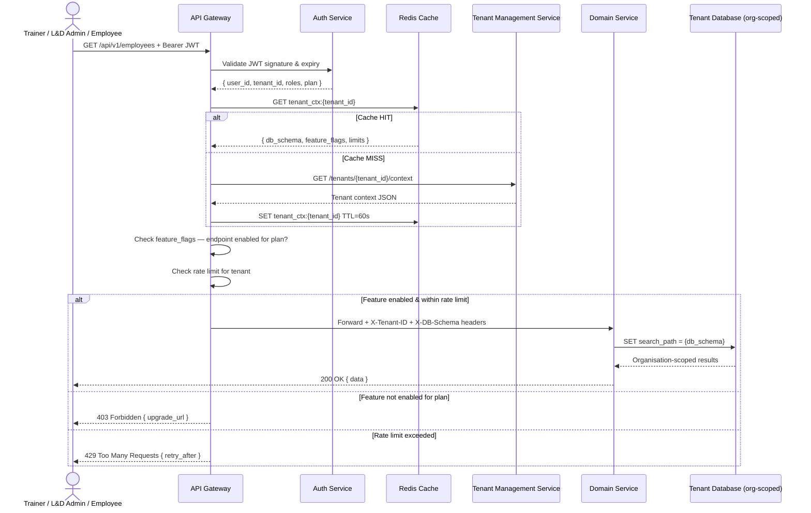
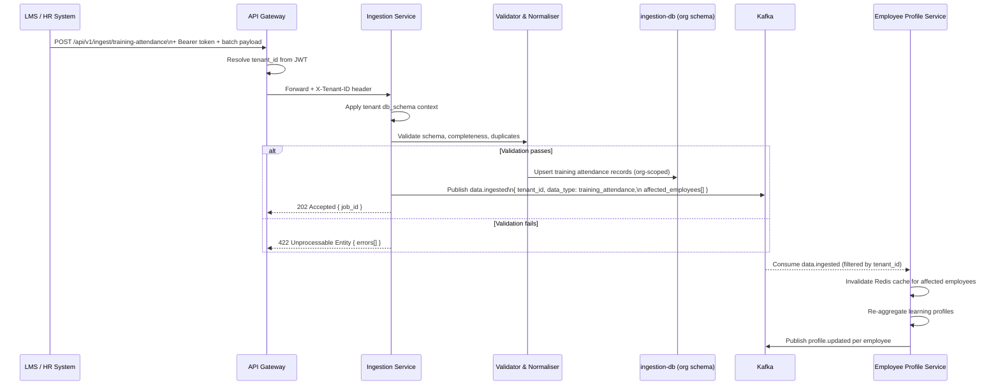
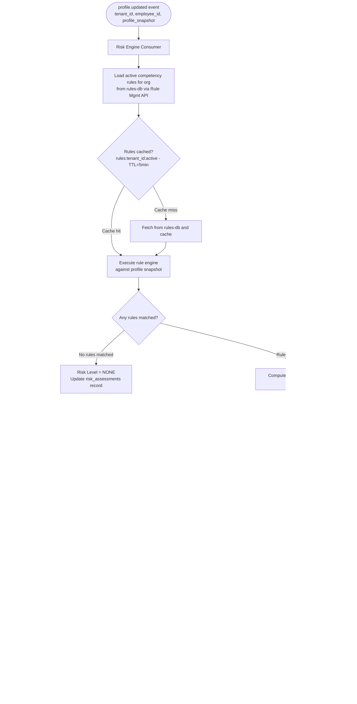
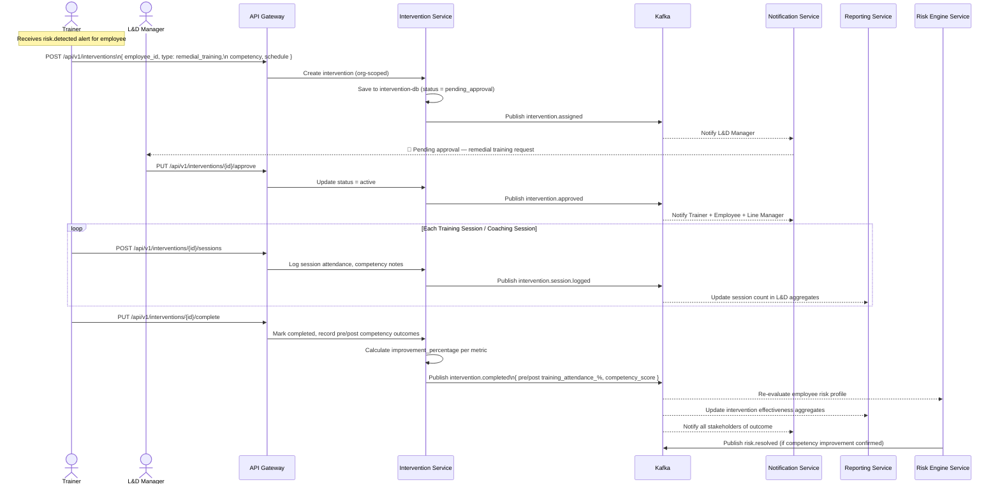
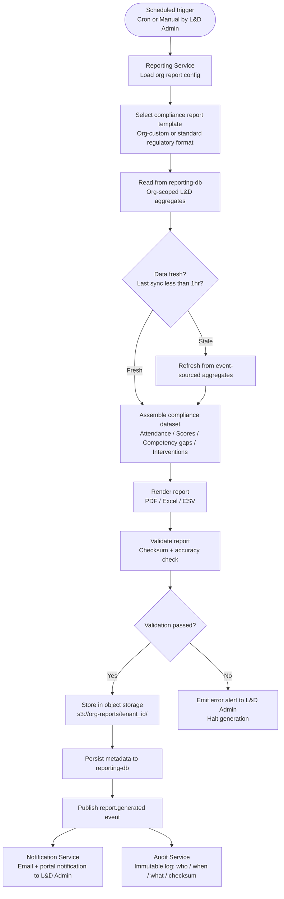
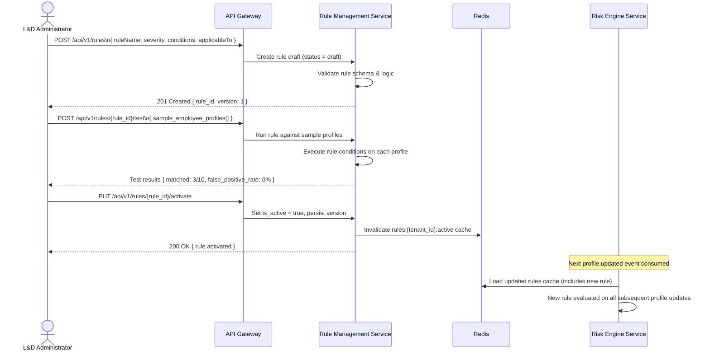
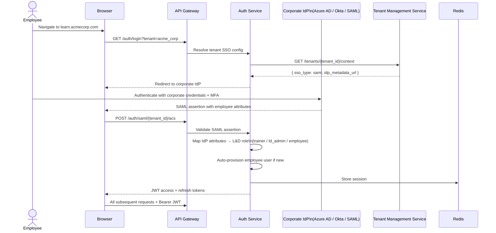
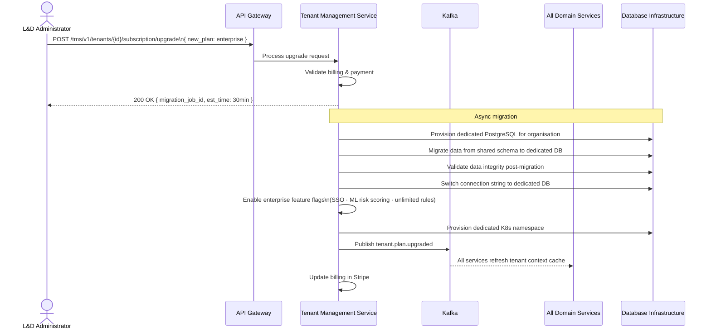

# Technical Flows

# Technical Flows — Corporate L&D SaaS Multi-Tenant

## 1. Tenant (Organisation) Onboarding & Provisioning Flow

---

## 2. Multi-Tenant Request Routing Flow

---

## 3. Training Data Ingestion Flow

**Three ingestion endpoints (per problem statement):**

| Endpoint | Data Type | Source |
|---|---|---|
| `POST /api/v1/ingest/training-attendance` | Employee training attendance records | LMS / HR system |
| `POST /api/v1/ingest/assessments` | Periodic assessment scores | Assessment platform |
| `POST /api/v1/ingest/competency-milestones` | Competency-level learning milestones | LMS / Competency framework |

---

## 4. Employee Risk Detection Flow

---

## 5. Intervention Lifecycle Flow — Remedial Training & Coaching

---

## 6. Compliance Report Generation Flow

---

## 7. Competency Rule Authoring & Activation Flow

---

## 8. SSO Authentication Flow (Enterprise — Corporate Identity Provider)

---

## 9. Plan Upgrade Flow — Corporate Tenant

