# User Journeys

# User Journeys — Corporate L&D SaaS Multi-Tenant

## Role Overview

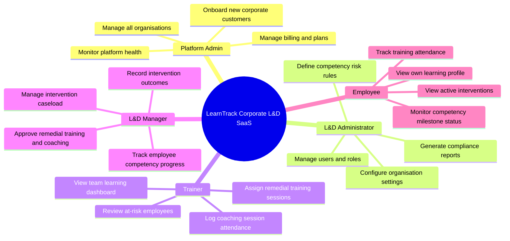

---

## Journey 1 — New Corporate Customer Onboards as a SaaS Tenant

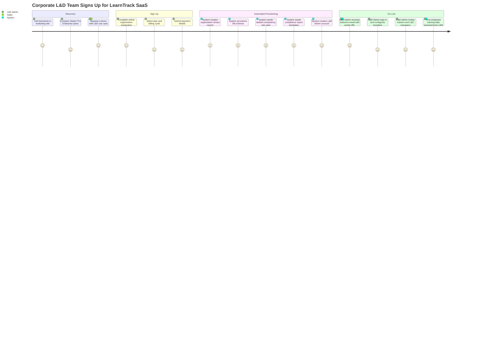

---

## Journey 2 — Trainer Identifies and Acts on an At-Risk Employee

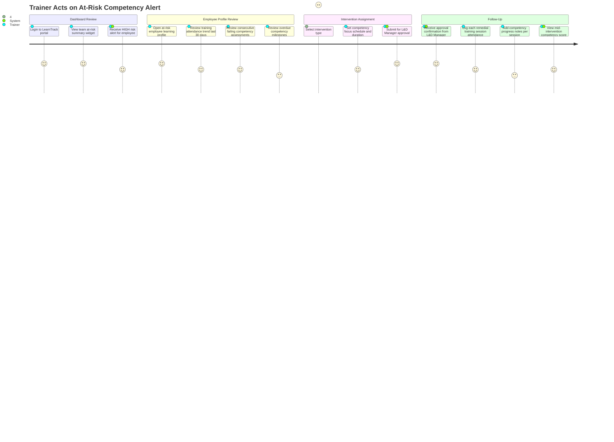

---

## Journey 3 — L&D Manager Manages Intervention Lifecycle

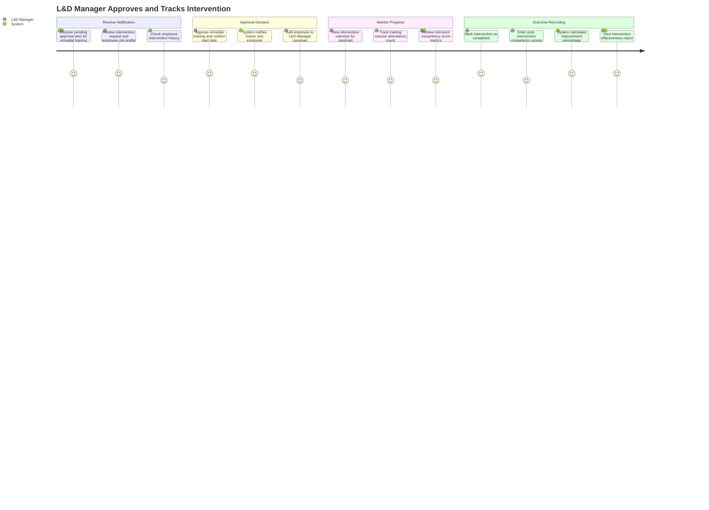

---

## Journey 4 — L&D Administrator Generates Compliance Report

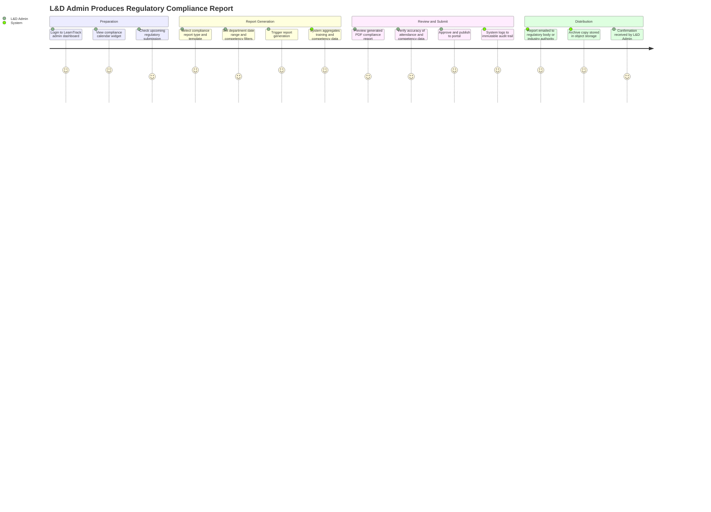

---

## Journey 5 — Employee Monitors Own Learning Progress

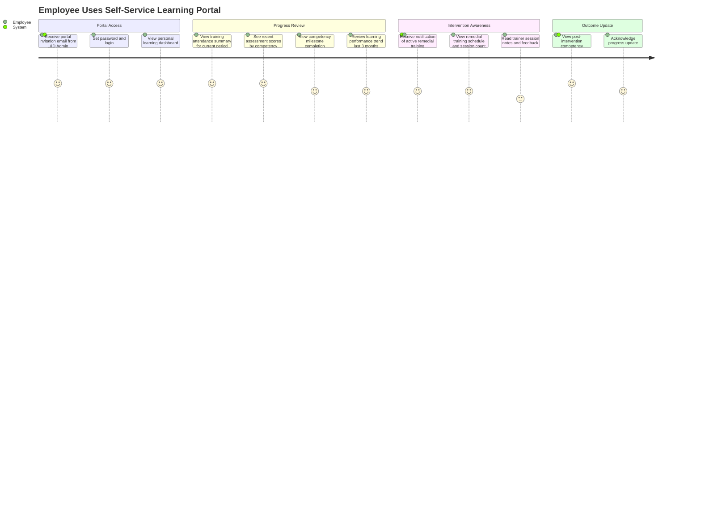

---

## Journey 6 — L&D Administrator Configures Competency Risk Rules

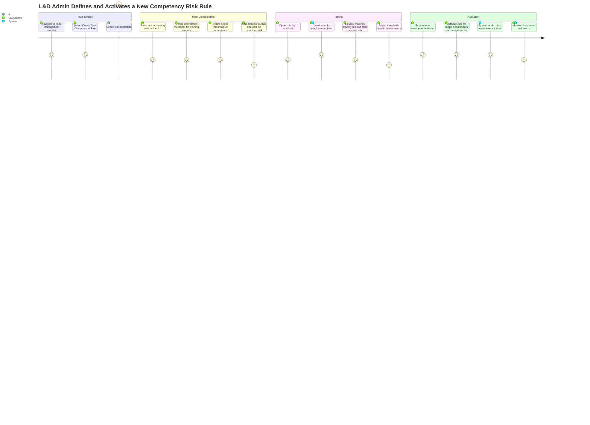

---

## Role-Based Dashboard Layouts

### Trainer Dashboard

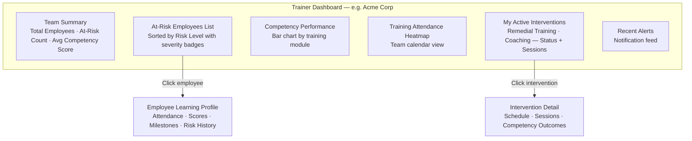

### L&D Administrator Dashboard

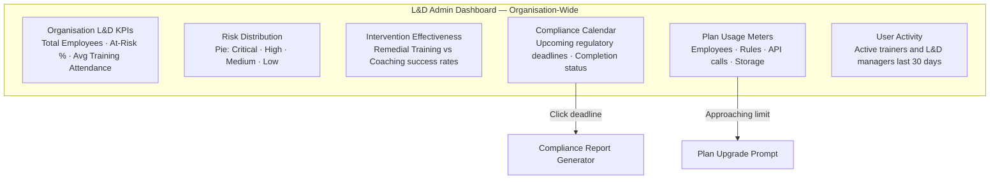

### L&D Manager Dashboard

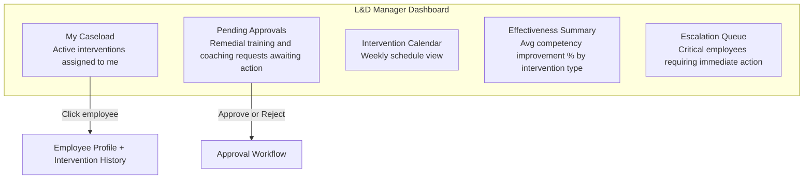

### Employee Self-Service Portal

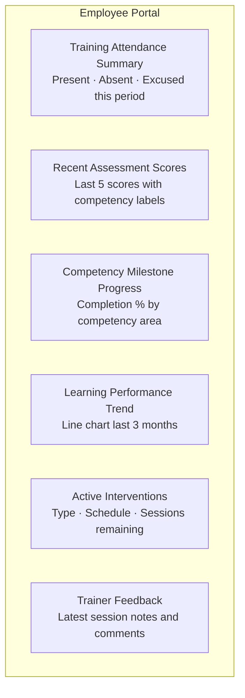

---

## Notification Touch-Points — Corporate L&D

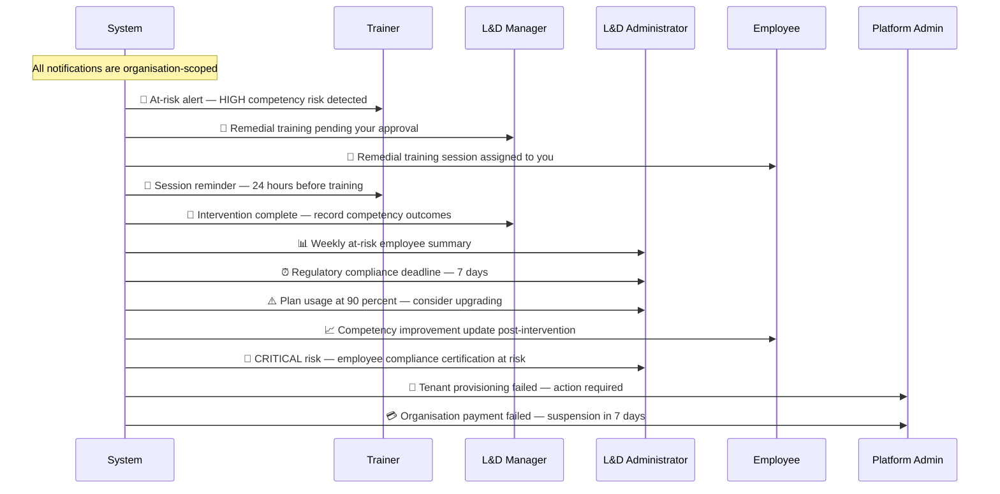
