# User Journeys

# User Journeys — SaaS Multi-Tenant

## Role Overview (All Tenant Types)

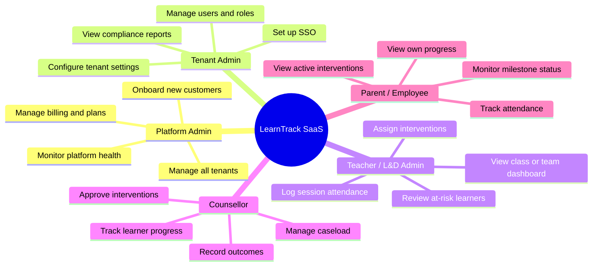

---

## Journey 1 — New Customer Onboards as a SaaS Tenant

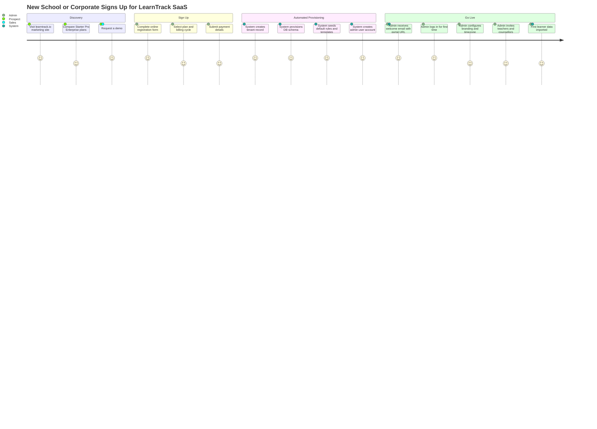

---

## Journey 2 — Platform Admin Manages the SaaS Platform

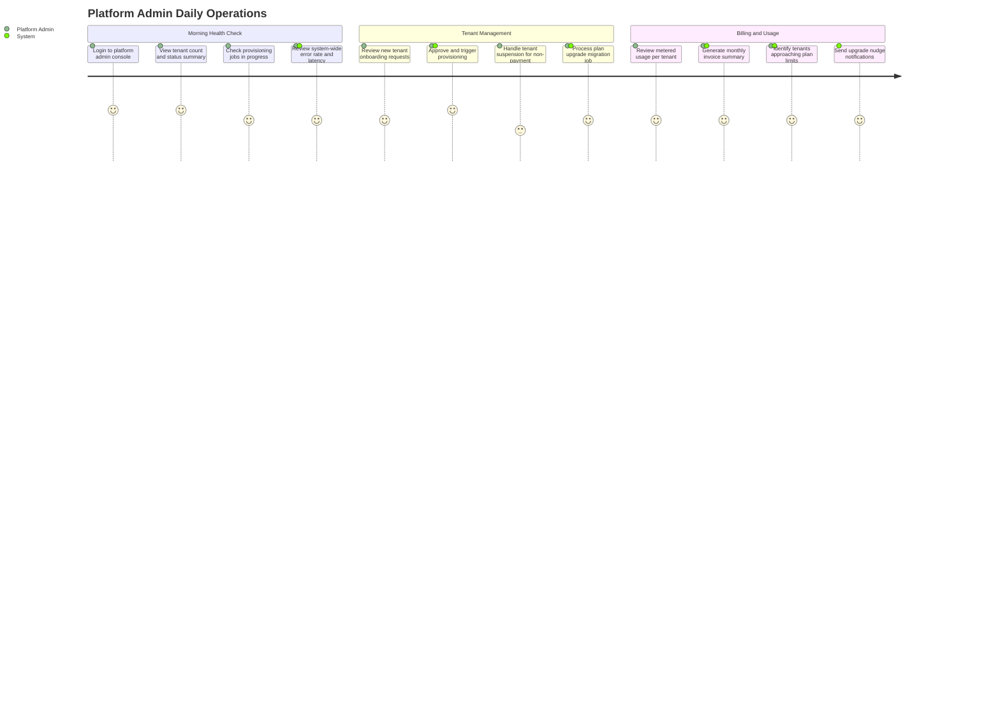

---

## Journey 3 — Tenant Admin Configures Their Environment

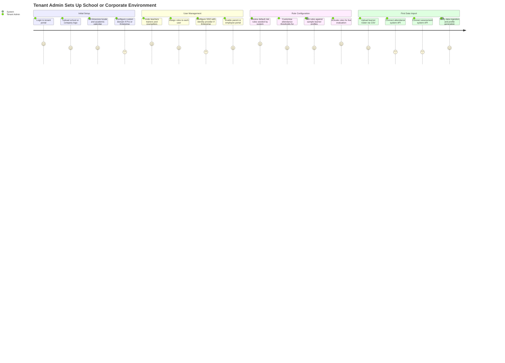

---

## Journey 4 — Teacher Identifies and Acts on an At-Risk Learner

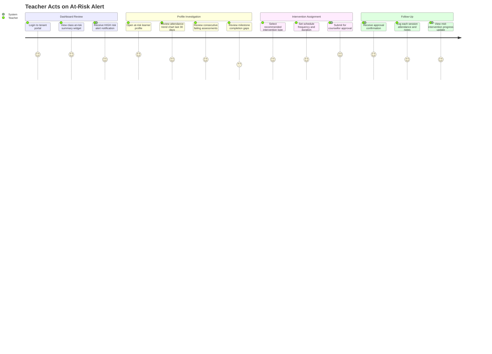

---

## Journey 5 — Parent or Employee Monitors Own Progress

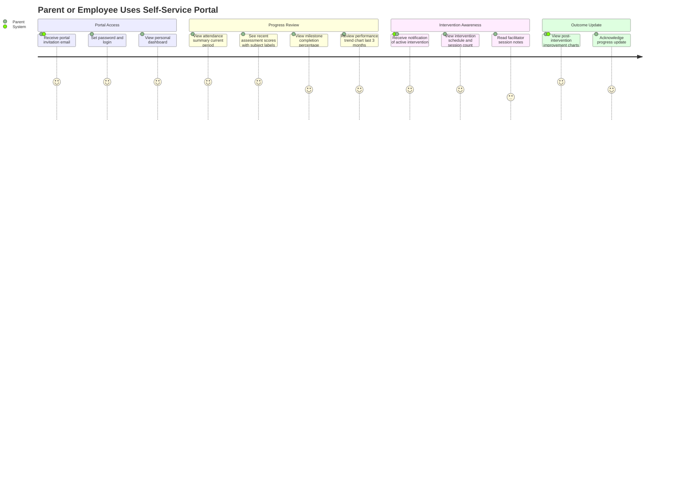

---

## Role-Based Dashboard Layouts

### Teacher / L&D Admin Dashboard

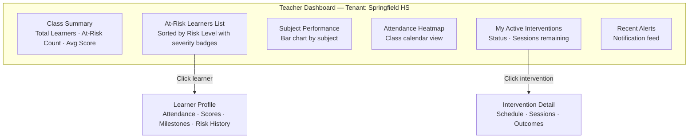

---

### Tenant Admin Dashboard

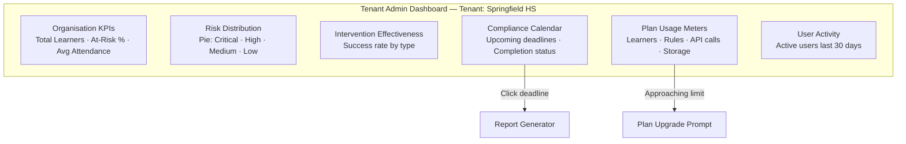

---

### Platform Admin Dashboard *(SaaS operator only)*

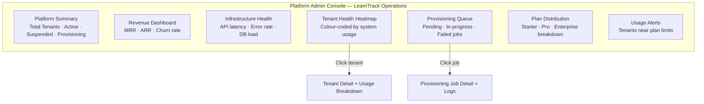

---

## Notification Touch-Points (Multi-Tenant Aware)

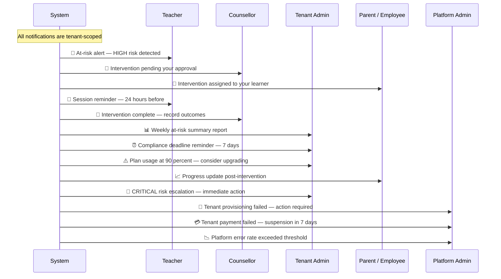

---

## Tenant Self-Service Upgrade Journey

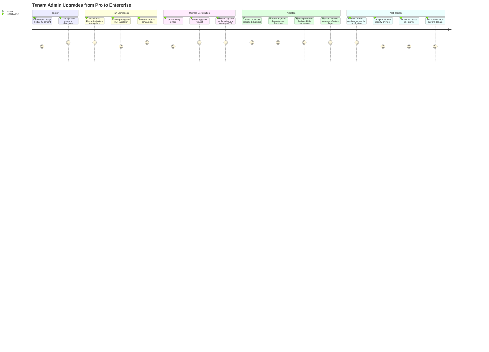
