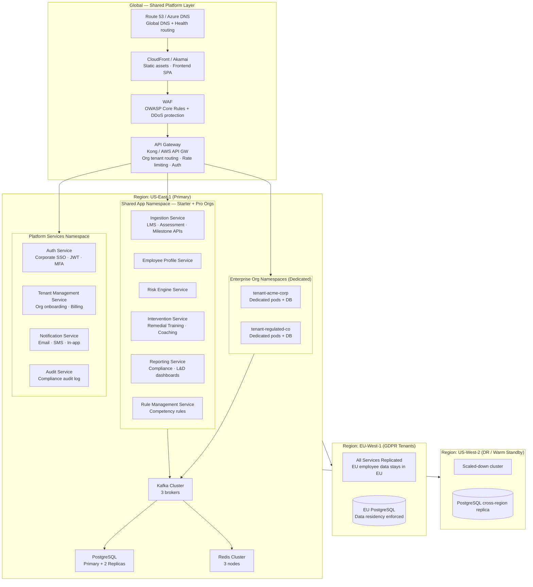
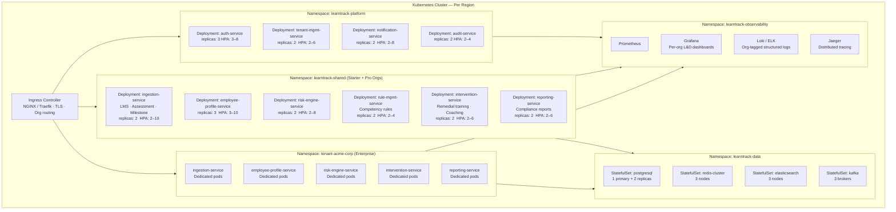
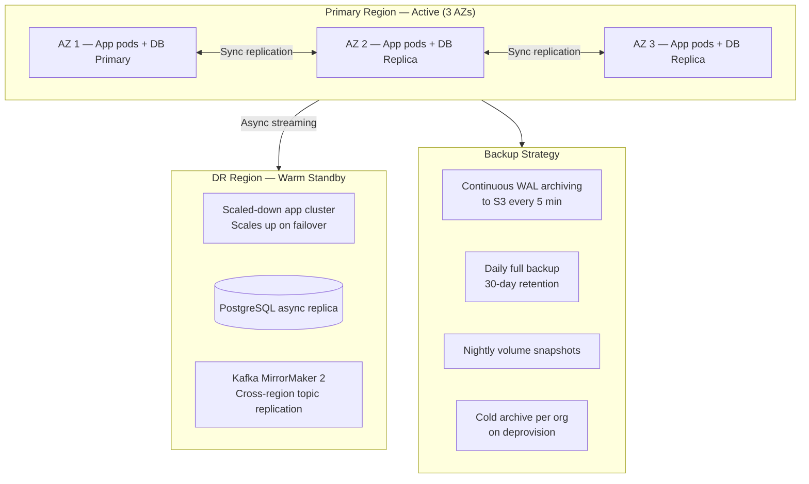
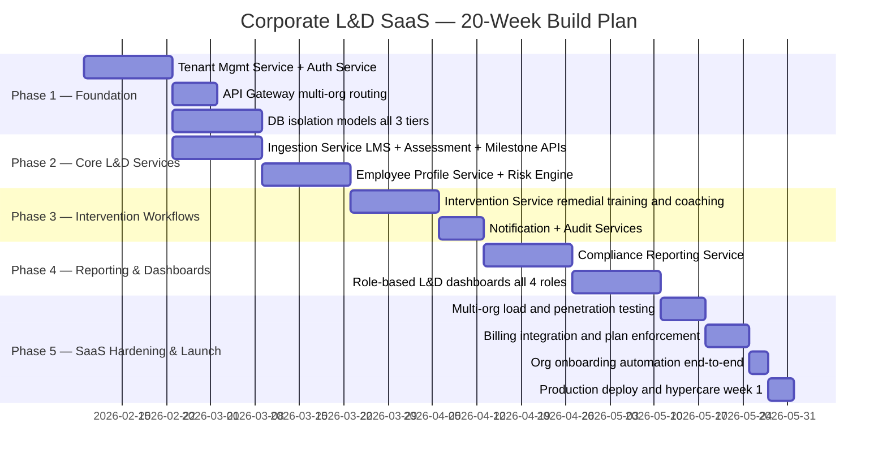

# Deployment Architecture

# Deployment Architecture — Corporate L&D SaaS Multi-Tenant

## Global Infrastructure Overview

---

## Kubernetes Cluster Topology

---

## Resource Sizing Per Service

| Service | Replicas (min–max) | CPU Request | CPU Limit | RAM Request | RAM Limit |
|---|---|---|---|---|---|
| Auth Service | 3 – 8 | 250m | 1000m | 512 Mi | 2 Gi |
| Tenant Mgmt Service | 2 – 6 | 250m | 1000m | 512 Mi | 2 Gi |
| Ingestion Service | 2 – 10 | 500m | 2000m | 1 Gi | 4 Gi |
| Employee Profile Service | 3 – 10 | 500m | 2000m | 1 Gi | 4 Gi |
| Risk Engine Service | 2 – 8 | 500m | 2000m | 1 Gi | 4 Gi |
| Rule Management Service | 2 – 4 | 250m | 1000m | 512 Mi | 2 Gi |
| Intervention Service | 2 – 6 | 250m | 1000m | 512 Mi | 2 Gi |
| Reporting Service | 2 – 6 | 500m | 2000m | 1 Gi | 4 Gi |
| Notification Service | 2 – 8 | 100m | 500m | 256 Mi | 1 Gi |
| Audit Service | 2 – 4 | 250m | 500m | 512 Mi | 1 Gi |
| PostgreSQL Primary | Fixed: 1 | 2 | 8 | 8 Gi | 32 Gi |
| Redis Cluster Node | Fixed: 3 | 500m | 2000m | 2 Gi | 8 Gi |
| Kafka Broker | Fixed: 3 | 1 | 4 | 4 Gi | 16 Gi |
| Elasticsearch Node | Fixed: 3 | 1 | 4 | 4 Gi | 8 Gi |

---

## CI/CD Pipeline

```mermaid
flowchart LR
    subgraph Source["Source Control"]
        GIT[Git Repository\nper-service or monorepo]
    end

    subgraph CI["Continuous Integration — per service"]
        LINT[Lint + Static Analysis\nSonarQube · Checkstyle]
        UT[Unit Tests\nMin 80% coverage]
        IT[Integration Tests\nTestcontainers]
        SAST[Security Scan\nSnyk · Trivy]
        BUILD[Build + Push Docker Image\nECR / ACR]
        HELM[Package Helm Chart\nVersion tagged]
    end

    subgraph CD["Continuous Delivery — ArgoCD GitOps"]
        DEV[Deploy → dev\nAuto on merge to main]
        TEST[Deploy → test\nSmoke + regression]
        STG[Deploy → staging\nPerf + UAT]
        GATE{Manual Approval\nRelease Manager}
        PROD[Deploy → production\nRolling update per service]
    end

    subgraph POST["Post-Deploy"]
        SMOKE[Smoke Tests\nCritical L&D API endpoints]
        MON[Monitor\n15 min observation window]
        ROLL[Auto-rollback\nif error rate spikes]
    end

    GIT -->|PR merge| LINT --> UT --> IT --> SAST --> BUILD --> HELM
    HELM --> DEV --> TEST --> STG --> GATE --> PROD --> SMOKE --> MON
    MON -->|Error rate > 1%| ROLL
```

---

## High Availability & Disaster Recovery

| DR Metric | Starter / Pro | Enterprise |
|---|---|---|
| Recovery Time Objective (RTO) | < 4 hours | < 1 hour |
| Recovery Point Objective (RPO) | < 1 hour | < 15 minutes |
| Backup frequency | Daily full + WAL | Continuous WAL + hourly snapshot |
| DR test frequency | Quarterly | Monthly |
| SLA uptime guarantee | 99.5 % | 99.9 % |

---

## Monitoring & Observability

```mermaid
graph LR
    subgraph Metrics["Metrics — Prometheus + Grafana"]
        M1[API latency P50/P95/P99 per service per org]
        M2[Error rate per endpoint]
        M3[Risk engine processing time per org]
        M4[Kafka consumer lag — training data pipeline]
        M5[DB connection pool per org]
        M6[Org plan usage meters]
    end

    subgraph Logs["Structured Logs — ELK / Loki"]
        L1[All logs tagged with tenant_id]
        L2[Compliance audit logs — pgaudit + app layer]
        L3[LMS ingestion error logs]
        L4[Security and access logs]
    end

    subgraph Alerts["Alerts — PagerDuty / OpsGenie"]
        A1[🚨 API error rate > 1%]
        A2[🚨 P95 latency > 500 ms]
        A3[🚨 Training data pipeline lag > 5 min]
        A4[🚨 DB replication lag > 60 s]
        A5[🚨 Org provisioning failure]
        A6[⚠️ Org plan usage > 90%]
        A7[💳 Payment failure — suspension imminent]
    end

    Metrics & Logs --> Alerts
```

---

## Security Controls

| Control | Implementation |
|---|---|
| Org data isolation | PostgreSQL Row Security (Starter) · Schema separation (Pro) · Dedicated DB (Enterprise) |
| Network isolation | Kubernetes NetworkPolicy — services cannot cross namespace boundaries |
| Secrets management | HashiCorp Vault — rotated per org, never in env vars |
| Inter-service auth | mTLS via Istio service mesh |
| API rate limiting | Per-org rate limits at Kong API Gateway |
| Container security | Non-root containers, read-only root filesystem |
| Image scanning | Trivy in CI — blocks on CRITICAL CVEs |
| WAF | OWASP Core Rule Set — blocks SQLi, XSS, CSRF |
| Employee PII encryption | AES-256 column-level for email, phone, date of birth |
| Compliance audit trail | Immutable per-org audit log — pgaudit + app-layer events |
| Penetration testing | Quarterly external pentest + annual red-team |
| Regulatory compliance | GDPR (EU orgs) · SOC 2 Type II · HR data privacy per jurisdiction |
| Data residency | EU-based orgs provisioned in EU-West — data never leaves EU |

---

## SaaS Go-Live Checklist

### Platform Readiness

| Item | Owner |
|---|---|
| All 10 services deployed and health-checked in production | DevOps |
| Multi-region failover tested end-to-end | DevOps |
| WAF rules validated against OWASP test suite | Security |
| Org provisioning automation tested (< 5 min target) | Engineering |
| Billing integration (Stripe) tested with live keys | Finance / Engineering |
| Platform admin console operational | Engineering |
| Monitoring dashboards and all alerts active | DevOps |
| Penetration test completed and findings remediated | Security |
| SOC 2 Type II controls documented | Security / Compliance |

### First Corporate Customer Onboarding Readiness

| Item | Owner |
|---|---|
| Default competency risk rule library ready (min 15 rules) | L&D Product |
| Default compliance report templates validated | Compliance Officer |
| LMS / assessment system API connectors tested | Engineering |
| User documentation and help centre live | Product |
| In-app L&D onboarding walkthrough tested | UX / Engineering |
| Support ticketing system configured per org tier | Support |

---

## 20-Week SaaS Build & Launch Roadmap

