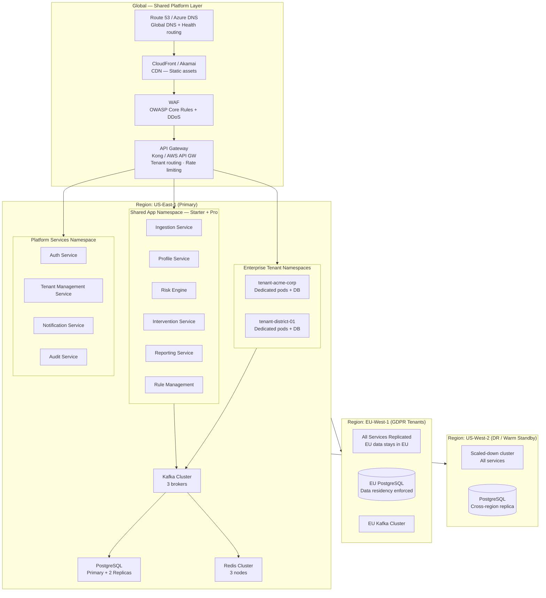
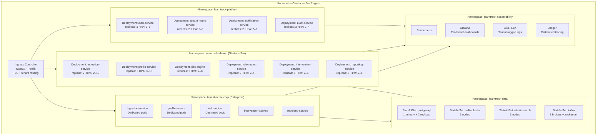
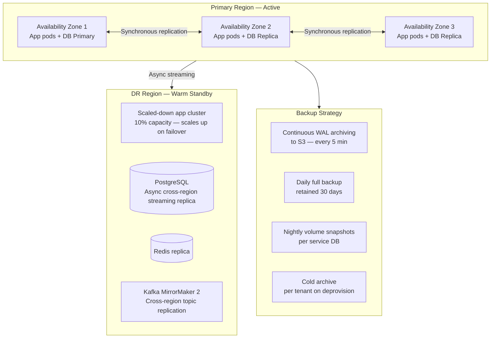
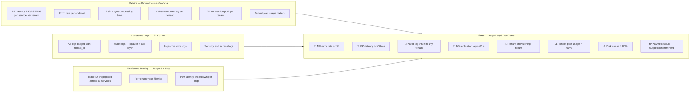
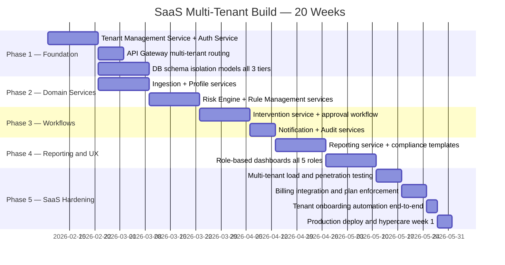

# Deployment Architecture

# Deployment Architecture — SaaS Multi-Tenant

## Global Infrastructure Overview

---

## Kubernetes Cluster Topology

---

## Resource Sizing Per Service

| Service | Replicas (min–max) | CPU Request | CPU Limit | RAM Request | RAM Limit |
|---|---|---|---|---|---|
| Auth Service | 3 – 8 | 250m | 1000m | 512 Mi | 2 Gi |
| Tenant Mgmt Service | 2 – 6 | 250m | 1000m | 512 Mi | 2 Gi |
| Ingestion Service | 2 – 10 | 500m | 2000m | 1 Gi | 4 Gi |
| Profile Service | 3 – 10 | 500m | 2000m | 1 Gi | 4 Gi |
| Risk Engine | 2 – 8 | 500m | 2000m | 1 Gi | 4 Gi |
| Rule Mgmt Service | 2 – 4 | 250m | 1000m | 512 Mi | 2 Gi |
| Intervention Service | 2 – 6 | 250m | 1000m | 512 Mi | 2 Gi |
| Reporting Service | 2 – 6 | 500m | 2000m | 1 Gi | 4 Gi |
| Notification Service | 2 – 8 | 100m | 500m | 256 Mi | 1 Gi |
| Audit Service | 2 – 4 | 250m | 500m | 512 Mi | 1 Gi |
| PostgreSQL Primary | Fixed: 1 | 2 | 8 | 8 Gi | 32 Gi |
| Redis Cluster Node | Fixed: 3 | 500m | 2000m | 2 Gi | 8 Gi |
| Kafka Broker | Fixed: 3 | 1 | 4 | 4 Gi | 16 Gi |
| Elasticsearch Node | Fixed: 3 | 1 | 4 | 4 Gi | 8 Gi |

---

## CI/CD Pipeline

```mermaid
flowchart LR
    subgraph Source["Source Control"]
        GIT[Git Monorepo\nor per-service repos]
    end

    subgraph CI["Continuous Integration — per service"]
        LINT[Lint + Static Analysis\nESLint · Checkstyle · SonarQube]
        UT[Unit Tests\nMin 80% coverage]
        IT[Integration Tests\nTestcontainers]
        SAST[Security Scan\nSnyk · Trivy]
        BUILD[Build + Push\nDocker Image → ECR/ACR]
        HELM[Package Helm Chart\nVersion tagged]
    end

    subgraph CD["Continuous Delivery — ArgoCD GitOps"]
        DEV[Deploy → dev\nAuto on merge to main]
        TEST[Deploy → test\nAuto — run smoke tests]
        STG[Deploy → staging\nAuto — perf + UAT tests]
        GATE{Manual\nApproval Gate\nRelease manager}
        PROD[Deploy → production\nRolling update per service]
    end

    subgraph POST["Post-Deploy"]
        SMOKE[Smoke Tests\nCritical API endpoints]
        MON[Monitor\n15 min observation window]
        ROLL[Auto-rollback\nif error rate spikes]
    end

    GIT -->|PR merge| LINT --> UT --> IT --> SAST --> BUILD --> HELM
    HELM --> DEV --> TEST --> STG --> GATE --> PROD --> SMOKE --> MON
    MON -->|Error rate > 1%| ROLL
```

### Pipeline Gate Criteria

| Gate | Criterion | Block On |
|---|---|---|
| Lint | Zero errors | Any error |
| Unit tests | ≥ 80 % coverage | Coverage drop |
| Integration tests | All green | Any failure |
| Security scan (SAST) | No CRITICAL CVEs | Critical CVE found |
| Docker image build | Successful | Build failure |
| Staging perf test | P95 < 200 ms | SLA breach |
| Manual approval | Release manager sign-off | Not approved |
| Smoke tests (prod) | All critical endpoints 200 OK | Any failure → auto-rollback |

---

## High Availability & Disaster Recovery

| DR Metric | Starter / Pro | Enterprise |
|---|---|---|
| Recovery Time Objective (RTO) | < 4 hours | < 1 hour |
| Recovery Point Objective (RPO) | < 1 hour | < 15 minutes |
| Backup frequency | Daily full + WAL | Continuous WAL + hourly snapshot |
| DR test frequency | Quarterly | Monthly |
| SLA uptime guarantee | 99.5 % | 99.9 % |

---

## Monitoring & Observability (Per-Tenant)

---

## Security Controls — SaaS Hardening

| Control | Implementation |
|---|---|
| Tenant data isolation | PostgreSQL Row Security (Starter) · Schema separation (Pro) · Dedicated DB (Enterprise) |
| Network isolation | Kubernetes NetworkPolicy — services cannot cross namespace boundaries |
| Secrets management | HashiCorp Vault — rotated per tenant, never in env vars |
| Inter-service auth | mTLS via Istio service mesh — all pod-to-pod traffic encrypted |
| API rate limiting | Per-tenant rate limits enforced at API Gateway (Kong) |
| Container security | Non-root containers, read-only root filesystem, no privileged pods |
| Image scanning | Trivy in CI — blocks on CRITICAL CVEs before any deploy |
| WAF | OWASP Core Rule Set — blocks SQLi, XSS, CSRF at edge |
| PII encryption | Column-level AES-256 for email, phone, date of birth |
| Audit logging | Immutable audit trail per tenant — `pgaudit` + app-layer events |
| Penetration testing | Quarterly external pentest + annual red-team exercise |
| Compliance | FERPA (US schools) · GDPR (EU tenants) · SOC 2 Type II (platform-wide) |
| Data residency | EU tenants provisioned in EU-West region — data never leaves EU |

---

## SaaS Go-Live Checklist

### Platform Readiness

| Item | Owner |
|---|---|
| All services deployed and health-checked in production | DevOps |
| Multi-region failover tested and documented | DevOps |
| WAF rules validated against OWASP test suite | Security |
| Kafka topic replication verified across regions | DevOps |
| Tenant provisioning automation tested end-to-end | Engineering |
| Billing integration (Stripe) tested with live keys | Finance / Engineering |
| Platform admin console operational | Engineering |
| Monitoring dashboards and all alerts active | DevOps |
| Penetration test completed and findings remediated | Security |
| SOC 2 controls documented and in place | Security / Compliance |

### First Tenant Onboarding Readiness

| Item | Owner |
|---|---|
| Onboarding email templates reviewed and tested | Marketing / Engineering |
| Default risk rule library validated (min 15 rules) | Product |
| Default report templates validated by compliance officer | Compliance |
| User documentation and help centre live | Product |
| In-app onboarding walkthrough tested | UX / Engineering |
| Support ticketing system configured per tenant | Support |
| SLA monitoring per tenant tier active | DevOps |

---

## 20-Week SaaS Build & Launch Roadmap

