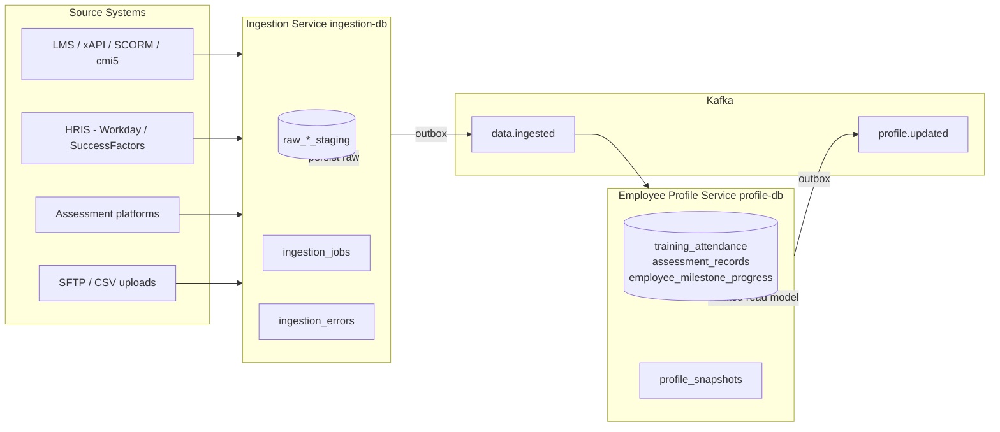
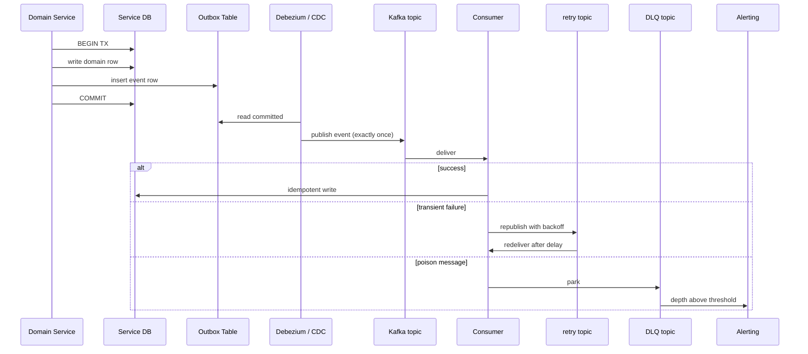
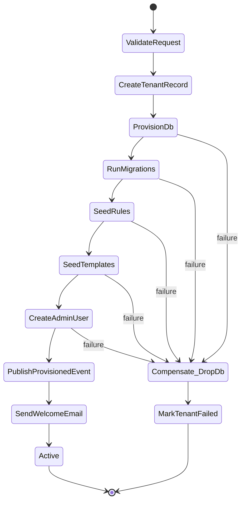
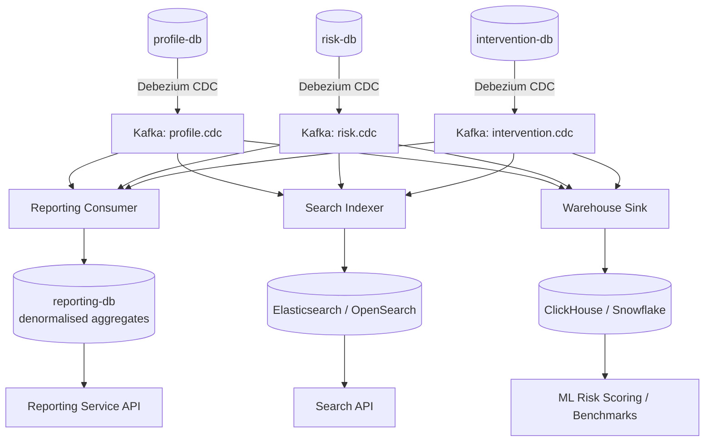

# L&D SaaS — Architecture Review

**Author role:** Senior Technical Architect (holistic view)
**Review date:** 2026-05-27
**Subject:** Corporate Learning Progress, Intervention & Compliance Tracking System
**Scope of review:** Architecture overview pack in `L-D/.sasva/overview/` (six markdown files)

---

## Source artefacts reviewed

| # | Document | Lines |
|---|----------|-------|
| 1 | [`00-executive-summary.md`](.sasva/overview/00-executive-summary.md) | 179 |
| 2 | [`01-architecture.md`](.sasva/overview/01-architecture.md) | 303 |
| 3 | [`02-database.md`](.sasva/overview/02-database.md) | 384 |
| 4 | [`03-technical-flows.md`](.sasva/overview/03-technical-flows.md) | 316 |
| 5 | [`04-user-journeys.md`](.sasva/overview/04-user-journeys.md) | 290 |
| 6 | [`05-deployment.md`](.sasva/overview/05-deployment.md) | 324 |

---

## 1. Executive verdict

The pack is a well-structured *target-state vision*: multi-tenant SaaS with three isolation tiers, event-driven microservices, per-service databases, tenant-context caching, JSON rule DSL, GDPR/SOC 2 framing, K8s + ArgoCD GitOps, and a realistic 20-week build plan. It is suitable as a **hackathon/MVP blueprint** and a **conversation starter for production**, but it is **not yet production-ready** as-is. Several patterns expected at the SaaS-platform tier are either missing or named without depth, and the documents disagree with each other on a few critical ownership boundaries.

**Maturity scorecard (1 = brief, 5 = production-grade):**

| Dimension | Score | Rationale |
|---|:---:|---|
| Architecture style & decomposition | 3.5 | Sound microservice split, but inter-service contracts, sagas, outbox, DLQs missing |
| Data architecture | 2.5 | Per-service DBs good; inconsistent ownership across docs; no CQRS/CDC; no analytics tier |
| Multi-tenant isolation | 4.0 | Strongest part of the design; clear three-tier model |
| Reliability & operations | 3.0 | HA basics covered; observability lacks unified tracing/APM; no chaos practice |
| Security & privacy | 3.0 | Good intentions (WAF, mTLS, Vault); per-tenant KMS, audit immutability, consent missing |
| Compliance breadth | 2.0 | GDPR + SOC 2 only; BFSI / Pharma / POSH / OSHA not addressed |
| Tech stack discipline | 2.0 | Polyglot backend + three frontends + three charting libs = MVP velocity risk |
| Documentation consistency | 2.5 | Notable doc-to-doc contradictions on data ownership |
| **Overall** | **2.9 / 5** | Strong vision; medium execution detail; needs targeted hardening |

**Bottom line:** Approve direction. Block production sign-off until the **P0** items in §9 are closed.

---

## 2. What is good — keep

- **Three-tier tenant isolation** (Starter row-level, Pro schema-per-tenant, Enterprise dedicated DB + namespace) is well thought through and mapped consistently end-to-end ([`01-architecture.md` lines 88–119](.sasva/overview/01-architecture.md), [`02-database.md` lines 5–27](.sasva/overview/02-database.md)).
- **Event-driven decoupling** through Kafka with topic-scoped events (`data.ingested`, `profile.updated`, `risk.detected`, `intervention.*`) — correct boundary between ingestion, profile, risk, intervention, reporting.
- **Per-service databases** prevent shared-database coupling between bounded contexts.
- **Tenant context caching** via Redis with 60 s TTL ([`03-technical-flows.md` lines 42–78](.sasva/overview/03-technical-flows.md)) — pragmatic and right pattern.
- **Rule Management separated from Risk Engine** ([`01-architecture.md` lines 177–213](.sasva/overview/01-architecture.md)) — enables L&D-admin authored rules, versioning, and a test sandbox without touching execution logic. Strong.
- **Role separation** for Trainer / L&D Admin / L&D Manager / Employee with a clear permissions matrix.
- **GDPR + SOC 2** named as compliance baselines.
- **20-week phased delivery** with clear milestones and a go-live checklist.
- **Resource sizing per service** and **HPA min/max** stated — rare in early architecture docs.

---

## 3. Gaps — Architecture (consistency & patterns)

### 3.1 Doc-to-doc inconsistency on data ownership (blocking)

`01-architecture.md` places `training_attendance`, `assessment_records`, `competency_milestones` under the **Ingestion Service** (ingestion-db) ([lines 41–54](.sasva/overview/01-architecture.md)). `02-database.md` places the **same tables** under **Employee Profile Service** (profile-db) ([lines 250–257](.sasva/overview/02-database.md)). Both cannot be true.

**Recommended resolution:** Ingestion owns *raw + staging* tables (`raw_training_attendance_staging`, `raw_assessment_staging`, `raw_milestone_staging` — already listed in [`02-database.md` lines 242–248](.sasva/overview/02-database.md)). Profile owns the *curated* `training_attendance`, `assessment_records`, `employee_milestone_progress` as a **read model** built from `data.ingested` events. Document and lock the boundary.

### 3.2 Auth round-trip on every request

[`03-technical-flows.md` lines 52–54](.sasva/overview/03-technical-flows.md) shows the API Gateway calling Auth Service to validate every JWT. This adds latency to every request and makes Auth a single point of failure.

**Recommended:** Gateway validates JWT **locally** using cached JWKS published by Auth Service (rotated keys). Auth only called for refresh/revocation list lookups.

### 3.3 No transactional outbox

Domain services persist to their DB and publish to Kafka in the same flow (e.g. Ingestion in [`03-technical-flows.md` lines 100–105](.sasva/overview/03-technical-flows.md)). If DB commit succeeds but broker publish fails (or vice versa), state diverges.

**Recommended:** Outbox table per service; CDC (Debezium) or polling publisher ships outbox rows to Kafka exactly-once. Document the pattern in `01-architecture.md`.

### 3.4 No DLQ / retry / poison-message handling

The arch diagram fans Kafka events to Profile / Risk / Intervention / Reporting / Notification / Audit consumers. There is no mention of **retry topics, exponential backoff, DLQ topics, alert-on-DLQ**, or **idempotent consumer keys**. In production this becomes the #1 source of silent data loss.

### 3.5 No idempotency keys

The ingestion endpoints (POST batches) and intervention transitions (approve / complete) have no `Idempotency-Key` header semantics. Retries from clients (LMS, mobile) will create duplicates.

### 3.6 No saga / orchestrated workflow for multi-step provisioning

Tenant onboarding ([`03-technical-flows.md` lines 8–36](.sasva/overview/03-technical-flows.md)) does **eight** side-effecting steps (create record → provision DB → migrate schema → seed rules → seed templates → create Auth user → publish event → send email). What happens if step 5 fails? There is no compensating action, no resumability, no state machine.

**Recommended:** Use a workflow engine (Temporal, Camunda) for tenant provisioning, plan upgrade, and intervention lifecycle. Service code today; durable workflow tomorrow.

### 3.7 Schema Registry without governance

[`00-executive-summary.md` line 104](.sasva/overview/00-executive-summary.md) lists Confluent Schema Registry but no documented choice of **Avro / JSON Schema / Protobuf**, no compatibility mode (BACKWARD / FORWARD / FULL), no event naming convention, no event ownership matrix.

### 3.8 Service mesh — name only

mTLS via Istio / Linkerd is mentioned ([`01-architecture.md` line 282](.sasva/overview/01-architecture.md)). No design for **circuit breakers, retries with budget, timeouts, traffic splitting, canary releases, fault injection**.

### 3.9 No BFF (Backend-for-Frontend) layer

A single API Gateway fronts web SPA + mobile PWA + external systems. Mobile and external API needs differ markedly; a BFF prevents one client's needs from polluting domain services.

### 3.10 No real-time path (WebSocket / SSE)

Dashboards target < 2 s load and there are notification touchpoints throughout the user journeys, but there is no server-push channel for live at-risk alerts, intervention status updates, or compliance deadline countdowns.

---

## 4. Gaps — Data & integration

### 4.1 Reporting read-model pipeline undefined

`reporting-db` exists ([`02-database.md` lines 275–280](.sasva/overview/02-database.md)) but **how it is populated** is not described. Today the diagrams imply Reporting consumes risk and intervention events — that yields partial aggregates, not full L&D facts.

**Recommended:** CDC (Debezium) from `profile-db`, `risk-db`, `intervention-db` → Kafka → Reporting consumer maintains denormalised report tables. Pure CQRS read model.

### 4.2 Elasticsearch role undefined

[`01-architecture.md` line 83](.sasva/overview/01-architecture.md) shows `ES → RPT & PROF` with no indexing pipeline, document model, refresh interval, or use case (search? aggregations? both?). Either define it or drop it; orphan infra is expensive.

### 4.3 No analytics / OLAP tier

Trend rules, cross-tenant anonymised benchmarks, ML risk scoring (an Enterprise feature per [`00-executive-summary.md` line 125](.sasva/overview/00-executive-summary.md)) all need an OLAP store. PostgreSQL JSONB and ES are not it.

**Recommended:** ClickHouse (self-hosted, low cost) or Snowflake/BigQuery/Redshift (managed). Sink from CDC.

### 4.4 Ingestion is API-only

Real enterprise LMSs deliver via **SFTP, CSV uploads, webhooks, message queues**, and need **reconciliation + replay** for late or corrected data. Three POST endpoints ([`03-technical-flows.md` lines 113–119](.sasva/overview/03-technical-flows.md)) is insufficient for the Pro/Enterprise customers the executive summary targets.

### 4.5 LMS standards missing

No mention of **SCORM 1.2/2004, xAPI (Tin Can), cmi5, AICC** — the lingua franca of corporate LMS exchange. Without these, every LMS integration is custom.

### 4.6 HRIS connectors not first-class

Workday, SAP SuccessFactors, BambooHR, Oracle HCM, Darwinbox provide the employee master. The pack assumes employees appear in the system but does not name the master-data source or sync pattern.

### 4.7 Competency taxonomy owner unclear

Rules reference competencies and milestones, but no service owns the **competency framework / skill graph / job-role-to-skill map**. Either add a `Taxonomy Service` or put it inside Rule Management.

### 4.8 Master data ownership unspecified

Departments, business units, training modules, assessment types — none has a documented owner. They appear as string columns everywhere.

### 4.9 Right-to-erasure has no cross-service design

[`02-database.md` line 383](.sasva/overview/02-database.md) promises a signed deletion certificate. The doc does not show how erasure propagates across `profile-db`, `risk-db`, `intervention-db`, audit-db cold archive, Kafka topic compaction, ES indices, S3 reports. This is a likely GDPR audit finding.

---

## 5. Gaps — Security, compliance, privacy

### 5.1 Column-level encryption without key management design

[`05-deployment.md` line 258](.sasva/overview/05-deployment.md) states AES-256 column-level for PII. No design for **per-tenant DEKs, envelope encryption, KMS choice (AWS KMS / Azure Key Vault / Vault Transit), key rotation cadence**.

### 5.2 Audit log is not provably immutable

`audit-db` is described as immutable but is a normal PostgreSQL table ([`02-database.md` lines 192–204](.sasva/overview/02-database.md)). Real immutability needs **append-only constraints, hash-chained entries, periodic signing into WORM storage** (S3 Object Lock).

### 5.3 Compliance breadth is too narrow

GDPR + SOC 2 only. Corporate L&D regularly hits:

- **BFSI India**: RBI / SEBI / IRDAI training mandates and submission templates
- **Pharma**: 21 CFR Part 11 — e-signatures + audit + closed/open system controls
- **Workplace safety**: OSHA (US) / DGFASLI (India) / ISO 45001
- **POSH (India)**: mandatory annual sexual-harassment training records
- **ISO 27001 / 9001 / 45001** internal audits
- **HIPAA** for healthcare customers

Each implies different retention windows, report formats, and signature ceremonies. Either name the GA scope or design report templates as fully pluggable.

### 5.4 No e-signature on compliance reports

Required for 21 CFR Part 11 and several regulator portals. No DocuSign / Adobe Sign / signed-PDF design.

### 5.5 Data residency not enforced beyond app

EU residency stated ([`05-deployment.md` lines 40–43, 262](.sasva/overview/05-deployment.md)), but Kafka cross-region MirrorMaker, Redis cluster, ES cluster, and object storage replication can all leak data across regions if not constrained explicitly.

### 5.6 PII discovery & classification policy missing

Which columns are PII? Which are sensitive PII? Which are regulated data (e.g. health, financial)? No data classification policy → no defensible encryption / access / retention story.

### 5.7 Tenant secrets isolation in Vault — strategy not described

Per-tenant Vault namespace? Transit engine? KV per tenant? Shared with policy bindings? Each has very different blast-radius implications.

### 5.8 Consent management absent

Employees are the data subjects, not the tenants. The platform must record consent for analytics, peer benchmarking, ML risk scoring (Enterprise), and intervention assignment. No consent model exists.

---

## 6. Gaps — Reliability & operations

### 6.1 Tenant Management Service is on the hot path

Every request resolves tenant context. Redis cache (60 s TTL) helps, but on cache miss the gateway calls TMS synchronously. TMS HA topology (active-active? read replicas? regional failover?) is not described.

### 6.2 Kafka noisy-neighbour risk

Single Kafka cluster per region, multi-tenant topics for Starter/Pro tiers. Without **per-tenant quotas, throttling, dedicated partitions for large tenants**, a single chatty tenant can starve others.

### 6.3 No chaos / game-day practice

Quarterly DR test is mentioned for Starter/Pro and monthly for Enterprise ([`05-deployment.md` line 206](.sasva/overview/05-deployment.md)), but **chaos engineering** (broker kill, pod kill, network partition, latency injection) is not part of the playbook.

### 6.4 DR procedure thin

RPO < 15 min Enterprise stated. Kafka MirrorMaker 2 named, but **PostgreSQL cross-region promotion runbook, DNS failover, app cold-start, idempotency on replay** are not specified.

### 6.5 Observability stack is incomplete

Prometheus + Grafana + ELK/Loki + Jaeger are listed. Missing:

- **OpenTelemetry** as the unifying standard for traces + metrics + logs
- **Error tracking** (Sentry / Rollbar) — distinct from APM
- **APM** with code-level insight (Datadog APM / New Relic / Dynatrace)
- **Synthetic monitoring** for tenant onboarding flow and report generation
- **RUM** (real user monitoring) for the < 2 s dashboard SLO

### 6.6 Feature-flag discipline

`tenant_feature_flags` exist for plan gating. No mention of a **release-time** feature flag service (LaunchDarkly / Unleash / Flagsmith) for safe progressive delivery, kill switches, and A/B tests.

### 6.7 No cost-per-tenant signal

Usage metering exists for billing. Cost allocation (CPU/RAM/storage/Kafka/Redis per tenant) is not surfaced — critical to defend gross margin as Pro/Enterprise scale.

---

## 7. Gaps — Product & domain

### 7.1 Lifecycle flows missing

Only **plan upgrade** is shown ([`03-technical-flows.md` lines 289–315](.sasva/overview/03-technical-flows.md)). Missing: **plan downgrade, cancellation, suspension on non-payment, deprovisioning + data export, self-serve trial, sandbox per tenant**.

### 7.2 Notification model is thin

Stateless Notification Service is fine for sending. The architecture does not address: **per-user channel preferences, opt-out, quiet hours, language, time zone, deduplication, digesting, template versioning, regulator-mandated channel** (e.g. portal upload vs email).

### 7.3 No file / evidence service

Trainer notes, certificates, completion proof, regulator submission acknowledgements — there is no file service or doc store. Object storage is named for reports but not as a general file service with virus scanning, retention, signed URLs.

### 7.4 Intervention workflow embedded in service

State machine ([`01-architecture.md` lines 225–234](.sasva/overview/01-architecture.md)) is shown inside Intervention Service. As approvals, escalations, reminders, SLA breaches grow, this becomes hard to evolve.

**Recommended:** Lift workflow to Temporal / Camunda; Intervention Service owns domain state, workflow engine owns process.

### 7.5 Coaching / mentor matching not modelled

The PS calls for coaching and mentoring assignments. No model for **mentor pool, skill match, capacity, conflict-of-interest** (e.g. line manager cannot mentor own report).

### 7.6 No public API / developer portal

Pro and Enterprise plans claim "API access" ([`00-executive-summary.md` line 124](.sasva/overview/00-executive-summary.md)). No design for **API key management, scopes, quotas, OpenAPI portal, sample SDKs**.

### 7.7 No outbound webhooks

Customers will want webhooks for `risk.detected`, `intervention.completed`, `report.generated`. Not designed.

### 7.8 i18n / l10n / timezone / accessibility

Multi-region SaaS without **i18n** (UI + emails + report templates), **timezone-aware reporting** (a session at 09:00 IST is what in UTC?), and **WCAG 2.1 AA** is a non-starter for global enterprise.

---

## 8. Tech stack — risks & recommendations

### 8.1 Risks

| Risk | Evidence | Why it matters |
|---|---|---|
| Polyglot backend | Spring Boot + FastAPI + ASP.NET Core ([`00-executive-summary.md` line 92](.sasva/overview/00-executive-summary.md)) | Three sets of build, CI, deps, libraries, hiring profiles in a 20-week plan |
| Three frontends listed | React + Angular + Vue ([line 97](.sasva/overview/00-executive-summary.md)) | Looks like indecision; pick one for design system reuse |
| Three charting libs | Chart.js + D3 + ApexCharts ([line 98](.sasva/overview/00-executive-summary.md)) | Same — UX inconsistency, bundle bloat |
| Two API Gateways | Kong / AWS API GW ([line 100](.sasva/overview/00-executive-summary.md)) | Choose one per environment, document config-as-code |
| Search undefined | Elasticsearch listed, no pipeline | Cost without value |

### 8.2 Recommended single-stack baseline (for MVP)

| Layer | Recommend | Rationale |
|---|---|---|
| Backend primary | **Spring Boot 3 (Java 21)** or **FastAPI (Python 3.12)** | Pick one for 90 % of services; allow targeted exceptions only |
| Frontend | **React 18 + TypeScript + Vite + TanStack Query + shadcn/Tailwind** | Largest ecosystem, easiest hiring, shared design system |
| Charting | **ApexCharts** as default + **D3** as escape hatch | Drop Chart.js |
| API Gateway | **Kong** (open source, self-host) for parity across clouds | Or AWS API GW if single-cloud AWS only |
| Service mesh | **Istio** with explicit retry/timeout/circuit-breaker defaults | Linkerd if simpler ops preferred |
| Schema Registry | **Confluent Schema Registry + Protobuf** (FULL compatibility) | Protobuf gives strongest evolution discipline |
| Workflow engine | **Temporal** (or Camunda 8) | Tenant provisioning, plan changes, intervention lifecycle |
| CDC | **Debezium** on PostgreSQL → Kafka | Outbox + reporting read model |
| Analytics store | **ClickHouse** (self-host) or **Snowflake** (managed) | OLAP, benchmarks, ML feature store |
| BI | **Metabase** (self-host) or **Looker / Power BI** | Internal + tenant-facing dashboards |
| Observability | **OpenTelemetry** (traces + metrics + logs) → **Grafana + Tempo + Loki + Mimir** or **Datadog** | Unified stack |
| Error tracking | **Sentry** | Distinct from APM |
| Feature flags | **Unleash** (OSS) or **LaunchDarkly** | Release-time, not config-time |
| Secrets | **HashiCorp Vault** with **per-tenant namespaces + transit engine** | Already listed; add namespace pattern |
| KMS | **AWS KMS** or **Azure Key Vault** envelope encryption with per-tenant DEKs | For PII columns + object storage |
| e-signatures | **DocuSign** or **Adobe Sign** | 21 CFR Part 11 ready |
| Object storage | **AWS S3** with **Object Lock (WORM)** for compliance reports + audit | Already listed; add Object Lock |
| Backups | **pgBackRest** (PostgreSQL) + **Velero** (K8s manifests + PVs) | Concrete tools |
| ML platform (Enterprise feature) | **MLflow** + feature store (**Feast**) on top of analytics store | Defer to P2 |
| Notifications | **Postmark / SendGrid** (email) + **Twilio** (SMS) + **Firebase Cloud Messaging** (push) + in-app via WebSocket | Existing service routes to these |

### 8.3 Trim list

| Drop / defer | Reason |
|---|---|
| Angular, Vue | Pick React; lose two |
| Chart.js | Use ApexCharts |
| FastAPI **and** ASP.NET Core (if Spring chosen) | Reserve as exceptions, not defaults |
| Elasticsearch | Defer until search use case proven; or replace with PostgreSQL full-text if scope small |

---

## 9. Prioritised improvement roadmap

### P0 — must close before MVP go-live

| ID | Item | Owner |
|---|---|---|
| P0-1 | Resolve `training_attendance` / `assessment_records` ownership (Ingestion vs Profile) and update both docs | Lead Architect |
| P0-2 | Pick single primary backend + single frontend; freeze stack ADR | CTO / Architect |
| P0-3 | Gateway-local JWT validation with JWKS rotation | Auth Engineer |
| P0-4 | Transactional outbox + Debezium publisher; idempotent consumers | Platform Engineer |
| P0-5 | DLQ + retry topics with exponential backoff; alert on DLQ depth | Platform Engineer |
| P0-6 | `Idempotency-Key` on ingestion + intervention transition endpoints | API Engineer |
| P0-7 | Workflow engine (Temporal) for tenant provisioning + plan change saga | Platform Engineer |
| P0-8 | Name target compliance regimes for GA (write into exec summary) | Compliance Officer |
| P0-9 | Per-tenant rate limits + Kafka quotas; noisy-neighbour test | SRE |
| P0-10 | OpenAPI 3.x for every service + version + deprecation policy | API Engineer |

### P1 — before first Enterprise tenant

| ID | Item | Owner |
|---|---|---|
| P1-1 | CDC pipeline (Debezium) → reporting-db + ClickHouse | Data Engineer |
| P1-2 | Per-tenant KMS / envelope encryption for PII columns + S3 reports | Security Engineer |
| P1-3 | Hash-chained, signed audit log with S3 Object Lock periodic export | Security Engineer |
| P1-4 | OpenTelemetry across all services + Sentry + APM | SRE |
| P1-5 | E-signature integration for compliance reports | Engineering + Compliance |
| P1-6 | Right-to-erasure orchestrator (saga across services + Kafka + S3) | Platform Engineer |
| P1-7 | WebSocket / SSE gateway for live dashboards & alerts | Frontend + Platform |
| P1-8 | i18n / timezone / WCAG 2.1 AA baseline in design system | UX + Frontend |
| P1-9 | File / evidence service with virus scanning + signed URLs | Backend Engineer |
| P1-10 | SCORM / xAPI / cmi5 ingestion adapters; HRIS connectors (Workday, SuccessFactors) | Integrations team |

### P2 — post-launch / scale phase

| ID | Item | Owner |
|---|---|---|
| P2-1 | Analytics warehouse + tenant-facing benchmarks (anonymised) | Data |
| P2-2 | ML risk scoring (Enterprise feature) on top of feature store | ML + Data |
| P2-3 | Public API + Developer Portal + SDKs (Pro/Enterprise) | API Engineer |
| P2-4 | Outbound webhooks fan-out service | Platform |
| P2-5 | Self-serve trial + sandbox tenants | Product + Platform |
| P2-6 | Plan downgrade / cancellation / data-export flows | Product + Platform |
| P2-7 | Chaos engineering programme + monthly game days | SRE |
| P2-8 | Cost-per-tenant FinOps dashboard | FinOps + SRE |
| P2-9 | Coaching/mentor matching engine (skill + capacity + COI) | Backend |
| P2-10 | Workflow engine extended to intervention lifecycle | Platform |

---

## 10. Open questions for the architecture board

1. **Primary backend language** for the next 24 months — Spring Boot or FastAPI?
2. **Primary frontend framework** — React (recommended) or other?
3. **Primary cloud** — AWS, Azure, both? Affects API gateway, KMS, object storage choices.
4. **GA compliance scope** — GDPR + SOC 2 only, or also BFSI / Pharma / POSH / OSHA at launch?
5. **ML risk scoring** — MVP (P1) or post-GA (P2)?
6. **EU multi-region** — at launch or after first EU tenant signs?
7. **Workflow engine** — Temporal (code-first) or Camunda (BPMN-first)?
8. **Analytics store** — self-hosted ClickHouse (low cost, ops burden) or managed Snowflake (high cost, low ops)?
9. **LMS standards** — must we ingest SCORM/xAPI/cmi5 at launch, or only proprietary APIs?
10. **Audit immutability** — is S3 Object Lock acceptable, or do regulators (Pharma) require a dedicated WORM appliance?

---

## Appendix A — Target state diagrams

### A.1 Corrected data ownership boundary

### A.2 Reliable event flow with outbox, DLQ and retry

### A.3 Tenant provisioning saga

### A.4 CQRS / CDC read-model pipeline

---

## Appendix B — Findings index (quick reference)

| Area | Gap count | Most critical item |
|---|:---:|---|
| Architecture patterns | 10 | Outbox + DLQ + idempotency missing |
| Data & integration | 9 | Doc inconsistency on data ownership |
| Security & compliance | 8 | Audit immutability not enforced |
| Reliability & ops | 7 | TMS HA topology undefined |
| Product & domain | 8 | No public API / webhook design |
| Tech stack | 5 | Polyglot backend + multi-frontend in 20-week MVP |

---

*End of review*
