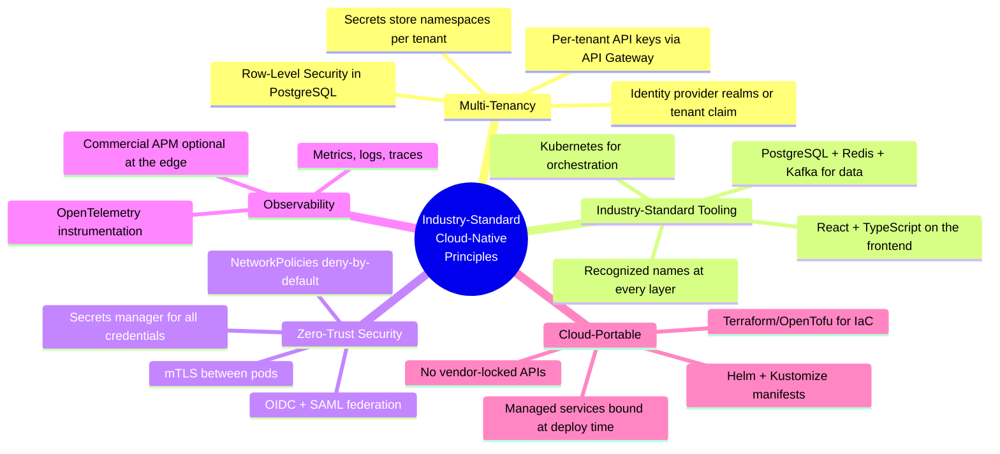
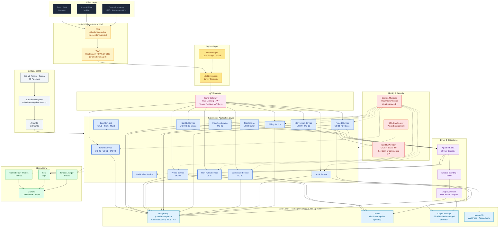
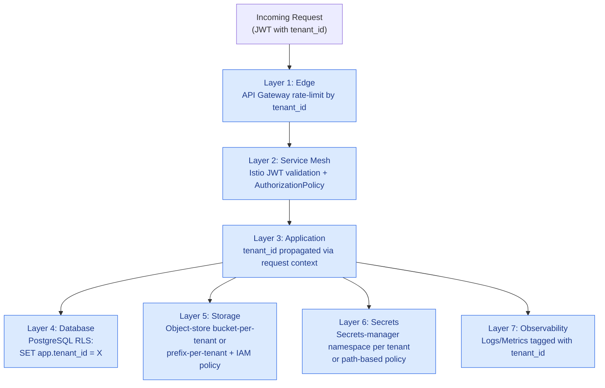
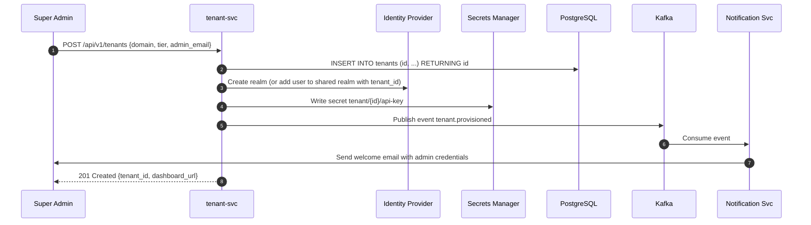
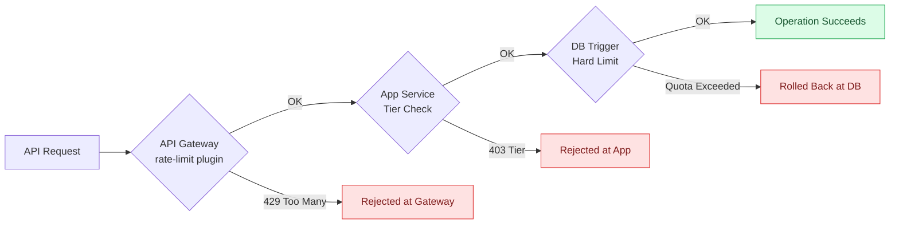

# 01 · System Design — Industry-Standard Cloud-Native Corporate Learning SaaS Platform

> **Platform-agnostic, multi-tenant SaaS** built on **industry-standard, cloud-portable technologies**. Greenfield blueprint — deployable on any major cloud, on-prem, or hybrid without code changes. The design names *technologies* (PostgreSQL, Redis, Kafka, Kubernetes), not vendor SKUs — each cloud's managed equivalent is a deployment-time choice.

---

## 1. Architecture Overview

The platform is deployed as a **multi-tenant SaaS application on Kubernetes** using a **microservices architecture**. Each of the 12 use cases maps to one or more independently deployable services. **Tenant isolation is enforced at every layer** — network (NetworkPolicies + service mesh), compute (namespace-per-environment), data (PostgreSQL Row-Level Security), and identity (OIDC/SAML provider with `tenant_id` claim in JWT).

### 1.1 Architecture Principles



### 1.2 The Four Pillars

| Pillar | Implementation | Tools |
|---|---|---|
| **Multi-Tenancy** | Shared cluster + per-tenant logical isolation | PostgreSQL RLS, API-gateway consumer plugins, IdP `tenant_id` claim, secrets-manager namespaces |
| **Industry-Standard Stack** | Container-first, declarative, immutable; technologies engineers and customers recognize | Kubernetes, PostgreSQL, Redis, Apache Kafka, Helm, React, TypeScript |
| **Zero-Trust Security** | "Never trust, always verify" | OIDC/SAML identity provider, secrets manager, service-mesh mTLS, OPA, NetworkPolicies, Falco |
| **Observability** | Three pillars: metrics, logs, traces | Prometheus, Grafana, Loki, Tempo, OpenTelemetry (with optional commercial APM/error tracking at the edge) |

---

## 2. Use Case → Service Mapping

| Use Case | Primary Services | Supporting Components |
|---|---|---|
| **UC-01** Tenant Onboarding | `tenant-svc` (Deployment), PostgreSQL | Kafka (provisioning events), secrets manager (secret injection), SMTP relay |
| **UC-02** Super Admin Manages Tenant | `admin-api` (Deployment), PostgreSQL | Prometheus alerts, Grafana dashboards |
| **UC-03** Manage Subscription Tier | `billing-svc` (Deployment), PostgreSQL | Kafka, commercial billing API (Stripe / Chargebee) |
| **UC-04** Configure Tenant SSO | Identity provider (realm/tenant config), secrets manager | `identity-svc`, OIDC/SAML federation |
| **UC-05** Ingest Training Data | API gateway, `ingestion-svc` | Kafka topics (per-tenant partition), PostgreSQL, Redis (idempotency) |
| **UC-06** View Employee Profile | `profile-svc` (Deployment), PostgreSQL | Redis cache, CDN for assets |
| **UC-07** Configure Risk Rule | `rules-svc` (Deployment), PostgreSQL | Object storage (rule JSON blobs), secrets manager |
| **UC-08** Identify At-Risk Learners | Argo Workflows + Knative jobs | Kafka, PostgreSQL, Notification dispatcher |
| **UC-09** Assign Intervention | `intervention-svc` (Deployment), PostgreSQL | Kafka, SMTP/SMS provider |
| **UC-10** Track Effectiveness | `analytics-svc` (Deployment), PostgreSQL | Reporting engine (e.g., ClickHouse / Trino), object storage |
| **UC-11** Generate Compliance Report | `report-svc` (Knative service), object storage | Argo Workflows, PostgreSQL |
| **UC-12** Role-Based Dashboard | `dashboard-api` (Deployment), Redis | PostgreSQL, CDN, WebSocket service (self-hosted or commercial) |

---

## 3. High-Level Architecture



---

## 4. Multi-Tenancy Strategy

The platform supports a **shared-everything model with logical isolation** — the most cost-efficient approach for SaaS workloads.

### 4.1 Tenant Isolation Layers



### 4.2 PostgreSQL RLS Pattern

```sql
-- Every tenant-scoped table:
ALTER TABLE employees ENABLE ROW LEVEL SECURITY;
CREATE POLICY tenant_isolation ON employees
  USING (tenant_id = current_setting('app.tenant_id')::uuid);

-- Application sets tenant context per request:
SET LOCAL app.tenant_id = '<tenant-uuid-from-jwt>';
```

### 4.3 Tenant Onboarding Flow (UC-01)



---

## 5. Subscription Tier Enforcement (UC-03)

Tier limits are enforced at **three independent layers** to prevent abuse:

| Tier | Max Employees | Max Risk Rules | API Rate Limit | Channels |
|---|---|---|---|---|
| **Basic** | 500 | 5 | 100 req/min | Email only |
| **Professional** | 5,000 | Unlimited | 1,000 req/min | Email + SMS + In-app |
| **Enterprise** | Unlimited | Unlimited | Unlimited (fair use) | All + Custom webhooks |

### Enforcement Layers

1. **API Gateway** — Rate-limiting plugin keyed by `tenant_id` from JWT.
2. **Application Service** — Checks tier from cached config; returns `403 TIER_LIMIT_EXCEEDED`.
3. **Database trigger** — Last line of defense; enforces hard limits on row counts.



---

## 6. Key Design Decisions vs the Cloud-Coupled Draft

The original system design was sketched using a single vendor's managed services. We re-expressed each decision using **industry-standard, cloud-portable technologies** before any code was written. The recognition test was: *would an experienced engineer or enterprise buyer immediately recognize this technology?*

| Decision | Cloud-Coupled Draft (Vendor-Specific) | Industry-Standard Choice | Rationale |
|---|---|---|---|
| **Orchestrator** | Single-vendor container-apps platform | Kubernetes (+ Istio service mesh) | De-facto standard for container workloads; portable; massive talent pool |
| **Identity** | Vendor's B2C identity service | OIDC + SAML provider (Keycloak self-hosted, or commercial IdP) | Standard protocols; pick deployment model later |
| **NoSQL Audit** | Vendor-only document DB | MongoDB | Widely recognized; many managed and self-hosted options |
| **Object Storage** | Vendor-native blob store | S3-API object storage (cloud-managed or MinIO) | S3 API is the de-facto standard |
| **Messaging** | Vendor message broker + event hub | Apache Kafka | Single technology for both queueing and streaming; recognized industry standard |
| **Real-time** | Vendor-specific WebSocket service | WebSocket (self-hosted or commercial vendor) | Standard protocol; deployment is a choice |
| **Functions** | Vendor's FaaS | Knative + KEDA | Scale-to-zero semantics; K8s-native; portable |
| **CDN / WAF** | Vendor's bundled CDN+WAF | CDN + ModSecurity (cloud-managed or independent vendor) | Better PoP coverage from specialist CDN vendors |
| **Container Registry** | Vendor's registry | Cloud-managed OCI registry (or Harbor) | Standard OCI registries available everywhere |
| **CI/CD** | Vendor's DevOps suite | GitHub Actions + Argo CD (GitOps) | Modern GitOps; broader ecosystem; no vendor pipeline lock-in |

---

## 7. Deployment Targets

This identical design can be deployed to any of the following environments. Specific cloud-provider managed-service SKUs are bound at deployment time (see [`13-Multi-Cloud-Mapping.md`](./13-Multi-Cloud-Mapping.md)).

| Target | Kubernetes Distribution | Notes |
|---|---|---|
| **Public Cloud A / B / C** | Cloud-provider managed Kubernetes | Use the cloud's managed PostgreSQL / Redis / Kafka / object storage; bind to identical Helm values |
| **On-Prem** | Rancher / OpenShift / vanilla K8s / k3s | MetalLB for LoadBalancer; Longhorn / Rook-Ceph for storage |
| **Hybrid** | Cluster API + Argo CD multi-cluster | Primary in cloud, DR on-prem (or vice versa) |
| **Edge** | k3s on small clusters | For air-gapped customer deployments |

All deployment targets use **identical Helm charts / Kustomize manifests** — only the underlying infrastructure differs.

---

## 8. SLA Targets

| Metric | Target | How Achieved |
|---|---|---|
| API Response (P95) | <200ms | HPA + KEDA scaling, Redis caching, read replicas |
| Dashboard Load | <2s | Redis cache + CDN for static assets |
| Platform Uptime | >99.9% | Multi-AZ pods, PodDisruptionBudgets, multi-region failover |
| Risk Batch Completion | <2hr window | Argo Workflows parallel processing per tenant |
| Report Generation | <30s | Knative scale-out + async generation via Argo |
| Data Ingestion | 10,000 records/min | Kafka with 10 partitions + KEDA consumer scaling |
| DB Query (P99) | <100ms | PgBouncer + read replicas + query optimization |

---

## Next Steps

- See [`02-Architecture-Diagrams.md`](./02-Architecture-Diagrams.md) for detailed per-layer diagrams.
- See [`03-Microservices-Architecture.md`](./03-Microservices-Architecture.md) for service-by-service breakdown.
- See [`13-Multi-Cloud-Mapping.md`](./13-Multi-Cloud-Mapping.md) for cloud-provider managed-service mappings at deployment time.
- See [`14-Technology-Choice-Reference.md`](./14-Technology-Choice-Reference.md) for the decision-time reference when picking any individual technology.
