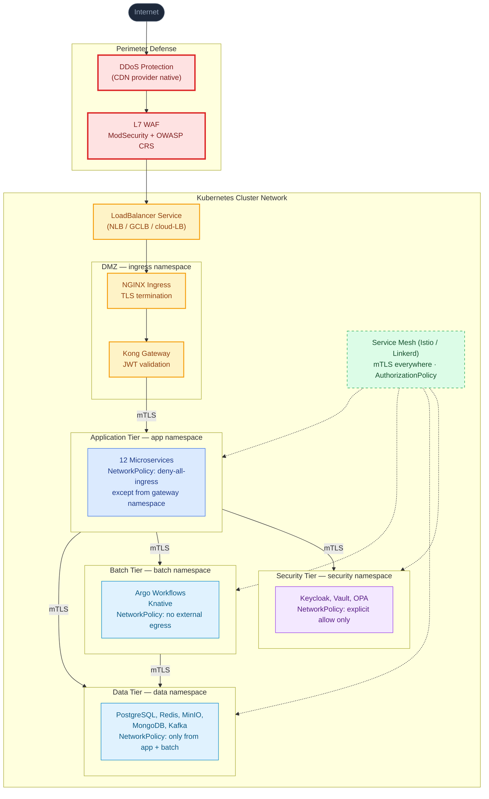
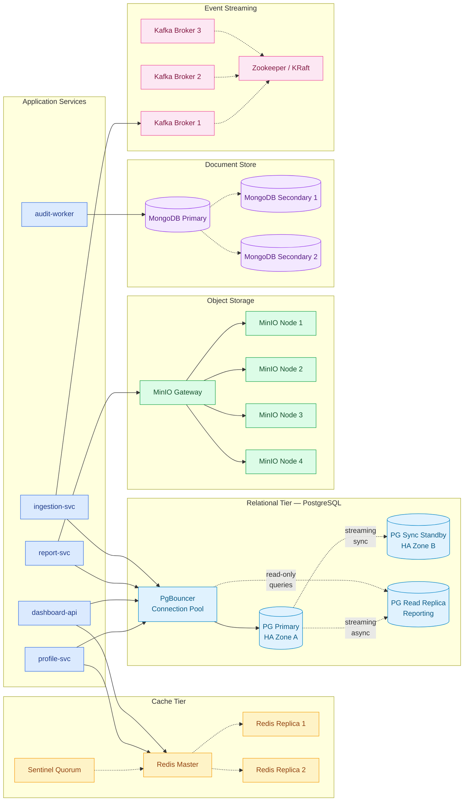
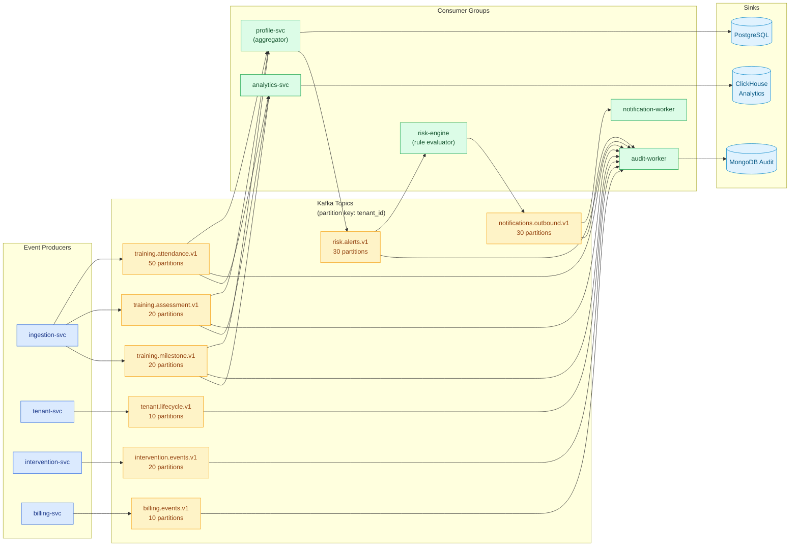
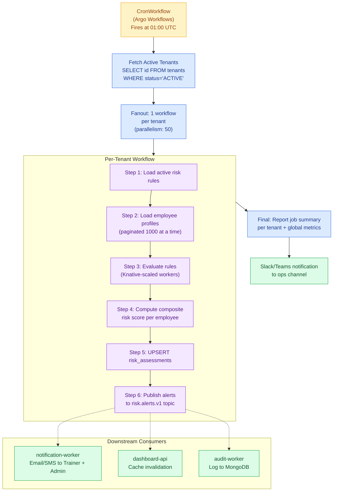
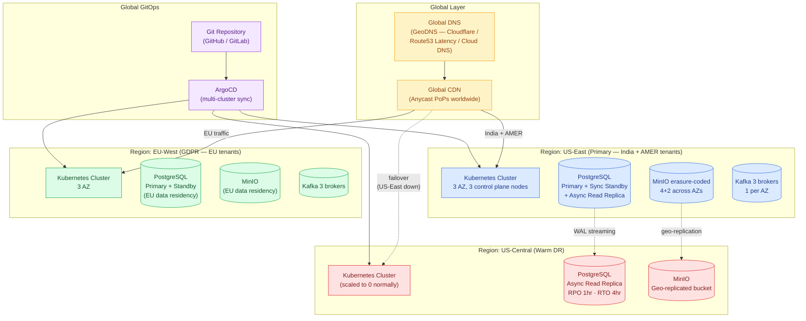
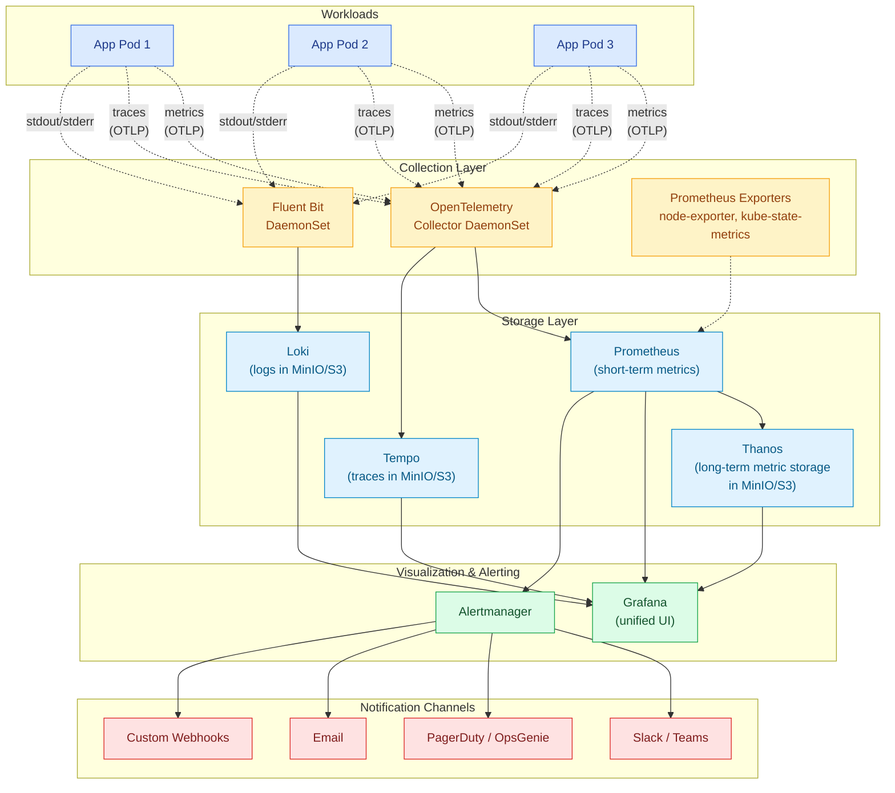
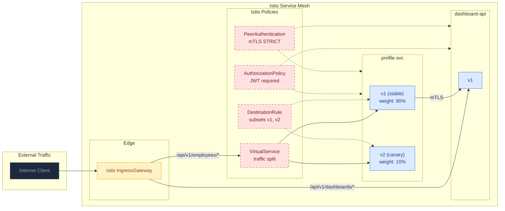

# 02 · Architecture Diagrams — Industry-Standard Visual Reference

> All diagrams use **Mermaid** and render natively on GitHub, GitLab, VS Code, and most markdown viewers.

> **A note on naming in diagrams.** Diagrams show the **technology** at each role (e.g., "PostgreSQL", "Apache Kafka", "MinIO"). When deployed to a public cloud, stateful technologies like PostgreSQL, Redis, Kafka, and object storage typically bind to the cloud provider's managed equivalent at deployment time — see [`13-Multi-Cloud-Mapping.md`](./13-Multi-Cloud-Mapping.md). MinIO, Keycloak, and Centrifugo are shown as the **reference self-hosted implementations**; each has commercial / managed alternatives documented in [`14-Technology-Choice-Reference.md`](./14-Technology-Choice-Reference.md).

---

## Diagram Index

1. [Full System Architecture (C4 Container Level)](#1-full-system-architecture-c4-container-level)
2. [Network Topology & Zero-Trust Layers](#2-network-topology--zero-trust-layers)
3. [Request Flow — End to End](#3-request-flow--end-to-end)
4. [Data Plane Architecture](#4-data-plane-architecture)
5. [Event-Driven Pipeline (Kafka)](#5-event-driven-pipeline-kafka)
6. [Nightly Risk Batch Workflow (UC-08)](#6-nightly-risk-batch-workflow-uc-08)
7. [Async Report Generation (UC-11)](#7-async-report-generation-uc-11)
8. [Multi-Region Deployment Topology](#8-multi-region-deployment-topology)
9. [GitOps CI/CD Pipeline](#9-gitops-cicd-pipeline)
10. [Observability Stack](#10-observability-stack)
11. [Identity & SSO Federation (UC-04)](#11-identity--sso-federation-uc-04)
12. [Service Mesh Traffic Management](#12-service-mesh-traffic-management)

---

## 1. Full System Architecture (C4 Container Level)

```mermaid
flowchart TB
    subgraph EXT["External Actors"]
        U1["L&D Admin"]
        U2["Trainer"]
        U3["Manager"]
        U4["Employee"]
        U5["External LMS"]
        U6["Payment Provider<br/>Stripe / Chargebee"]
    end

    subgraph EDGE["Edge & CDN"]
        CDN["CDN<br/>Cloudflare / Fastly"]
        WAF["WAF<br/>OWASP CRS"]
        DNS["DNS<br/>Cloudflare / Route53 / Cloud DNS"]
    end

    subgraph CLUSTER["Kubernetes Cluster"]
        subgraph INGRESS_NS["ingress namespace"]
            ING["NGINX / Envoy Ingress"]
            CERTMGR["cert-manager"]
        end

        subgraph GATEWAY_NS["gateway namespace"]
            KONG["Kong Gateway<br/>(or Envoy Gateway)"]
        end

        subgraph APP_NS["app namespace"]
            FRONTEND["frontend<br/>nginx + React SPA"]
            TS["tenant-svc"]
            IS["identity-svc"]
            IG["ingestion-svc"]
            PS["profile-svc"]
            RS["rules-svc"]
            IV["intervention-svc"]
            RP["report-svc<br/>(Knative)"]
            DS["dashboard-api"]
            NS["notification-worker"]
            AS["audit-worker"]
            BS["billing-svc"]
            WS["websocket-svc<br/>Centrifugo"]
        end

        subgraph BATCH_NS["batch namespace"]
            ARGO["Argo Workflows"]
            KNATIVE["Knative Eventing"]
            KEDA["KEDA Autoscaler"]
        end

        subgraph DATA_NS["data namespace"]
            PG[("PostgreSQL<br/>CloudNativePG")]
            PG_R[("PG Read Replica")]
            RD[("Redis<br/>Sentinel")]
            MINIO[("MinIO Cluster")]
            MONGO[("MongoDB ReplicaSet")]
            KAFKA[("Kafka<br/>Strimzi")]
        end

        subgraph SEC_NS["security namespace"]
            KC["Keycloak"]
            VAULT["Vault"]
            OPA["OPA Gatekeeper"]
        end

        subgraph OBS_NS["observability namespace"]
            PROM["Prometheus"]
            GRAF["Grafana"]
            LOKI["Loki"]
            TEMPO["Tempo"]
            OTEL["OpenTelemetry<br/>Collector"]
        end
    end

    subgraph EXT_SVC["External Services"]
        SMTP["SMTP Relay<br/>SendGrid / SES"]
        SMS["SMS Gateway<br/>Twilio"]
    end

    U1 & U2 & U3 & U4 --> DNS --> CDN --> WAF --> ING
    U5 --> CDN
    ING --> KONG
    CERTMGR -.-> ING
    KONG --> FRONTEND
    KONG --> TS & IS & IG & PS & RS & IV & RP & DS & BS
    NS --> SMTP
    NS --> SMS
    BS --> U6
    APP_NS --> KAFKA
    KAFKA --> ARGO & KNATIVE
    APP_NS --> PG
    APP_NS --> PG_R
    APP_NS --> RD
    RP --> MINIO
    AS --> MONGO
    IS --> KC
    VAULT -.-> APP_NS
    OPA -.-> APP_NS
    APP_NS --> OTEL
    OTEL --> PROM & LOKI & TEMPO
    PROM & LOKI & TEMPO --> GRAF
    WS -.->|"WebSocket"| U1 & U2 & U3 & U4

    classDef ext fill:#f1f5f9,color:#1e293b,stroke:#64748b
    classDef edge fill:#fef3c7,color:#92400e,stroke:#f59e0b
    classDef gw fill:#fce7f3,color:#831843,stroke:#ec4899
    classDef app fill:#dbeafe,color:#1e3a8a,stroke:#326ce5
    classDef batch fill:#f3e8ff,color:#581c87,stroke:#9333ea
    classDef data fill:#e0f2fe,color:#075985,stroke:#0284c7
    classDef sec fill:#fee2e2,color:#7f1d1d,stroke:#dc2626
    classDef obs fill:#dcfce7,color:#14532d,stroke:#16a34a

    class U1,U2,U3,U4,U5,U6,SMTP,SMS ext
    class CDN,WAF,DNS edge
    class ING,CERTMGR,KONG gw
    class FRONTEND,TS,IS,IG,PS,RS,IV,RP,DS,NS,AS,BS,WS app
    class ARGO,KNATIVE,KEDA batch
    class PG,PG_R,RD,MINIO,MONGO,KAFKA data
    class KC,VAULT,OPA sec
    class PROM,GRAF,LOKI,TEMPO,OTEL obs
```



---

## 2. Network Topology & Zero-Trust Layers



### Key Zero-Trust Principles

| Principle | Implementation |
|---|---|
| **Default deny** | Kubernetes `NetworkPolicy` with `policyTypes: [Ingress, Egress]` deny-all baseline |
| **Identity per workload** | Each pod gets a SPIFFE/SPIRE identity (or service account + Istio cert) |
| **mTLS everywhere** | Istio `PeerAuthentication: STRICT` cluster-wide |
| **AuthZ at every hop** | OPA Gatekeeper + Istio `AuthorizationPolicy` |
| **Secrets never in env vars** | Vault Agent Injector or External Secrets Operator |

---

## 3. Request Flow — End to End

A typical API call from browser to database, showing every hop:

```mermaid
sequenceDiagram
    autonumber
    participant U as User Browser
    participant CDN as CDN (Cloudflare)
    participant WAF as WAF
    participant LB as LoadBalancer
    participant ING as NGINX Ingress
    participant KONG as Kong Gateway
    participant KC as Keycloak (OIDC)
    participant SVC as profile-svc Pod
    participant PG as PostgreSQL
    participant RD as Redis

    U->>CDN: GET /api/v1/employees/123/profile
    CDN->>WAF: Forward (cache miss)
    WAF->>WAF: Check OWASP rules
    WAF->>LB: Pass (clean)
    LB->>ING: HTTPS (TLS 1.3)
    ING->>ING: Cert from cert-manager
    ING->>KONG: HTTP (internal)
    KONG->>KC: Verify JWT signature (cached JWKS)
    KC-->>KONG: Valid (tenant_id, roles)
    KONG->>KONG: Rate-limit check (Redis-backed)
    KONG->>KONG: Inject X-Tenant-Id header
    KONG->>SVC: Forward request (mTLS via Istio)
    SVC->>RD: GET profile:{tenant}:{emp_id}
    alt Cache Hit
        RD-->>SVC: Cached JSON
    else Cache Miss
        SVC->>PG: SET LOCAL app.tenant_id; SELECT...
        PG-->>SVC: Result (RLS-filtered)
        SVC->>RD: SET cache (TTL 15min)
    end
    SVC-->>KONG: 200 OK
    KONG-->>ING: 200 OK
    ING-->>LB: 200 OK
    LB-->>WAF: 200 OK
    WAF-->>CDN: 200 OK + cache headers
    CDN-->>U: 200 OK (cached at edge if appropriate)
```

---

## 4. Data Plane Architecture



---

## 5. Event-Driven Pipeline (Kafka)



### Topic Naming Convention

`{domain}.{entity}.{version}` — versioned topics enable schema evolution without breaking consumers.

---

## 6. Nightly Risk Batch Workflow (UC-08)



### Argo Workflow Manifest (Excerpt)

```yaml
apiVersion: argoproj.io/v1alpha1
kind: CronWorkflow
metadata:
  name: nightly-risk-evaluation
spec:
  schedule: "0 1 * * *"
  timezone: "UTC"
  workflowSpec:
    entrypoint: evaluate-all-tenants
    parallelism: 50
    templates:
      - name: evaluate-all-tenants
        steps:
          - - name: fetch-tenants
              template: fetch-active-tenants
          - - name: per-tenant
              template: evaluate-tenant
              arguments:
                parameters: [{ name: tenant-id, value: "{{item}}" }]
              withParam: "{{steps.fetch-tenants.outputs.result}}"
```

---

## 7. Async Report Generation (UC-11)

```mermaid
sequenceDiagram
    autonumber
    participant U as User
    participant K as Kong Gateway
    participant API as report-svc API
    participant PG as PostgreSQL
    participant KAFKA as Kafka<br/>(report.jobs topic)
    participant KN as Knative<br/>report-worker
    participant MINIO as MinIO
    participant WS as Centrifugo<br/>WebSocket

    U->>K: POST /api/v1/reports {type:PDF, period:Q3}
    K->>API: Forward (JWT validated)
    API->>PG: INSERT report_jobs (status=PENDING)
    API->>KAFKA: Produce job event {job_id, tenant_id, params}
    API-->>U: 202 Accepted {job_id, status_url}

    Note over KN: KEDA scales report-worker<br/>from 0→N based on queue depth

    KAFKA->>KN: Consume job
    KN->>PG: SET app.tenant_id; SELECT data (RLS applied)
    KN->>KN: Render PDF (wkhtmltopdf / chromium-headless)
    KN->>MINIO: PUT reports/{tenant_id}/{job_id}.pdf
    KN->>MINIO: Generate pre-signed URL (24h)
    KN->>PG: UPDATE report_jobs SET status=COMPLETED, url=?
    KN->>WS: Publish to channel user:{user_id}
    WS-->>U: "Your report is ready: [Download]"

    U->>API: GET /api/v1/reports/{job_id}
    API->>PG: SELECT * FROM report_jobs WHERE id=?
    API-->>U: 200 {url, expires_at}
    U->>MINIO: GET (pre-signed URL)
    MINIO-->>U: PDF binary
```

---

## 8. Multi-Region Deployment Topology



---

## 9. GitOps CI/CD Pipeline

```mermaid
flowchart LR
    DEV["Developer<br/>git push feature/x"]

    subgraph CI["CI Pipeline (Tekton / GitHub Actions)"]
        LINT["Lint + Format"]
        TEST["Unit Tests<br/>>80% coverage"]
        SAST["SAST<br/>SonarQube + Semgrep"]
        BUILD["Docker Build<br/>(multi-arch)"]
        SCAN["Trivy Image Scan"]
        SIGN["Cosign Sign Image"]
        PUSH["Push to Harbor"]
    end

    HARBOR["Harbor Registry<br/>+ Notary signing"]

    subgraph CD["CD Pipeline (ArgoCD GitOps)"]
        MR["Auto-update<br/>image tag in Git<br/>via Renovate / Bot"]
        SYNC["ArgoCD detects change<br/>kubectl apply"]
        DEV_ENV["Dev Cluster<br/>Auto-sync"]
        STG_ENV["Staging Cluster<br/>Auto-sync + smoke tests"]
        PROD_ENV["Prod Cluster<br/>Manual approval gate"]
    end

    subgraph PROGRESS["Progressive Delivery"]
        ARGOROLL["Argo Rollouts<br/>Canary 10% → 50% → 100%"]
        ANALYSIS["Flagger / Prometheus<br/>analysis (P95, error rate)"]
        ROLLBACK["Auto-rollback if<br/>SLO violated"]
    end

    DEV --> LINT --> TEST --> SAST --> BUILD --> SCAN --> SIGN --> PUSH
    PUSH --> HARBOR --> MR --> SYNC
    SYNC --> DEV_ENV
    SYNC --> STG_ENV
    SYNC --> PROD_ENV --> ARGOROLL --> ANALYSIS
    ANALYSIS -- "healthy" --> ARGOROLL
    ANALYSIS -- "violated" --> ROLLBACK

    classDef dev fill:#f1f5f9,color:#1e293b,stroke:#64748b
    classDef ci fill:#fef3c7,color:#92400e,stroke:#f59e0b
    classDef cd fill:#dbeafe,color:#1e3a8a,stroke:#326ce5
    classDef reg fill:#dcfce7,color:#14532d,stroke:#16a34a
    classDef prog fill:#f3e8ff,color:#581c87,stroke:#9333ea

    class DEV dev
    class LINT,TEST,SAST,BUILD,SCAN,SIGN,PUSH ci
    class MR,SYNC,DEV_ENV,STG_ENV,PROD_ENV cd
    class HARBOR reg
    class ARGOROLL,ANALYSIS,ROLLBACK prog
```



---

## 10. Observability Stack



---

## 11. Identity & SSO Federation (UC-04)

```mermaid
sequenceDiagram
    autonumber
    participant U as Tenant User
    participant B as Browser
    participant APP as React SPA
    participant KC as Keycloak<br/>(platform realm)
    participant IDP as Tenant IdP<br/>(Okta / AAD / OneLogin)
    participant API as Backend API

    U->>B: Visit https://tenant.platform.com
    B->>APP: Load SPA
    APP->>KC: OIDC Authorization Request<br/>(scope: openid profile, kc_idp_hint=tenant-saml)
    KC->>KC: Lookup tenant IdP config
    KC->>IDP: SAML AuthnRequest (signed)
    IDP->>U: Show login page
    U->>IDP: Enter corp credentials + MFA
    IDP-->>KC: SAML Response (signed assertion)
    KC->>KC: Validate signature; map claims<br/>(email → username, groups → roles)
    KC->>KC: Inject tenant_id custom claim
    KC-->>APP: OIDC Authorization Code
    APP->>KC: Exchange code for tokens
    KC-->>APP: access_token + refresh_token<br/>(JWT with tenant_id, roles)
    APP->>API: GET /api/v1/profile<br/>Authorization: Bearer {jwt}
    API->>API: Verify JWT (cached JWKS)
    API->>API: Extract tenant_id, set RLS context
    API-->>APP: 200 Profile JSON
```

---

## 12. Service Mesh Traffic Management



---

## How These Diagrams Render

- **GitHub / GitLab / Bitbucket** — Native rendering in markdown viewer.
- **VS Code** — Install "Markdown Preview Mermaid Support" extension.
- **Confluence / Notion** — Use Mermaid plugin or paste source into a mermaid block.
- **Standalone export** — Use [Mermaid CLI](https://github.com/mermaid-js/mermaid-cli):
  ```bash
  npx -p @mermaid-js/mermaid-cli mmdc -i 02-Architecture-Diagrams.md -o diagrams.pdf
  ```
