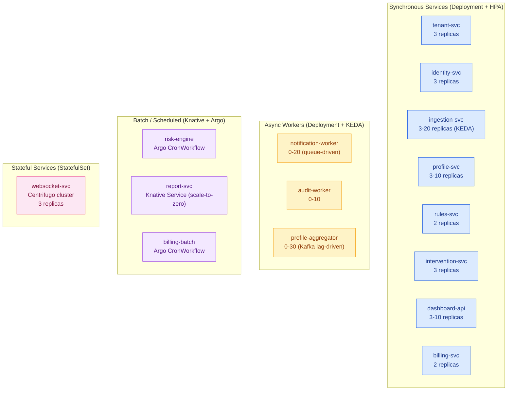
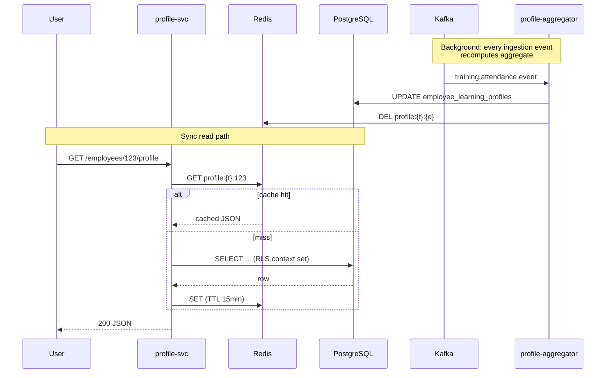
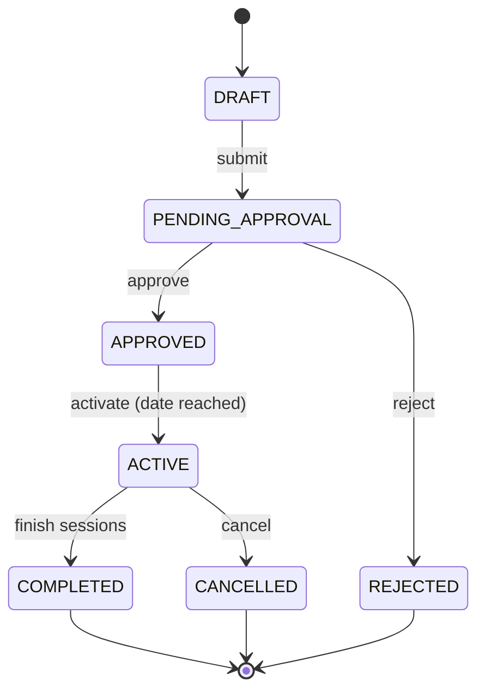
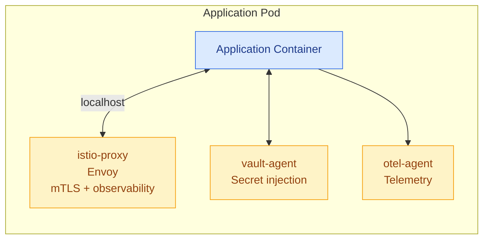

# 03 · Microservices Architecture — Cloud-Native

> All services run as **Kubernetes Deployments / StatefulSets / Knative Services** inside a shared cluster. Service mesh (Istio / Linkerd) provides mTLS, traffic management, and observability.

---

## Service Topology



---

## Service Catalogue

### 1. `tenant-svc` — Tenant Lifecycle (UC-01, UC-02, UC-03)

| Aspect | Value |
|---|---|
| **K8s Resource** | Deployment, 3 replicas |
| **Language** | Go / Java / Python (your choice) |
| **Scaling** | HPA on CPU (target 70%) |
| **Endpoints** | `POST /tenants`, `GET /tenants/{id}`, `PUT /tenants/{id}`, `DELETE /tenants/{id}`, `PUT /tenants/{id}/subscription` |
| **Dependencies** | PostgreSQL (write), Vault (writes secrets), Keycloak Admin API (creates user/realm), Kafka (publishes `tenant.lifecycle.v1`) |
| **Critical Path** | Tenant onboarding flow (UC-01) — provisions DB schema policies, generates API keys, sends welcome email via notification-worker |

**Sample Deployment Manifest:**
```yaml
apiVersion: apps/v1
kind: Deployment
metadata:
  name: tenant-svc
  namespace: app
spec:
  replicas: 3
  selector:
    matchLabels: { app: tenant-svc }
  template:
    metadata:
      labels: { app: tenant-svc, version: v1 }
      annotations:
        vault.hashicorp.com/agent-inject: "true"
        vault.hashicorp.com/role: "tenant-svc"
        vault.hashicorp.com/agent-inject-secret-db: "secret/data/tenant-svc/db"
    spec:
      serviceAccountName: tenant-svc
      containers:
        - name: tenant-svc
          image: harbor.platform.com/learning/tenant-svc:1.2.3
          ports: [{ containerPort: 8080 }]
          resources:
            requests: { cpu: 100m, memory: 256Mi }
            limits:   { cpu: 500m, memory: 512Mi }
          livenessProbe:
            httpGet: { path: /healthz, port: 8080 }
          readinessProbe:
            httpGet: { path: /readyz,  port: 8080 }
```

---

### 2. `identity-svc` — SSO Bridge (UC-04)

| Aspect | Value |
|---|---|
| **K8s Resource** | Deployment, 3 replicas |
| **Purpose** | Bridge between platform and Keycloak; handles tenant-specific SSO config |
| **Endpoints** | `GET /tenants/{id}/sso`, `PUT /tenants/{id}/sso` |
| **Dependencies** | Keycloak Admin REST API, Vault (stores IdP secrets), PostgreSQL (SSO config table) |
| **Note** | The actual authentication is handled by Keycloak itself — this service only manages **configuration** (uploading SAML metadata, setting OIDC client secrets). |

---

### 3. `ingestion-svc` — Training Data Ingestion (UC-05)

| Aspect | Value |
|---|---|
| **K8s Resource** | Deployment, 3-20 replicas (KEDA scaler on Kafka producer queue) |
| **Throughput** | 10,000 records/min target |
| **Endpoints** | `POST /ingest/attendance`, `POST /ingest/assessments`, `POST /ingest/milestones` |
| **Auth** | API key (Kong consumer) — not user JWT |
| **Dependencies** | Kong (rate limit), Redis (idempotency key), Kafka (publishes raw events) |
| **Pattern** | API → validate schema → Redis SETNX (idempotency) → publish to Kafka (partition by tenant_id) → return 202 Accepted |

**Idempotency Pattern:**
```python
key = f"ingestion:idem:{tenant_id}:{request_id}"
if not redis.set(key, "1", nx=True, ex=86400):
    return 200, {"status": "duplicate", "message": "Already processed"}
# Otherwise publish to Kafka
```

---

### 4. `profile-svc` — Employee Profile (UC-06)

| Aspect | Value |
|---|---|
| **K8s Resource** | Deployment, 3-10 replicas (HPA on requests/sec) |
| **Endpoints** | `GET /employees/{id}/profile`, `GET /employees/{id}/history` |
| **Cache** | Redis — key `profile:{tenant_id}:{emp_id}`, TTL 15min |
| **Dependencies** | PostgreSQL (read with RLS), Redis (cache) |
| **Companion** | `profile-aggregator` — Kafka consumer that updates `employee_learning_profiles` table on every ingestion event |



---

### 5. `rules-svc` — Risk Rule Configuration (UC-07)

| Aspect | Value |
|---|---|
| **K8s Resource** | Deployment, 2 replicas |
| **Endpoints** | `GET /rules`, `POST /rules`, `PUT /rules/{id}`, `DELETE /rules/{id}` |
| **Storage** | PostgreSQL (rule records), MinIO (large JSON rule templates) |
| **Tier Enforcement** | Basic = 5 rules max; checked at API + DB trigger |
| **Versioning** | Every update creates a new row in `risk_rule_versions` (immutable history) |

---

### 6. `risk-engine` — Nightly Batch Evaluator (UC-08)

| Aspect | Value |
|---|---|
| **K8s Resource** | Argo CronWorkflow (industry-standard for scheduled batch jobs on Kubernetes) |
| **Schedule** | `0 1 * * *` (01:00 UTC daily) |
| **Pattern** | Fan-out per tenant; staggered to avoid DB overload; parallelism: 50 |
| **Dependencies** | PostgreSQL (read), Kafka (publishes `risk.alerts.v1`) |
| **Compute** | Knative-scaled workers (scale-to-zero between runs) |

See [`07-Batch-Event-Processing.md`](./07-Batch-Event-Processing.md) for the full workflow.

---

### 7. `intervention-svc` — Intervention Lifecycle (UC-09, UC-10)

| Aspect | Value |
|---|---|
| **K8s Resource** | Deployment, 3 replicas |
| **Endpoints** | `POST /interventions`, `PATCH /interventions/{id}/approve`, `PATCH /interventions/{id}/complete`, `GET /interventions/{id}/effectiveness` |
| **State Machine** | DRAFT → PENDING_APPROVAL → APPROVED → ACTIVE → COMPLETED / REJECTED / CANCELLED |
| **Dependencies** | PostgreSQL, Kafka (publishes approval workflow events) |
| **Effectiveness Tracking** | Snapshots `pre_metrics` JSON at assignment; computes `post_metrics` after completion; derives `improvement_pct` |



---

### 8. `report-svc` — Compliance Reports (UC-11)

| Aspect | Value |
|---|---|
| **K8s Resource** | Knative Service (scale-to-zero) — async generation; Deployment for sync API |
| **Endpoints** | `POST /reports` (enqueue job), `GET /reports/{job_id}` (status + URL) |
| **Formats** | PDF (wkhtmltopdf / chromium-headless / Gotenberg), Excel (apache-poi / openpyxl), CSV (streaming) |
| **Storage** | MinIO — `reports/{tenant_id}/{job_id}.{ext}` with pre-signed URL (24h expiry) |
| **Pattern** | API returns 202 + job_id; worker generates async; WebSocket pushes notification when ready |

---

### 9. `dashboard-api` — Role-Based Dashboards (UC-12)

| Aspect | Value |
|---|---|
| **K8s Resource** | Deployment, 3-10 replicas |
| **Endpoints** | `GET /dashboards/{role}`, `GET /dashboards/widgets/{widget_id}` |
| **Cache** | Redis — key `dashboard:{tenant}:{role}`, TTL 5min |
| **Real-time** | WebSocket via Centrifugo for live KPI updates |
| **Tier Gating** | Widget visibility filtered by tier — Basic sees subset, Pro+ sees all |

---

### 10. `notification-worker` — Multi-channel Notifications

| Aspect | Value |
|---|---|
| **K8s Resource** | Deployment, 0-20 replicas (KEDA scaler on Kafka topic lag) |
| **Input** | Consumes `notifications.outbound.v1` Kafka topic |
| **Channels** | Email (SMTP relay → SendGrid/SES/Postal), SMS (Twilio/MessageBird), In-app (Centrifugo WebSocket) |
| **Tier Enforcement** | Basic = Email only; Pro/Ent = all channels |
| **Retry** | Exponential backoff; failed messages go to dead-letter topic |

---

### 11. `audit-worker` — Audit Trail

| Aspect | Value |
|---|---|
| **K8s Resource** | Deployment, 0-10 replicas (KEDA) |
| **Input** | Consumes **all** Kafka topics (wildcard pattern) |
| **Storage** | MongoDB — `audit_logs` collection, sharded by `tenant_id`, append-only |
| **Immutability** | MongoDB role with `find + insert` only (no `update/delete`) |
| **Retention** | Permanent for compliance; cold-tier after 1 year via MongoDB compression |

---

### 12. `billing-svc` — Subscription Billing (UC-03)

| Aspect | Value |
|---|---|
| **K8s Resource** | Deployment, 2 replicas |
| **External Integration** | Stripe / Chargebee / Paddle (webhook receiver + API client) |
| **Daily Job** | `billing-batch` Argo CronWorkflow computes usage from `usage_metering` and pushes invoice to billing provider |
| **Tier Limit Enforcement** | Publishes to Kafka `tier.limit.exceeded` events for downstream consumers |

---

## Bonus Services (not counted in 12 core)

### A. `websocket-svc` — Centrifugo Cluster

- **Type:** StatefulSet, 3 replicas, headless service
- **Purpose:** Real-time push to browser (report ready, intervention assigned, dashboard live updates)
- **Persistence:** Connection state in Redis
- **Auth:** Validates JWT on connect; auto-subscribes to channels `user:{user_id}` and `tenant:{tenant_id}`

### B. `frontend` — React SPA / PWA

- **Type:** Deployment with nginx serving static assets
- **Alternative:** Push to object storage + CDN for full static-site deployment (no pod needed)

---

## Sidecar Pattern

Every application pod includes these sidecars:



---

## Scaling Strategy per Service

| Service | Scaler | Trigger | Min | Max |
|---|---|---|---|---|
| `tenant-svc` | HPA | CPU 70% | 3 | 10 |
| `identity-svc` | HPA | CPU 70% | 3 | 10 |
| `ingestion-svc` | KEDA | Kafka producer rate | 3 | 20 |
| `profile-svc` | HPA | Requests/sec via Prometheus adapter | 3 | 10 |
| `rules-svc` | HPA | CPU 70% | 2 | 5 |
| `intervention-svc` | HPA | CPU 70% | 3 | 8 |
| `dashboard-api` | HPA | Requests/sec | 3 | 10 |
| `report-svc` | KEDA | Kafka topic lag | 0 | 30 (Knative) |
| `notification-worker` | KEDA | Kafka topic lag | 0 | 20 |
| `audit-worker` | KEDA | Kafka topic lag | 0 | 10 |
| `profile-aggregator` | KEDA | Kafka topic lag | 0 | 30 |
| `billing-svc` | HPA | CPU 70% | 2 | 5 |
| `websocket-svc` | StatefulSet (fixed) | — | 3 | 3 |
| `frontend` | HPA | CPU 50% | 2 | 8 |

---

## PodDisruptionBudgets (HA)

Every multi-replica service has a PDB to ensure rolling updates and node drains don't take it down:

```yaml
apiVersion: policy/v1
kind: PodDisruptionBudget
metadata:
  name: profile-svc-pdb
spec:
  minAvailable: 2
  selector:
    matchLabels: { app: profile-svc }
```

---

## Inter-Service Communication

| Pattern | Use Case | Implementation |
|---|---|---|
| **Sync REST** | User-facing reads/writes | HTTP via Istio mTLS |
| **Sync gRPC** | High-throughput internal | gRPC + Protocol Buffers |
| **Async Events** | Decoupled side-effects | Kafka topics |
| **Async Commands** | Workflow orchestration | Kafka or NATS JetStream |
| **Real-time Push** | Browser notifications | Centrifugo WebSocket |
