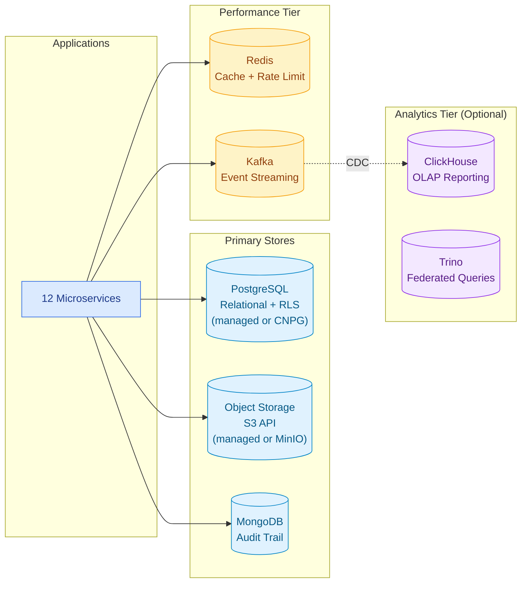
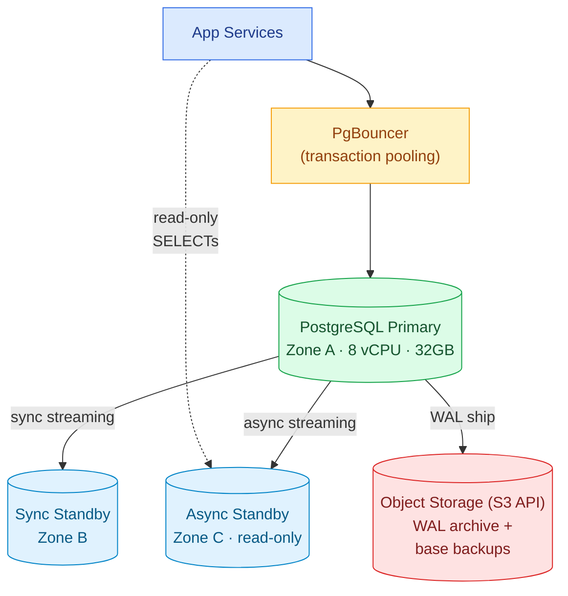
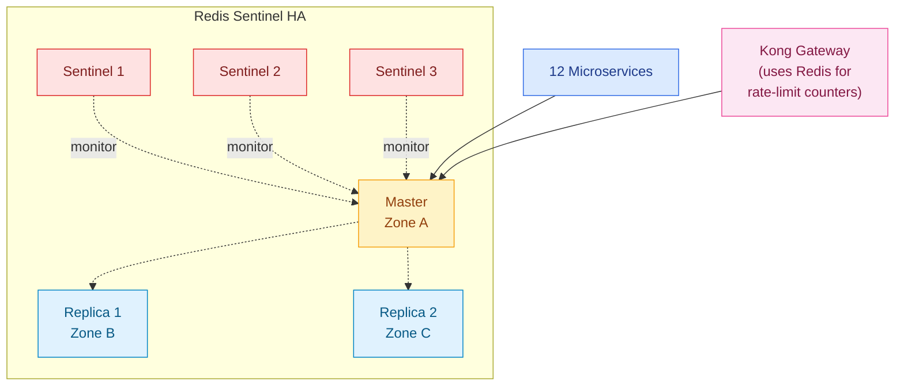
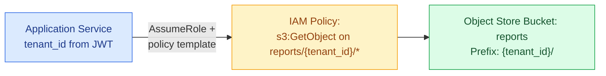
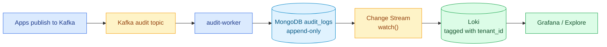
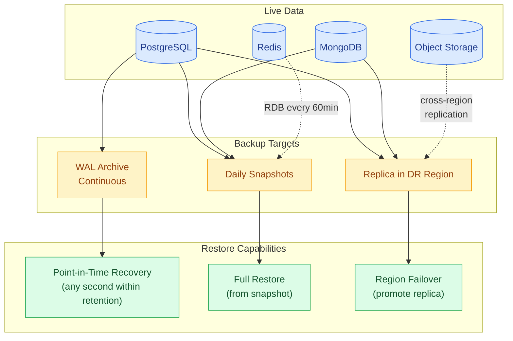

# 04 · Data Architecture — Industry-Standard Stores

> All data stores use **industry-standard technologies** (PostgreSQL, Redis, S3-compatible object storage, MongoDB, Apache Kafka). Each can be deployed either as **a managed service from the chosen cloud provider** (recommended for production unless you have an experienced platform team) or **self-hosted inside Kubernetes via a mature operator**. The application code is identical in either case.

### Deployment Pattern

| Data Store | Recommended Default | Self-Hosted Alternative |
|---|---|---|
| **PostgreSQL** | Cloud-provider managed PostgreSQL service | CloudNativePG operator on Kubernetes |
| **Redis** | Cloud-provider managed Redis service | Redis operator on Kubernetes |
| **Object Storage (S3 API)** | Cloud-provider managed object storage | MinIO on Kubernetes |
| **MongoDB** | Managed MongoDB (e.g., MongoDB Atlas) | MongoDB community operator on Kubernetes |
| **Apache Kafka** | Cloud-provider managed Kafka service | Strimzi operator on Kubernetes |

The rest of this document describes **the technology and its operational model**. Bind to the appropriate managed service from your chosen cloud at deploy time (see [`13-Multi-Cloud-Mapping.md`](./13-Multi-Cloud-Mapping.md)).

---

## Data Stores Overview



---

## 1. PostgreSQL — Primary Relational Store

PostgreSQL is the industry-standard relational database for SaaS platforms — used by GitLab, Reddit, Instagram, Discord, Robinhood, and countless others. **Every major cloud provider offers a managed PostgreSQL service**, and a mature Kubernetes operator (CloudNativePG) handles self-hosted deployments.

### 1.1 Deployment Options

| Option | When to Use |
|---|---|
| **Cloud-provider managed PostgreSQL** *(recommended default)* | Production SaaS without a dedicated DBA team — managed backups, HA, patching, monitoring |
| **CloudNativePG operator (self-hosted in K8s)** | Air-gapped customers, sovereign deployments, on-prem, or when you want infrastructure ownership |
| **Managed PostgreSQL with replica in K8s** | Hybrid disaster-recovery posture |

### 1.2 Why CloudNativePG (for the self-hosted path)

CloudNativePG (CNPG) is a **production-grade Kubernetes operator** for PostgreSQL maintained by EDB. It handles:

- Streaming replication (sync + async)
- Automatic failover (without external tools like Patroni/Stolon)
- Continuous WAL archiving to object storage
- Point-in-time recovery (PITR)
- Online schema migrations (with Atlas / Bytebase / Liquibase)
- Connection pooling via PgBouncer

### 1.2 Cluster Configuration

```yaml
apiVersion: postgresql.cnpg.io/v1
kind: Cluster
metadata:
  name: learning-platform-pg
  namespace: data
spec:
  instances: 3                     # 1 primary + 2 standbys
  primaryUpdateStrategy: unsupervised
  postgresql:
    parameters:
      max_connections: "500"
      shared_buffers: "8GB"
      effective_cache_size: "24GB"
      work_mem: "16MB"
      maintenance_work_mem: "2GB"
      wal_level: "replica"
      max_wal_size: "4GB"
  storage:
    size: 1Ti
    storageClass: fast-ssd
  bootstrap:
    initdb:
      database: learning_platform
      owner: app
  backup:
    barmanObjectStore:
      destinationPath: s3://learning-pg-backups
      s3Credentials:
        accessKeyId: { name: minio-creds, key: ACCESS_KEY }
        secretAccessKey: { name: minio-creds, key: SECRET_KEY }
      wal:
        compression: gzip
      data:
        compression: gzip
    retentionPolicy: "30d"
  monitoring:
    enablePodMonitor: true
```

### 1.3 Topology



### 1.4 Row-Level Security (RLS) — Tenant Isolation

Every tenant-scoped table follows the same RLS pattern:

```sql
ALTER TABLE employees ENABLE ROW LEVEL SECURITY;
CREATE POLICY tenant_isolation ON employees
  USING (tenant_id = current_setting('app.tenant_id')::uuid);
```

**Application sets context per request:**

```python
@app.before_request
def set_tenant_context():
    tenant_id = extract_tenant_from_jwt(request.headers["Authorization"])
    db.execute("SET LOCAL app.tenant_id = %s", (tenant_id,))
```

> `SET LOCAL` is critical — it scopes the setting to the current transaction only, preventing connection pool poisoning.

### 1.5 Complete Schema — All 12 Use Cases

The schema is **identical** to the Azure design (24 tables across 8 groups). See the full SQL in [`schema.sql`](./schema.sql) (extracted below).

```sql
-- ═══════════════════════════════════════════════════════════════════
-- GROUP 1 · PLATFORM LAYER  (UC-01 UC-02 UC-03)  [No RLS — global]
-- ═══════════════════════════════════════════════════════════════════

CREATE TABLE tenants (
  id                UUID    PRIMARY KEY DEFAULT gen_random_uuid(),
  domain            VARCHAR(255) UNIQUE NOT NULL,
  name              VARCHAR(255) NOT NULL,
  tier              VARCHAR(50)  NOT NULL DEFAULT 'BASIC',
  status            VARCHAR(50)  NOT NULL DEFAULT 'PENDING_SETUP',
  admin_email       VARCHAR(255) NOT NULL,
  activated_at      TIMESTAMPTZ,
  suspended_at      TIMESTAMPTZ,
  metadata          JSONB        DEFAULT '{}',
  created_at        TIMESTAMPTZ  DEFAULT NOW()
);
CREATE INDEX idx_tenants_domain ON tenants(domain);
CREATE INDEX idx_tenants_status ON tenants(status);

CREATE TABLE subscription_plans (
  id                UUID    PRIMARY KEY DEFAULT gen_random_uuid(),
  name              VARCHAR(50) UNIQUE NOT NULL,
  max_employees     INT,
  max_risk_rules    INT,
  max_api_calls_min INT,
  features          JSONB   NOT NULL,
  monthly_price_usd DECIMAL(10,2),
  created_at        TIMESTAMPTZ DEFAULT NOW()
);

CREATE TABLE tenant_subscriptions (
  id                UUID    PRIMARY KEY DEFAULT gen_random_uuid(),
  tenant_id         UUID    NOT NULL REFERENCES tenants(id),
  plan_name         VARCHAR(50) NOT NULL,
  status            VARCHAR(50) DEFAULT 'ACTIVE',
  billing_cycle     VARCHAR(20) DEFAULT 'ANNUAL',
  started_at        TIMESTAMPTZ DEFAULT NOW(),
  expires_at        TIMESTAMPTZ,
  cancelled_at      TIMESTAMPTZ,
  external_sub_id   VARCHAR(255),  -- Stripe / Chargebee / Paddle ID
  created_at        TIMESTAMPTZ DEFAULT NOW()
);

CREATE TABLE usage_metering (
  id                UUID    PRIMARY KEY DEFAULT gen_random_uuid(),
  tenant_id         UUID    NOT NULL REFERENCES tenants(id),
  metric_date       DATE    NOT NULL,
  active_employees  INT     DEFAULT 0,
  api_calls_count   BIGINT  DEFAULT 0,
  storage_bytes     BIGINT  DEFAULT 0,
  report_count      INT     DEFAULT 0,
  created_at        TIMESTAMPTZ DEFAULT NOW(),
  UNIQUE(tenant_id, metric_date)
);

CREATE TABLE tenant_api_keys (
  id                UUID    PRIMARY KEY DEFAULT gen_random_uuid(),
  tenant_id         UUID    NOT NULL REFERENCES tenants(id),
  key_hash          VARCHAR(255) NOT NULL,   -- SHA-256 hash; raw key stored in Vault
  key_prefix        VARCHAR(10)  NOT NULL,
  name              VARCHAR(255),
  is_active         BOOLEAN DEFAULT TRUE,
  last_used_at      TIMESTAMPTZ,
  expires_at        TIMESTAMPTZ,
  created_by        UUID,
  created_at        TIMESTAMPTZ DEFAULT NOW()
);

CREATE TABLE tenant_sso_configs (
  id                UUID    PRIMARY KEY DEFAULT gen_random_uuid(),
  tenant_id         UUID    NOT NULL REFERENCES tenants(id) UNIQUE,
  protocol          VARCHAR(20) NOT NULL,   -- SAML2|OIDC
  idp_metadata_url  VARCHAR(500),
  idp_entity_id     VARCHAR(500),
  idp_sso_url       VARCHAR(500),
  idp_certificate   TEXT,
  oidc_client_id    VARCHAR(255),
  oidc_issuer_url   VARCHAR(500),
  oidc_scopes       VARCHAR(500),
  keycloak_idp_alias VARCHAR(100),  -- Keycloak identity provider alias
  is_active         BOOLEAN  DEFAULT FALSE,
  tested_at         TIMESTAMPTZ,
  created_at        TIMESTAMPTZ DEFAULT NOW(),
  updated_at        TIMESTAMPTZ DEFAULT NOW()
);

-- ═══════════════════════════════════════════════════════════════════
-- GROUP 2 · USERS & RBAC  (All UCs)
-- ═══════════════════════════════════════════════════════════════════

CREATE TABLE users (
  id                UUID    PRIMARY KEY DEFAULT gen_random_uuid(),
  tenant_id         UUID    REFERENCES tenants(id),  -- NULL = super admin
  email             VARCHAR(255) NOT NULL,
  full_name         VARCHAR(255),
  is_active         BOOLEAN DEFAULT TRUE,
  is_super_admin    BOOLEAN DEFAULT FALSE,
  keycloak_user_id  VARCHAR(255),                    -- Keycloak subject (replaces b2c_object_id)
  last_login_at     TIMESTAMPTZ,
  created_at        TIMESTAMPTZ DEFAULT NOW(),
  UNIQUE(tenant_id, email)
);
ALTER TABLE users ENABLE ROW LEVEL SECURITY;
CREATE POLICY tenant_isolation ON users
  USING (tenant_id = current_setting('app.tenant_id')::uuid
      OR is_super_admin = TRUE);

CREATE TABLE user_roles (
  id                UUID    PRIMARY KEY DEFAULT gen_random_uuid(),
  tenant_id         UUID    NOT NULL REFERENCES tenants(id),
  user_id           UUID    NOT NULL REFERENCES users(id),
  role              VARCHAR(50) NOT NULL,
  assigned_by       UUID    REFERENCES users(id),
  assigned_at       TIMESTAMPTZ DEFAULT NOW(),
  UNIQUE(tenant_id, user_id, role)
);
ALTER TABLE user_roles ENABLE ROW LEVEL SECURITY;
CREATE POLICY tenant_isolation ON user_roles
  USING (tenant_id = current_setting('app.tenant_id')::uuid);

-- ═══════════════════════════════════════════════════════════════════
-- GROUP 3 · EMPLOYEE MASTER & DATA INGESTION  (UC-05 UC-06)
-- ═══════════════════════════════════════════════════════════════════

CREATE TABLE employees (
  id                UUID    PRIMARY KEY DEFAULT gen_random_uuid(),
  tenant_id         UUID    NOT NULL REFERENCES tenants(id),
  user_id           UUID    REFERENCES users(id),
  employee_code     VARCHAR(100),
  full_name         VARCHAR(255) NOT NULL,
  email             VARCHAR(255) NOT NULL,
  department        VARCHAR(255),
  designation       VARCHAR(255),
  manager_id        UUID    REFERENCES employees(id),
  location          VARCHAR(255),
  join_date         DATE,
  is_active         BOOLEAN DEFAULT TRUE,
  created_at        TIMESTAMPTZ DEFAULT NOW(),
  updated_at        TIMESTAMPTZ DEFAULT NOW(),
  UNIQUE(tenant_id, email)
);
ALTER TABLE employees ENABLE ROW LEVEL SECURITY;
CREATE POLICY tenant_isolation ON employees
  USING (tenant_id = current_setting('app.tenant_id')::uuid);

CREATE TABLE attendance_records (
  id                UUID    PRIMARY KEY DEFAULT gen_random_uuid(),
  tenant_id         UUID    NOT NULL,
  employee_id       UUID    NOT NULL REFERENCES employees(id),
  training_session  VARCHAR(255),
  session_date      DATE    NOT NULL,
  status            VARCHAR(20) NOT NULL,
  duration_minutes  INT,
  source_system     VARCHAR(100),
  ingested_at       TIMESTAMPTZ DEFAULT NOW(),
  UNIQUE(tenant_id, employee_id, training_session, session_date)
);
ALTER TABLE attendance_records ENABLE ROW LEVEL SECURITY;
CREATE POLICY tenant_isolation ON attendance_records
  USING (tenant_id = current_setting('app.tenant_id')::uuid);

CREATE TABLE assessment_scores (
  id                UUID    PRIMARY KEY DEFAULT gen_random_uuid(),
  tenant_id         UUID    NOT NULL,
  employee_id       UUID    NOT NULL REFERENCES employees(id),
  assessment_name   VARCHAR(255) NOT NULL,
  assessment_type   VARCHAR(50),
  score             DECIMAL(5,2) NOT NULL,
  max_score         DECIMAL(5,2) DEFAULT 100.00,
  pass_score        DECIMAL(5,2) DEFAULT 60.00,
  is_passed         BOOLEAN GENERATED ALWAYS AS (score >= pass_score) STORED,
  taken_at          DATE    NOT NULL,
  source_system     VARCHAR(100),
  ingested_at       TIMESTAMPTZ DEFAULT NOW()
);
ALTER TABLE assessment_scores ENABLE ROW LEVEL SECURITY;
CREATE POLICY tenant_isolation ON assessment_scores
  USING (tenant_id = current_setting('app.tenant_id')::uuid);

CREATE TABLE competency_milestones (
  id                UUID    PRIMARY KEY DEFAULT gen_random_uuid(),
  tenant_id         UUID    NOT NULL,
  employee_id       UUID    NOT NULL REFERENCES employees(id),
  milestone_code    VARCHAR(100) NOT NULL,
  milestone_name    VARCHAR(255) NOT NULL,
  competency_area   VARCHAR(255),
  status            VARCHAR(50) DEFAULT 'NOT_STARTED',
  target_date       DATE,
  completed_at      TIMESTAMPTZ,
  proficiency_level VARCHAR(50),
  source_system     VARCHAR(100),
  ingested_at       TIMESTAMPTZ DEFAULT NOW(),
  UNIQUE(tenant_id, employee_id, milestone_code)
);
ALTER TABLE competency_milestones ENABLE ROW LEVEL SECURITY;
CREATE POLICY tenant_isolation ON competency_milestones
  USING (tenant_id = current_setting('app.tenant_id')::uuid);

CREATE TABLE employee_learning_profiles (
  id                    UUID    PRIMARY KEY DEFAULT gen_random_uuid(),
  tenant_id             UUID    NOT NULL,
  employee_id           UUID    NOT NULL REFERENCES employees(id),
  attendance_pct_30d    DECIMAL(5,2),
  attendance_pct_90d    DECIMAL(5,2),
  avg_score_30d         DECIMAL(5,2),
  avg_score_90d         DECIMAL(5,2),
  consecutive_fails     INT     DEFAULT 0,
  milestones_total      INT     DEFAULT 0,
  milestones_completed  INT     DEFAULT 0,
  milestones_pct        DECIMAL(5,2),
  trend_direction       VARCHAR(20),
  trend_score_delta     DECIMAL(5,2),
  last_activity_date    DATE,
  current_risk_level    VARCHAR(20)   DEFAULT 'LOW',
  last_calculated_at    TIMESTAMPTZ   DEFAULT NOW(),
  UNIQUE(tenant_id, employee_id)
);
ALTER TABLE employee_learning_profiles ENABLE ROW LEVEL SECURITY;
CREATE POLICY tenant_isolation ON employee_learning_profiles
  USING (tenant_id = current_setting('app.tenant_id')::uuid);

CREATE TABLE ingestion_logs (
  id                UUID    PRIMARY KEY DEFAULT gen_random_uuid(),
  tenant_id         UUID    NOT NULL,
  api_key_id        UUID    REFERENCES tenant_api_keys(id),
  data_type         VARCHAR(50),
  source_system     VARCHAR(100),
  records_received  INT     DEFAULT 0,
  records_processed INT     DEFAULT 0,
  records_failed    INT     DEFAULT 0,
  error_details     JSONB,
  ingested_at       TIMESTAMPTZ DEFAULT NOW()
);

-- ═══════════════════════════════════════════════════════════════════
-- GROUP 4 · RISK ENGINE  (UC-07 UC-08)
-- ═══════════════════════════════════════════════════════════════════

CREATE TABLE risk_rules (
  id                UUID    PRIMARY KEY DEFAULT gen_random_uuid(),
  tenant_id         UUID    NOT NULL REFERENCES tenants(id),
  rule_code         VARCHAR(50) NOT NULL,
  name              VARCHAR(255) NOT NULL,
  description       TEXT,
  severity          VARCHAR(20) NOT NULL,
  rule_type         VARCHAR(50),
  conditions        JSONB   NOT NULL,
  actions           JSONB   NOT NULL,
  is_active         BOOLEAN DEFAULT TRUE,
  is_global_template BOOLEAN DEFAULT FALSE,
  version           INT     DEFAULT 1,
  created_by        UUID    REFERENCES users(id),
  created_at        TIMESTAMPTZ DEFAULT NOW(),
  updated_at        TIMESTAMPTZ DEFAULT NOW(),
  UNIQUE(tenant_id, rule_code, version)
);
ALTER TABLE risk_rules ENABLE ROW LEVEL SECURITY;
CREATE POLICY tenant_isolation ON risk_rules
  USING (tenant_id = current_setting('app.tenant_id')::uuid
      OR is_global_template = TRUE);

CREATE TABLE risk_rule_versions (
  id                UUID    PRIMARY KEY DEFAULT gen_random_uuid(),
  tenant_id         UUID    NOT NULL,
  rule_id           UUID    NOT NULL REFERENCES risk_rules(id),
  version           INT     NOT NULL,
  conditions        JSONB   NOT NULL,
  actions           JSONB   NOT NULL,
  changed_by        UUID    REFERENCES users(id),
  change_reason     TEXT,
  created_at        TIMESTAMPTZ DEFAULT NOW()
);
ALTER TABLE risk_rule_versions ENABLE ROW LEVEL SECURITY;
CREATE POLICY tenant_isolation ON risk_rule_versions
  USING (tenant_id = current_setting('app.tenant_id')::uuid);

CREATE TABLE risk_evaluation_jobs (
  id                UUID    PRIMARY KEY DEFAULT gen_random_uuid(),
  tenant_id         UUID    NOT NULL REFERENCES tenants(id),
  evaluation_date   DATE    NOT NULL,
  status            VARCHAR(50) DEFAULT 'PENDING',
  employees_evaluated INT   DEFAULT 0,
  alerts_generated  INT     DEFAULT 0,
  started_at        TIMESTAMPTZ,
  completed_at      TIMESTAMPTZ,
  error_message     TEXT,
  argo_workflow_name VARCHAR(255),   -- Argo Workflows reference
  created_at        TIMESTAMPTZ DEFAULT NOW(),
  UNIQUE(tenant_id, evaluation_date)
);

CREATE TABLE risk_assessments (
  id                UUID    PRIMARY KEY DEFAULT gen_random_uuid(),
  tenant_id         UUID    NOT NULL,
  employee_id       UUID    NOT NULL REFERENCES employees(id),
  evaluation_job_id UUID    REFERENCES risk_evaluation_jobs(id),
  risk_level        VARCHAR(20) NOT NULL,
  risk_score        DECIMAL(5,2),
  rules_fired       JSONB,
  contributing_factors JSONB,
  previous_risk_level VARCHAR(20),
  is_notified       BOOLEAN  DEFAULT FALSE,
  notified_at       TIMESTAMPTZ,
  assessed_at       TIMESTAMPTZ DEFAULT NOW()
);
ALTER TABLE risk_assessments ENABLE ROW LEVEL SECURITY;
CREATE POLICY tenant_isolation ON risk_assessments
  USING (tenant_id = current_setting('app.tenant_id')::uuid);

-- ═══════════════════════════════════════════════════════════════════
-- GROUP 5 · INTERVENTION MANAGEMENT  (UC-09 UC-10)
-- ═══════════════════════════════════════════════════════════════════

CREATE TABLE interventions (
  id                UUID    PRIMARY KEY DEFAULT gen_random_uuid(),
  tenant_id         UUID    NOT NULL,
  employee_id       UUID    NOT NULL REFERENCES employees(id),
  risk_assessment_id UUID   REFERENCES risk_assessments(id),
  type              VARCHAR(50) NOT NULL,
  title             VARCHAR(255),
  description       TEXT,
  status            VARCHAR(50) DEFAULT 'DRAFT',
  assigned_by       UUID    REFERENCES users(id),
  approved_by       UUID    REFERENCES users(id),
  rejected_by       UUID    REFERENCES users(id),
  rejection_reason  TEXT,
  trainer_id        UUID    REFERENCES users(id),
  scheduled_start   TIMESTAMPTZ,
  scheduled_end     TIMESTAMPTZ,
  actual_start      TIMESTAMPTZ,
  actual_end        TIMESTAMPTZ,
  sessions_planned  INT     DEFAULT 1,
  sessions_attended INT     DEFAULT 0,
  pre_metrics       JSONB,
  post_metrics      JSONB,
  improvement_pct   DECIMAL(5,2),
  outcome_notes     TEXT,
  created_at        TIMESTAMPTZ DEFAULT NOW(),
  updated_at        TIMESTAMPTZ DEFAULT NOW()
);
ALTER TABLE interventions ENABLE ROW LEVEL SECURITY;
CREATE POLICY tenant_isolation ON interventions
  USING (tenant_id = current_setting('app.tenant_id')::uuid);

CREATE TABLE intervention_sessions (
  id                UUID    PRIMARY KEY DEFAULT gen_random_uuid(),
  tenant_id         UUID    NOT NULL,
  intervention_id   UUID    NOT NULL REFERENCES interventions(id),
  session_number    INT     NOT NULL,
  scheduled_at      TIMESTAMPTZ,
  conducted_at      TIMESTAMPTZ,
  duration_minutes  INT,
  attendance_status VARCHAR(20),
  trainer_notes     TEXT,
  employee_feedback TEXT,
  created_at        TIMESTAMPTZ DEFAULT NOW()
);
ALTER TABLE intervention_sessions ENABLE ROW LEVEL SECURITY;
CREATE POLICY tenant_isolation ON intervention_sessions
  USING (tenant_id = current_setting('app.tenant_id')::uuid);

CREATE TABLE intervention_workflow_events (
  id                UUID    PRIMARY KEY DEFAULT gen_random_uuid(),
  tenant_id         UUID    NOT NULL,
  intervention_id   UUID    NOT NULL REFERENCES interventions(id),
  from_status       VARCHAR(50),
  to_status         VARCHAR(50) NOT NULL,
  action            VARCHAR(50) NOT NULL,
  performed_by      UUID    REFERENCES users(id),
  comments          TEXT,
  created_at        TIMESTAMPTZ DEFAULT NOW()
);
ALTER TABLE intervention_workflow_events ENABLE ROW LEVEL SECURITY;
CREATE POLICY tenant_isolation ON intervention_workflow_events
  USING (tenant_id = current_setting('app.tenant_id')::uuid);

-- ═══════════════════════════════════════════════════════════════════
-- GROUP 6 · COMPLIANCE REPORTING  (UC-11)
-- ═══════════════════════════════════════════════════════════════════

CREATE TABLE report_definitions (
  id                UUID    PRIMARY KEY DEFAULT gen_random_uuid(),
  tenant_id         UUID    REFERENCES tenants(id),
  name              VARCHAR(255) NOT NULL,
  description       TEXT,
  report_type       VARCHAR(100) NOT NULL,
  default_filters   JSONB,
  is_global         BOOLEAN  DEFAULT FALSE,
  created_at        TIMESTAMPTZ DEFAULT NOW()
);

CREATE TABLE report_jobs (
  id                UUID    PRIMARY KEY DEFAULT gen_random_uuid(),
  tenant_id         UUID    NOT NULL,
  report_definition_id UUID  REFERENCES report_definitions(id),
  requested_by      UUID    REFERENCES users(id),
  report_type       VARCHAR(100) NOT NULL,
  parameters        JSONB   NOT NULL,
  format            VARCHAR(20) NOT NULL,
  status            VARCHAR(50) DEFAULT 'PENDING',
  storage_url       VARCHAR(1000),    -- Object-store pre-signed URL (S3 API)
  file_size_bytes   BIGINT,
  error_message     TEXT,
  requested_at      TIMESTAMPTZ DEFAULT NOW(),
  completed_at      TIMESTAMPTZ,
  expires_at        TIMESTAMPTZ
);
ALTER TABLE report_jobs ENABLE ROW LEVEL SECURITY;
CREATE POLICY tenant_isolation ON report_jobs
  USING (tenant_id = current_setting('app.tenant_id')::uuid);

CREATE TABLE report_schedules (
  id                UUID    PRIMARY KEY DEFAULT gen_random_uuid(),
  tenant_id         UUID    NOT NULL,
  name              VARCHAR(255) NOT NULL,
  report_definition_id UUID  REFERENCES report_definitions(id),
  parameters        JSONB   NOT NULL,
  cron_expression   VARCHAR(100) NOT NULL,
  format            VARCHAR(20) DEFAULT 'PDF',
  recipient_emails  JSONB   NOT NULL,
  is_active         BOOLEAN DEFAULT TRUE,
  last_run_at       TIMESTAMPTZ,
  next_run_at       TIMESTAMPTZ,
  created_by        UUID    REFERENCES users(id),
  created_at        TIMESTAMPTZ DEFAULT NOW()
);
ALTER TABLE report_schedules ENABLE ROW LEVEL SECURITY;
CREATE POLICY tenant_isolation ON report_schedules
  USING (tenant_id = current_setting('app.tenant_id')::uuid);

-- ═══════════════════════════════════════════════════════════════════
-- GROUP 7 · NOTIFICATIONS
-- ═══════════════════════════════════════════════════════════════════

CREATE TABLE notifications (
  id                UUID    PRIMARY KEY DEFAULT gen_random_uuid(),
  tenant_id         UUID    NOT NULL,
  user_id           UUID    REFERENCES users(id),
  type              VARCHAR(100) NOT NULL,
  channel           VARCHAR(20) NOT NULL,
  subject           VARCHAR(255),
  body              TEXT,
  status            VARCHAR(20) DEFAULT 'PENDING',
  reference_id      UUID,
  reference_type    VARCHAR(50),
  sent_at           TIMESTAMPTZ,
  read_at           TIMESTAMPTZ,
  created_at        TIMESTAMPTZ DEFAULT NOW()
);
ALTER TABLE notifications ENABLE ROW LEVEL SECURITY;
CREATE POLICY tenant_isolation ON notifications
  USING (tenant_id = current_setting('app.tenant_id')::uuid);

-- ═══════════════════════════════════════════════════════════════════
-- GROUP 8 · DASHBOARD  (UC-12)
-- ═══════════════════════════════════════════════════════════════════

CREATE TABLE dashboard_configurations (
  id                UUID    PRIMARY KEY DEFAULT gen_random_uuid(),
  tenant_id         UUID    NOT NULL,
  user_id           UUID    REFERENCES users(id),
  role              VARCHAR(50) NOT NULL,
  widgets           JSONB   NOT NULL,
  layout            JSONB,
  created_at        TIMESTAMPTZ DEFAULT NOW(),
  updated_at        TIMESTAMPTZ DEFAULT NOW()
);
ALTER TABLE dashboard_configurations ENABLE ROW LEVEL SECURITY;
CREATE POLICY tenant_isolation ON dashboard_configurations
  USING (tenant_id = current_setting('app.tenant_id')::uuid);
```

**Changes from Azure schema:**
- `b2c_object_id` → `keycloak_user_id`
- `stripe_sub_id` → generalized `external_sub_id`
- `blob_url` → `storage_url` (S3-API object storage — all return URLs)
- Added `argo_workflow_name` reference in `risk_evaluation_jobs`
- Added `keycloak_idp_alias` in `tenant_sso_configs`

---

## 2. Redis — Cache + Rate-Limit Store

### 2.1 Topology



### 2.2 Cache Key Patterns

| Pattern | Content | TTL | Use Case |
|---|---|---|---|
| `profile:{tenant_id}:{employee_id}` | Aggregated profile JSON | 15 min | UC-06 Profile API |
| `dashboard:{tenant_id}:{role}` | Dashboard KPIs | 5 min | UC-12 |
| `rules:{tenant_id}` | Active risk rules list | 30 min | UC-08 |
| `ratelimit:{tenant_id}:{window}` | Sliding-window counter | 60 sec | API-gateway rate-limit |
| `token:revoked:{jti}` | Revoked JWT blacklist | Token expiry | Auth |
| `tenant:{tenant_id}:config` | Tier, limits, flags | 60 min | All services |
| `ingestion:idem:{tenant}:{req_id}` | Idempotency marker | 24h | UC-05 |
| `websocket:user:{user_id}` | Connection metadata | TTL = connection | WebSocket service (Centrifugo or commercial) |

### 2.3 Eviction Policy

`maxmemory-policy: allkeys-lru` — least-recently-used keys evicted when memory full. Acceptable for cache use; rate-limit counters are short-TTL so unlikely to be evicted prematurely.

---

## 3. Object Storage — S3-Compatible

Object storage uses the **S3 API** — the de-facto industry standard. Every major cloud provider offers a managed object store with S3-compatible semantics, and MinIO is the standard for self-hosted deployments.

### 3.1 Deployment Options

| Option | When to Use |
|---|---|
| **Cloud-provider managed object storage** *(recommended default)* | Production deployment on a major public cloud — lowest cost, no ops |
| **MinIO on Kubernetes** | Self-hosted / on-prem / air-gapped deployments |
| **MinIO as a gateway** | If you need a uniform S3 API across multi-cloud / hybrid |

### 3.2 Why the S3 API

- **Universally supported** — same client SDKs work against the major cloud object stores, MinIO, Wasabi, Backblaze B2, etc.
- **Mature features** — pre-signed URLs, lifecycle policies, server-side encryption, object lock for compliance.
- **Multi-tenant friendly** — supports per-tenant buckets or per-tenant prefixes with IAM policies.

### 3.3 Bucket Layout

| Bucket | Content | Access Policy | Lifecycle |
|---|---|---|---|
| `reports` | `{tenant_id}/{job_id}.{ext}` PDFs/Excel | Private + pre-signed URLs | 7 years (regulatory) |
| `imports` | `{tenant_id}/{date}/raw.csv` | Private | Delete 30 days after processed |
| `rule-templates` | `{template_id}.json` | Read-only via service account | Permanent |
| `audit-archive` | `{tenant_id}/{year}/{month}.parquet` | Object Lock (immutable) | 10 years |
| `attachments` | `{tenant_id}/{intervention_id}/file.{ext}` | Private + pre-signed | 5 years |
| `pg-backups` | PostgreSQL WAL + base backups | Service account only | 30 days |
| `mongo-backups` | MongoDB ops backups | Service account only | 30 days |

### 3.4 Tenant Isolation Strategy



### 3.5 Self-Hosted Sizing (MinIO)

For the self-hosted path only:

| Tier | Nodes | Erasure Config | Raw Capacity | Usable | Failure Tolerance |
|---|---|---|---|---|---|
| Small | 4 | EC:2 | 10 TB | 8 TB | 2 disks/node |
| Medium | 8 | EC:4 | 50 TB | 40 TB | 4 disks/node |
| Large | 16 | EC:4 | 200 TB | 160 TB | 4 disks/node |

---

## 4. MongoDB — Audit Trail

### 4.1 Design

- **Collection:** `audit_logs`
- **Sharding:** `{ tenant_id: "hashed" }` — even distribution across shards
- **Indexes:** `{ tenant_id: 1, timestamp: -1 }`, `{ entity_type: 1, entity_id: 1 }`
- **Immutability:** Service account role grants only `find` + `insert`; no `update` or `delete`

### 4.2 Document Schema

```json
{
  "_id": "ObjectId(...)",
  "tenantId": "tenant-uuid",
  "userId": "user-uuid",
  "userRole": "LD_ADMIN",
  "action": "GENERATE_COMPLIANCE_REPORT",
  "entityType": "REPORT",
  "entityId": "report-uuid",
  "timestamp": ISODate("2026-10-15T14:32:00Z"),
  "ipAddress": "203.0.113.42",
  "requestId": "req-uuid",
  "payload": { "reportType": "ATTENDANCE_COMPLIANCE", "period": "Q3-2026" },
  "result": "SUCCESS",
  "kafka_offset": 12345,
  "kafka_partition": 7
}
```

### 4.3 Change Streams → Loki

MongoDB **Change Streams** stream every new audit document into Loki for centralized search:



### 4.4 Alternatives

| Alternative | When to Choose |
|---|---|
| **ScyllaDB / Cassandra** | Write-heavy (>100K writes/sec) audit workloads |
| **AWS DynamoDB / GCP Firestore** | If running cloud-managed and want zero-ops |
| **ClickHouse with append-only table** | If you also need analytical queries on audit data |
| **Postgres append-only table** | Smallest scale; keep everything in one DB |

---

## 5. Kafka — Event Streaming

Managed via **Strimzi operator** — the de facto K8s operator for Kafka, CNCF-aligned, used in production at countless enterprises.

### 5.1 Cluster Topology

| Component | Replicas | Resources | Storage |
|---|---|---|---|
| Kafka Brokers | 3 (1 per AZ) | 4 vCPU / 8 GB | 500 GB SSD each |
| Zookeeper / KRaft | 3 | 1 vCPU / 2 GB | 50 GB SSD each |
| Schema Registry | 2 | 0.5 vCPU / 512 MB | — |
| Kafka Connect | 2 | 2 vCPU / 4 GB | — |

### 5.2 Topic Strategy

| Topic | Partitions | Replication | Retention | Compaction |
|---|---|---|---|---|
| `training.attendance.v1` | 50 | 3 | 7 days | — |
| `training.assessment.v1` | 20 | 3 | 7 days | — |
| `training.milestone.v1` | 20 | 3 | 7 days | — |
| `tenant.lifecycle.v1` | 10 | 3 | 90 days | compacted |
| `intervention.events.v1` | 20 | 3 | 30 days | — |
| `billing.events.v1` | 10 | 3 | 90 days | — |
| `risk.alerts.v1` | 30 | 3 | 7 days | — |
| `notifications.outbound.v1` | 30 | 3 | 24 hrs | — |
| `audit.firehose.v1` | 50 | 3 | 7 days | — |

**Partition key = `tenant_id`** for all tenant-scoped topics — ensures ordered processing per tenant and even distribution across consumers.

---

## 6. Backup & Recovery Strategy



| Resource | Backup Method | RPO | RTO | Retention |
|---|---|---|---|---|
| PostgreSQL | WAL + base backups → object storage (managed PG handles automatically; CNPG for self-hosted) | 5 min | 30 min | 30 days |
| PostgreSQL DR | Continuous streaming replica | 30 sec | 5 min (promote) | Same as primary |
| MongoDB | Percona Backup for MongoDB (or Atlas backups) | 1 hr | 1 hr | 30 days |
| Object Storage | Cross-region replication (managed or MinIO site replication) | <15 min | 1 hr | 7–10 years (tier-based) |
| Redis | RDB snapshot every 60 min → object storage | 1 hr | 15 min | 7 days |
| Kafka | Cross-cluster MirrorMaker 2 (managed or self-hosted) | <1 min | <5 min | Same as primary |
| K8s manifests | Velero → MinIO | 0 (GitOps) | 30 min | Git history |
