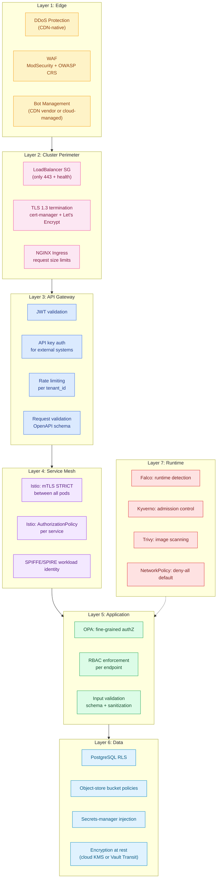
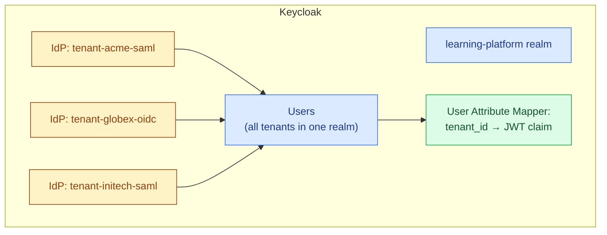
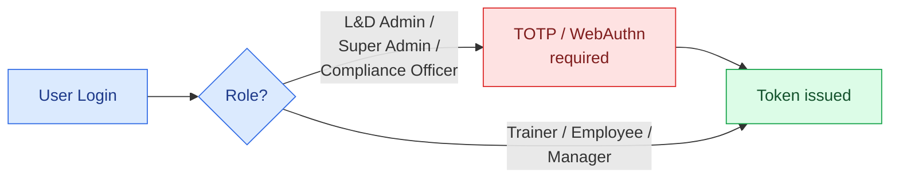
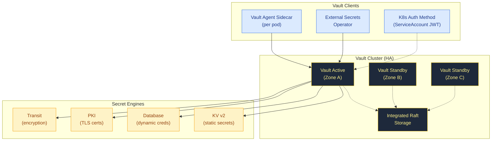
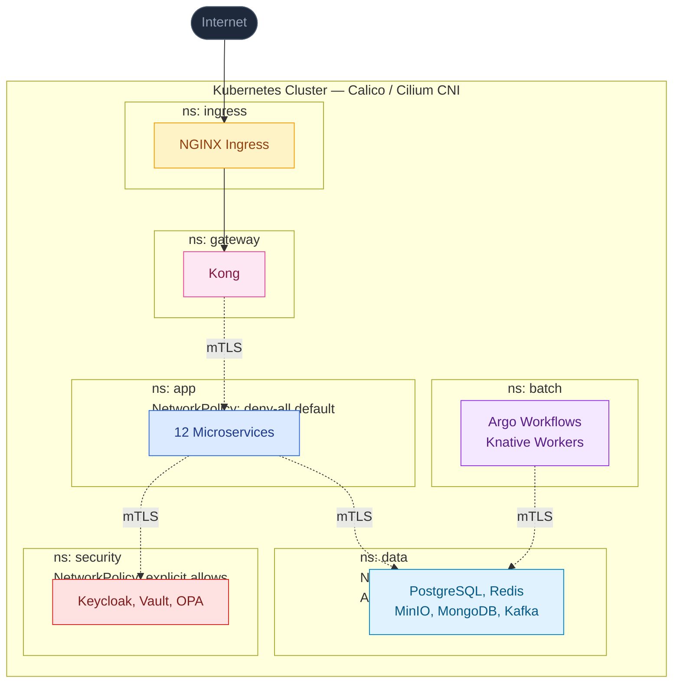
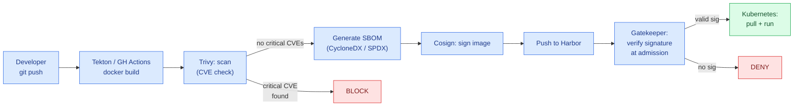
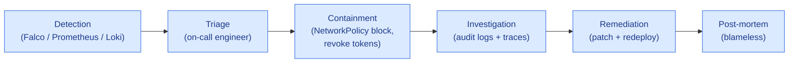

# 05 · Security & Identity Architecture

> **Zero-Trust** model: never trust, always verify. Every workload, request, and secret is authenticated and authorized at every hop.

---

## 1. Security Layers



---

## 2. Identity Management

The platform uses **standard identity protocols** — OIDC and SAML 2.0 — so the choice of Identity Provider (IdP) is interchangeable. The default reference implementation is **Keycloak** (self-hosted, open-source, no per-MAU pricing), but the same application code works against any compliant commercial IdP.

### 2.1 Identity Provider Options

| Option | Best For | Pricing Model | Operational Burden |
|---|---|---|---|
| **Keycloak (self-hosted)** *(reference)* | Cost-sensitive, sovereign deployments, on-prem customers | Free (infra cost only) | Operate cluster yourself |
| **Commercial B2B IdP** (e.g., Auth0, WorkOS, FrontEgg, Okta) | Fastest time-to-market, strong customer-confidence signal | Per-MAU or per-connection | Vendor handles ops |
| **Cloud-provider managed IdP** (Cognito / Identity Platform / Entra External ID) | When already heavily invested in one cloud | Per-MAU | Vendor handles ops |

> The application is coded against **OIDC + SAML 2.0** — switching IdPs requires configuration, not code changes.

### 2.2 Why Keycloak as the Reference Default

| Feature | Keycloak | Typical Commercial B2B IdP |
|---|---|---|
| Self-hosted | Yes (free) | No (vendor-hosted) |
| SAML 2.0 | Native | Native |
| OIDC | Native | Native |
| Social Login (Google, MS, FB, etc.) | Native | Native |
| Identity Brokering (federation) | Native, unlimited IdPs | Native (often capped by tier) |
| Custom claims via mappers | UI + scripts | UI + actions/hooks |
| Multi-tenancy | Realms or shared realm + claim | Organizations / tenants |
| Pricing | Free | Per-MAU or per-connection |
| Vendor lock-in | None (OSS) | Vendor-specific data export |
| Hiring | Solid talent pool | Easier — broader recognition |

### 2.3 Multi-Tenancy Strategies

**Two valid approaches:**

#### Option A: Shared Realm + `tenant_id` Claim (RECOMMENDED)



**Pros:**
- Single realm to operate (simpler)
- Cross-tenant analytics in one place
- Easier to upgrade Keycloak version
- Lower memory footprint

**Cons:**
- Tenant must be tagged on every user (mandatory custom attribute)
- One misconfigured mapper exposes cross-tenant data

#### Option B: Realm per Tenant

**Pros:**
- Hard isolation at Keycloak level
- Per-tenant theming and login flows easy
- Per-tenant admin delegation

**Cons:**
- Realm sprawl (1,000 tenants = 1,000 realms)
- Higher Keycloak memory footprint
- Slower realm metadata cache invalidation

### 2.4 JWT Token Structure

```json
{
  "iss": "https://auth.platform.com/realms/learning-platform",
  "sub": "abc-123-keycloak-user-id",
  "aud": ["learning-platform-api"],
  "exp": 1735690000,
  "iat": 1735686400,
  "tenant_id": "550e8400-e29b-41d4-a716-446655440000",
  "email": "jane.doe@acme.com",
  "name": "Jane Doe",
  "roles": ["LD_ADMIN", "TRAINER"],
  "tier": "PROFESSIONAL",
  "preferred_username": "jane.doe"
}
```

### 2.5 Authentication Flows

| Flow | When Used | Standard |
|---|---|---|
| **Authorization Code + PKCE** | SPA / mobile login | OIDC |
| **Client Credentials** | Service-to-service inside cluster | OAuth 2.0 |
| **Refresh Token Rotation** | Long-lived sessions | OIDC |
| **Token Exchange** | Backend-to-backend impersonation (audit) | RFC 8693 |
| **Device Code Flow** | CLI tools, embedded devices | RFC 8628 |

### 2.6 MFA Enforcement



Configured via Keycloak **Authentication Flow** with conditional MFA step based on role.

---

## 3. Secrets Management

Secrets management is an industry-standard requirement. The platform supports two deployment patterns, configurable per environment:

| Option | Best For |
|---|---|
| **Cloud-provider managed secrets store** *(simpler default)* | Single-cloud deployments — no operational burden |
| **HashiCorp Vault (self-hosted)** *(reference implementation)* | Multi-cloud, hybrid, on-prem, sovereign deployments; rich features (dynamic creds, PKI, transit encryption) |

Application code reads secrets via the **External Secrets Operator (ESO)** or **Vault Agent sidecar** — both abstractions work against either backend. Switching between the two is a configuration change, not a code change.

### 3.1 Why Vault (for the self-hosted reference path)

- Centralized secret storage with strong auth (K8s ServiceAccount, AppRole, OIDC, JWT)
- **Dynamic secrets** — generate short-lived DB credentials on demand
- **Encryption-as-a-service** (Transit secret engine)
- **PKI engine** — issue short-lived TLS certs to workloads
- **Audit logging** — every secret access logged
- Industry-standard tool with strong commercial support (HashiCorp / IBM)

### 3.2 Vault Topology



### 3.3 Secret Paths

| Path | Content | Access Policy |
|---|---|---|
| `secret/data/tenants/{id}/api-key` | Per-tenant API key (UC-05) | `ingestion-svc` ServiceAccount only |
| `secret/data/postgres/app` | DB user credentials | All app services |
| `secret/data/redis/connection` | Redis connection string | Profile, dashboard, rules services |
| `secret/data/tenants/{id}/sso-secret` | OIDC client secret (UC-04) | `identity-svc` only |
| `secret/data/billing/stripe-webhook` | Stripe webhook signing key | `billing-svc` only |
| `secret/data/report-signing-key` | RSA private key | `report-svc` only |
| `database/creds/app-readonly` | Dynamic Postgres role (TTL 1h) | Reporting services |
| `pki/issue/internal-mtls` | Workload TLS cert (TTL 24h) | All services (Istio fallback) |

### 3.4 Secret Injection Pattern

```yaml
apiVersion: apps/v1
kind: Deployment
metadata:
  name: tenant-svc
spec:
  template:
    metadata:
      annotations:
        vault.hashicorp.com/agent-inject: "true"
        vault.hashicorp.com/role: "tenant-svc"
        vault.hashicorp.com/agent-inject-secret-db: "secret/data/postgres/app"
        vault.hashicorp.com/agent-inject-template-db: |
          {{- with secret "secret/data/postgres/app" -}}
          postgres://{{ .Data.data.user }}:{{ .Data.data.password }}@pg-rw.data:5432/learning
          {{- end -}}
    spec:
      serviceAccountName: tenant-svc
      containers:
        - name: app
          env:
            - name: DATABASE_URL_FILE
              value: /vault/secrets/db
```

The Vault Agent sidecar writes the rendered secret to `/vault/secrets/db` — the app reads it from there. **No secret ever appears in environment variables or git.**

---

## 4. Authorization — OPA / OPA Gatekeeper

### 4.1 Two Use Cases

| Layer | Tool | Purpose |
|---|---|---|
| **Cluster Admission** | OPA Gatekeeper | Validate K8s manifests at apply-time (no privileged pods, required labels, etc.) |
| **Application AuthZ** | OPA (sidecar or library) | Fine-grained "can user X do action Y on resource Z" |

### 4.2 Gatekeeper Example — Block Privileged Containers

```yaml
apiVersion: templates.gatekeeper.sh/v1
kind: ConstraintTemplate
metadata:
  name: k8spsprivileged
spec:
  crd:
    spec:
      names:
        kind: K8sPSPrivileged
  targets:
    - target: admission.k8s.gatekeeper.sh
      rego: |
        package k8spsprivileged
        violation[{"msg": msg}] {
          c := input.review.object.spec.containers[_]
          c.securityContext.privileged
          msg := sprintf("Privileged container not allowed: %v", [c.name])
        }
```

### 4.3 Application AuthZ Example — Intervention Approval

```rego
package learning.intervention

# Only L&D Admins can approve interventions
default allow := false

allow if {
  input.action == "approve"
  input.resource.type == "intervention"
  "LD_ADMIN" in input.user.roles
  input.resource.tenant_id == input.user.tenant_id
  input.resource.status == "PENDING_APPROVAL"
}
```

App service calls OPA:
```python
result = opa.evaluate(
    "learning/intervention/allow",
    {"action": "approve", "resource": intervention, "user": current_user}
)
if not result:
    raise Forbidden()
```

---

## 5. Network Security

### 5.1 NetworkPolicy Strategy

Every namespace has a **default deny-all** policy, then explicit allows.

```yaml
# Default deny all ingress + egress in app namespace
apiVersion: networking.k8s.io/v1
kind: NetworkPolicy
metadata:
  name: default-deny-all
  namespace: app
spec:
  podSelector: {}
  policyTypes: [Ingress, Egress]

---
# Allow gateway → app
apiVersion: networking.k8s.io/v1
kind: NetworkPolicy
metadata:
  name: allow-from-gateway
  namespace: app
spec:
  podSelector: {}
  policyTypes: [Ingress]
  ingress:
    - from:
        - namespaceSelector:
            matchLabels: { name: gateway }
      ports:
        - protocol: TCP
          port: 8080

---
# Allow app → data (PostgreSQL)
apiVersion: networking.k8s.io/v1
kind: NetworkPolicy
metadata:
  name: allow-to-data-pg
  namespace: app
spec:
  podSelector: {}
  policyTypes: [Egress]
  egress:
    - to:
        - namespaceSelector:
            matchLabels: { name: data }
          podSelector:
            matchLabels: { app: postgresql }
      ports:
        - protocol: TCP
          port: 5432
```

### 5.2 Service Mesh mTLS

Istio `PeerAuthentication` enforces mTLS cluster-wide:

```yaml
apiVersion: security.istio.io/v1
kind: PeerAuthentication
metadata:
  name: default
  namespace: istio-system
spec:
  mtls:
    mode: STRICT
```

### 5.3 Network Topology



---

## 6. Encryption

| Type | At Rest | In Transit |
|---|---|---|
| **PostgreSQL** | Storage encryption (cloud-managed disk encryption or LUKS) + optional column-level encryption via Vault Transit | TLS to clients, SSL to replicas |
| **Redis** | Storage encryption + optional Vault Transit | TLS to clients |
| **Object Storage** | Server-side encryption (SSE-S3 / SSE-KMS) | TLS to clients |
| **MongoDB** | WiredTiger encryption + KMS | TLS to clients |
| **Kafka** | Broker disk encryption | TLS to clients + brokers |
| **Backups** | Same as source + additional GPG/Vault encryption | TLS to backup target |
| **Service Mesh** | N/A | mTLS via Istio/SPIRE |

### Key Management

- **Cloud KMS** — use the chosen cloud provider's managed key service for disk encryption keys.
- **Vault Transit Engine** *(or cloud-managed KMS encryption-as-a-service)* — for application-level field encryption (e.g., PII in audit logs).
- **cert-manager** — for TLS certs (Let's Encrypt for external, self-signed CA for internal).

---

## 7. Runtime Security — Falco

Detects suspicious activity in real-time:

```yaml
# Custom Falco rule: detect privilege escalation in app pods
- rule: Privilege Escalation in App Pod
  desc: Detect privilege escalation in application pods
  condition: >
    proc.name in (sudo, su, doas) and
    container.image.repository startswith "harbor.platform.com/learning/"
  output: >
    Privilege escalation in app pod (user=%user.name command=%proc.cmdline
    container=%container.name pod=%k8s.pod.name)
  priority: WARNING
  tags: [process, mitre_privilege_escalation]
```

Falco events flow to Loki + Alertmanager → PagerDuty for critical events.

---

## 8. Image Security



---

## 9. Compliance & Audit

| Requirement | Implementation |
|---|---|
| **SOC 2 Type II** | Falco runtime logs + Loki + retention; audit trail in MongoDB; access logs from Kong + Istio |
| **GDPR (Right to Erasure)** | Per-tenant data delete: PostgreSQL `DELETE WHERE tenant_id=?` (CASCADE) + MinIO bucket purge + Kafka tombstone records |
| **HIPAA (US healthcare tenants)** | Vault Transit encryption for PHI columns + audit log of every access |
| **ISO 27001** | Documented policies in Git; access reviews via Keycloak group export; quarterly Trivy + Defender scans |
| **PCI-DSS (if storing card data)** | Don't — delegate to Stripe/Chargebee with tokenization |

---

## 10. Security Operations

### 10.1 Incident Response Flow



### 10.2 Secret Rotation

- **DB credentials:** Vault dynamic secrets — every workload gets a fresh credential on pod startup, TTL 1h.
- **API keys:** Quarterly rotation enforced by `tenant-svc` cron job.
- **JWT signing keys:** Keycloak rotates automatically every 90 days; old keys remain trusted for 30 days for token validation.
- **TLS certs:** cert-manager renews 30 days before expiry; Istio mesh certs rotated every 24h.
