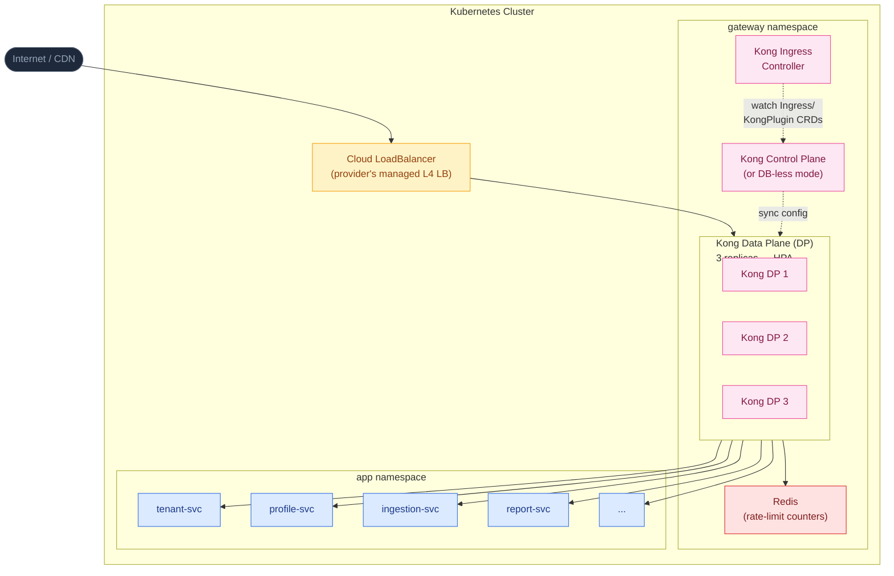
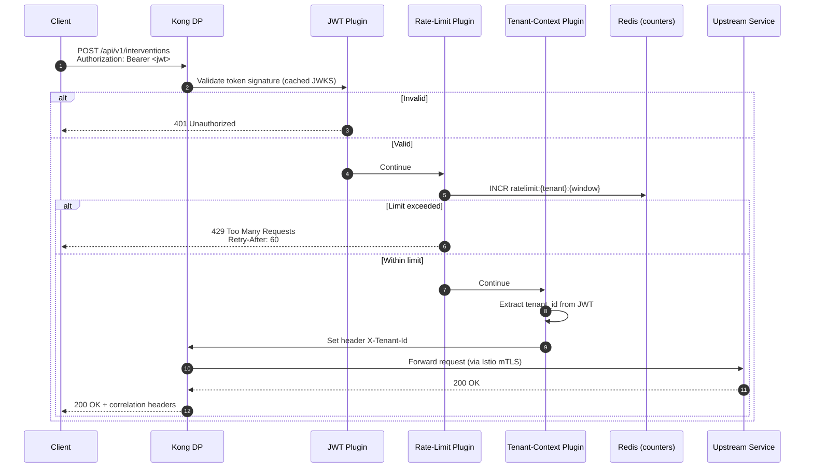
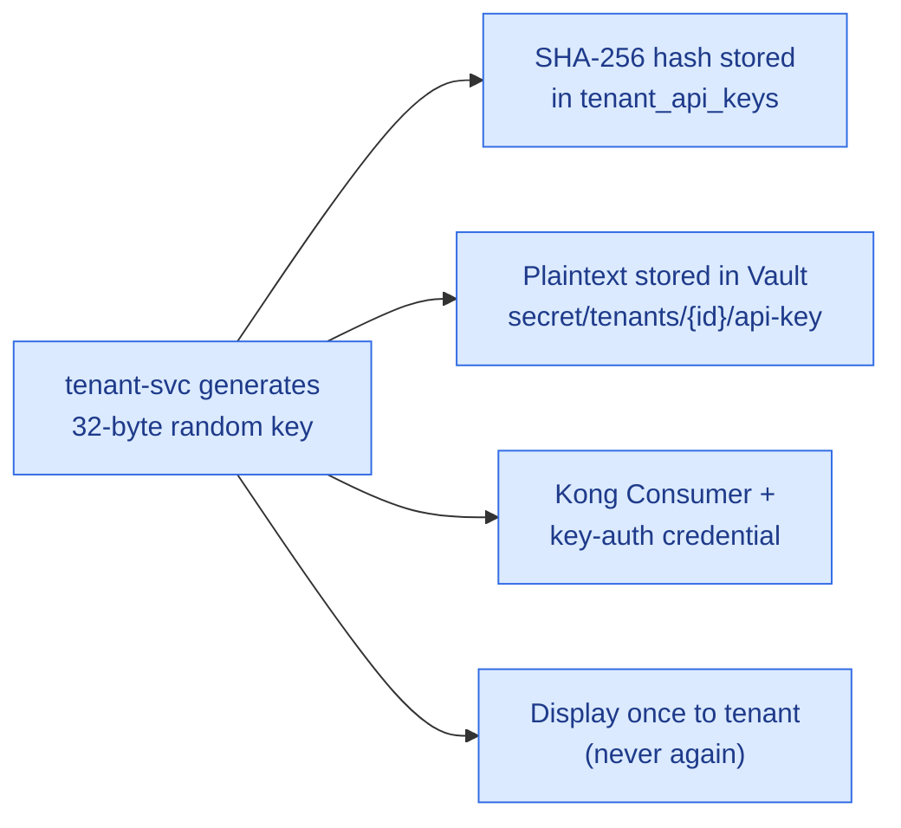

# 06 · API Gateway Design — Kong / Envoy

> The platform uses an **industry-standard API gateway** with full JWT validation, per-tenant rate limiting, request routing, plugin extensibility, and developer-portal capability. The reference implementation is **Kong Gateway** with **Envoy Gateway** as a fully supported alternative. Both are cloud-portable; either can be self-hosted in Kubernetes or substituted with the cloud provider's managed API gateway service at deployment time.

---

## 1. Why Kong (or Envoy)?

| Feature | Kong Gateway *(reference)* | Envoy Gateway *(alternative)* | Cloud-Provider Managed API Gateway |
|---|---|---|---|
| **Runtime** | Lua on OpenResty / NGINX | C++ (high performance) | Vendor-managed |
| **K8s-Native** | Yes (Kong Ingress Controller) | Yes (implements K8s Gateway API) | No (separate vendor service) |
| **JWT Validation** | `jwt` plugin | Built-in filter | Built-in |
| **Rate Limiting per Key** | `rate-limiting-advanced` (Redis-backed) | Custom filter / `local_ratelimit` | Built-in |
| **Custom Plugins** | Lua, Go, Python, JS | C++, WASM | Vendor-specific policies |
| **Developer Portal** | Built-in (Kong Manager / Konnect) | None native; pair with SwaggerUI | Built-in |
| **Cost** | OSS free; Enterprise optional | OSS free | Per-call billing (usually ~$700-$1,200+/mo at typical scale) |
| **Vendor Lock-in** | None | None | Total (vendor-specific) |
| **Industry Recognition** | Very high (used by GitHub, Cisco, NASA) | High (powers Istio, AWS App Mesh) | High (each vendor) |

> **The reference implementation uses Kong** for its mature developer portal, plugin ecosystem, and rate-limiting capabilities. **Envoy Gateway** is an excellent alternative — particularly for teams already invested in Envoy or Istio. Both are widely recognized in the industry and have deep talent pools.

---

## 2. Gateway Topology



---

## 3. Tenant Subscription Tier Mapping

| Tier | Kong Consumer Group | Plugins Applied | Rate Limit | Features |
|---|---|---|---|---|
| **basic-tier** | `cg-basic` | `rate-limiting-advanced`, `jwt`, `request-validator` | 100 req/min, 50K/day | Core APIs only |
| **professional-tier** | `cg-professional` | + `proxy-cache`, `correlation-id` | 1,000 req/min, 1M/day | All APIs incl. SMS, webhooks |
| **enterprise-tier** | `cg-enterprise` | + `bot-detection`, `acl` | Fair-use (no hard limit) | All APIs, custom integrations |
| **platform-admin** | `cg-admin` | `key-auth`, `acl` | Internal only | Super admin endpoints |

---

## 4. Kong Configuration (Declarative)

### 4.1 Plugin Setup — JWT Validation

```yaml
apiVersion: configuration.konghq.com/v1
kind: KongPlugin
metadata:
  name: jwt-keycloak-validation
  namespace: gateway
plugin: jwt
config:
  uri_param_names: [jwt]
  claims_to_verify: [exp, nbf]
  key_claim_name: kid
  secret_is_base64: false
  run_on_preflight: true
```

### 4.2 Plugin Setup — Rate Limiting per Tenant

```yaml
apiVersion: configuration.konghq.com/v1
kind: KongPlugin
metadata:
  name: rate-limit-by-tenant
  namespace: gateway
plugin: rate-limiting-advanced
config:
  limit: [1000]
  window_size: [60]
  identifier: header
  header_name: X-Tenant-Id
  strategy: redis
  redis:
    host: redis.data
    port: 6379
  sync_rate: 0     # 0 = strict mode, no eventual consistency
```

### 4.3 Plugin — Inject Tenant Context

Custom plugin written in Lua to extract `tenant_id` from JWT and inject as header for backend RLS:

```lua
-- kong-plugin-tenant-context
local jwt_decoder = require "kong.plugins.jwt.jwt_parser"

local TenantContextHandler = {
  VERSION = "1.0.0",
  PRIORITY = 999,  -- runs after jwt plugin
}

function TenantContextHandler:access(conf)
  local auth_header = kong.request.get_header("authorization")
  if not auth_header then return end
  local token = string.gsub(auth_header, "Bearer ", "")
  local jwt, err = jwt_decoder:new(token)
  if not jwt then return end
  local tenant_id = jwt.claims.tenant_id
  if tenant_id then
    kong.service.request.set_header("X-Tenant-Id", tenant_id)
  end
end

return TenantContextHandler
```

### 4.4 Ingress Route Definition

```yaml
apiVersion: networking.k8s.io/v1
kind: Ingress
metadata:
  name: profile-api
  namespace: gateway
  annotations:
    konghq.com/plugins: jwt-keycloak-validation,rate-limit-by-tenant,tenant-context
    konghq.com/protocols: "https"
spec:
  ingressClassName: kong
  rules:
    - host: api.platform.com
      http:
        paths:
          - path: /api/v1/employees
            pathType: Prefix
            backend:
              service:
                name: profile-svc
                port:
                  number: 8080
```

---

## 5. API Endpoints Mapping

| Endpoint Group | Path | Methods | Upstream Service | Plugins Applied |
|---|---|---|---|---|
| Tenant Management | `/api/v1/tenants` | GET, POST, PUT, DELETE | `tenant-svc` | jwt, rate-limit, audit-log |
| SSO Configuration | `/api/v1/tenants/{id}/sso` | GET, PUT | `identity-svc` | jwt, rate-limit, audit-log |
| Data Ingestion | `/api/v1/ingest/{type}` | POST | `ingestion-svc` | key-auth, rate-limit (high), request-size-limit |
| Employee Profiles | `/api/v1/employees/{id}/profile` | GET | `profile-svc` | jwt, rate-limit, proxy-cache |
| Risk Rules | `/api/v1/rules` | GET, POST, PUT, DELETE | `rules-svc` | jwt, rate-limit, audit-log |
| Risk Assessments | `/api/v1/assessments` | GET | `risk-engine-api` | jwt, rate-limit |
| Interventions | `/api/v1/interventions` | GET, POST, PATCH | `intervention-svc` | jwt, rate-limit, audit-log |
| Reports | `/api/v1/reports` | GET, POST | `report-svc` | jwt, rate-limit (lower), request-validator |
| Dashboards | `/api/v1/dashboards/{role}` | GET | `dashboard-api` | jwt, rate-limit, proxy-cache |
| Audit Trail | `/api/v1/audit` | GET | `audit-api` | jwt (admin only), rate-limit |
| Subscriptions | `/api/v1/subscriptions` | GET, PUT | `billing-svc` | jwt (admin only), rate-limit, audit-log |
| Notifications | `/api/v1/notifications` | GET | `notification-api` | jwt, rate-limit |

---

## 6. Request Flow Through Kong



---

## 7. Per-Tenant API Key Auth (UC-05 External Systems)

External LMS / Attendance / Assessment APIs do **not** use Keycloak JWT — they use **API keys** issued at tenant onboarding.

### 7.1 API Key Lifecycle



### 7.2 Kong Consumer Per Tenant

```yaml
apiVersion: configuration.konghq.com/v1
kind: KongConsumer
metadata:
  name: tenant-acme-corp
  namespace: gateway
  annotations:
    kubernetes.io/ingress.class: kong
username: acme-corp
custom_id: 550e8400-e29b-41d4-a716-446655440000  # tenant_id
credentials:
  - acme-key-auth-secret
---
apiVersion: v1
kind: Secret
metadata:
  name: acme-key-auth-secret
  namespace: gateway
type: Opaque
stringData:
  kongCredType: key-auth
  key: "sk_acme_live_xyz123abc456def789"  # Or use auto-generated
```

### 7.3 Plugin — Key Auth + Rate Limit

```yaml
apiVersion: configuration.konghq.com/v1
kind: KongPlugin
metadata:
  name: ingestion-key-auth
plugin: key-auth
config:
  key_names: [X-API-Key, apikey]
  key_in_body: false
  hide_credentials: true
```

The ingestion endpoint applies both `key-auth` and a separate higher rate limit:

```yaml
apiVersion: networking.k8s.io/v1
kind: Ingress
metadata:
  name: ingestion-api
  annotations:
    konghq.com/plugins: ingestion-key-auth,rate-limit-ingestion,request-size-limit
spec:
  rules:
    - host: api.platform.com
      http:
        paths:
          - path: /api/v1/ingest
            pathType: Prefix
            backend:
              service:
                name: ingestion-svc
                port:
                  number: 8080
```

---

## 8. Developer Portal

Kong Manager (free) or Konnect (SaaS) provides a developer portal where tenant admins can:

- View their API keys (re-rotate)
- View OpenAPI spec for all endpoints
- View usage analytics (req/day, errors)
- Subscribe webhooks

Alternative cloud-native option: **Backstage** (Spotify OSS) with the Kong plugin.

---

## 9. Custom Plugins to Build

| Plugin | Purpose | Language |
|---|---|---|
| `tenant-context` | Extract `tenant_id` from JWT and inject header | Lua |
| `tier-enforcement` | Block requests if tier-disallowed endpoint | Lua |
| `audit-log` | Stream every request to Kafka audit topic | Lua + Kafka producer |
| `gdpr-redaction` | Redact PII fields from response logs | Lua |
| `request-correlation` | Inject `X-Request-Id` (if not present) for distributed tracing | Lua |

---

## 10. Failure Modes & Resilience

| Failure | Behavior | Mitigation |
|---|---|---|
| **Redis down** | Rate limiting falls back to local counters; slight over-limit possible | Redis Sentinel HA + multi-AZ |
| **Keycloak down** | JWT validation fails for new requests; cached JWKS allows existing tokens until expiry | Keycloak HA (3 replicas) + 5min JWKS cache |
| **Upstream service down** | Kong returns 503; circuit breaker opens after N failures | Health checks + multiple replicas + service mesh retry |
| **Kong DP overloaded** | HPA scales replicas | HPA on CPU 60% + PodDisruptionBudget |
| **Single Kong DP crash** | LoadBalancer routes around it; PDB keeps min replicas | LB health checks every 5s |

---

## 11. Alternative: Envoy Gateway (K8s Gateway API)

For teams adopting the new **Gateway API** standard (replacing Ingress), Envoy Gateway is the recommended choice:

```yaml
apiVersion: gateway.networking.k8s.io/v1
kind: Gateway
metadata:
  name: learning-gateway
spec:
  gatewayClassName: envoy
  listeners:
    - name: https
      protocol: HTTPS
      port: 443
      tls:
        mode: Terminate
        certificateRefs:
          - name: platform-tls

---
apiVersion: gateway.networking.k8s.io/v1
kind: HTTPRoute
metadata:
  name: profile-api
spec:
  parentRefs: [{ name: learning-gateway }]
  hostnames: [api.platform.com]
  rules:
    - matches:
        - path:
            type: PathPrefix
            value: /api/v1/employees
      backendRefs:
        - name: profile-svc
          port: 8080
      filters:
        - type: ExtensionRef
          extensionRef:
            group: gateway.envoyproxy.io
            kind: SecurityPolicy
            name: jwt-keycloak
```

The choice between Kong and Envoy Gateway is primarily about:
- **Plugin ecosystem maturity** → Kong wins today
- **Performance ceiling** → Envoy wins (C++ vs Lua)
- **Future-proofing on Gateway API** → Envoy Gateway is purpose-built for it
