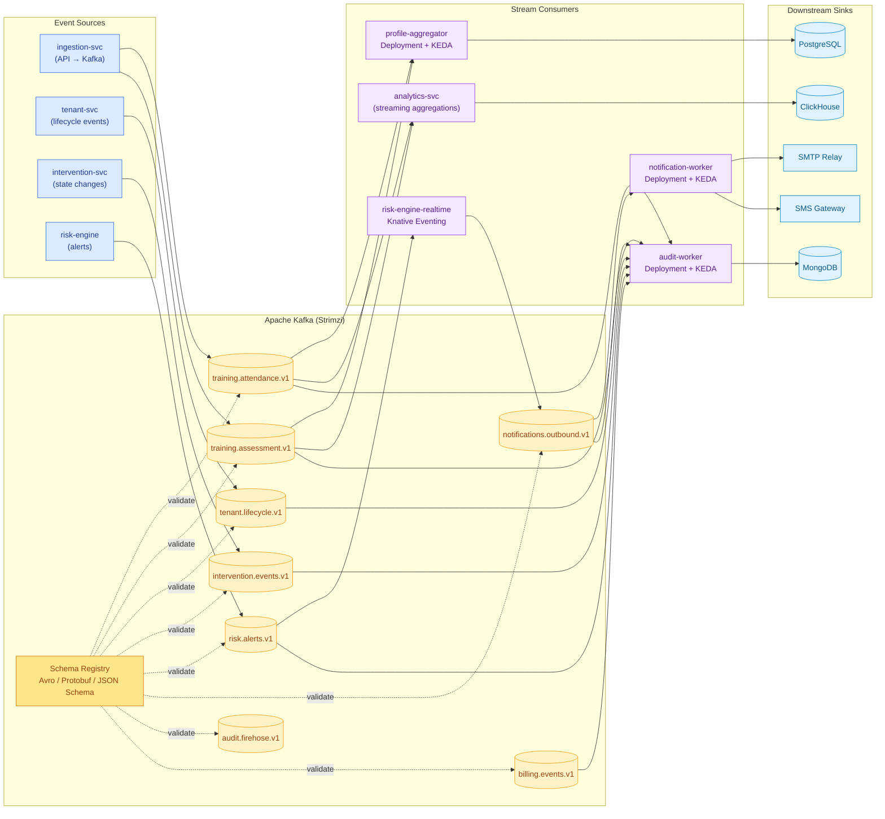
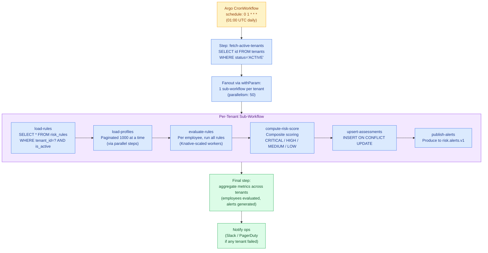
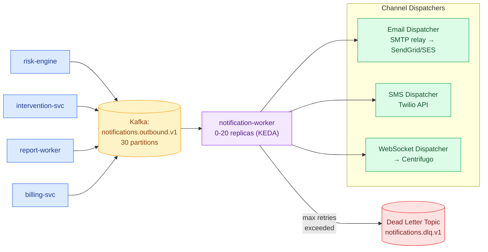
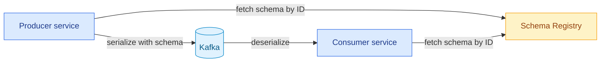
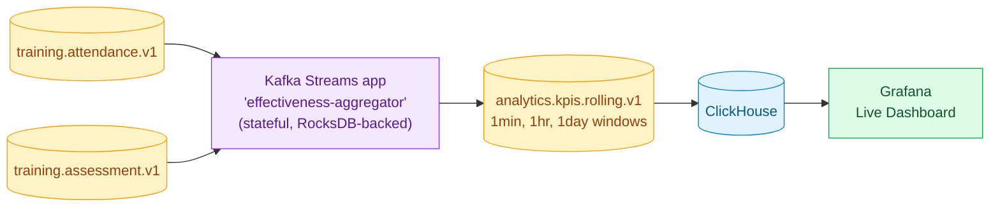

# 07 · Batch Processing & Event-Driven Architecture

> The platform uses **Apache Kafka** — the industry-standard event-streaming platform — for both async messaging and event streaming, with **Knative + KEDA + Argo Workflows** for serverless workloads, autoscaling, and stateful workflows. Kafka can be deployed as a managed service from the chosen cloud provider, or self-hosted via the Strimzi operator in Kubernetes; the application code is identical.

---

## 1. Component Roles

| Component | Purpose | Deployment Pattern |
|---|---|---|
| **Apache Kafka** | Async messaging + event streaming (unified) | Cloud-provider managed Kafka *(recommended)* or self-hosted via Strimzi operator |
| **Knative Eventing** | CloudEvents-based routing, source/sink abstraction | Self-managed in cluster |
| **KEDA** | Scale workers from zero based on queue depth | Self-managed in cluster |
| **Argo Workflows** | Stateful, multi-step workflows with retries | Self-managed in cluster |
| **Knative Serving** | Scale-to-zero HTTP services | Self-managed in cluster |

> All components above are industry-standard. **Kafka** is run at scale by LinkedIn, Netflix, Uber, Goldman Sachs, and most of the Fortune 100; **Knative** is the standard for K8s-native serverless (used by IBM Cloud, SAP, and others); **KEDA** is a CNCF graduated project widely deployed at enterprise scale.

---

## 2. Event Streaming Architecture



---

## 3. UC-08 — Nightly Risk Evaluation Workflow

### 3.1 High-Level Flow



### 3.2 Full Argo CronWorkflow Manifest

```yaml
apiVersion: argoproj.io/v1alpha1
kind: CronWorkflow
metadata:
  name: nightly-risk-evaluation
  namespace: batch
spec:
  schedule: "0 1 * * *"
  timezone: "UTC"
  concurrencyPolicy: Forbid
  successfulJobsHistoryLimit: 3
  failedJobsHistoryLimit: 5
  workflowSpec:
    entrypoint: evaluate-all-tenants
    serviceAccountName: risk-engine-sa
    parallelism: 50
    activeDeadlineSeconds: 7200    # 2hr SLA
    podGC:
      strategy: OnWorkflowSuccess

    templates:
      - name: evaluate-all-tenants
        steps:
          - - name: fetch-tenants
              template: fetch-active-tenants
          - - name: per-tenant
              template: evaluate-tenant
              arguments:
                parameters:
                  - name: tenant-id
                    value: "{{item}}"
              withParam: "{{steps.fetch-tenants.outputs.result}}"
          - - name: summary
              template: aggregate-metrics
              arguments:
                parameters:
                  - name: results
                    value: "{{steps.per-tenant.outputs.result}}"

      - name: fetch-active-tenants
        script:
          image: harbor.platform.com/learning/risk-engine:1.0.0
          command: [python]
          source: |
            import psycopg2, json
            conn = psycopg2.connect(os.environ["DATABASE_URL"])
            cur = conn.cursor()
            cur.execute("SELECT id FROM tenants WHERE status='ACTIVE'")
            tenant_ids = [str(row[0]) for row in cur.fetchall()]
            print(json.dumps(tenant_ids))

      - name: evaluate-tenant
        inputs:
          parameters:
            - name: tenant-id
        retryStrategy:
          limit: 3
          retryPolicy: OnFailure
          backoff:
            duration: "30s"
            factor: 2
        container:
          image: harbor.platform.com/learning/risk-engine:1.0.0
          command: [python, /app/evaluate.py]
          args: ["--tenant-id={{inputs.parameters.tenant-id}}"]
          envFrom:
            - secretRef: { name: risk-engine-secrets }

      - name: aggregate-metrics
        inputs:
          parameters:
            - name: results
        container:
          image: harbor.platform.com/learning/risk-engine:1.0.0
          command: [python, /app/aggregate.py]
```

### 3.3 Per-Tenant Evaluation Logic

```python
def evaluate_tenant(tenant_id):
    with db.transaction():
        db.execute("SET LOCAL app.tenant_id = %s", (tenant_id,))

        rules = db.fetchall(
            "SELECT * FROM risk_rules WHERE tenant_id=%s AND is_active=true",
            (tenant_id,)
        )
        if not rules:
            return {"tenant_id": tenant_id, "skipped": True}

        job_id = db.fetchone(
            "INSERT INTO risk_evaluation_jobs "
            "(tenant_id, evaluation_date, status, started_at) "
            "VALUES (%s, CURRENT_DATE, 'RUNNING', NOW()) "
            "RETURNING id", (tenant_id,)
        )[0]

        alerts_generated = 0
        page_size = 1000
        offset = 0
        while True:
            profiles = db.fetchall(
                "SELECT * FROM employee_learning_profiles "
                "WHERE tenant_id=%s LIMIT %s OFFSET %s",
                (tenant_id, page_size, offset)
            )
            if not profiles:
                break

            for profile in profiles:
                fired_rules = []
                for rule in rules:
                    if evaluate_rule(rule, profile):
                        fired_rules.append({
                            "rule_id": rule["id"],
                            "rule_code": rule["rule_code"],
                            "severity": rule["severity"]
                        })

                risk_level = compute_composite_risk(fired_rules)
                previous = db.fetchone(
                    "SELECT risk_level FROM risk_assessments "
                    "WHERE tenant_id=%s AND employee_id=%s "
                    "ORDER BY assessed_at DESC LIMIT 1",
                    (tenant_id, profile["employee_id"])
                )

                db.execute(
                    "INSERT INTO risk_assessments "
                    "(tenant_id, employee_id, evaluation_job_id, "
                    " risk_level, rules_fired, previous_risk_level) "
                    "VALUES (%s, %s, %s, %s, %s::jsonb, %s)",
                    (tenant_id, profile["employee_id"], job_id,
                     risk_level, json.dumps(fired_rules),
                     previous[0] if previous else None)
                )

                if risk_level in ("CRITICAL", "HIGH"):
                    kafka_producer.send(
                        "risk.alerts.v1",
                        key=tenant_id.encode(),
                        value={
                            "tenant_id": tenant_id,
                            "employee_id": str(profile["employee_id"]),
                            "risk_level": risk_level,
                            "fired_rules": fired_rules,
                            "previous_level": previous[0] if previous else None,
                        }
                    )
                    alerts_generated += 1

            offset += page_size

        db.execute(
            "UPDATE risk_evaluation_jobs SET status='COMPLETED', "
            "completed_at=NOW(), alerts_generated=%s WHERE id=%s",
            (alerts_generated, job_id)
        )

    return {"tenant_id": tenant_id, "alerts": alerts_generated}
```

---

## 4. UC-05 — Real-Time Data Ingestion

```mermaid
sequenceDiagram
    autonumber
    participant EXT as External LMS
    participant K as Kong Gateway
    participant IG as ingestion-svc
    participant RD as Redis
    participant KAFKA as Kafka<br/>training.attendance.v1
    participant PA as profile-aggregator
    participant PG as PostgreSQL
    participant CACHE as Redis (profile cache)

    EXT->>K: POST /api/v1/ingest/attendance<br/>X-API-Key: sk_...<br/>{records: [...]}
    K->>K: Validate API key (Kong key-auth)
    K->>K: Rate limit (1000/min for Pro tier)
    K->>IG: Forward + X-Tenant-Id header
    IG->>IG: Validate schema (JSON Schema)
    IG->>RD: SETNX ingestion:idem:{tenant}:{req_id}
    alt Duplicate
        IG-->>EXT: 200 {status: duplicate}
    else New
        loop For each record
            IG->>KAFKA: Produce (partition key=tenant_id)
        end
        IG-->>EXT: 202 Accepted {received: N}
    end

    Note over KAFKA,PA: Async, parallel consumption
    KAFKA->>PA: Consume batch (50 records)
    PA->>PG: SET LOCAL app.tenant_id; INSERT records
    PA->>PG: Recompute employee_learning_profiles<br/>(UPSERT)
    PA->>CACHE: DEL profile:{tenant}:{employee_id}
    PA->>KAFKA: Commit consumer offset
```

### 4.1 KEDA Scaler for profile-aggregator

```yaml
apiVersion: keda.sh/v1alpha1
kind: ScaledObject
metadata:
  name: profile-aggregator-scaler
  namespace: app
spec:
  scaleTargetRef:
    name: profile-aggregator
  minReplicaCount: 0
  maxReplicaCount: 30
  pollingInterval: 15
  cooldownPeriod: 300
  triggers:
    - type: kafka
      metadata:
        bootstrapServers: kafka.data:9092
        consumerGroup: profile-aggregator-cg
        topic: training.attendance.v1
        lagThreshold: "100"
        offsetResetPolicy: latest
```

---

## 5. UC-11 — Async Report Generation

### 5.1 End-to-End Flow

```mermaid
sequenceDiagram
    autonumber
    participant U as User
    participant K as Kong
    participant API as report-svc (sync API)
    participant PG as PostgreSQL
    participant KAFKA as Kafka report.jobs
    participant KN as report-worker (Knative)
    participant MINIO as MinIO
    participant CENT as Centrifugo<br/>(WebSocket)

    U->>K: POST /api/v1/reports {type:PDF, period:Q3}
    K->>API: Forward (JWT validated)
    API->>PG: INSERT report_jobs (status=PENDING)
    API->>KAFKA: Produce {job_id, tenant_id, params}
    API-->>U: 202 Accepted {job_id, status_url}

    Note over KN: KEDA scales 0→N based on Kafka lag

    KAFKA->>KN: Consume job
    KN->>PG: SET LOCAL app.tenant_id; SELECT data
    KN->>KN: Render PDF (Gotenberg / wkhtmltopdf)
    KN->>MINIO: PUT reports/{tenant}/{job}.pdf
    MINIO-->>KN: ETag
    KN->>MINIO: Generate pre-signed URL (24h)
    KN->>PG: UPDATE report_jobs status=COMPLETED, url=?
    KN->>CENT: Publish to channel user:{user_id}
    CENT-->>U: WebSocket push "Report ready: [Download]"

    U->>API: GET /api/v1/reports/{job_id}
    API->>PG: SELECT * FROM report_jobs
    API-->>U: 200 {url, expires_at}
    U->>MINIO: GET <pre-signed URL>
    MINIO-->>U: PDF bytes
```

### 5.2 Knative Service for report-worker

```yaml
apiVersion: serving.knative.dev/v1
kind: Service
metadata:
  name: report-worker
  namespace: batch
spec:
  template:
    metadata:
      annotations:
        autoscaling.knative.dev/min-scale: "0"
        autoscaling.knative.dev/max-scale: "30"
        autoscaling.knative.dev/target: "5"   # 5 concurrent requests per pod
    spec:
      containerConcurrency: 5
      timeoutSeconds: 600
      containers:
        - image: harbor.platform.com/learning/report-worker:1.0.0
          resources:
            requests: { cpu: 500m, memory: 1Gi }
            limits:   { cpu: 2,    memory: 4Gi }
          env:
            - name: MINIO_ENDPOINT
              value: minio.data:9000
```

### 5.3 Knative Eventing — Kafka Source

```yaml
apiVersion: sources.knative.dev/v1beta1
kind: KafkaSource
metadata:
  name: report-jobs-source
  namespace: batch
spec:
  consumerGroup: report-worker-cg
  bootstrapServers: [kafka.data:9092]
  topics: [report.jobs.v1]
  sink:
    ref:
      apiVersion: serving.knative.dev/v1
      kind: Service
      name: report-worker
```

When a message lands on `report.jobs.v1`, Knative Eventing invokes the Knative service, which scales from 0 → N → 0 automatically.

---

## 6. Notification Dispatch Pipeline



### 6.1 Notification Message Schema

```json
{
  "schema_version": "1.0",
  "notification_id": "uuid",
  "tenant_id": "uuid",
  "user_id": "uuid",
  "type": "RISK_ALERT",
  "channels": ["EMAIL", "SMS", "IN_APP"],
  "tier_required": "PROFESSIONAL",
  "subject": "Critical: 3 learners need immediate attention",
  "body_text": "...",
  "body_html": "...",
  "metadata": {
    "intervention_id": "uuid",
    "risk_level": "CRITICAL"
  },
  "retry_count": 0,
  "max_retries": 5,
  "created_at": "2026-10-15T14:32:00Z"
}
```

### 6.2 Tier-Based Channel Filtering

The notification worker checks the tenant's tier and **drops disallowed channels** before dispatching:

```python
TIER_CHANNELS = {
    "BASIC": {"EMAIL"},
    "PROFESSIONAL": {"EMAIL", "SMS", "IN_APP"},
    "ENTERPRISE": {"EMAIL", "SMS", "IN_APP", "WEBHOOK"},
}

def filter_channels(tenant_tier, requested_channels):
    allowed = TIER_CHANNELS.get(tenant_tier, set())
    return [c for c in requested_channels if c in allowed]
```

---

## 7. Schema Registry & Evolution

All Kafka messages use **Avro schemas** registered in the Schema Registry (Confluent or Apicurio). This prevents producers from publishing breaking changes.



### Compatibility Mode

- **BACKWARD compatibility** is enforced — new schemas can only add optional fields. Removing fields requires a new topic version (`training.attendance.v2`).

---

## 8. Stream Processing for Real-Time Analytics

For UC-10 (Effectiveness Tracking) we use **Kafka Streams** (or **Apache Flink**) to compute rolling KPIs:



---

## 9. Why Kafka Over Vendor-Specific Queue + Event Services

Most cloud vendors offer **two separate services** — one for queues and another for event streaming. Kafka unifies both into a single technology that is portable across clouds.

| Capability | Vendor Queue Service | Vendor Event-Stream Service | Apache Kafka |
|---|---|---|---|
| Queue semantics | ✓ | — | ✓ (consumer group) |
| Topic / pub-sub | ✓ | ✓ | ✓ |
| Ordered delivery | ✓ (per session) | ✓ (per partition) | ✓ (per partition) |
| Exactly-once delivery | ✓ | — | ✓ (transactional API) |
| Message retention | Up to 14 days | Typically up to 7 days (longer with retention add-ons) | Configurable (effectively unlimited) |
| Throughput per partition | Lower | 1 MB/s | 10+ MB/s |
| Schema enforcement | None | None | Schema Registry |
| Stream processing | None | Vendor-specific (e.g., Stream Analytics) | Kafka Streams, Flink |
| Cost at scale (~1B msgs/mo) | ~$1,500 | ~$700 | ~$300 self-hosted; ~$600-900 managed |
| Portability | Vendor-locked | Vendor-locked | Same code runs on any cloud / on-prem |

**Conclusion:** Kafka replaces **both** queue and event-stream services with a single industry-standard technology. The result: lower operational surface, lower cost, and full cloud portability.
