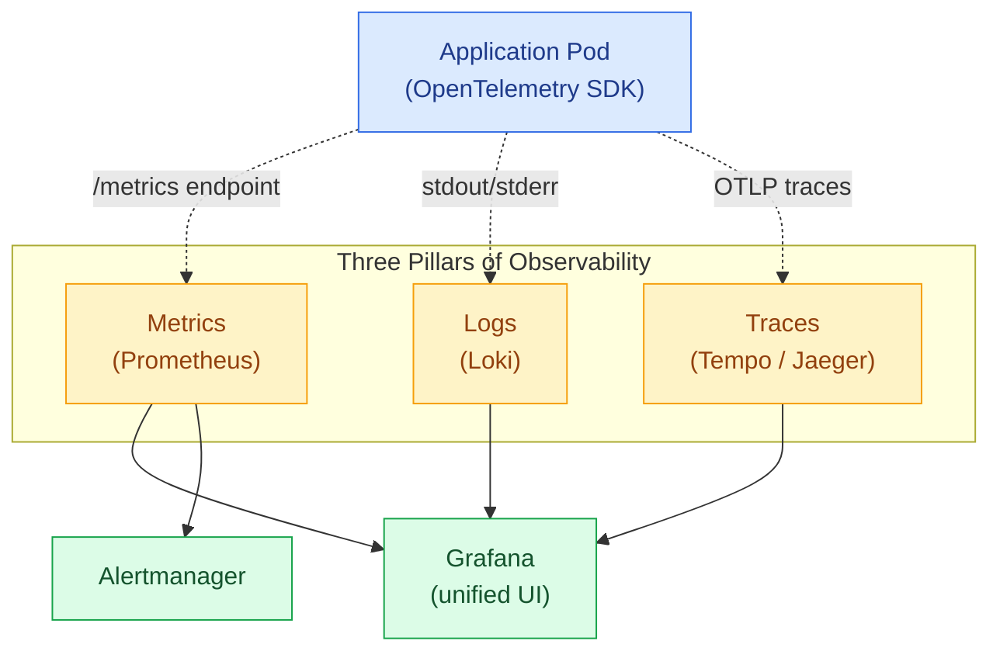
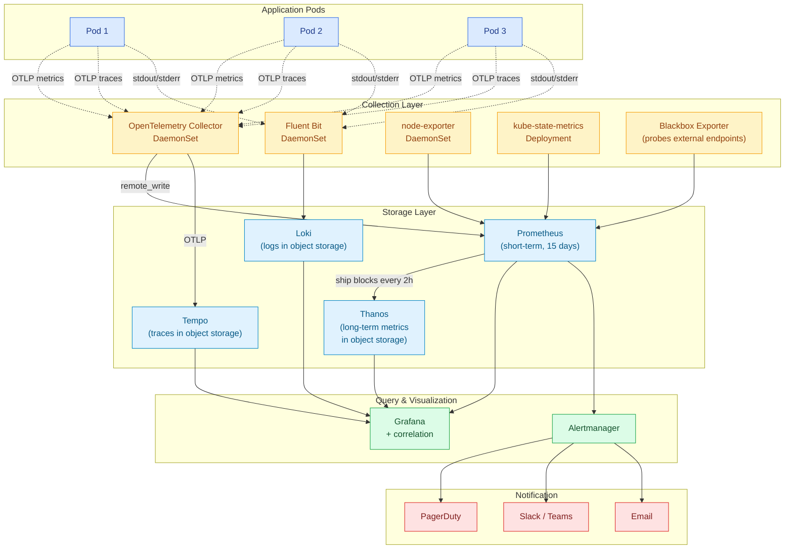
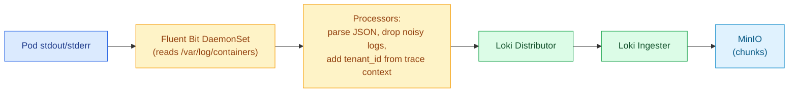
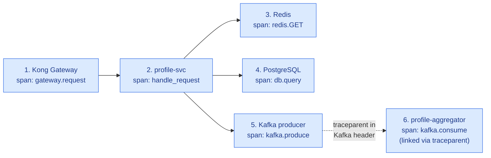
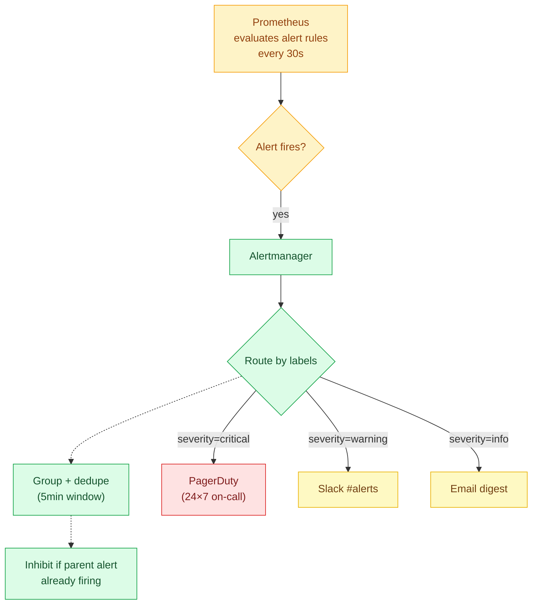
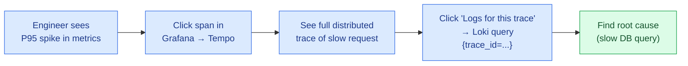

# 08 · Observability — The Three Pillars

> The platform's observability stack uses **OpenTelemetry** as the unified standard for instrumentation and **Prometheus + Grafana** as the recognized industry-standard metrics + dashboarding combination. Logs use **Loki** (or Elastic / OpenSearch) and traces use **Tempo** (or Jaeger). At the application layer, a **commercial error-tracking service** (e.g., Sentry) is recommended for developer-grade error visibility.

### Deployment Options

| Tier | Recommended Default | Commercial Alternative |
|---|---|---|
| **Metrics** | Prometheus + Grafana (self-managed) | Commercial APM (Datadog, New Relic, Dynatrace) — pay per host |
| **Logs** | Loki (self-managed) | Commercial log service (Datadog Logs, Splunk, Sumo Logic) |
| **Traces** | Tempo + OpenTelemetry (self-managed) | Commercial APM tracing (Datadog APM, Honeycomb, Lightstep) |
| **Error Tracking** | Sentry (self-hosted or SaaS) | Sentry SaaS, Rollbar, Bugsnag |
| **Synthetic Monitoring / Uptime** | Blackbox Exporter + Prometheus | Pingdom, Uptime.com, Datadog Synthetics |
| **On-Call / Alerting** | Alertmanager → email/Slack/PagerDuty | Commercial: PagerDuty, Opsgenie, VictorOps |

> Why the **OSS stack as the default?** Prometheus, Grafana, Loki, Tempo, and OpenTelemetry are **all industry-standard** — used by every Fortune 100 with a serious platform team. They cost only infrastructure to run. **Commercial APM** is recommended layered on top *if and when* the team wants developer-grade DX (Datadog) and is willing to pay for it; the application instrumentation does not change because everything is OpenTelemetry-native.

---

## 1. The Three Pillars



---

## 2. Full Observability Stack



---

## 3. Metrics — Prometheus + Thanos

### 3.1 What to Measure

#### RED Method (for every microservice)
- **R**ate — requests per second
- **E**rrors — error rate (%)
- **D**uration — request latency (P50, P95, P99)

#### USE Method (for every resource)
- **U**tilization — % busy
- **S**aturation — queue length
- **E**rrors — failures

### 3.2 Standard Metric Labels

Every metric **must** include these labels for proper aggregation and tenant attribution:

| Label | Example | Purpose |
|---|---|---|
| `service` | `profile-svc` | Service name |
| `tenant_id` | `550e8400-...` | Tenant attribution (sampled / hashed for high cardinality) |
| `tier` | `PROFESSIONAL` | Subscription tier |
| `endpoint` | `/api/v1/employees/profile` | API endpoint |
| `method` | `GET` | HTTP method |
| `status_code` | `200` | Response code |
| `pod` | `profile-svc-abc123` | Pod name (auto-injected) |
| `namespace` | `app` | K8s namespace |

> **High Cardinality Warning:** Avoid raw `tenant_id` on every metric — use `tenant_tier` as a low-cardinality label and reserve `tenant_id` for sampled/specific dashboards.

### 3.3 Sample Application Instrumentation (Python)

```python
from prometheus_client import Counter, Histogram, Gauge
from opentelemetry import trace, metrics

http_requests_total = Counter(
    "http_requests_total",
    "Total HTTP requests",
    ["service", "method", "endpoint", "status_code", "tier"]
)

http_request_duration_seconds = Histogram(
    "http_request_duration_seconds",
    "HTTP request duration",
    ["service", "method", "endpoint"],
    buckets=(0.01, 0.05, 0.1, 0.25, 0.5, 1, 2.5, 5, 10)
)

active_connections = Gauge(
    "active_connections",
    "Currently active connections",
    ["service"]
)

@app.middleware("http")
async def metrics_middleware(request, call_next):
    start = time.time()
    response = await call_next(request)
    duration = time.time() - start
    http_requests_total.labels(
        service="profile-svc",
        method=request.method,
        endpoint=request.url.path,
        status_code=str(response.status_code),
        tier=request.state.tenant_tier
    ).inc()
    http_request_duration_seconds.labels(
        service="profile-svc",
        method=request.method,
        endpoint=request.url.path
    ).observe(duration)
    return response
```

### 3.4 Prometheus Configuration

```yaml
apiVersion: monitoring.coreos.com/v1
kind: Prometheus
metadata:
  name: main
  namespace: observability
spec:
  replicas: 2
  retention: 15d
  serviceMonitorSelector: {}      # Pick up all ServiceMonitors
  podMonitorSelector: {}
  ruleSelector: {}
  resources:
    requests: { memory: 4Gi, cpu: 1 }
    limits:   { memory: 8Gi, cpu: 4 }
  storage:
    volumeClaimTemplate:
      spec:
        storageClassName: fast-ssd
        resources: { requests: { storage: 500Gi } }
  thanos:
    image: quay.io/thanos/thanos:v0.36.0
    objectStorageConfig:
      key: thanos.yaml
      name: thanos-objstore-config
```

### 3.5 ServiceMonitor — Scrape App Metrics

```yaml
apiVersion: monitoring.coreos.com/v1
kind: ServiceMonitor
metadata:
  name: profile-svc
  namespace: app
spec:
  selector:
    matchLabels: { app: profile-svc }
  endpoints:
    - port: metrics
      path: /metrics
      interval: 15s
```

---

## 4. Logs — Loki

### 4.1 Why Loki Over Elasticsearch

| Feature | Loki | Elasticsearch |
|---|---|---|
| Storage backend | S3-compatible object storage (cheap) | Local SSD (expensive) |
| Indexes | Labels only (small) | Full-text (large) |
| Query language | LogQL (PromQL-like) | KQL (proprietary) |
| Resource footprint | Low | Very high |
| Multi-tenancy | Native (tenant header) | Plugin / per-cluster |
| Cost at scale | $0.01/GB/mo | $0.30+/GB/mo |
| Best for | Cloud-native, Prometheus-aligned shops | Search-heavy, e-commerce |

### 4.2 Log Pipeline



### 4.3 Structured Logging Format

All application logs must be JSON for parseability:

```json
{
  "timestamp": "2026-10-15T14:32:00.123Z",
  "level": "INFO",
  "service": "profile-svc",
  "version": "1.2.3",
  "pod": "profile-svc-abc123",
  "trace_id": "4bf92f3577b34da6a3ce929d0e0e4736",
  "span_id": "00f067aa0ba902b7",
  "tenant_id": "550e8400-e29b-41d4-a716-446655440000",
  "user_id": "user-uuid",
  "endpoint": "/api/v1/employees/123/profile",
  "method": "GET",
  "status_code": 200,
  "duration_ms": 45,
  "msg": "Profile fetched successfully"
}
```

### 4.4 LogQL Sample Queries

```logql
# All errors for a specific tenant in the last hour
{namespace="app", tenant_id="550e8400-..."} |= "ERROR"

# 95th percentile latency by endpoint
quantile_over_time(0.95,
  {service="profile-svc"} | json | unwrap duration_ms [5m])

# Top 10 slowest endpoints
topk(10,
  avg by (endpoint) (
    {namespace="app"} | json | unwrap duration_ms
  )
)
```

---

## 5. Traces — Tempo / Jaeger

### 5.1 Distributed Tracing with OpenTelemetry

Every service is instrumented with OpenTelemetry SDK. Traces propagate automatically through HTTP headers (`traceparent`) and Kafka headers.



### 5.2 Tempo Configuration

```yaml
apiVersion: v1
kind: ConfigMap
metadata:
  name: tempo-config
  namespace: observability
data:
  tempo.yaml: |
    server:
      http_listen_port: 3200
    distributor:
      receivers:
        otlp:
          protocols:
            grpc: { endpoint: 0.0.0.0:4317 }
            http: { endpoint: 0.0.0.0:4318 }
    storage:
      trace:
        backend: s3
        s3:
          endpoint: minio.data:9000
          bucket: tempo-traces
          insecure: true
        wal:
          path: /var/tempo/wal
    compactor:
      compaction:
        block_retention: 720h   # 30 days
```

### 5.3 Trace Sampling Strategy

| Tier | Sampling Rate |
|---|---|
| Health checks | 0% |
| Errors (5xx) | 100% |
| Slow requests (>500ms) | 100% |
| Normal requests | 1% (tail-based sampling) |

Configured via OpenTelemetry Collector's `tail_sampling` processor.

---

## 6. Alerting — Alertmanager

### 6.1 Alert Hierarchy



### 6.2 Critical Alert Rules

```yaml
groups:
  - name: api-slos
    rules:
      - alert: APIHighErrorRate
        expr: |
          sum(rate(http_requests_total{status_code=~"5.."}[5m])) by (service)
          /
          sum(rate(http_requests_total[5m])) by (service)
          > 0.01
        for: 5m
        labels: { severity: critical }
        annotations:
          summary: "{{ $labels.service }} error rate >1%"
          runbook_url: "https://wiki/runbooks/api-errors"

      - alert: APIHighLatencyP95
        expr: |
          histogram_quantile(0.95,
            sum(rate(http_request_duration_seconds_bucket[5m])) by (service, le)
          ) > 0.2
        for: 5m
        labels: { severity: warning }
        annotations:
          summary: "{{ $labels.service }} P95 latency > 200ms"

      - alert: RiskBatchJobFailed
        expr: argo_workflow_status{name=~"nightly-risk-evaluation-.*", phase="Failed"} > 0
        for: 1m
        labels: { severity: critical }

      - alert: PostgreSQLHighCPU
        expr: pg_stat_database_blks_hit_ratio < 0.95
        for: 10m
        labels: { severity: warning }

      - alert: KafkaConsumerLagHigh
        expr: kafka_consumergroup_lag > 10000
        for: 5m
        labels: { severity: warning }
```

---

## 7. Dashboards — Grafana

### 7.1 Standard Dashboards

| Dashboard | Audience | Key Panels |
|---|---|---|
| **Platform Overview** | Ops + Leadership | Total tenants, P95 latency, error rate, MAU |
| **Per-Tenant Health** | Customer Success + Tenant Admin | Tenant API usage, error rate, last activity |
| **Service Detail** | Engineering | RED metrics per service + dependencies |
| **Database Health** | DBA | Connection pool, slow queries, cache hit ratio |
| **Kafka Health** | Engineering | Lag, throughput, broker disk usage |
| **Cost & Resource** | FinOps | Pod CPU/mem usage, storage growth, K8s costs |
| **Security & Compliance** | Security | Failed logins, MFA usage, audit log volume |

### 7.2 Grafana Auto-Provisioning

Dashboards stored in Git, synced via ConfigMap + Grafana's file provider:

```yaml
apiVersion: v1
kind: ConfigMap
metadata:
  name: grafana-dashboards
  namespace: observability
data:
  platform-overview.json: |
    { "dashboard": { ... } }
```

ArgoCD applies the ConfigMap; Grafana picks it up automatically.

---

## 8. Service-Level Objectives (SLOs)

Define SLOs as code using **Sloth** or **OpenSLO**:

```yaml
# Using Sloth (https://sloth.dev)
apiVersion: sloth.slok.dev/v1
kind: PrometheusServiceLevel
metadata:
  name: profile-svc-slos
  namespace: app
spec:
  service: profile-svc
  labels: { team: platform }
  slos:
    - name: availability
      objective: 99.9
      sli:
        events:
          error_query: 'sum(rate(http_requests_total{service="profile-svc",status_code=~"5.."}[5m]))'
          total_query: 'sum(rate(http_requests_total{service="profile-svc"}[5m]))'
      alerting:
        page_alert: { labels: { severity: critical } }
        ticket_alert: { labels: { severity: warning } }

    - name: latency
      objective: 95.0
      sli:
        events:
          error_query: 'sum(rate(http_request_duration_seconds_count{service="profile-svc",le="0.2"}[5m]))'
          total_query: 'sum(rate(http_request_duration_seconds_count{service="profile-svc"}[5m]))'
```

Sloth auto-generates **error budgets** and **burn rate alerts**.

---

## 9. Correlation Across Pillars

The killer feature of this stack: **single pane of glass with correlation**.



Grafana automatically adds **"View logs for this trace"** buttons because logs include `trace_id` field that links to Loki, and Tempo links spans to source code/services. This was previously only possible with expensive APM vendors.

---

## 10. Cost Comparison

| Component | Azure (1B logs + traces /mo) | Cloud-Native (self-hosted) |
|---|---|---|
| Metrics | $200-400 (App Insights) | $50 (MinIO storage) |
| Logs | $300+ (Log Analytics @ $2.30/GB) | $30 (MinIO storage) |
| Traces | $100 (App Insights sampled) | $20 (MinIO storage) |
| Dashboards | Included | Grafana free |
| Alerts | Included | Alertmanager free |
| Total | **$600-800/mo** | **~$100/mo + 0.5 vCPU compute** |

> Trade-off: Self-hosted requires operational expertise. For small teams, **Grafana Cloud** ($299/mo) provides the same stack as managed SaaS while staying portable.
