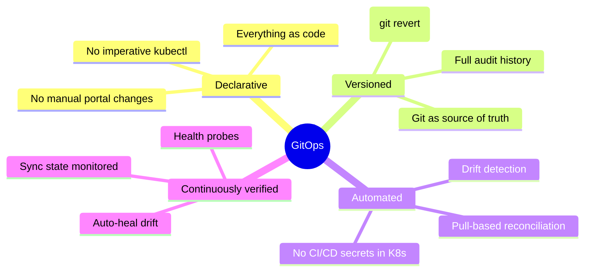
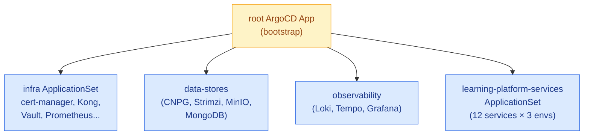
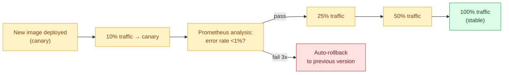
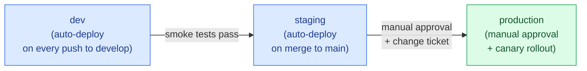
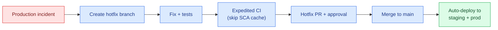

# 09 · CI/CD & DevOps — GitOps Pipeline

> The platform uses a **GitOps-native pipeline** built on industry-standard tools: **GitHub Actions** (or Tekton) for CI and **Argo CD** for CD. The Git repository is the **single source of truth** — direct `kubectl` access to clusters is forbidden. Both tools are widely adopted across the industry with deep talent pools.

---

## 1. GitOps Principles



### Two Key Repositories

| Repo | Purpose | Who Updates |
|---|---|---|
| **Application Repo** (`learning-platform/`) | Source code per microservice | Developers via PRs |
| **Config Repo** (`learning-platform-config/`) | Helm values, Kustomize overlays, image tags per environment | CI auto-updates; humans on rare manual ops |

> ArgoCD watches **only the config repo** and applies changes to clusters.

---

## 2. Full Pipeline Architecture

```mermaid
flowchart LR
    DEV["Developer"]
    APP_REPO["learning-platform/<br/>(application code)"]
    CONFIG_REPO["learning-platform-config/<br/>(K8s manifests, Helm values)"]

    subgraph CI["CI Pipeline (Tekton / GitHub Actions)"]
        LINT["Lint + Format"]
        UT["Unit Tests<br/>(>80% coverage)"]
        SAST["SAST<br/>Semgrep + SonarQube"]
        SCA["SCA<br/>OWASP Dependency-Check"]
        BUILD["Docker Build<br/>(buildx, multi-arch)"]
        IMG_SCAN["Image Scan<br/>(Trivy + Grype)"]
        SBOM["Generate SBOM<br/>(CycloneDX / Syft)"]
        SIGN["Sign Image<br/>(Cosign + Keyless)"]
        PUSH["Push to Harbor"]
        E2E["Integration Tests<br/>(Testcontainers)"]
        BUMP["Auto-bump tag in<br/>config repo<br/>(via PR or Renovate)"]
    end

    HARBOR[("Harbor Registry<br/>+ vulnerability DB<br/>+ Notary signatures")]

    subgraph CD["CD Pipeline (ArgoCD)"]
        ARGOCD["ArgoCD"]
        APPSET["ApplicationSet<br/>(generates 1 App<br/>per env × per service)"]
        SYNC["Sync to clusters"]
    end

    subgraph CLUSTERS["Target Clusters"]
        DEV_K["dev cluster"]
        STG_K["staging cluster"]
        PROD_US["prod-us cluster"]
        PROD_EU["prod-eu cluster"]
    end

    subgraph PROGRESSIVE["Progressive Delivery"]
        ROLLOUT["Argo Rollouts<br/>Canary 10→50→100%"]
        ANALYSIS["Flagger / Prometheus<br/>SLO analysis"]
        AUTO["Auto-promote<br/>or auto-rollback"]
    end

    DEV --> APP_REPO
    APP_REPO --> LINT --> UT --> SAST --> SCA --> BUILD --> IMG_SCAN
    IMG_SCAN --> SBOM --> SIGN --> PUSH --> HARBOR
    HARBOR --> BUMP --> CONFIG_REPO
    BUILD --> E2E
    CONFIG_REPO --> ARGOCD --> APPSET --> SYNC
    SYNC --> DEV_K & STG_K & PROD_US & PROD_EU
    PROD_US & PROD_EU --> ROLLOUT --> ANALYSIS --> AUTO

    classDef dev fill:#f1f5f9,color:#1e293b,stroke:#64748b
    classDef repo fill:#fef3c7,color:#92400e,stroke:#f59e0b
    classDef ci fill:#dbeafe,color:#1e3a8a,stroke:#326ce5
    classDef reg fill:#dcfce7,color:#14532d,stroke:#16a34a
    classDef cd fill:#f3e8ff,color:#581c87,stroke:#9333ea
    classDef cluster fill:#e0f2fe,color:#075985,stroke:#0284c7
    classDef prog fill:#fce7f3,color:#831843,stroke:#ec4899

    class DEV dev
    class APP_REPO,CONFIG_REPO repo
    class LINT,UT,SAST,SCA,BUILD,IMG_SCAN,SBOM,SIGN,PUSH,E2E,BUMP ci
    class HARBOR reg
    class ARGOCD,APPSET,SYNC cd
    class DEV_K,STG_K,PROD_US,PROD_EU cluster
    class ROLLOUT,ANALYSIS,AUTO prog
```



---

## 3. CI Pipeline — GitHub Actions Example

```yaml
# .github/workflows/ci.yml
name: CI Pipeline
on:
  push:
    branches: [main, develop, "feature/**"]
  pull_request:

jobs:
  lint:
    runs-on: ubuntu-latest
    steps:
      - uses: actions/checkout@v4
      - uses: actions/setup-python@v5
        with: { python-version: "3.12" }
      - run: pip install ruff mypy
      - run: ruff check .
      - run: mypy .

  test:
    runs-on: ubuntu-latest
    services:
      postgres:
        image: postgres:16
        env: { POSTGRES_PASSWORD: test }
        ports: ["5432:5432"]
      redis:
        image: redis:7
        ports: ["6379:6379"]
    steps:
      - uses: actions/checkout@v4
      - uses: actions/setup-python@v5
      - run: pip install -r requirements.txt
      - run: pytest --cov=. --cov-report=xml --cov-fail-under=80
      - uses: codecov/codecov-action@v4

  sast:
    runs-on: ubuntu-latest
    steps:
      - uses: actions/checkout@v4
      - uses: returntocorp/semgrep-action@v1
        with: { config: "p/owasp-top-ten p/python" }
      - uses: SonarSource/sonarqube-scan-action@master
        env: { SONAR_TOKEN: ${{ secrets.SONAR_TOKEN }} }

  sca:
    runs-on: ubuntu-latest
    steps:
      - uses: actions/checkout@v4
      - uses: dependency-check/Dependency-Check_Action@main
        with:
          project: "learning-platform"
          path: "."
          format: "ALL"
          args: --failOnCVSS 7

  build-and-push:
    if: github.event_name == 'push' && github.ref == 'refs/heads/main'
    needs: [lint, test, sast, sca]
    runs-on: ubuntu-latest
    permissions:
      contents: read
      id-token: write    # for keyless cosign signing
    steps:
      - uses: actions/checkout@v4
      - uses: docker/setup-buildx-action@v3

      - name: Login to Harbor
        uses: docker/login-action@v3
        with:
          registry: harbor.platform.com
          username: ${{ secrets.HARBOR_USER }}
          password: ${{ secrets.HARBOR_PASS }}

      - name: Generate version
        id: ver
        run: echo "tag=$(git rev-parse --short HEAD)" >> $GITHUB_OUTPUT

      - name: Build and push
        id: build
        uses: docker/build-push-action@v5
        with:
          context: .
          push: true
          platforms: linux/amd64,linux/arm64
          tags: harbor.platform.com/learning/profile-svc:${{ steps.ver.outputs.tag }}
          cache-from: type=registry,ref=harbor.platform.com/learning/profile-svc:buildcache
          cache-to: type=registry,ref=harbor.platform.com/learning/profile-svc:buildcache,mode=max

      - name: Scan image
        uses: aquasecurity/trivy-action@master
        with:
          image-ref: harbor.platform.com/learning/profile-svc:${{ steps.ver.outputs.tag }}
          format: 'sarif'
          severity: 'CRITICAL,HIGH'
          exit-code: '1'

      - name: Generate SBOM
        uses: anchore/sbom-action@v0
        with:
          image: harbor.platform.com/learning/profile-svc:${{ steps.ver.outputs.tag }}
          format: cyclonedx-json

      - name: Sign image (keyless)
        uses: sigstore/cosign-installer@v3
      - run: cosign sign --yes harbor.platform.com/learning/profile-svc@${{ steps.build.outputs.digest }}

      - name: Bump tag in config repo
        env:
          GH_TOKEN: ${{ secrets.CONFIG_REPO_TOKEN }}
        run: |
          gh repo clone org/learning-platform-config
          cd learning-platform-config
          yq -i '.image.tag = "${{ steps.ver.outputs.tag }}"' \
            apps/profile-svc/values-dev.yaml
          git config user.email "ci@platform.com"
          git config user.name "CI Bot"
          git commit -am "chore(profile-svc): bump dev image to ${{ steps.ver.outputs.tag }}"
          git push
```

---

## 4. CD Pipeline — ArgoCD

### 4.1 ApplicationSet (one definition → many environments)

```yaml
apiVersion: argoproj.io/v1alpha1
kind: ApplicationSet
metadata:
  name: learning-platform-services
  namespace: argocd
spec:
  generators:
    - matrix:
        generators:
          - list:
              elements:
                - { service: tenant-svc }
                - { service: identity-svc }
                - { service: profile-svc }
                - { service: rules-svc }
                - { service: intervention-svc }
                - { service: report-svc }
                - { service: dashboard-api }
                - { service: ingestion-svc }
                - { service: notification-worker }
                - { service: audit-worker }
                - { service: billing-svc }
          - list:
              elements:
                - { env: dev, autoSync: true,  cluster: dev-cluster   }
                - { env: stg, autoSync: true,  cluster: stg-cluster   }
                - { env: prd, autoSync: false, cluster: prod-us-cluster }
  template:
    metadata:
      name: '{{service}}-{{env}}'
    spec:
      project: learning-platform
      source:
        repoURL: https://github.com/org/learning-platform-config.git
        targetRevision: main
        path: 'apps/{{service}}'
        helm:
          valueFiles: [values.yaml, 'values-{{env}}.yaml']
      destination:
        server: '{{cluster}}'
        namespace: app
      syncPolicy:
        automated:
          prune: true
          selfHeal: true
        syncOptions: [CreateNamespace=true, PrunePropagationPolicy=foreground]
```

This **single ApplicationSet** generates `12 services × 3 environments = 36 ArgoCD Applications` automatically.

### 4.2 ArgoCD App-of-Apps Pattern



---

## 5. Helm Chart Structure

Each service has a single chart:

```
learning-platform-config/
├── argocd/
│   ├── root-app.yaml
│   └── application-sets/
├── apps/
│   ├── tenant-svc/
│   │   ├── Chart.yaml
│   │   ├── values.yaml          (defaults)
│   │   ├── values-dev.yaml      (env overrides)
│   │   ├── values-stg.yaml
│   │   ├── values-prd.yaml
│   │   └── templates/
│   │       ├── deployment.yaml
│   │       ├── service.yaml
│   │       ├── servicemonitor.yaml
│   │       ├── pdb.yaml
│   │       ├── hpa.yaml
│   │       ├── networkpolicy.yaml
│   │       ├── ingress.yaml
│   │       └── kong-plugin.yaml
│   ├── profile-svc/
│   └── ... (10 more services)
├── infra/
│   ├── cert-manager/
│   ├── kong/
│   ├── vault/
│   ├── istio/
│   └── observability/
└── databases/
    ├── postgresql/
    ├── redis/
    ├── kafka/
    └── minio/
```

---

## 6. Progressive Delivery — Argo Rollouts

### 6.1 Canary Deployment for Production

```yaml
apiVersion: argoproj.io/v1alpha1
kind: Rollout
metadata:
  name: profile-svc
spec:
  replicas: 6
  strategy:
    canary:
      analysis:
        templates:
          - templateName: success-rate
        startingStep: 2
        args:
          - name: service-name
            value: profile-svc
      steps:
        - setWeight: 10
        - pause: { duration: 5m }
        - setWeight: 25
        - pause: { duration: 5m }
        - setWeight: 50
        - pause: { duration: 10m }
        - setWeight: 100
  selector:
    matchLabels: { app: profile-svc }
  template:
    metadata:
      labels: { app: profile-svc }
    spec:
      containers:
        - name: profile-svc
          image: harbor.platform.com/learning/profile-svc:{{ image.tag }}

---
apiVersion: argoproj.io/v1alpha1
kind: AnalysisTemplate
metadata:
  name: success-rate
spec:
  args: [{ name: service-name }]
  metrics:
    - name: success-rate
      interval: 1m
      successCondition: result[0] >= 0.99
      failureLimit: 3
      provider:
        prometheus:
          address: http://prometheus.observability:9090
          query: |
            sum(rate(http_requests_total{service="{{args.service-name}}",status_code!~"5.."}[2m]))
            /
            sum(rate(http_requests_total{service="{{args.service-name}}"}[2m]))
```

### 6.2 Rollout Flow



---

## 7. Infrastructure as Code

### 7.1 Two-Layer IaC

| Layer | Tool | Purpose |
|---|---|---|
| **Cloud Resources** | Terraform / OpenTofu | VPC, K8s cluster, IAM, DNS, LoadBalancer |
| **K8s Resources** | Helm + Kustomize (synced by ArgoCD) | All in-cluster manifests |
| **Cloud Resources from K8s** | Crossplane | Optional — manage cloud resources via K8s CRDs |

### 7.2 Terraform Module Layout

```
terraform/
├── modules/
│   ├── k8s-cluster/         # EKS / GKE / AKS abstraction
│   ├── network/             # VPC + subnets
│   ├── dns/                 # Route53 / Cloud DNS / Azure DNS
│   └── kms/                 # KMS keys for disk encryption
├── envs/
│   ├── dev/main.tf
│   ├── staging/main.tf
│   ├── prod-us/main.tf
│   └── prod-eu/main.tf
└── backend.tf               # State in MinIO or cloud bucket
```

### 7.3 Provider Abstraction

The same Terraform code deploys to AWS, GCP, or Azure by switching provider:

```hcl
# modules/k8s-cluster/main.tf
variable "cloud_provider" { type = string }  # "aws" | "gcp" | "azure"

module "eks"  { count = var.cloud_provider == "aws" ? 1 : 0   ... }
module "gke"  { count = var.cloud_provider == "gcp" ? 1 : 0   ... }
module "aks"  { count = var.cloud_provider == "azure" ? 1 : 0 ... }
```

---

## 8. Environment Promotion



| Env | Auto-Sync | Approval | Sub-cluster |
|---|---|---|---|
| dev | ✓ | None | dev-cluster |
| staging | ✓ | None | staging-cluster |
| prod-us | ✗ | ChangeAdvisoryBoard + Ops | prod-us-cluster |
| prod-eu | ✗ | DPO + Ops (GDPR) | prod-eu-cluster |

---

## 9. Secrets in CI/CD

| Secret | Where Stored | How Used |
|---|---|---|
| Harbor registry creds | GitHub Actions secret | Build push step |
| ArgoCD repo creds | Sealed Secrets in config repo | ArgoCD reads at startup |
| Sonarqube token | GitHub Actions secret | SAST step |
| Kubeconfig | None — ArgoCD has its own service account in-cluster | N/A (GitOps pull model) |
| App secrets (DB pwd, etc.) | Vault | Injected at pod startup |

> **Key insight:** With GitOps, no CI/CD secret is ever stored in CI for cluster access. ArgoCD pulls from Git; CI only pushes to Git. This dramatically shrinks the attack surface.

---

## 10. Why GitOps Over Vendor-Specific DevOps Suites

Most cloud vendors offer integrated CI/CD platforms (e.g., Azure DevOps, AWS CodePipeline, GCP Cloud Build). The industry has converged on **GitHub Actions + Argo CD** for new SaaS platforms because of its portability, open ecosystem, and developer familiarity.

| Aspect | Vendor-Specific DevOps Suite | GitHub Actions + Argo CD |
|---|---|---|
| **CI hosting** | Vendor-hosted agents | GitHub-hosted runners or self-hosted |
| **CD model** | Push (release pipeline pushes to env) | Pull (Argo CD watches Git) |
| **Approval gates** | Pre-deployment approvals | Argo CD manual sync or PR-based |
| **Audit trail** | Pipeline runs in vendor UI | Git commits (immutable) |
| **Rollback** | Re-run old pipeline | `git revert` + Argo CD auto-sync |
| **Multi-cluster** | Multiple release stages | Multiple Argo CD destinations |
| **Cost** | Often $40/user/mo + agent minutes | GitHub Actions has generous free tier; $4/user/mo paid |
| **Vendor lock-in** | Tightly tied to one vendor | Open standards; portable |
| **Disaster recovery** | Re-create project in vendor portal | Re-deploy Argo CD; instant resync from Git |
| **Industry recognition** | Vendor-specific | GitHub Actions and Argo CD are universally recognized |

---

## 11. Day-2 Operations

### 11.1 Rollback Procedure

```bash
# Revert the bad commit in config repo
git revert <bad-commit-sha>
git push

# ArgoCD detects change and auto-syncs (within 3min)
# Or force immediate sync:
argocd app sync profile-svc-prd
```

### 11.2 Emergency Hotfix



### 11.3 Cluster Bootstrap

A fresh cluster is bootstrapped with **one command**:

```bash
kubectl apply -f https://raw.githubusercontent.com/org/learning-platform-config/main/argocd/bootstrap.yaml
```

This installs ArgoCD, which then installs everything else from the config repo. **No imperative scripts.**
