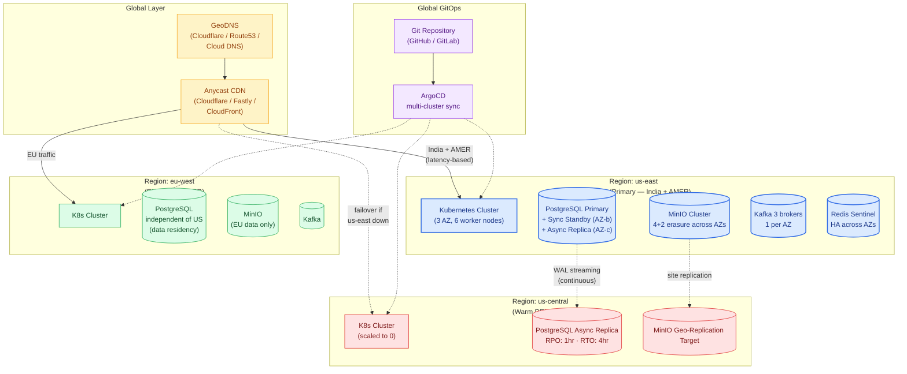
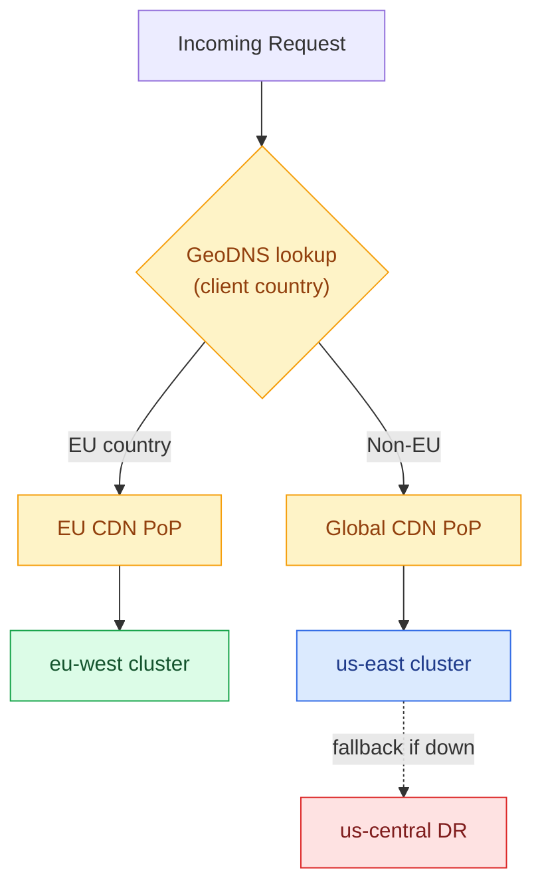
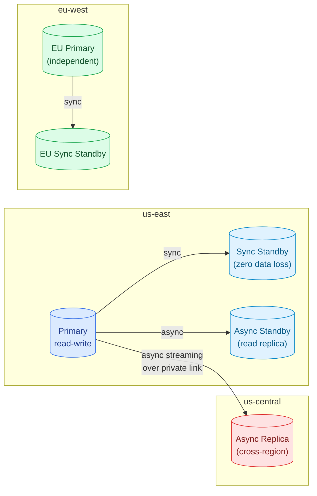
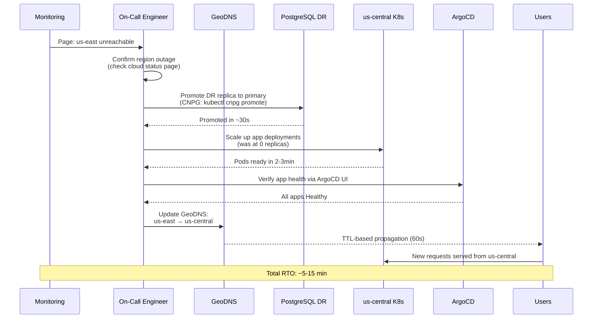
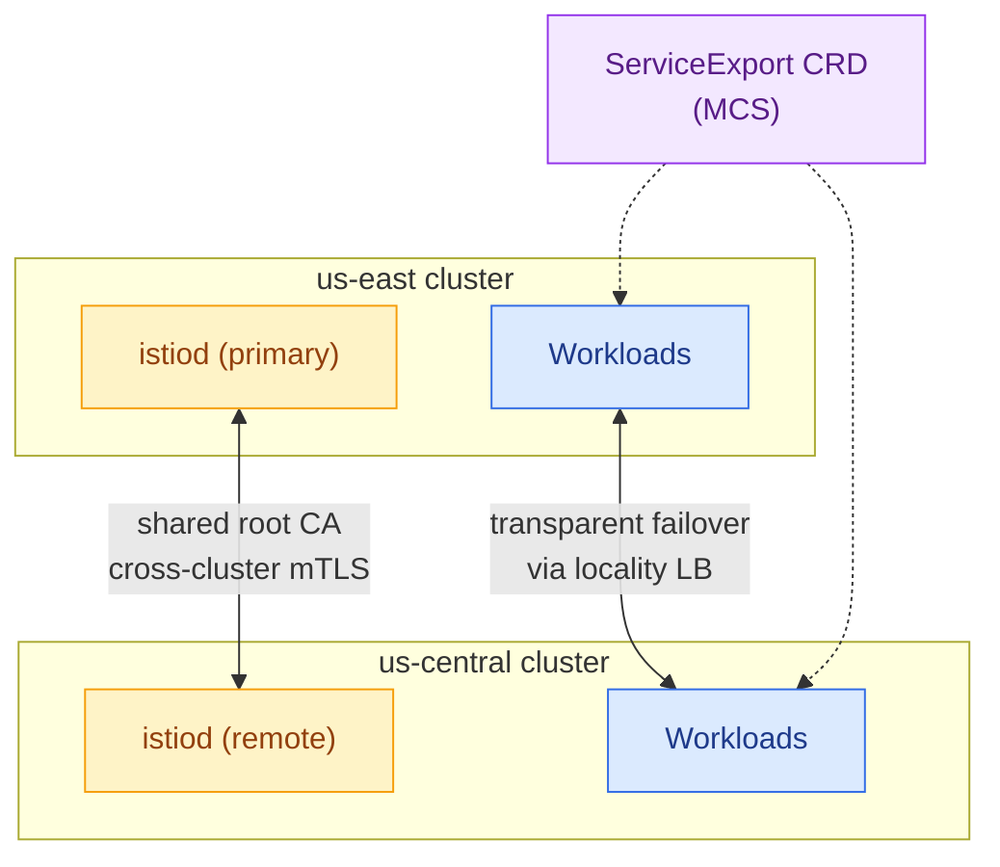
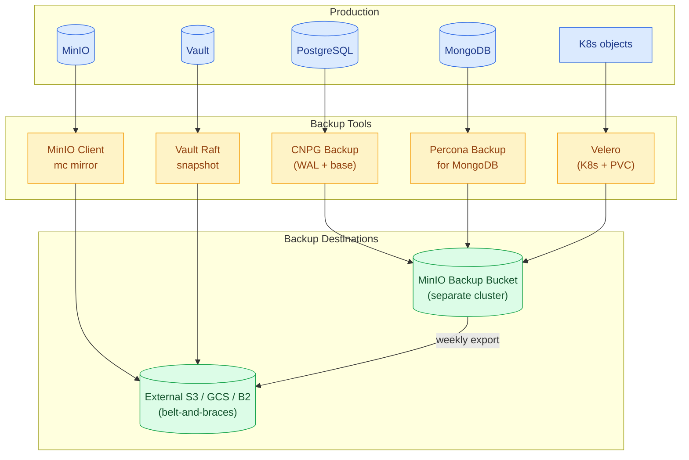
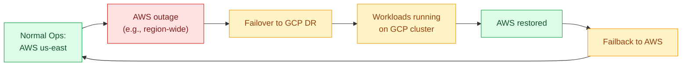

# 10 · Multi-Region Deployment & Disaster Recovery

> Cloud-native multi-region strategy with **active-active for read** and **active-passive for write**. Supports cross-cloud failover (e.g., AWS primary → GCP DR) — impossible with Azure-only design.

---

## 1. Regional Topology



---

## 2. Data Residency Rules

| Tenant Region | Routes To | Data Stays In | Compliance |
|---|---|---|---|
| India | us-east | us-east | RBI guidelines on US storage allowed |
| AMER (US/CA/MX) | us-east | us-east | CCPA, HIPAA-ready |
| EU (27 countries) | eu-west | eu-west **only** | GDPR — no replication outside EU |
| APAC (future) | ap-south | ap-south | Per-country regulations |

Routing is enforced at the **CDN / GeoDNS layer**, NOT in application code, so a misconfigured app can never accidentally route EU traffic to US.



---

## 3. Replication Strategy per Data Store

### 3.1 PostgreSQL



**Configuration:**
- **Sync replication** within region — zero data loss for hot failover
- **Async streaming** to DR region — RPO of seconds
- **EU PostgreSQL is independent** — no replication to non-EU regions (GDPR)

### 3.2 MinIO Site Replication

```yaml
# MinIO multi-site replication setup
mc admin replicate add  \
    us-east http://minio-us:9000 \
    us-central http://minio-dr:9000 \
    --replicate "delete,delete-marker,replica-metadata-sync"
```

- **Same-region replication:** Erasure coding across AZs (within cluster)
- **Cross-region replication:** Async site replication to DR
- **EU bucket replication:** Disabled — EU buckets stay in eu-west only

### 3.3 Kafka MirrorMaker 2

```yaml
apiVersion: kafka.strimzi.io/v1beta2
kind: KafkaMirrorMaker2
metadata:
  name: us-to-dr-mirror
spec:
  version: 3.6.0
  replicas: 2
  connectCluster: "us-east"
  clusters:
    - alias: us-east
      bootstrapServers: kafka-us.data:9092
    - alias: us-central
      bootstrapServers: kafka-dr.data:9092
  mirrors:
    - sourceCluster: us-east
      targetCluster: us-central
      sourceConnector:
        config:
          replication.factor: 3
          sync.topic.acls.enabled: true
      topicsPattern: ".*"
      topicsExcludePattern: "internal-.*"
```

### 3.4 MongoDB Cross-Region Replica Set

```yaml
# 3-node replica set spanning 2 regions
members:
  - host: mongo-1.us-east.svc.cluster.local:27017
    priority: 2     # primary candidate
  - host: mongo-2.us-east.svc.cluster.local:27017
    priority: 1
  - host: mongo-3.us-central.svc.cluster.local:27017
    priority: 0     # DR — never primary
    hidden: true
    votes: 1
```

---

## 4. Disaster Recovery Tiers

| Tier | RPO | RTO | Cost | Use Case |
|---|---|---|---|---|
| **Hot DR** (active-active) | Near-zero | Near-zero | High (3× cost) | Mission-critical, public sector |
| **Warm DR** (this design) | 1hr | 4hr | Medium (1.3× cost) | Standard enterprise SaaS |
| **Cold DR** (backup only) | 24hr | 24hr+ | Low (1.1× cost) | Dev/staging environments |

> The cloud-native design supports **all three tiers** — choose per environment via Helm values.

---

## 5. Failover Procedures

### 5.1 Single Pod Failure
Automatic — K8s reschedules pod elsewhere within seconds. PodDisruptionBudget ensures min replicas.

### 5.2 Single AZ Failure
Automatic — pods reschedule to surviving AZs. PostgreSQL syncs to standby in another AZ; failover via CNPG operator within 30s.

### 5.3 Whole Region Failure (us-east → us-central failover)



### 5.4 Failback Procedure

After us-east is restored:

```bash
# 1. Restore PG primary in us-east (was replica during failover)
kubectl cnpg promote pg-us-east --no-wait

# 2. Re-sync data: us-central → us-east
# (CNPG handles this via streaming)

# 3. Wait for replication lag to be <1s
kubectl cnpg status pg-us-east

# 4. Scale up apps in us-east
kubectl scale deploy --all --replicas=3 -n app

# 5. Update GeoDNS back to us-east
# 6. Scale down us-central (back to DR posture)
kubectl scale deploy --all --replicas=0 -n app  # in us-central
```

---

## 6. Multi-Cluster Service Mesh (Optional Advanced)

For **true active-active** across regions, Istio multi-cluster:



**Trade-offs:**
- **Pro:** Sub-second failover; geographically aware load balancing.
- **Con:** Higher complexity; cross-cluster TLS rotation; egress charges.

For most SaaS workloads, the **warm-DR pattern** is the right balance.

---

## 7. Backup Strategy



| Resource | Tool | Frequency | Retention | RPO | RTO |
|---|---|---|---|---|---|
| PostgreSQL | CloudNativePG | WAL continuous + daily base | 30 days hot + 1 year cold | 5min | 30min |
| MongoDB | Percona Backup | Daily | 30 days | 24hr | 1hr |
| MinIO | mc mirror | Continuous (site replication) | 7-10 years (tier-based) | 15min | 1hr |
| Redis | RDB snapshot | Every 60min | 7 days | 1hr | 15min |
| K8s manifests | GitOps | Continuous | Git history (forever) | 0 | 30min |
| Vault | Raft snapshot | Every 6hr | 7 days | 6hr | 30min |
| Kafka | MirrorMaker 2 | Continuous | Same as primary | <1min | <5min |

---

## 8. DR Testing — Game Days

Quarterly DR drill checklist:

```mermaid
flowchart LR
    PLAN["Plan game day<br/>(schedule maintenance window)"]
    SIM["Simulate failure<br/>(e.g., chaos-mesh kills us-east AZ-a)"]
    OBSERVE["Observe automated recovery<br/>(metrics, traces, logs)"]
    MANUAL["Manual failover drill<br/>(promote DR replica)"]
    VERIFY["Verify functionality<br/>(smoke tests against DR region)"]
    RESTORE["Restore to normal state<br/>(failback)"]
    POSTMORTEM["Document findings<br/>(update runbook)"]

    PLAN --> SIM --> OBSERVE --> MANUAL --> VERIFY --> RESTORE --> POSTMORTEM

    classDef step fill:#dbeafe,color:#1e3a8a,stroke:#326ce5
    class PLAN,SIM,OBSERVE,MANUAL,VERIFY,RESTORE,POSTMORTEM step
```



Tools: **Chaos Mesh** or **LitmusChaos** for controlled failure injection.

---

## 9. Cross-Cloud Failover (Bonus)

A unique advantage of cloud-native: **switch cloud providers mid-flight**.



Requirements for cross-cloud DR:
1. **PostgreSQL streaming over VPN/private link** between clouds
2. **MinIO site replication** to GCS or another MinIO cluster
3. **GeoDNS provider that supports multiple cloud endpoints** (Cloudflare, NS1, Route53)
4. **Container images mirrored** across cloud registries (Harbor pull-through)

> This is the ultimate vendor lock-in escape hatch — impossible with Azure-only design.

---

## 10. Compliance & Audit

Every failover event is recorded:

| Event | Recorded In | Used For |
|---|---|---|
| DNS routing change | Cloudflare audit log + Git commit | Compliance reporting |
| PG promotion | CNPG K8s events + Loki | RTO/RPO measurement |
| Backup execution | Velero logs + Prometheus metric | Validate retention policy |
| DR drill outcome | Confluence + post-mortem doc | SOC 2 evidence |
| Failed health check | Prometheus + Alertmanager | Trigger investigation |

---

## 11. Summary Table

| Capability | Cloud-Coupled Baseline | Cloud-Portable Design |
|---|---|---|
| **Multi-region** | 2 regions within one vendor | Any 2+ regions across any cloud(s) |
| **Cross-cloud failover** | Not possible | Yes, with VPN / private link |
| **Data residency (GDPR)** | One vendor's EU region | Any EU region of any cloud |
| **Region failure RTO** | 4 hr (vendor traffic manager) | 5–15 min (managed GeoDNS + auto-scale) |
| **Active-active multi-region** | Limited (only certain vendor-specific stores) | Full (Istio multi-cluster + Postgres logical replication + Kafka MirrorMaker) |
| **Bare-metal DR** | Not possible | Yes (on-prem cluster) |
| **Customer-self-hosted DR** | Not possible | Yes (export same Helm charts to customer K8s) |
