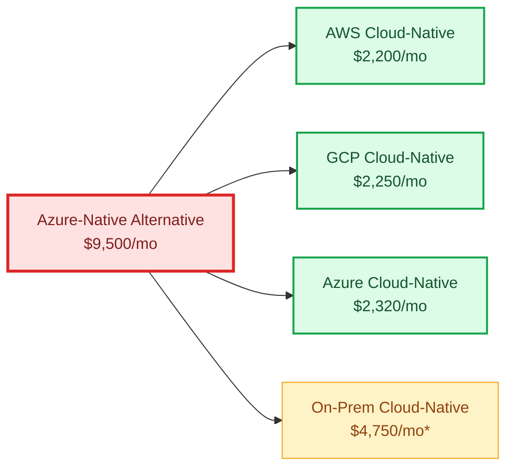
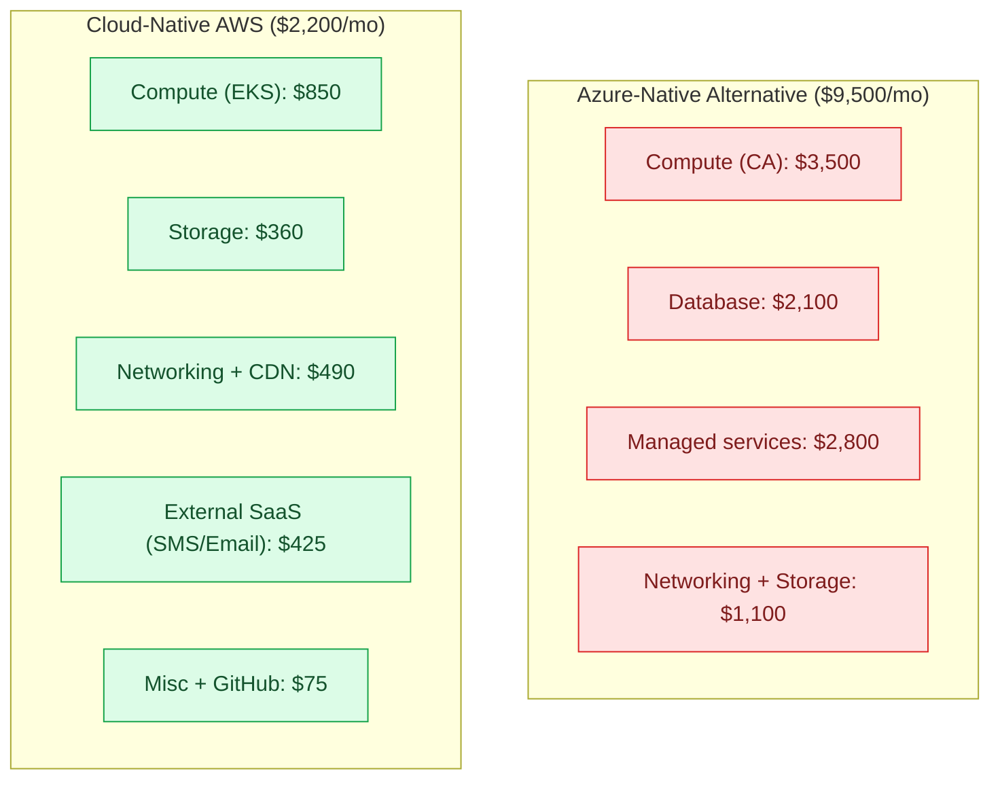
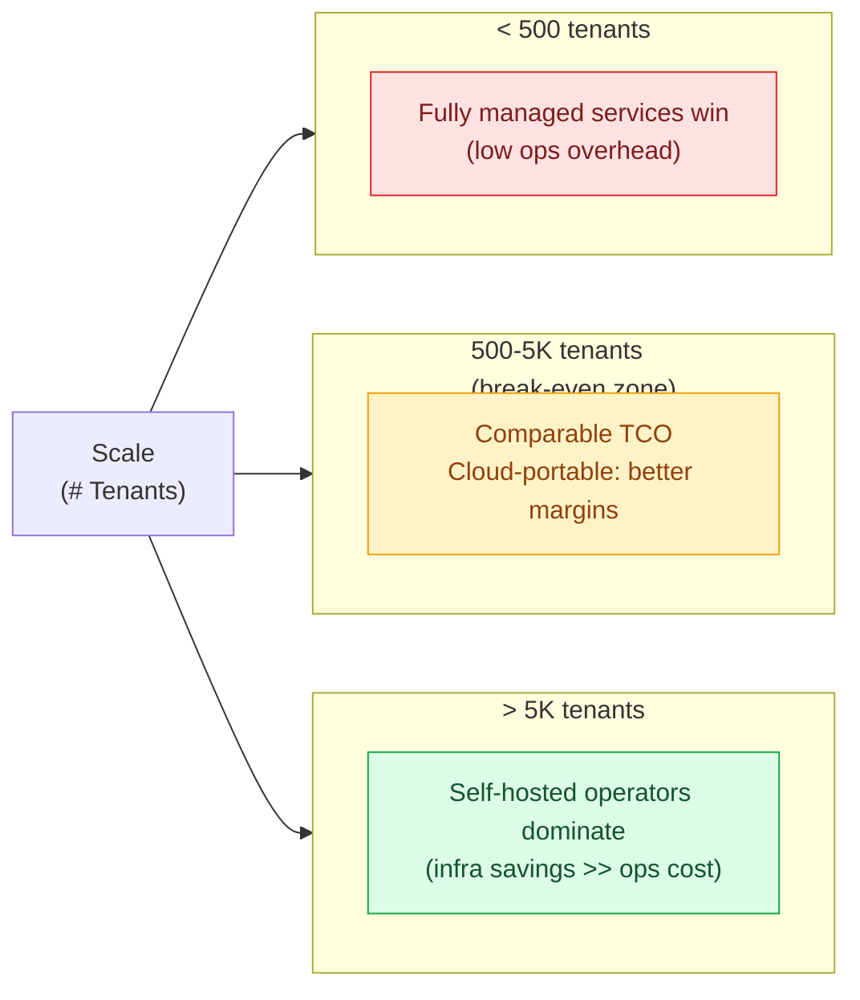
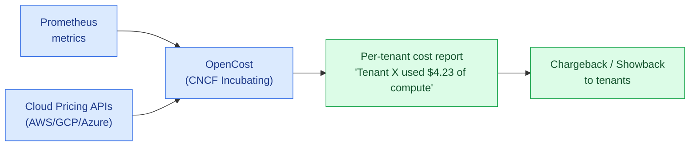

# 11 · Cost Analysis — Multi-Cloud Comparison

> Estimated monthly cost for the **same production workload** (1,580 tenants, ~10M API calls/mo, ~10TB storage) across the **cloud-coupled draft** (single-vendor managed services, considered as a baseline) and the **industry-standard cloud-portable design** deployed on each major cloud provider plus on-prem.
>
> Because the cloud-portable design names *technologies* — not vendor SKUs — we can deploy it to any cloud and compare like-for-like managed services at deployment time. The cost estimates below use representative pricing from the major cloud providers; specific service names are referenced only inside this comparison document.

---

## 1. Baseline Workload Assumptions

| Metric | Value |
|---|---|
| Tenants | 1,580 |
| Active employees across all tenants | ~120,000 |
| API calls / month | ~10 million |
| Data ingested / day | ~1 TB |
| Reports generated / month | ~50,000 |
| Compute hours | 12 services × avg 3 replicas × 1 vCPU = 36 vCPU-hours peak |
| Object storage | ~10 TB |
| RDBMS storage | ~1 TB |
| Egress traffic | ~5 TB/mo |

---

## 2. Cloud-Coupled Baseline (Azure-Specific Draft Considered)

If we had built directly on a single cloud's managed services (per the original Azure-specific draft), the cost would be:

| Service | Monthly Cost (USD) |
|---|---|
| Azure Container Apps | $2,800 – $4,200 |
| Azure DB PostgreSQL | $1,800 – $2,400 |
| Azure API Management | $700 – $1,200 |
| Azure Front Door | $400 – $600 |
| Azure Redis Cache | $450 – $600 |
| Azure Functions | $150 – $250 |
| Azure Service Bus | $100 – $200 |
| Azure Event Hubs | $200 – $350 |
| Azure Cosmos DB | $100 – $200 |
| Azure Blob Storage | $100 – $200 |
| Azure AD B2C | $150 – $300 |
| Azure Communication Services | $200 – $400 |
| Azure SignalR Service | $50 – $100 |
| Azure Key Vault | $20 – $50 |
| Azure Monitor + App Insights | $200 – $400 |
| Azure DevOps | $50 – $100 |
| Azure Container Registry | $20 – $50 |
| **TOTAL** | **$7,490 – $11,600** |

> Midpoint: **~$9,500 / month**

---

## 3. Cloud-Native on AWS

| Component | AWS Service | Configuration | Monthly Cost (USD) |
|---|---|---|---|
| K8s Control Plane | EKS | 1 cluster | $73 |
| K8s Workers | EC2 m5.xlarge | 6 nodes × ~24/7 | $700 – $900 |
| K8s Storage | EBS gp3 | 2 TB | $160 |
| Container Registry | ECR | 50 GB | $5 |
| LoadBalancer | NLB | 1 | $20 + $0.006/LCU |
| CDN + WAF | CloudFront + AWS WAF | 5 TB egress | $400 – $500 |
| Object Storage (MinIO equivalent) | S3 Standard + IA | 10 TB | $200 – $250 |
| Cloud KMS | KMS | secret encryption | $5 |
| DNS | Route 53 | hosted zone + queries | $5 |
| **AWS Infra Subtotal** | | | **$1,570 – $1,920** |
| | | | |
| **Self-hosted OSS (on EC2/EKS)** | | | |
| PostgreSQL (CloudNativePG) | — | 8 vCPU node + 1 TB EBS | included |
| Redis (Operator) | — | 2 GB cluster | included |
| Kafka (Strimzi) | — | 3 brokers | included |
| MinIO | — | (uses S3 below as alternative) | — |
| MongoDB | — | 3-node ReplicaSet | included |
| Keycloak | — | 2 replicas | included |
| Vault | — | 3 replicas | included |
| Kong, Istio, Prometheus, Loki, Tempo, ArgoCD, Tekton, Harbor | — | (operational overhead, no licence) | included |
| **External SaaS (optional)** | | | |
| SMTP (SendGrid or SES) | SES | 500K emails | $50 |
| SMS (Twilio) | Twilio | 50K SMS | $375 |
| External Stripe (billing) | — | 2.9% + 30¢ per txn | usage-based |
| GitHub Actions | GitHub | CI minutes (free tier mostly) | $0 – $50 |
| | | | |
| **AWS TOTAL** | | | **$2,000 – $2,400** |

> **Savings vs Azure: ~75% (or ~$7,000/month)**

---

## 4. Cloud-Native on GCP

| Component | GCP Service | Configuration | Monthly Cost (USD) |
|---|---|---|---|
| K8s Control Plane | GKE Autopilot | Pay-per-pod | included |
| K8s Workers | GKE Autopilot pods | ~36 vCPU continuous | $850 – $1,000 |
| K8s Storage | Persistent Disk SSD | 2 TB | $200 |
| Container Registry | Artifact Registry | 50 GB | $5 |
| LoadBalancer | GCLB | 1 | $20 + traffic |
| CDN + WAF | Cloud CDN + Cloud Armor | 5 TB egress | $400 – $500 |
| Object Storage | GCS Standard | 10 TB | $200 |
| Cloud KMS | KMS | — | $5 |
| DNS | Cloud DNS | — | $5 |
| **GCP Infra Subtotal** | | | **$1,685 – $1,935** |
| Self-hosted OSS | — | (same as AWS) | included |
| SMTP + SMS | SendGrid + Twilio | — | $400 |
| GitHub Actions | — | — | $50 |
| **GCP TOTAL** | | | **$2,100 – $2,400** |

> **Savings vs Azure: ~75%**

---

## 5. Cloud-Native on Azure (AKS)

Running the **same cloud-native design on Azure AKS** (not using Azure-specific managed services):

| Component | Azure Service | Configuration | Monthly Cost (USD) |
|---|---|---|---|
| K8s Control Plane | AKS | Free | $0 |
| K8s Workers | AKS nodes (D4s_v5) | 6 nodes | $800 – $1,000 |
| K8s Storage | Premium SSD | 2 TB | $250 |
| Container Registry | Azure Container Registry | 50 GB | $20 |
| LoadBalancer | Standard LB | 1 | $20 |
| CDN + WAF | Azure Front Door OR Cloudflare | 5 TB | $400 – $500 |
| Object Storage | Blob Storage Hot+Cool | 10 TB | $200 |
| Key Vault | Standard | — | $25 |
| DNS | Azure DNS | — | $5 |
| **Azure Infra Subtotal** | | | **$1,720 – $2,020** |
| SMTP + SMS | SendGrid + Twilio | — | $400 |
| GitHub Actions | — | — | $50 |
| **Azure Cloud-Native TOTAL** | | | **$2,170 – $2,470** |

> **Savings vs Azure-native alternative: ~74%**
>
> **Key insight:** Even if you must run on Azure (corporate mandate, existing contract), going AKS + self-hosted OSS still saves ~75% on infra cost compared to Azure managed PaaS. The Azure premium is on the managed services, not the cloud itself.

---

## 6. Cloud-Native On-Premises / Hybrid

For organizations with existing data centers (e.g., enterprise customers, government, finance):

| Component | Cost Driver | Monthly Equivalent (USD) |
|---|---|---|
| Hardware (amortized over 5 years) | 6 nodes × $5,000 / 60 mo | $500 |
| Power + cooling + rack space | DC ops | $300 |
| Network bandwidth | 100Mbps committed | $400 |
| Storage (NetApp / Ceph) | 20 TB usable | $300 |
| K8s distribution (Rancher / OpenShift) | Per-node license | $0 (Rancher OSS) – $500 (OpenShift) |
| Operations engineer (% of FTE) | 30% × $120K/yr | $3,000 |
| **TOTAL** | | **$4,500 – $5,000** |

> Higher than cloud once you factor in human cost, but **strategic for data sovereignty / regulated environments**.

---

## 7. TCO Comparison Chart

\* On-prem includes 30% FTE for ops; remove if you're already running data centers.

---

## 8. Cost Breakdown by Category

---

## 9. Per-Tenant Cost Analysis

| Design | Total Monthly | Tenants | Cost / Tenant / Month |
|---|---|---|---|
| Azure-Native (alternative) | $9,500 | 1,580 | $6.01 |
| AWS Cloud-Native | $2,200 | 1,580 | $1.39 |
| GCP Cloud-Native | $2,250 | 1,580 | $1.42 |
| Azure Cloud-Native | $2,320 | 1,580 | $1.47 |
| On-Prem Cloud-Native | $4,750 | 1,580 | $3.01 |

**For a SaaS business charging $50/tenant/month:**

| Design | Gross Margin |
|---|---|
| Azure-Native (alternative) | 88% |
| AWS Cloud-Native | **97%** |
| On-Prem | 94% |

**Difference: ~$72,000/year per 1,000 tenants in incremental gross profit.**

---

## 10. Hidden Costs to Consider

### 10.1 Cost NOT Visible in Cloud Bill

| Hidden Cost | Cloud-Coupled Baseline | Cloud-Portable Design |
|---|---|---|
| Egress / data transfer | Bundled into managed-service costs | Pay per GB cross-region |
| Backup storage | Often free up to a limit | Pay for object-storage backup |
| Monitoring ingestion | High at scale | Self-hosted Prometheus = compute cost only |
| API gateway calls | Per-call billing | Free (Kong on K8s) |
| Engineer time on lock-in | Implicit | Reduced (portable, industry-standard skills) |

### 10.2 Operations Cost (FTE)

| Workload | Cloud-Coupled (Fully Managed) | Cloud-Portable (Self-Hosted Path) |
|---|---|---|
| Cluster operations | ~0.2 FTE (managed K8s) | ~0.4 FTE (K8s + operators) |
| Database operations | ~0.1 FTE (managed PG) | ~0.3 FTE (CloudNativePG operator) |
| Identity management | ~0.05 FTE (managed IdP) | ~0.15 FTE (Keycloak ops) |
| **Total FTE** | **~0.35 FTE** | **~0.85 FTE** |
| **FTE cost @ $150K** | **$52K/yr** | **$128K/yr** |
| **Cloud savings/yr** | $0 | $87K |
| **Net annual savings** | $0 | **$11K – $30K+** (for 1.5K tenants) |

> Net savings shrink as self-hosting ops cost grows, but scale linearly. **At 10,000+ tenants, the cloud-portable savings dominate** — and the platform can opt to use cloud-managed equivalents for some tiers while self-hosting others.

---

## 11. Break-Even Analysis

---

## 12. Cost Optimization Levers

### 12.1 Reserved Capacity

| Cloud | Discount | Term |
|---|---|---|
| AWS Savings Plans | up to 72% | 1-3 year |
| GCP Committed Use | up to 70% | 1-3 year |
| Azure Reserved Instances | up to 72% | 1-3 year |

### 12.2 Spot Instances

For non-critical workloads (CI runners, batch jobs):

| Workload | Spot Discount |
|---|---|
| GitHub Actions self-hosted runners | 60-80% |
| Argo Workflows batch jobs | 70-90% |
| Knative scale-to-zero report workers | 70-90% |

### 12.3 Autoscaling

- Scale dev/staging to 0 outside business hours: 40% savings
- KEDA scale-to-zero on event-driven workers: 30% savings
- Cluster Autoscaler aggressive downscale: 15-25% savings

### 12.4 Storage Tiering

| Tier | Use Case | Cost (per GB/mo) |
|---|---|---|
| Hot (SSD) | Live PG, recent reports | $0.05 - $0.10 |
| Warm (Standard) | 30-day-old reports, audit | $0.02 |
| Cold (Glacier / Archive) | 1-year+ audit, compliance | $0.001 - $0.004 |

---

## 13. Recommendation by Stage

For a greenfield SaaS launching with this blueprint:

| Business Stage | Recommended Approach |
|---|---|
| **0-100 tenants (MVP / Beta)** | Cloud-native on managed K8s (EKS/GKE/AKS); offload K8s control plane only; use OSS for everything else |
| **100-1K tenants** | Same stack — add observability hardening and per-tenant cost attribution (OpenCost) |
| **1K-10K tenants** | Optimize: reserved instances, autoscaling tuning, multi-AZ data tier; possibly add a second region |
| **10K+ tenants** | Consider multi-cloud; negotiate enterprise discounts; explore dedicated tenancy options |
| **Regulated / Sovereign customers** | Same Helm charts deployed on-prem (Rancher / OpenShift) — premium SKU offering |

---

## 14. The "5 Year Cost" View

Assuming 50% YoY tenant growth from 1,580 → 12,000:

| Year | Azure-Native (alternative) | Cloud-Native AWS | Difference |
|---|---|---|---|
| 2026 | $114K | $26K | $88K |
| 2027 | $171K | $40K | $131K |
| 2028 | $257K | $60K | $197K |
| 2029 | $385K | $90K | $295K |
| 2030 | $578K | $135K | $443K |
| **5-yr Total** | **$1,505K** | **$351K** | **$1,154K** |

> **Over 5 years: $1.15M+ avoided** by starting cloud-native — for a SaaS scaling from 1.6K to 12K tenants.

---

## 15. Cost Monitoring with KubeCost / OpenCost

Both provide per-namespace, per-pod, per-tenant cost attribution:

This enables **tier-based pricing** and **fair allocation** of infrastructure costs to tenants — a critical SaaS capability.
