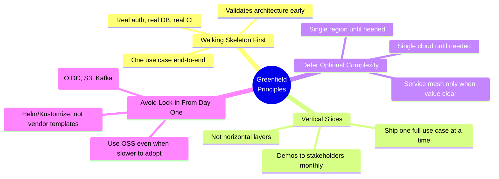
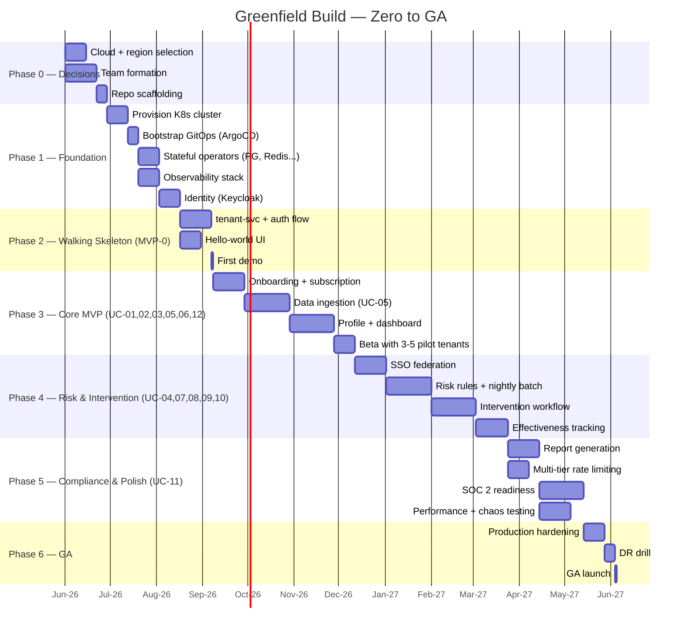
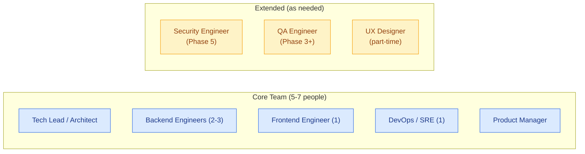
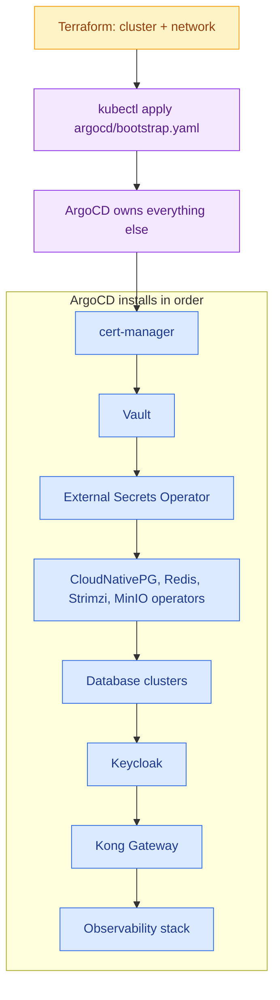
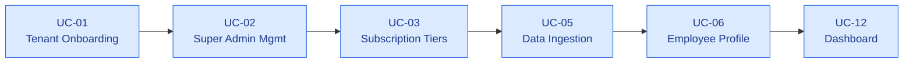
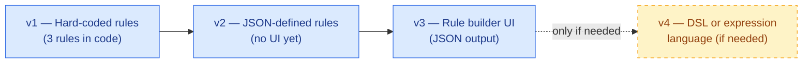
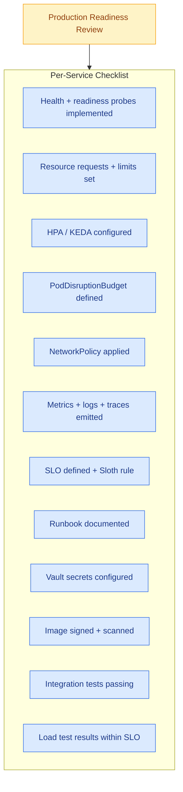

# 12 · Implementation Roadmap — Greenfield Build

> Phased plan to **build the platform from zero to production** using the cloud-native blueprint. Optimized for an early-stage team that wants to ship the MVP fast while keeping the architecture portable.

---

## 1. Guiding Principles



---

## 2. End-to-End Timeline (12 Months to GA)



---

## 3. Phase 0 — Decisions & Team (Weeks 1-3)

### 3.1 Critical Decisions to Make Before Building

| Decision | Options | Recommendation | Lock-in Risk |
|---|---|---|---|
| **Cloud Provider for first deployment** | Any major public cloud or on-prem | See [`13-Multi-Cloud-Mapping.md`](./13-Multi-Cloud-Mapping.md) for selection criteria | Low (Kubernetes is portable) |
| **K8s Distribution** | Cloud-managed (preferred) vs self-managed | Managed — saves ops effort early; the cloud's managed Kubernetes service is industry standard everywhere | None |
| **Primary Region** | Major-cloud region close to first customers | Match where first paying customers are | None |
| **Service Mesh Day-1?** | Istio from day 1 vs add later | **Add later** — keep MVP simple | Low — Istio is additive |
| **API Gateway** | Kong vs Envoy Gateway vs NGINX Ingress | Kong — best developer portal and largest plugin ecosystem | Low |
| **Backend Language** | Node.js (TypeScript) / Java (Spring Boot) / Go | **Pick one industry-standard stack and standardize** | Low |
| **Frontend Stack** | React + TypeScript | React + TypeScript — industry standard | None |
| **Cloud Costs Budget** | $1K-$3K/mo for dev/staging | Plan for $2K/mo through MVP | — |

### 3.2 Minimum Viable Team



### 3.3 Repository Layout

```
learning-platform/                       (application code monorepo)
├── services/
│   ├── tenant-svc/
│   ├── identity-svc/
│   ├── profile-svc/
│   ├── ingestion-svc/
│   └── ... (12 services)
├── frontend/
│   └── react-app/
├── libs/
│   ├── shared-types/
│   ├── auth-client/
│   └── db-utils/
├── tests/
│   └── e2e/
├── .github/workflows/
└── docs/

learning-platform-config/                (GitOps repo)
├── argocd/
├── apps/                                (Helm values per service)
├── infra/                               (cert-manager, Kong, Vault, etc.)
└── databases/

learning-platform-terraform/             (infra IaC)
├── modules/
└── envs/
    ├── dev/
    ├── staging/
    └── prod-us/
```

---

## 4. Phase 1 — Foundation (Weeks 4-7)

**Goal:** Land the cloud-native platform; ready to deploy services.

### 4.1 Deliverables

| Deliverable | Owner | Definition of Done |
|---|---|---|
| Dev cluster on chosen cloud | DevOps | `kubectl get nodes` returns 3+ nodes |
| Staging cluster | DevOps | Same |
| ArgoCD bootstrapped | DevOps | ArgoCD UI accessible; root app synced |
| Harbor registry | DevOps | Image push/pull works |
| Vault deployed + initialized | DevOps | KV v2 mount enabled; K8s auth configured |
| Keycloak deployed | DevOps | Admin console accessible; first realm + IdP created |
| CloudNativePG operator + dev cluster | DevOps | Sample app can connect; HA verified by killing pod |
| Redis Operator + cluster | DevOps | Sentinel quorum healthy |
| MinIO cluster | DevOps | Bucket create / put / get works |
| Strimzi Kafka cluster | DevOps | Topic create + produce/consume works |
| Prometheus + Grafana + Loki + Tempo | DevOps | Default dashboards visible |
| cert-manager + Let's Encrypt | DevOps | Sample TLS cert auto-issued |
| Kong Gateway | DevOps | Sample ingress with JWT plugin works |
| Istio (optional) | DevOps | mTLS enabled cluster-wide if chosen |

### 4.2 Infrastructure as Code Order



### 4.3 Exit Criteria

- A developer can: `git push` → CI builds image → push to Harbor → ArgoCD syncs → service runs on staging.
- A pod can read secrets from Vault, write to PostgreSQL, publish to Kafka, store a file in MinIO.
- Prometheus has metrics for the cluster; Grafana shows a default dashboard.

---

## 5. Phase 2 — Walking Skeleton (Weeks 8-11)

**Goal:** One narrow but **complete** use case in production — proves the architecture works end-to-end.

### 5.1 Chosen Walking Skeleton

**"A super-admin can create a tenant, the tenant admin can sign in via Keycloak, and they see an empty dashboard."**

This single flow validates:
- Frontend → CDN → Ingress → Kong → backend service → PostgreSQL
- Authentication via Keycloak (OIDC)
- JWT validation in Kong with `tenant_id` claim
- PostgreSQL RLS with tenant context
- Vault secret injection
- Observability (request shows up in traces + logs + metrics)
- CI/CD GitOps deploy
- Helm chart pattern for a service

### 5.2 What's IN Scope

| Item | In scope |
|---|---|
| `tenant-svc` — create tenant | YES (one endpoint: POST /tenants) |
| `frontend` — login + empty dashboard | YES |
| Keycloak realm with one user attribute mapper | YES |
| Kong JWT plugin | YES |
| PostgreSQL schema for `tenants` table only | YES |
| Vault secret for DB password | YES |
| ArgoCD app for `tenant-svc` + `frontend` | YES |

### 5.3 What's OUT of Scope (deferred)

- SSO federation (UC-04) — use local Keycloak users initially
- Subscription tiers (UC-03) — only one default tier
- Data ingestion (UC-05) — no data yet
- Notifications, audit log, billing — stubbed out

### 5.4 First Demo

End of Phase 2 = **stakeholder demo**:
1. Open admin URL → log in as super admin
2. Click "Create Tenant" → fill form → submit
3. Open tenant URL → log in as tenant admin → see empty dashboard
4. Open Grafana → show the trace of the entire flow
5. Open ArgoCD → show all syncing apps healthy

---

## 6. Phase 3 — Core MVP (Months 3-5)

**Goal:** First 6 use cases shippable. Beta with 3-5 friendly tenants.

### 6.1 Build Order (Vertical Slices)



### 6.2 Per-Use-Case Output

| Use Case | Service(s) Built | Demo-Ready Output |
|---|---|---|
| UC-01 | `tenant-svc` | Self-service tenant signup form + email confirmation |
| UC-02 | `tenant-svc` (admin endpoints) | Super-admin can list/edit/suspend tenants |
| UC-03 | `billing-svc` (basic) | Tier change via admin UI; rate limiting works |
| UC-05 | `ingestion-svc`, Kafka, `profile-aggregator` | External API can POST training data; appears in DB |
| UC-06 | `profile-svc` | Employee detail page shows aggregated profile |
| UC-12 | `dashboard-api`, `frontend` widgets | Role-based dashboard with live KPIs |

### 6.3 Architecture Discipline

By end of Phase 3, the following patterns are codified:

| Pattern | Implementation |
|---|---|
| **Service Helm chart template** | All services follow same Chart structure |
| **PostgreSQL migration tool** | Atlas / golang-migrate / Alembic adopted |
| **Common auth library** | `auth-client` lib extracts tenant_id from JWT |
| **Standard error contract** | All services return same JSON error envelope |
| **OpenAPI spec per service** | Auto-generated from code, published to Kong |
| **Integration test harness** | Testcontainers spins up PG + Redis + Kafka |

### 6.4 Beta Launch Checklist

- [ ] 3-5 friendly tenants onboarded
- [ ] On-call rotation set up (PagerDuty)
- [ ] Status page (statuspage.io / Cachet)
- [ ] Customer support channel (email or Slack Connect)
- [ ] Bug-tracker integration to Slack
- [ ] Weekly retro with beta tenants

---

## 7. Phase 4 — Risk Engine & Intervention (Months 6-8)

**Goal:** Ship the differentiating value — proactive risk detection + intervention.

| Use Case | Service(s) | Key Risks |
|---|---|---|
| UC-04 SSO Federation | Keycloak IdP brokering | SAML metadata variations between IdPs |
| UC-07 Risk Rules | `rules-svc` | Rule grammar design — keep simple JSON for v1 |
| UC-08 Nightly Risk Batch | Argo Workflow + `risk-engine` worker | Performance with large tenants; staggered execution |
| UC-09 Intervention Assignment | `intervention-svc` | Approval workflow state machine complexity |
| UC-10 Effectiveness Tracking | `analytics-svc` | Statistical validity of pre/post comparison |

### 7.1 Risk Engine Iteration

Build the risk engine **incrementally**:



---

## 8. Phase 5 — Compliance & Production Hardening (Months 9-11)

| Stream | Owner | Output |
|---|---|---|
| **UC-11 Reports** | Backend team | PDF/Excel/CSV generation via `report-svc` Knative; pre-signed URLs |
| **SOC 2 Readiness** | Security + DevOps | Audit log immutability, access controls, vendor list, BCP/DR docs |
| **Performance Testing** | QA + SRE | k6 / Locust load tests — 500 concurrent users, sustained 10K req/min |
| **Chaos Engineering** | SRE | Chaos Mesh — pod kills, AZ failure, DB primary failover |
| **Security Hardening** | Security | Trivy + Grype scan all images; Falco rules; OPA Gatekeeper policies |
| **Per-Tenant Tier Enforcement** | Backend | Kong rate limits + DB triggers + app checks all aligned |
| **GDPR Readiness** | Security + Backend | Right to erasure script; data inventory; DPA template for customers |

### 8.1 Production Readiness Review (PRR) Checklist

Every service must pass a PRR before production rollout:



---

## 9. Phase 6 — GA Launch (Month 12)

| Activity | Day |
|---|---|
| Final DR drill (simulated region failure) | T-14 |
| Performance test at 2× projected load | T-10 |
| Security pen test (external auditor) | T-7 |
| Status page green for 7 days | T-7 → T-0 |
| Customer-facing documentation live | T-3 |
| Marketing launch | T-0 |
| 24×7 on-call rotation active | T-0 onwards |
| Post-launch retrospective | T+14 |

---

## 10. Optional Add-Ons (Post-GA)

These are not blockers for GA — add as growth demands.

| Capability | Trigger to Add | Estimated Effort |
|---|---|---|
| **Service Mesh (Istio)** | When 15+ services or zero-trust required | 6 weeks |
| **Multi-region** | When >50% traffic outside primary region | 8 weeks |
| **Cross-cloud DR** | When customer demands or vendor risk concern | 6 weeks |
| **ML-based risk scoring** | When customers want predictive (not just rule-based) | 12+ weeks |
| **API Marketplace / Developer Portal** | When self-serve API key flow needed | 4 weeks |
| **White-label / on-prem deployment** | When enterprise customer requires it | 8 weeks |
| **Analytics warehouse (ClickHouse)** | When cross-tenant analytics + reports slow PG | 6 weeks |

---

## 11. Risk Register

| Risk | Likelihood | Impact | Mitigation |
|---|---|---|---|
| **K8s ramp-up too slow** | Medium | High | Bring in 1 K8s consultant for Phase 1; pair with team |
| **Cloud costs balloon** | Medium | Medium | Set budget alerts in cloud account; weekly OpenCost review |
| **Picking wrong cloud** | Low | High | Decision documented in ADR; portable design means low switching cost |
| **Keycloak operational complexity** | Medium | Medium | Use Bitnami Helm chart; vendor support optional |
| **OSS supply chain attacks** | Medium | High | Cosign signing, SBOM, Trivy scans, pinned versions |
| **Performance issues at scale** | Medium | High | Continuous load testing from Phase 3 onwards |
| **Compliance gaps** | Low | High | SOC 2 audit early (Phase 5); GDPR DPO consultation |
| **Single point of knowledge** | High | High | Pair programming; architecture docs in Git; rotation |

---

## 12. Resource & Budget Plan

### 12.1 Team Cost (12 months)

| Role | Count | Avg Loaded Cost (USD/mo) | Total (12 mo) |
|---|---|---|---|
| Tech Lead / Architect | 1 | $18,000 | $216,000 |
| Backend Engineers | 3 | $15,000 | $540,000 |
| Frontend Engineer | 1 | $13,000 | $156,000 |
| DevOps / SRE | 1 | $16,000 | $192,000 |
| Product Manager | 1 | $14,000 | $168,000 |
| Security Engineer (50% from Phase 5) | 0.5 | $17,000 | $51,000 |
| QA Engineer (from Phase 3) | 1 | $11,000 | $110,000 |
| **Team Subtotal** | | | **$1,433,000** |

### 12.2 Infrastructure Cost (12 months)

| Phase | Monthly | Months | Subtotal |
|---|---|---|---|
| Phase 0-1 (dev only) | $500 | 2 | $1,000 |
| Phase 2-3 (dev + staging) | $1,000 | 4 | $4,000 |
| Phase 4-5 (dev + staging + small prod) | $1,500 | 4 | $6,000 |
| Phase 6 (full production) | $2,500 | 2 | $5,000 |
| **Infra Subtotal** | | | **$16,000** |

### 12.3 External Services (12 months)

| Item | Annual |
|---|---|
| GitHub Team | $1,200 |
| PagerDuty | $2,400 |
| Sentry / Error tracking (optional) | $3,000 |
| Twilio (SMS) seed | $500 |
| SendGrid (Email) | $1,200 |
| Pen test (one-time) | $15,000 |
| SOC 2 audit (one-time) | $25,000 |
| **External Subtotal** | | **$48,300** |

### 12.4 Grand Total

| Category | Year 1 |
|---|---|
| Team | $1,433,000 |
| Infrastructure | $16,000 |
| External services | $48,300 |
| **TOTAL Year 1** | **~$1,497,000** |

> Compare to: typical SaaS startup spends $1.5-2M to reach GA. This is on the lower end because cloud-native + GitOps reduces operational burden significantly.

---

## 13. Decision Points (When to Re-Evaluate)

| Milestone | Re-Evaluate |
|---|---|
| End of Phase 1 | Is cloud choice still right? Any architectural surprises? |
| End of Phase 3 (beta) | Are SLOs realistic? Right team size? Build-vs-buy decisions? |
| End of Phase 5 (PRR) | Performance test results — scale-up plan? |
| GA + 6 months | Multi-region needed? More services? |

---

## 14. Definition of "Done" per Phase

| Phase | Done When |
|---|---|
| 0 | All architectural decisions documented in ADRs; team hired; repos initialized |
| 1 | Engineer can deploy a hello-world via GitOps in <30 min |
| 2 | Walking skeleton demo passes stakeholder review |
| 3 | 3+ beta tenants actively using the platform |
| 4 | Risk batch successfully evaluates all beta tenants for 14 consecutive nights |
| 5 | PRR passes for all 12 services; load test sustains 2× projected GA traffic |
| 6 | Public launch; first paying customer; on-call drill completed |
