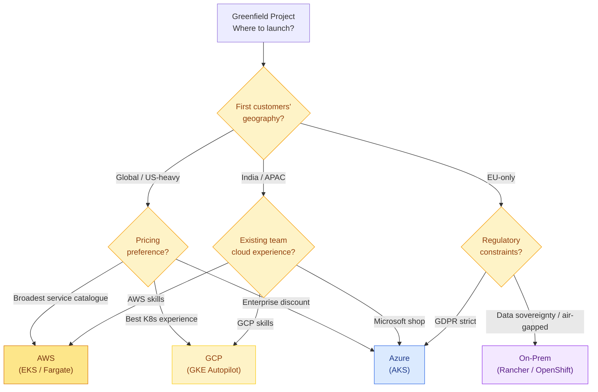
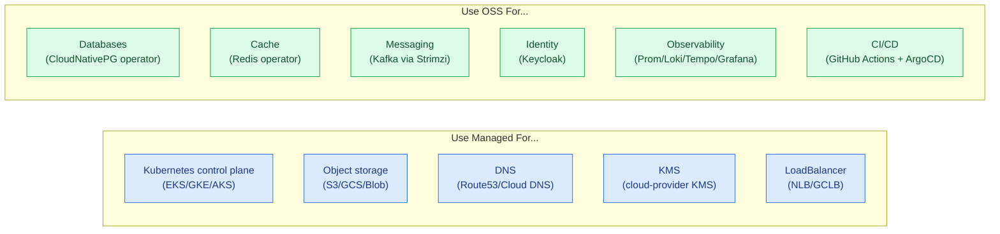
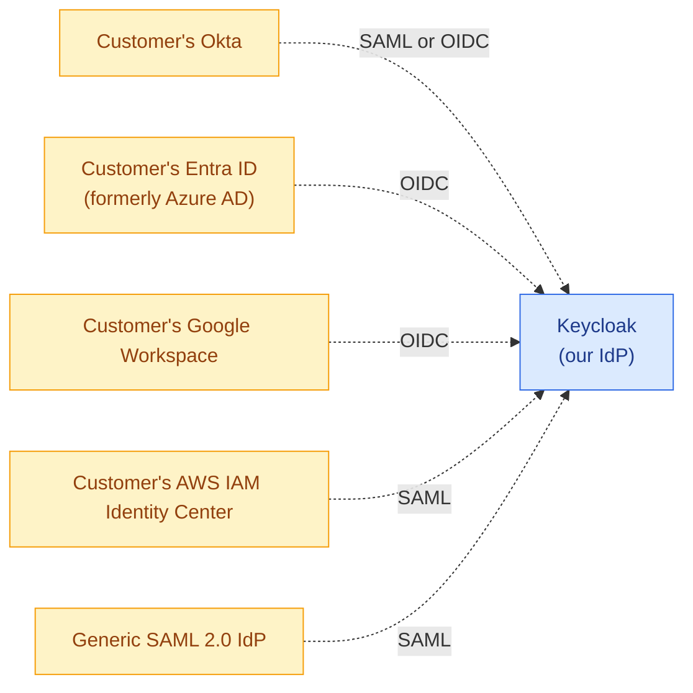
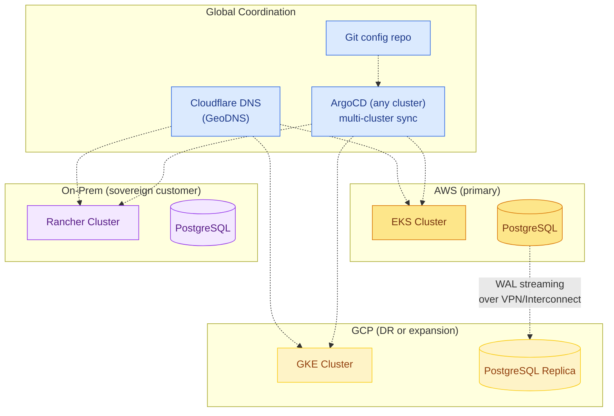
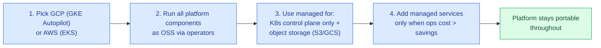

# 13 · Multi-Cloud Service Mapping

> Picking which cloud to deploy on first. The cloud-native blueprint runs the **same Helm charts on any cloud**, but each cloud has a managed Kubernetes flavor, native storage, and a few cloud-specific niceties worth knowing.

---

## 1. Decision Matrix — Which Cloud to Start On?



### TL;DR Recommendation

| Scenario | Recommended Cloud |
|---|---|
| Generic SaaS startup, no constraints | **GCP (GKE Autopilot)** — best K8s ergonomics |
| Need broadest service catalogue / enterprise | **AWS (EKS)** |
| GDPR / EU-heavy / Microsoft ecosystem ties | **Azure (AKS)** |
| Regulated / sovereign / hybrid | **On-prem (Rancher or OpenShift)** |
| Multi-cloud from day 1 | **Start with one; design supports any** |

---

## 2. Master Service Mapping Table

Every layer of the cloud-native blueprint, mapped to:
- the **default OSS choice** (deployed via operators inside K8s)
- the **AWS managed equivalent** (if you prefer to offload ops)
- the **GCP managed equivalent**
- the **Azure managed equivalent**

> Choosing managed = lower ops effort but more lock-in. Choosing OSS = portable + cheap but more ops effort. The design works either way.

### 2.1 Compute & Orchestration

| Capability | OSS / Cloud-Native | AWS Managed | GCP Managed | Azure Managed |
|---|---|---|---|---|
| Kubernetes cluster | k3s / Rancher / OpenShift | **EKS** | **GKE Autopilot** | **AKS** |
| Serverless container | Knative + KEDA | Lambda + ECS Fargate | Cloud Run | Container Apps / Functions |
| Batch / workflow | Argo Workflows | Step Functions / Batch | Workflows / Batch | Logic Apps / Functions Orchestrator |
| Service mesh | Istio / Linkerd | App Mesh (deprecated) / Istio | Anthos Service Mesh | Service Mesh on AKS |
| Ingress | NGINX / Envoy Gateway | ALB / NLB | GCLB | App Gateway |
| Container registry | Harbor | ECR | Artifact Registry | ACR |

### 2.2 Data Stores

| Capability | OSS / Cloud-Native | AWS Managed | GCP Managed | Azure Managed |
|---|---|---|---|---|
| Relational DB (Postgres) | CloudNativePG operator | RDS for PostgreSQL / Aurora PG | Cloud SQL for PostgreSQL | Azure DB for PostgreSQL |
| Cache | Redis Operator | ElastiCache for Redis | Memorystore for Redis | Azure Cache for Redis |
| Object storage | MinIO | **S3** | **GCS** | Blob Storage |
| NoSQL document | MongoDB Operator | DocumentDB | Firestore | Cosmos DB |
| Wide-column NoSQL | Cassandra / Scylla | Keyspaces | Bigtable | Cosmos DB Cassandra |
| Search | OpenSearch | OpenSearch Service | (use Elastic on GKE) | Azure AI Search |
| Time-series | VictoriaMetrics / Prometheus | Timestream | (use Prom + Cloud Storage) | Azure Data Explorer |
| Analytics warehouse | ClickHouse / Trino | Redshift / Athena | BigQuery | Synapse |

### 2.3 Messaging & Streaming

| Capability | OSS / Cloud-Native | AWS Managed | GCP Managed | Azure Managed |
|---|---|---|---|---|
| Event streaming | Kafka (Strimzi) | **MSK** | (Pub/Sub or Confluent on GCP) | Event Hubs (Kafka API) |
| Message queue | Kafka / RabbitMQ / NATS | SQS | Pub/Sub | Service Bus |
| Pub/Sub | Kafka / NATS JetStream | SNS / EventBridge | Pub/Sub | Event Grid |
| Stream processing | Kafka Streams / Flink | Kinesis Data Analytics | Dataflow | Stream Analytics |
| Real-time WebSocket | Centrifugo / NATS | API Gateway WebSocket | (custom) | SignalR |

### 2.4 Identity & Security

| Capability | OSS / Cloud-Native | AWS Managed | GCP Managed | Azure Managed |
|---|---|---|---|---|
| Identity / SSO | **Keycloak** | Cognito | Identity Platform | Azure AD B2C |
| Secrets | Vault | Secrets Manager | Secret Manager | Key Vault |
| Certificates | cert-manager + Let's Encrypt | ACM | Certificate Manager | Key Vault Certs |
| Policy / authorization | OPA Gatekeeper | (custom IAM) | (custom IAM) | Azure Policy |
| Cloud KMS | Vault Transit | KMS | Cloud KMS | Key Vault |
| WAF | ModSecurity + OWASP CRS | AWS WAF | Cloud Armor | Front Door WAF |
| DDoS protection | (CDN-provided) | Shield | Cloud Armor | DDoS Protection |
| Runtime security | Falco | GuardDuty + Falco | Security Command Center | Defender for Cloud |
| Image scanning | Trivy / Grype | ECR scanning | Container Analysis | Defender for Containers |
| Service mesh mTLS | Istio | App Mesh | ASM | OSM |

### 2.5 Observability

| Capability | OSS / Cloud-Native | AWS Managed | GCP Managed | Azure Managed |
|---|---|---|---|---|
| Metrics | Prometheus + Thanos | CloudWatch + AMP | Cloud Monitoring | Azure Monitor |
| Logs | Loki | CloudWatch Logs | Cloud Logging | Log Analytics |
| Traces | Tempo / Jaeger | X-Ray | Cloud Trace | Application Insights |
| Dashboards | **Grafana** | CloudWatch / AMG | Cloud Monitoring / AMG | Workbooks |
| APM | OpenTelemetry | X-Ray + ADOT | Cloud Trace + Profiler | Application Insights |
| Alerting | Alertmanager | CloudWatch Alarms | Cloud Monitoring Alerting | Azure Monitor Alerts |

### 2.6 CI/CD & DevOps

| Capability | OSS / Cloud-Native | AWS Managed | GCP Managed | Azure Managed |
|---|---|---|---|---|
| Git hosting | (GitHub / GitLab / Gitea) | CodeCommit | Source Repositories | Azure Repos |
| CI runner | GitHub Actions / Tekton / GitLab CI | CodeBuild | Cloud Build | Azure Pipelines |
| CD | **ArgoCD / Flux** (GitOps) | CodeDeploy | Cloud Deploy | Azure DevOps Release |
| Artifact storage | Harbor / MinIO | CodeArtifact / S3 | Artifact Registry | Azure Artifacts |
| Progressive delivery | Argo Rollouts / Flagger | AppMesh + CodeDeploy | (custom) | (custom) |

### 2.7 Networking

| Capability | OSS / Cloud-Native | AWS Managed | GCP Managed | Azure Managed |
|---|---|---|---|---|
| CDN | Cloudflare / Fastly / BunnyCDN | CloudFront | Cloud CDN | Front Door |
| DNS | (any provider) | Route 53 | Cloud DNS | Azure DNS |
| Private connectivity | (VPN per cloud) | PrivateLink + Direct Connect | Private Service Connect + Interconnect | Private Link + ExpressRoute |
| LoadBalancer | MetalLB (on-prem) | NLB / ALB | GCLB | Standard LB |

### 2.8 Communications

| Capability | OSS / Cloud-Native | AWS | GCP | Azure |
|---|---|---|---|---|
| Email | Postal / SMTP relay | SES | (use SendGrid) | Communication Services |
| SMS | (use Twilio) | SNS | (use Twilio) | Communication Services |
| Push notifications | Centrifugo / FCM | SNS / Pinpoint | FCM | Notification Hubs |
| Voice | (use Twilio) | Chime / Connect | (use Twilio) | Communication Services |

---

## 3. Hybrid Strategy: Best-of-Both

You don't have to choose pure OSS or pure managed. A pragmatic mix:



This pattern:
- **Keeps cluster ops simple** (managed K8s control plane is free or cheap and saves significant effort)
- **Keeps data portable** (OSS databases run on local volumes; backups go to S3-compatible storage anywhere)
- **Keeps identity portable** (Keycloak runs anywhere; no IdP lock-in)
- **Avoids the most expensive managed services** (DB, identity, messaging — where vendors mark up 3-5×)

---

## 4. Cloud-Specific Helm Values Strategy

The same Helm chart, with environment-specific overrides for cloud differences:

```
apps/profile-svc/
├── values.yaml                  # defaults
├── values-aws.yaml              # AWS-specific overrides
├── values-gcp.yaml              # GCP-specific overrides
├── values-azure.yaml            # Azure-specific overrides
└── values-onprem.yaml           # On-prem overrides
```

### Example Cloud-Specific Overrides

```yaml
# values-aws.yaml
storage:
  storageClass: gp3
ingress:
  annotations:
    kubernetes.io/ingress.class: alb
    alb.ingress.kubernetes.io/scheme: internet-facing

# values-gcp.yaml
storage:
  storageClass: standard-rwo
ingress:
  annotations:
    kubernetes.io/ingress.class: gce

# values-azure.yaml
storage:
  storageClass: managed-premium
ingress:
  annotations:
    kubernetes.io/ingress.class: azure-application-gateway
```

The **application code never changes** — only Helm values.

---

## 5. Storage Class Mapping

Storage classes are the most cloud-specific aspect. Use this mapping:

| Use Case | AWS | GCP | Azure | On-Prem |
|---|---|---|---|---|
| High-IOPS DB | `gp3` / `io2` | `pd-ssd` | `Premium_LRS` | Local SSD / Ceph RBD |
| Standard app data | `gp3` | `pd-balanced` | `StandardSSD_LRS` | NFS / Longhorn |
| Backup / cold | `sc1` / S3 Glacier | `pd-standard` / Coldline | `Standard_LRS` / Cool | Tape / Cold object |
| Block (PVC ReadWriteOnce) | EBS | Persistent Disk | Managed Disk | Longhorn / Ceph |
| Shared (PVC ReadWriteMany) | EFS | Filestore | Azure Files | NFS / CephFS |

---

## 6. Identity Federation Examples

Keycloak can federate to whichever cloud IdP you choose, so customers' IT can SSO via familiar systems:



Keycloak **stays the same** regardless of which cloud you run on; only the customer's IdP changes.

---

## 7. Cross-Cloud Networking (Future-Proofing)

Even if you start on one cloud, the design lets you extend across clouds later:



---

## 8. Cloud-Specific Gotchas

### AWS
- IAM Roles for Service Accounts (IRSA) — preferred over pod-level credentials
- EBS volumes can't move across AZs — pin pods or use EFS for cross-AZ
- ALB pricing is per LCU — can surprise at scale
- Spot instance interruptions affect KEDA scale-down behavior

### GCP
- GKE Autopilot is opinionated — you can't run privileged containers or DaemonSets that need root
- Workload Identity is the GKE equivalent of IRSA
- Filestore (RWX) is expensive — use NFS provisioner on PDs if budget-tight

### Azure
- AKS Pod Identity → Workload Identity migration is ongoing
- Some operators (e.g., Strimzi) need AKS-specific tuning for ZRS storage
- Front Door + AKS combination requires careful CORS configuration

### On-Prem
- You need MetalLB (or similar) for LoadBalancer-type services
- Storage is the hardest problem — Longhorn / Rook-Ceph / Portworx
- DR is harder — need a second site or cloud as DR target

---

## 9. Crossplane — Manage Cloud Resources from K8s

Beyond running workloads on K8s, **Crossplane** lets you define cloud resources (S3 buckets, IAM roles, DNS records) as K8s CRDs:

```yaml
apiVersion: storage.aws.upbound.io/v1beta1
kind: Bucket
metadata:
  name: tenant-reports-acme
spec:
  forProvider:
    region: us-east-1
    versioning: { enabled: true }
  providerConfigRef:
    name: aws-provider
```

This unifies infrastructure management — same `kubectl apply` for both apps and cloud resources. Optional but powerful for multi-cloud teams.

---

## 10. Recommended Starting Point

For a typical greenfield SaaS team in 2026:



This gives the **best portability + lowest cost** while not sacrificing too much ops convenience early.

---

## 11. ADR Template for Cloud Decision

Document the choice in an Architecture Decision Record:

```markdown
# ADR-001: Initial Cloud Provider Selection

## Status
Accepted — 2026-MM-DD

## Context
Greenfield SaaS launching in <region>. Customers primarily in <geography>.
Team has <N> people with cloud experience profile <X>.
Budget for first 12 months: ~$<amount>.

## Decision
We will launch on **<chosen cloud>** using **<chosen K8s distribution>**.

## Rationale
- <Reason 1>
- <Reason 2>

## Consequences
- Pros: <list>
- Cons: <list>
- Reversibility: HIGH — Helm charts and Terraform modules support all three major clouds.

## Alternatives Considered
- <Cloud A>: Rejected because <reason>
- <Cloud B>: Rejected because <reason>
- On-prem: Rejected because <reason>
```

Save this ADR in `learning-platform-config/docs/adr/001-cloud-provider.md` so the decision is documented and reviewable.
