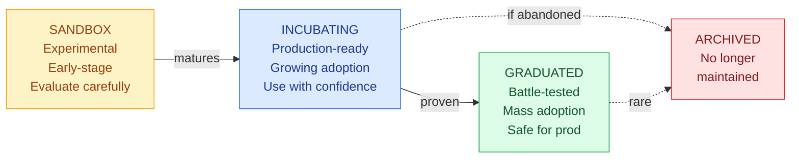
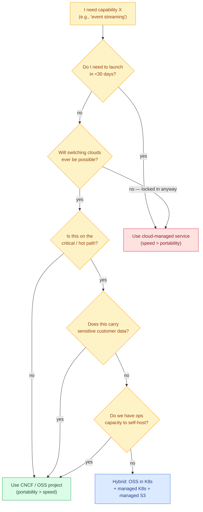
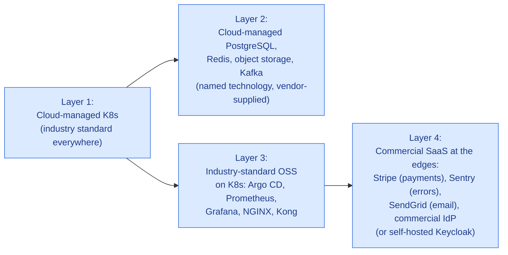
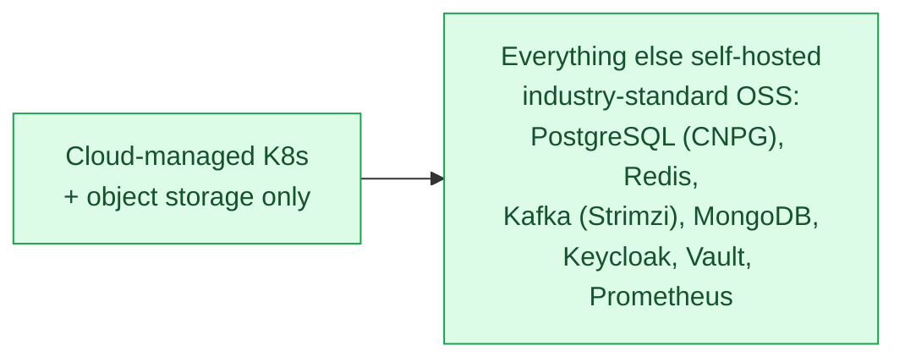
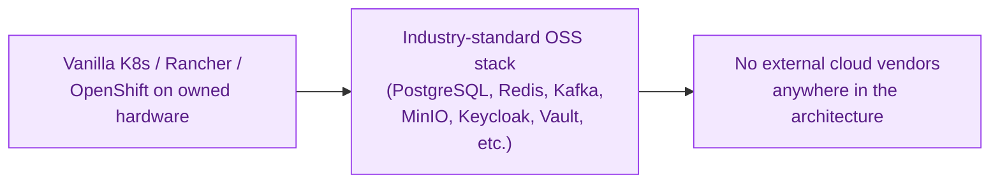

# 14 · Technology Choice Reference

> **Keep this open when picking a technology.** For every architectural capability, this doc lists:
> - The **industry-standard choice** (recognized name, deep talent pool, mature ecosystem)
> - The **self-hosted OSS implementation** (portable, vendor-neutral, lower TCO at scale)
> - The **cloud-provider managed equivalent** (fastest to operate, vendor coupling)
> - **When to choose which** (decision criteria)
>
> **The platform's reference defaults** are listed under each layer. Cloud-managed alternatives are shown for use at deployment time when binding the design to a specific cloud.

---

## 1. About CNCF — Quick Primer

### What is CNCF?

**CNCF (Cloud Native Computing Foundation)** is a vendor-neutral non-profit under the Linux Foundation that hosts and governs the world's most important cloud-native open-source projects.

| Aspect | Detail |
|---|---|
| **Founded** | 2015 |
| **Parent** | Linux Foundation |
| **Members** | 800+ companies (Google, Microsoft, AWS, IBM, Red Hat, Intel, Cisco, Oracle, …) |
| **Hosted projects** | 200+ |
| **Flagship** | Kubernetes (donated by Google in 2015) |
| **Website** | [cncf.io](https://cncf.io) · [landscape.cncf.io](https://landscape.cncf.io) |

### CNCF's Definition of "Cloud Native"

> *"Cloud-native technologies empower organizations to build and run scalable applications in modern, dynamic environments such as public, private, and hybrid clouds. Containers, service meshes, microservices, immutable infrastructure, and declarative APIs exemplify this approach."*

### CNCF Project Maturity Levels



| Level | Production Risk | Examples |
|---|---|---|
| **Graduated** | LOW — used by tens of thousands of orgs in production | Kubernetes, Prometheus, Helm, Argo CD, Envoy, Istio, OPA, Falco, Harbor, containerd, etcd, gRPC, Linkerd, Jaeger, Fluentd, Vitess, KEDA |
| **Incubating** | MEDIUM — production-grade but newer, evaluate fit | Argo Rollouts, OpenTelemetry, Knative, Cilium, Envoy Gateway, Strimzi, Kyverno, Crossplane, Backstage, NATS, Notary, Karpenter |
| **Sandbox** | HIGHER — early-stage, prove value before scaling | CloudNativePG, OpenFGA, KubeVela, KCL, KubeStellar |

### Why CNCF Matters for Our Design

CNCF-aligned tech gives us:

```mermaid
mindmap
  root((Why CNCF<br/>Matters))
    Vendor Neutrality
      Multi-company governance
      No single owner can change rules
      Open public roadmap
    Production Maturity
      Used at Google · Netflix · Spotify · Comcast
      Proven at petabyte / billion-req scale
      Established CVE / security process
    Portability
      Same project runs on any cloud
      Same project runs on-prem
      Same project runs in customer environment
    Skills & Talent
      Engineers move between companies easily
      Conferences (KubeCon) cross-pollinate
      Hire from huge global pool
    Long-Term Viability
      Foundation prevents abandonment
      Multi-vendor support
      Community-driven priorities
```

---

## 2. Decision Framework — How to Choose

Before reaching for a specific technology, walk through this decision tree:



### Trade-Off Cheat Sheet

| If you optimize for… | …choose this |
|---|---|
| **Speed to ship** | Cloud-managed service |
| **Lowest infra $** | OSS on K8s |
| **Lowest TCO incl. ops** | Hybrid (managed K8s + OSS workloads) |
| **No vendor lock-in** | CNCF / OSS only |
| **Compliance / sovereignty** | OSS (deployable on-prem) |
| **Minimum ops headcount** | Cloud-managed |
| **Multi-cloud / DR** | CNCF / OSS only |
| **Smallest team possible** | Cloud-managed |
| **Customer self-hosting** | CNCF / OSS only |

---

## 3. Master Technology Reference Table

For every capability the platform needs, here's the **industry-standard technology** (named in the design), its maturity status, and the **managed equivalent on each major cloud** (chosen at deployment time).

> **Convention:** **Bold** = the platform's reference default. Cloud columns show the managed equivalent that satisfies the same role.

> **All technologies in the bold "OSS" column are industry-standard.** They are recognized names with deep talent pools — engineers can be hired quickly and customers know what they are. CNCF status is shown for transparency; we choose tools because they are the industry standard, not because they happen to be CNCF.

---

### 3.1 Container Orchestration

| Capability | CNCF / OSS | Status | AWS | GCP | Azure |
|---|---|---|---|---|---|
| Kubernetes cluster | **Kubernetes** | Graduated | EKS / EKS Auto Mode | **GKE Autopilot** / GKE Standard | AKS / AKS Automatic |
| Container runtime | **containerd** | Graduated | (built-in to EKS) | (built-in) | (built-in) |
| K8s package manager | **Helm** | Graduated | (use Helm) | (use Helm) | (use Helm) |
| K8s GitOps | **Argo CD** / **Flux** | Graduated / Graduated | (use Argo CD) | Cloud Deploy + Argo CD | (use Argo CD) |
| Multi-cluster mgmt | **Cluster API** + **Karmada** | Incubating / Sandbox | EKS Connector | Anthos Fleet / GKE Hub | Azure Arc-enabled K8s |
| Cluster autoscaler | **Cluster Autoscaler** / **Karpenter** | (CNCF) / Incubating | Karpenter (best on EKS) | GKE built-in | AKS built-in |
| Container registry | **Harbor** | Graduated | ECR | Artifact Registry | ACR |

**When to use what:**
- **Managed K8s control plane** (EKS / GKE / AKS) is almost always worth it — saves serious ops effort, costs $0-$73/cluster/mo.
- **Helm + Argo CD** is the standard regardless of cloud.
- **Harbor self-hosted** when you need image signing + scanning bundled and free; **cloud registry** when you don't want to operate another service.

---

### 3.2 Service Mesh & Networking

| Capability | CNCF / OSS | Status | AWS | GCP | Azure |
|---|---|---|---|---|---|
| Service mesh | **Istio** / **Linkerd** | Graduated / Graduated | App Mesh (being deprecated) | Anthos Service Mesh | Service Mesh on AKS / OSM |
| Ingress controller | **NGINX Ingress** / Traefik | (Apache OSS) | ALB Ingress | GKE Ingress (GCLB) | App Gateway Ingress |
| API Gateway | **Kong** / **Envoy Gateway** | (Kong Inc) / Incubating | API Gateway / App Mesh | API Gateway / Apigee | API Management |
| CNI (pod networking) | **Cilium** / Calico | Graduated / (OSS) | VPC CNI / Cilium | Dataplane v2 (Cilium-based) | Azure CNI / Cilium |
| Network policy | **Cilium NetworkPolicy** / Calico | Graduated | Calico / Cilium | Network Policy (built-in) | Calico / Cilium |
| Service discovery | **CoreDNS** (built-in to K8s) | Graduated | (built-in) | (built-in) | (built-in) |
| L4 load balancer | **MetalLB** (on-prem) | (CNCF Sandbox) | NLB | GCLB (TCP) | Standard LB |
| L7 load balancer | **Envoy** / **NGINX** | Graduated / (OSS) | ALB | GCLB (HTTP/S) | App Gateway |
| Service to service mTLS | **Istio** / **SPIRE** | Graduated / Graduated | App Mesh + ACM | ASM | OSM + Key Vault |
| Cluster CA / cert mgmt | **cert-manager** | Graduated | ACM / Private CA | Certificate Manager | Key Vault |

**When to use what:**
- **Istio** is the safer choice for new clusters needing mesh; **Linkerd** is simpler and lighter.
- **Kong** has the best developer portal experience; **Envoy Gateway** is the future for K8s Gateway API standard.
- **Cilium** is becoming the default CNI everywhere because of its eBPF-based observability.

---

### 3.3 Serverless & Event-Driven

| Capability | CNCF / OSS | Status | AWS | GCP | Azure |
|---|---|---|---|---|---|
| FaaS / scale-to-zero | **Knative Serving** / **OpenFaaS** | Incubating / (OSS) | Lambda / Fargate | **Cloud Run** | Functions / Container Apps |
| Event-driven autoscaling | **KEDA** | Graduated | (use KEDA) | (use KEDA) | (use KEDA) |
| Workflow orchestration | **Argo Workflows** / **Temporal** | Graduated / (OSS) | Step Functions | Workflows | Logic Apps / Durable Functions |
| Event router | **Knative Eventing** / **NATS** | Incubating / Incubating | EventBridge | Eventarc | Event Grid |
| Cron / scheduling | **CronJob** (K8s native) | (built-in) | EventBridge Scheduler | Cloud Scheduler | Logic Apps |
| Batch processing | **Argo Workflows** + **K8s Jobs** | Graduated | AWS Batch | GCP Batch | Azure Batch |

**When to use what:**
- **KEDA** is universal — runs on any K8s, integrates with 60+ event sources (Kafka, RabbitMQ, Postgres, Redis, even cloud queues).
- **Knative** when you want scale-to-zero HTTP services without owning Lambda/CloudRun.
- **Argo Workflows** for multi-step batch jobs (way more powerful than Step Functions and portable).

---

### 3.4 Databases

| Capability | CNCF / OSS | Status | AWS | GCP | Azure |
|---|---|---|---|---|---|
| PostgreSQL (operator) | **CloudNativePG** | Sandbox | RDS for PostgreSQL / Aurora PG | **Cloud SQL for PG** / AlloyDB | Azure DB for PostgreSQL |
| MySQL (operator) | Vitess / Percona | Graduated / (OSS) | RDS for MySQL / Aurora MySQL | Cloud SQL for MySQL | Azure DB for MySQL |
| MongoDB (operator) | **MongoDB Community Operator** / Percona | (MongoDB Inc) | DocumentDB | (use Atlas) | Cosmos DB (Mongo API) |
| Cassandra | **K8ssandra** / Apache Cassandra | (Apache) | Keyspaces | (use Datastax) | Cosmos DB (Cassandra API) |
| Wide-column NoSQL | **ScyllaDB** | (OSS) | DynamoDB | Bigtable | Cosmos DB |
| Time-series | **VictoriaMetrics** / **Prometheus** | (OSS) / Graduated | Timestream | (use Prometheus) | Azure Data Explorer |
| Search | **OpenSearch** / **Meilisearch** | (Apache) / (OSS) | OpenSearch Service | (use OpenSearch on GKE) | Azure AI Search |
| Vector DB | **Qdrant** / **Weaviate** / **pgvector** | (OSS) | OpenSearch + kNN / Aurora pgvector | Vertex AI Vector Search | Azure AI Search vectors |
| Graph DB | **Neo4j Community** / **Dgraph** | (OSS) | Neptune | (use Neo4j on GKE) | Cosmos DB (Gremlin) |
| Analytics warehouse | **ClickHouse** / **Apache Druid** | (Apache) / (Apache) | Redshift / Athena | **BigQuery** | Synapse / Fabric |
| Federated query | **Trino** / **Apache Drill** | (OSS) / (Apache) | Athena | BigQuery Omni | Synapse |

**When to use what:**
- **For OLTP (Postgres):** Use cloud-managed (RDS / Cloud SQL / Azure DB) for first 12 months — saves ops; switch to **CloudNativePG** when you want multi-cloud DR or cost optimization at scale.
- **For NoSQL document (MongoDB):** **MongoDB Atlas** SaaS is usually cheaper than operating yourself for small-medium scale.
- **For analytics warehouse:** **BigQuery** is the easiest if you're on GCP; **ClickHouse** is the most portable.
- **Vector DBs:** **pgvector extension in Postgres** is the simplest if you already have Postgres.

---

### 3.5 Caching & In-Memory

| Capability | CNCF / OSS | Status | AWS | GCP | Azure |
|---|---|---|---|---|---|
| Key-value cache | **Redis** / **Valkey** (CNCF fork) / **DragonflyDB** | (OSS) / Sandbox | ElastiCache for Redis / Valkey | Memorystore for Redis / Valkey | Cache for Redis |
| In-memory DB | **KeyDB** / **Redis** | (OSS) | MemoryDB for Redis | Memorystore | Cache for Redis Enterprise |
| Distributed cache | **Hazelcast** / **Apache Ignite** | (OSS) / (Apache) | ElastiCache | Memorystore | Cache for Redis |

**Note on Redis licensing (2024 change):** Redis Inc. changed Redis to a source-available license. The CNCF fork **Valkey** is the truly OSS continuation. Cloud providers are migrating to Valkey:
- AWS: ElastiCache for Valkey (available)
- GCP: Memorystore for Valkey (available)
- Azure: Cache for Redis remains Redis-licensed

**When to use what:**
- For greenfield: **Valkey** (CNCF, free, drop-in Redis replacement).
- If sticking with Redis: use the cloud-managed offering for small scale; OSS Redis on K8s for full control.

---

### 3.6 Messaging & Event Streaming

| Capability | CNCF / OSS | Status | AWS | GCP | Azure |
|---|---|---|---|---|---|
| Event streaming (Kafka) | **Strimzi** (Kafka operator) / **Redpanda** | Incubating / (OSS) | **MSK** / MSK Serverless | (use Confluent Cloud) | Event Hubs (Kafka API) |
| Message queue | **NATS** / **RabbitMQ** | Incubating / (OSS) | SQS | Pub/Sub | Service Bus |
| Pub/sub | **NATS JetStream** / Kafka | Incubating | SNS / EventBridge | **Pub/Sub** | Event Grid |
| Stream processing | **Apache Flink** / **Kafka Streams** | (Apache) | Kinesis Data Analytics / Managed Flink | Dataflow | Stream Analytics |
| CDC (change data capture) | **Debezium** | (OSS) / Incubating | DMS | Datastream | Data Factory |
| WebSocket / real-time | **Centrifugo** / **NATS** | (OSS) / Incubating | API Gateway WS / IoT Core | (custom) | SignalR Service |

**When to use what:**
- **Kafka via Strimzi** is the most portable choice — runs identically on any K8s.
- **NATS** is much lighter than Kafka — great for service-to-service messaging where you don't need infinite retention.
- **MSK / Event Hubs (Kafka API)** are good escape hatches if you don't want to operate Kafka yourself.

---

### 3.7 Identity & Authentication

| Capability | CNCF / OSS | Status | AWS | GCP | Azure |
|---|---|---|---|---|---|
| SSO / IdP | **Keycloak** | Incubating (joined 2023) | Cognito | Identity Platform / Firebase Auth | Azure AD B2C / Entra ID External |
| SAML 2.0 provider | **Keycloak** / **Authentik** | Incubating / (OSS) | Cognito (limited) | Identity Platform | Entra ID |
| OAuth 2.0 / OIDC server | **Keycloak** / **Ory Hydra** / **Authentik** | Incubating / (OSS) / (OSS) | Cognito | Identity Platform | Entra ID |
| Workload identity | **SPIFFE / SPIRE** | Graduated | IAM Roles for Service Accounts (IRSA) | Workload Identity | Workload Identity (AKS) |
| Authorization (fine-grained) | **OPA** / **Cedar** / **OpenFGA** | Graduated / (OSS) / Sandbox | IAM / Verified Permissions | IAM | RBAC / Entra Perm Mgmt |
| Authentication library | **dex** / **oauth2-proxy** | (OSS) / (OSS) | (Cognito SDK) | (Identity Platform SDK) | (MSAL SDK) |

**When to use what:**
- **Keycloak** for customer-facing SSO with per-tenant IdP federation — vastly more flexible than cloud IdPs for B2B SaaS.
- **Cloud IdP** (Cognito / Identity Platform / Entra ID) for internal admin auth where simplicity matters most.
- **SPIFFE/SPIRE** for cross-cluster, cross-cloud workload identity.

---

### 3.8 Secrets & Configuration

| Capability | CNCF / OSS | Status | AWS | GCP | Azure |
|---|---|---|---|---|---|
| Secrets manager | **HashiCorp Vault** (OSS edition) / **Infisical** | (HashiCorp BSL) / (OSS) | Secrets Manager | Secret Manager | Key Vault |
| K8s secrets injection | **External Secrets Operator** | Incubating | (use ESO) | (use ESO) | (use ESO) |
| Sealed secrets in Git | **Sealed Secrets** (Bitnami) | (OSS) | (use Sealed Secrets) | (use Sealed Secrets) | (use Sealed Secrets) |
| Encryption (KMS) | **Vault Transit Engine** | (HashiCorp) | KMS | Cloud KMS | Key Vault Managed HSM |
| Certificate mgmt | **cert-manager** | Graduated | ACM | Certificate Manager | Key Vault Certs |
| Config feature flags | **OpenFeature** / **Flagsmith** / **Unleash** | Incubating / (OSS) / (OSS) | AppConfig | (use OpenFeature) | App Configuration |
| Dynamic config | **etcd** / **Consul** | Graduated / (HashiCorp) | AppConfig | Runtime Config | App Configuration |

**Note on Vault licensing:** HashiCorp moved Vault to BSL in 2023. The **OpenBao** fork (Linux Foundation) is the true OSS continuation. Functional drop-in replacement.

**When to use what:**
- **External Secrets Operator + Vault/OpenBao** is the most portable pattern.
- **Cloud-native secret managers** (Secrets Manager, Secret Manager, Key Vault) are fine for single-cloud — ESO supports all of them as backends.
- **cert-manager** is universal — no real alternative needed.

---

### 3.9 Object & File Storage

| Capability | CNCF / OSS | Status | AWS | GCP | Azure |
|---|---|---|---|---|---|
| Object storage (S3-compatible) | **MinIO** / **SeaweedFS** / **Ceph RGW** | (OSS) | **S3** | **GCS** (S3-compat via interop) | Blob Storage |
| Distributed file system | **CephFS** / **GlusterFS** / **JuiceFS** | (OSS) | EFS | Filestore | Azure Files |
| Block storage (PVC RWO) | **Longhorn** / **OpenEBS** / **Rook-Ceph** | Incubating / (OSS) / Graduated | EBS | Persistent Disk | Managed Disk |
| Backup / archive | **Velero** / **Restic** / **Kopia** | (OSS) | S3 Glacier / Backup | Archive / Backup | Blob Archive / Backup |
| Backup of K8s + PVCs | **Velero** / **Kasten K10** | (OSS) / (commercial) | Backup for EKS | Backup for GKE | Backup for AKS |

**When to use what:**
- **S3 / GCS / Blob managed** is almost always cheaper than self-hosting MinIO at <100TB scale.
- **MinIO** when you need on-prem or want S3-compatible API in a multi-cloud setup.
- **Velero** is the de facto K8s backup tool — works with any S3-compatible backend.

---

### 3.10 Observability — Metrics

| Capability | CNCF / OSS | Status | AWS | GCP | Azure |
|---|---|---|---|---|---|
| Metrics collection | **Prometheus** | Graduated | Amazon Managed Prometheus (AMP) | Cloud Monitoring (Prometheus-compat) | Azure Monitor (Prometheus-compat) |
| Metrics storage (long-term) | **Thanos** / **Cortex** / **Mimir** | Incubating / Incubating / (OSS) | AMP (Prom managed) | Cloud Monitoring | Azure Monitor / Managed Grafana |
| Node-level metrics | **node-exporter** | (Prometheus) | CloudWatch Agent | Ops Agent | Azure Monitor Agent |
| K8s metrics | **kube-state-metrics** | (Prometheus) | Container Insights | GKE Monitoring | Container Insights |
| Real-user monitoring (RUM) | **Faro** (Grafana) | (OSS) | CloudWatch RUM | Cloud Trace + RUM | Application Insights RUM |
| Synthetic monitoring | **Blackbox Exporter** / **Checkly** | (OSS) | CloudWatch Synthetics | Cloud Monitoring Uptime | Application Insights Availability |
| SLO management | **Sloth** / **OpenSLO** | (OSS) | (custom) | (custom) | (custom) |

---

### 3.11 Observability — Logs

| Capability | CNCF / OSS | Status | AWS | GCP | Azure |
|---|---|---|---|---|---|
| Log collection | **Fluent Bit** / **Vector** | Graduated / (OSS) | CloudWatch Agent | Ops Agent | Azure Monitor Agent |
| Log aggregation (heavy) | **OpenSearch** / **Elasticsearch** | (Apache) / (Elastic) | OpenSearch Service | (use OS on GKE) | Azure AI Search |
| Log aggregation (light) | **Loki** / **VictoriaLogs** | (Grafana OSS) / (OSS) | CloudWatch Logs | Cloud Logging | Log Analytics |
| Log shipping | **Fluentd** / **Logstash** / **Vector** | Graduated / (Elastic) / (OSS) | Kinesis Firehose | Pub/Sub + Dataflow | Event Hubs + Stream Analytics |

**When to use what:**
- **Loki** is the cheapest log storage at any scale (uses MinIO/S3 as backend; only indexes labels).
- **OpenSearch** when you need full-text search on logs.
- **Cloud-native log services** (CloudWatch Logs / Cloud Logging / Log Analytics) are easy but **expensive at scale** — $0.50-$2.30 per GB ingested.

---

### 3.12 Observability — Traces

| Capability | CNCF / OSS | Status | AWS | GCP | Azure |
|---|---|---|---|---|---|
| Distributed tracing | **OpenTelemetry** (instrumentation) | Incubating | X-Ray | Cloud Trace | Application Insights |
| Trace storage | **Tempo** / **Jaeger** / **Zipkin** | (Grafana OSS) / Graduated / (OSS) | X-Ray | Cloud Trace | Application Insights |
| OpenTelemetry collector | **OTel Collector** | Incubating | (use OTel) | (use OTel) | (use OTel) |

**When to use what:**
- **OpenTelemetry is the universal instrumentation standard** — all clouds support OTLP ingest now.
- **Tempo** for cheap trace storage (uses MinIO/S3 backend).
- **Jaeger** if you want a more feature-rich UI than Tempo.

---

### 3.13 Observability — Visualization

| Capability | CNCF / OSS | Status | AWS | GCP | Azure |
|---|---|---|---|---|---|
| Dashboards | **Grafana** (OSS) | (Grafana Labs OSS) | Amazon Managed Grafana (AMG) | (use Grafana on GKE) | Azure Managed Grafana |
| Alerting | **Alertmanager** (Prometheus) | (Prometheus) | CloudWatch Alarms | Cloud Monitoring Alerts | Azure Monitor Alerts |
| Incident management | **Grafana OnCall** / PagerDuty / Opsgenie | (OSS) / commercial | (use commercial) | (use commercial) | (use commercial) |
| Status pages | **Cachet** / **Atlassian Statuspage** | (OSS) / commercial | (use commercial) | (use commercial) | (use commercial) |

**When to use what:**
- **Grafana is universal** — use it everywhere. Cloud-managed Grafana saves you from running it but uses identical config.
- **PagerDuty / Opsgenie** for on-call paging (no good OSS equivalent).

---

### 3.14 Security & Policy

| Capability | CNCF / OSS | Status | AWS | GCP | Azure |
|---|---|---|---|---|---|
| Policy engine (general) | **OPA** | Graduated | (use OPA) | (use OPA) | Azure Policy |
| K8s admission policy | **OPA Gatekeeper** / **Kyverno** | Graduated / Incubating | (use either) | Policy Controller (uses Gatekeeper) | Azure Policy for K8s (uses Gatekeeper) |
| Runtime security | **Falco** | Graduated | GuardDuty + Falco | Security Command Center | Defender for Cloud |
| Vulnerability scanning (images) | **Trivy** / **Grype** | (Aqua OSS) / (Anchore OSS) | ECR Scan / Inspector | Container Analysis | Defender for Containers |
| Image signing | **Cosign** (Sigstore) | (LF project) | ECR signing | Binary Authorization | ACR + Notation |
| SBOM generation | **Syft** / **CycloneDX** / **SPDX** | (Anchore OSS) | Inspector | Container Analysis | Defender for Containers |
| Network policy | **Cilium** / Calico | Graduated | (use Cilium / Calico) | Network Policy / Cilium | Calico / Cilium |
| Web application firewall | **ModSecurity** + OWASP CRS | (OWASP OSS) | AWS WAF | Cloud Armor | Front Door WAF / WAF on App Gateway |
| Bot management | **Coraza** (OWASP) / Cloudflare | (OSS) / commercial | Shield Advanced | Cloud Armor | Front Door |
| DDoS protection | (CDN-provided) | — | Shield Standard (free) / Advanced | Cloud Armor | DDoS Protection |
| CSPM (cloud security posture) | **Prowler** / **CloudSploit** | (OSS) | Security Hub / Inspector | Security Command Center | Defender for Cloud |
| Threat detection | **Falco** | Graduated | GuardDuty | Security Command Center | Defender for Cloud |
| Compliance scanning | **Open Cluster Management** / **Compliance Operator** | (OSS) | Audit Manager | Security Command Center | Defender for Cloud |

**When to use what:**
- **Trivy + Falco + cert-manager + OPA + Kyverno** is the universal cloud-native security stack — same setup everywhere.
- **Cloud-native CSPM** (Security Hub / SCC / Defender) is worth using for the cloud-account layer (IAM misconfig detection, etc.); CNCF tools cover the K8s/app layer.

---

### 3.15 CI/CD & DevOps

| Capability | CNCF / OSS | Status | AWS | GCP | Azure |
|---|---|---|---|---|---|
| CI runner | **Tekton** / GitHub Actions self-hosted / **Drone** | Graduated / commercial / (OSS) | CodeBuild | Cloud Build | Azure Pipelines |
| CD (GitOps) | **Argo CD** / **Flux** | Graduated / Graduated | (use either) | Cloud Deploy + Argo CD | (use either) |
| Progressive delivery | **Argo Rollouts** / **Flagger** | Incubating / (OSS) | App Mesh + CodeDeploy | (custom) | (custom) |
| Pipeline as code | **Tekton** / **Dagger** | Graduated / (OSS) | CodePipeline | Cloud Build | Azure Pipelines |
| Git server (self-hosted) | **Gitea** / **GitLab CE** | (OSS) / (OSS) | CodeCommit | Source Repositories | Azure Repos |
| Artifact storage | **Harbor** / **Sonatype Nexus** / **JFrog Artifactory CE** | Graduated / (OSS) / commercial | CodeArtifact | Artifact Registry | Azure Artifacts |
| Renovate / dep updates | **Renovate** (Mend) / Dependabot | (OSS) | Dependabot | Dependabot | Dependabot |
| Container build | **Buildah** / **Kaniko** / **buildx** | (OSS) / (OSS) / (Docker) | CodeBuild | Cloud Build | Azure Pipelines |

**When to use what:**
- **GitHub Actions** (free for OSS, generous free tier) + **Argo CD** is the simplest modern pipeline.
- **Tekton** when you want pipelines as K8s CRDs and full pipeline portability.
- **Cloud-native CI/CD** (CodeBuild / Cloud Build / Pipelines) is fine if you're single-cloud and want one fewer thing to operate.

---

### 3.16 Infrastructure as Code

| Capability | CNCF / OSS | Status | AWS | GCP | Azure |
|---|---|---|---|---|---|
| Multi-cloud IaC | **OpenTofu** (Terraform fork) / **Pulumi** | (Linux Foundation) / (Pulumi OSS) | CloudFormation / CDK | Deployment Manager / Config Connector | Bicep / ARM |
| Cloud resources as K8s | **Crossplane** | Incubating | ACK (AWS Controllers for K8s) | Config Connector | Azure Service Operator |
| Manifest templating | **Helm** / **Kustomize** | Graduated / (built-in K8s) | (use Helm / Kustomize) | (same) | (same) |
| Policy as code (IaC) | **OPA Conftest** / **Checkov** | Graduated / (OSS) | (use either) | (same) | (same) |
| Config language | **CUE** / **KCL** | (OSS) / Sandbox | (custom) | (custom) | (custom) |

**Note on Terraform licensing:** HashiCorp moved Terraform to BSL in 2023. **OpenTofu** (under Linux Foundation) is the OSS fork — 100% compatible. Use OpenTofu for new projects.

**When to use what:**
- **OpenTofu + Helm + Argo CD** is the universal stack — same code deploys to any cloud.
- **Crossplane** when you want everything (apps + cloud resources) managed through one K8s control plane.
- **Cloud-native IaC** (CloudFormation / Deployment Manager / Bicep) is fine for single-cloud-forever, but locks you in.

---

### 3.17 Communications (Email / SMS / Push)

| Capability | CNCF / OSS | Status | AWS | GCP | Azure |
|---|---|---|---|---|---|
| Transactional email | **Postal** (self-hosted) / SMTP relay | (OSS) | **SES** | (use SendGrid) | Communication Services |
| Bulk email | **listmonk** | (OSS) | SES | (use SendGrid / Mailgun) | Communication Services |
| SMS | (use Twilio / MessageBird) | — | SNS | (use Twilio) | Communication Services |
| Push notifications | **Centrifugo** / FCM | (OSS) | SNS / Pinpoint | Firebase Cloud Messaging | Notification Hubs |
| Voice / video | (use Twilio / Jitsi self-hosted) | (OSS) | Chime / Connect | (use Twilio) | Communication Services |

**Reality check:** SMS and voice are **telco interconnection problems** — there's no good OSS solution. Just pick Twilio.

---

### 3.18 Frontend, CDN & DNS

| Capability | CNCF / OSS | Status | AWS | GCP | Azure |
|---|---|---|---|---|---|
| Frontend hosting | (S3 + CDN) / **Coolify** / **Dokku** | (OSS) | S3 + CloudFront / Amplify | GCS + Cloud CDN | Static Web Apps / Storage + Front Door |
| CDN (commercial) | **Cloudflare** / **Fastly** / **BunnyCDN** | commercial | CloudFront | Cloud CDN / Media CDN | Front Door / CDN |
| DNS | **PowerDNS** / **CoreDNS** (external) | (OSS) | Route 53 | Cloud DNS | Azure DNS |
| GeoDNS / Smart DNS | **PowerDNS** / Cloudflare | (OSS) | Route 53 (latency / geo routing) | Cloud DNS (Geo) | Traffic Manager |
| Domain registrar | (Cloudflare / Porkbun / Namecheap) | commercial | Route 53 Domains | Cloud Domains | App Service Domains |

**When to use what:**
- **Cloudflare** is hard to beat for CDN + DNS + DDoS combined (generous free tier).
- **Cloud-native CDNs** (CloudFront / Cloud CDN / Front Door) are integrated with rest of cloud but more expensive at scale.

---

### 3.19 Cost Management

| Capability | CNCF / OSS | Status | AWS | GCP | Azure |
|---|---|---|---|---|---|
| K8s cost attribution | **OpenCost** / **Kubecost** | Incubating / (commercial OSS) | (use OpenCost) | (use OpenCost) | (use OpenCost) |
| Cloud cost monitoring | **Komiser** / **Infracost** | (OSS) / (OSS) | Cost Explorer + Trusted Advisor | Cost Management | Cost Management + Advisor |
| FinOps practices | (FinOps Foundation) | — | (Trusted Advisor) | (Active Assist) | (Advisor) |

---

## 4. Quick Recommendations by Profile

### 4.1 "Industry-Standard, ship fast on one cloud" *(recommended for greenfield B2B SaaS)*



**Trade-off:** Some cloud-managed dependencies for the data tier (acceptable — every cloud offers Postgres / Redis / Kafka / object storage). Application code remains portable.

### 4.2 "Industry-Standard, multi-cloud from day one"



**Trade-off:** More ops effort; full portability. Recommended once the platform reaches multi-region or multi-cloud scale.

### 4.3 "Sovereign / regulated / customer self-hosted"



**Trade-off:** Highest ops burden; full sovereignty and customer-deployability. Required for air-gapped or regulated-data environments.

---

## 5. Red Flags — Avoid These Anti-Patterns

| Anti-Pattern | Why Bad | Fix |
|---|---|---|
| Using cloud-managed services that wrap CNCF tools (e.g., AWS Managed Kafka where you only use vanilla Kafka APIs) without an abstraction layer | Locks you in for marginal ops savings | Use the OSS version OR abstract through Helm values |
| Putting business logic in cloud-vendor proprietary services (Step Functions, Logic Apps, Cosmos stored procedures) | Total rewrite needed to switch clouds | Keep logic in your code; use cloud services only for infra primitives |
| Mixing vendor IAM with K8s RBAC inconsistently | Permissions audit nightmare | Use OPA / Keycloak as the single authoritative source of truth |
| Using a cloud's proprietary metrics format | Can't unify observability across clouds | Use OpenTelemetry as the universal collector |
| Hard-coding cloud endpoints in app code | Breaks portability | Use environment variables + Helm values |

---

## 6. The "Switch Cost" Test

Before adopting any technology, ask:

> **"If I needed to replace this with an equivalent on another cloud, how long would it take?"**

| Switch Cost | Examples | Verdict |
|---|---|---|
| **<1 day** | Postgres, Redis (Valkey), MinIO/S3, Kafka — same API everywhere | SAFE to use anywhere |
| **<1 week** | Cloud-managed K8s, Cloud-managed Postgres — same SQL, different operations | ACCEPTABLE lock-in |
| **<1 month** | Cognito → Keycloak, Cosmos DB → MongoDB — protocol-level swap | THINK CAREFULLY |
| **>3 months** | Step Functions, Cosmos stored procs, IAM-tied business logic | AVOID for new code |

---

## 7. CNCF Resources

| Resource | URL | Purpose |
|---|---|---|
| **CNCF Landscape** | [landscape.cncf.io](https://landscape.cncf.io) | Interactive map of all CNCF + adjacent projects |
| **CNCF Project Index** | [cncf.io/projects](https://www.cncf.io/projects) | Official list of hosted projects with maturity |
| **TAGs (Technical Advisory Groups)** | [github.com/cncf/toc](https://github.com/cncf/toc) | Where project graduations are debated |
| **KubeCon + CloudNativeCon** | [events.linuxfoundation.org](https://events.linuxfoundation.org) | Annual conferences (3× per year, different regions) |
| **CNCF Slack** | [slack.cncf.io](https://slack.cncf.io) | Direct access to project maintainers |
| **End User Case Studies** | [cncf.io/case-studies](https://www.cncf.io/case-studies) | Real production stories from large orgs |
| **Certified Kubernetes Conformance** | [cncf.io/training/certification/software-conformance](https://www.cncf.io/training/certification/software-conformance/) | Verify a K8s distro is standards-compliant |

---

## 8. Decision Log Template

For every significant tech choice, capture an **ADR (Architecture Decision Record)**:

```markdown
# ADR-NNN: Choose <Technology> for <Capability>

## Status
Accepted | Superseded by ADR-XXX | Deprecated

## Date
YYYY-MM-DD

## Context
- What capability is needed?
- What scale / SLA / compliance requirements?
- What team skills do we have?

## Options Considered

### Option A: <CNCF/OSS option>
- Pros:
- Cons:
- Switch cost if abandoned: <hours/days/weeks>

### Option B: <Cloud-managed option>
- Pros:
- Cons:
- Switch cost if abandoned: <hours/days/weeks>

## Decision
We choose <option>.

## Rationale
<3-5 sentences>

## Consequences
- Pros: <list>
- Cons: <list>
- Reversibility: <HIGH / MEDIUM / LOW>

## Review Trigger
Re-evaluate this decision when: <e.g., scale exceeds X, team grows beyond Y, multi-cloud required>
```

Store ADRs in `learning-platform-config/docs/adr/`.

---

## 9. TL;DR — The Industry-Standard Defaults

These are the platform's default technology choices. Every name in this list is **industry-standard** — engineers know it, customers recognize it, and a managed equivalent exists on every major cloud (selectable at deployment time).

| Capability | Default Technology | Deployment Pattern (Recommended) |
|---|---|---|
| Container orchestration | **Kubernetes** | Cloud-provider managed control plane |
| RDBMS | **PostgreSQL** | Cloud-managed PG service for first 12 months → CloudNativePG later if needed |
| Cache | **Redis** | Cloud-managed Redis service (or Valkey/Redis operator self-hosted) |
| Object storage | **S3-API object storage** | Cloud-managed object store (cheaper than self-hosted at <100TB) |
| NoSQL (audit) | **MongoDB** | Managed MongoDB Atlas early; MongoDB operator later if needed |
| Search (optional) | **Elasticsearch / OpenSearch** | Cloud-managed search service |
| Messaging | **Apache Kafka** | Cloud-managed Kafka (recommended) or Strimzi operator self-hosted |
| Identity | **OIDC + SAML provider** | Keycloak self-hosted (reference) or commercial IdP (Auth0 / WorkOS) |
| Secrets | **External Secrets Operator** + cloud-managed secrets manager (initial) → HashiCorp Vault / OpenBao when needed |
| API gateway | **Kong Gateway** (or Envoy Gateway) | Self-hosted in cluster |
| Service mesh | **Istio** (introduce when 15+ services) | Self-hosted in cluster |
| Serverless / autoscale | **Knative + KEDA** | Self-hosted in cluster |
| Workflow orchestration | **Argo Workflows** | Self-hosted in cluster |
| Observability | **Prometheus + Loki + Tempo + Grafana** | Self-hosted in cluster (commercial APM layered on top if desired) |
| Distributed tracing | **OpenTelemetry + Tempo / Jaeger** | OpenTelemetry standard everywhere |
| Error tracking | **Sentry** | Commercial SaaS or self-hosted |
| CI | **GitHub Actions** | Commercial SaaS |
| GitOps CD | **Argo CD** | Self-hosted in cluster |
| Container registry | **Cloud-managed OCI registry** (or Harbor self-hosted) | Cloud-managed default |
| Infrastructure as Code | **Terraform / OpenTofu + Helm** | Commercial / OSS |
| Policy engine | **Kyverno** (simpler) or **OPA Gatekeeper** | Self-hosted in cluster |
| Runtime security | **Falco** | Self-hosted in cluster |
| Image scanning | **Trivy** | CI integration |
| Cost monitoring | **OpenCost** | Self-hosted in cluster |
| CDN + DNS | Independent CDN vendor (e.g., Cloudflare) or cloud-managed CDN | Commercial SaaS |
| Transactional email | **Commercial provider** (e.g., SendGrid, Postmark, SES) | Commercial SaaS |
| SMS | **Twilio** (or equivalent) | Commercial SaaS |
| Payments / billing | **Stripe** (or equivalent — Adyen, Chargebee) | Commercial SaaS |
| Status page | Commercial service or Cachet self-hosted | Either |
| On-call / paging | **PagerDuty** (or Opsgenie) | Commercial SaaS |
| Frontend framework | **React + TypeScript** | Build-time |
| Backend language | **Node.js (TypeScript)** or **Java (Spring Boot)** or **Go** | Containers in K8s |

These choices give you **~80% of the benefits of cloud-native portability with ~20% of the operational complexity** of a fully self-hosted stack. Every layer uses **industry-standard, widely-adopted technologies** — recognized by customers, easy to hire for, and mature enough for production from day one.
