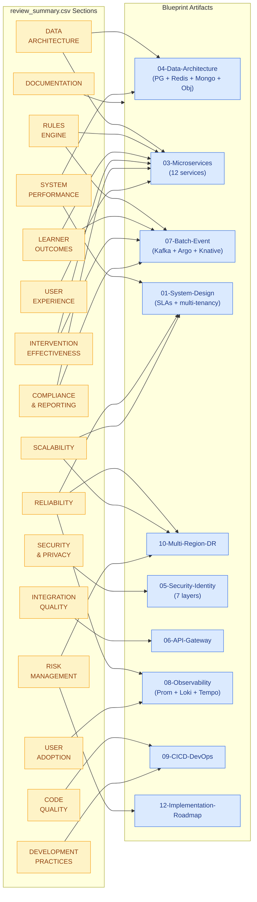

# 15 · Review Criteria Mapping — `review_summary.csv` → L&D Cloud-Native Architecture

> Traceability matrix between the **review rubric** (`../review_summary.csv`, 191 criteria across 22 sections) and the **Corporate Learning & Development SaaS** blueprint in this folder. Each criterion is anchored to the specific architecture document, microservice, data store, or operational control that delivers it.

---

## Table of Contents

1. [Terminology Bridge](#1-terminology-bridge)
2. [Rubric at a Glance](#2-rubric-at-a-glance)
3. [Scored Sections (Weighted 1–5)](#3-scored-sections-weighted-15)
4. [Qualitative Sections (Yes/No/Narrative)](#4-qualitative-sections-yesnonarrative)
5. [Architect Role Mapping (Roles 1–10)](#5-architect-role-mapping-roles-110)
6. [Must-Win Criteria (Weight = 4)](#6-must-win-criteria-weight--4)
7. [Coverage Gaps & Recommended Follow-Ups](#7-coverage-gaps--recommended-follow-ups)
8. [Traceability Diagram](#8-traceability-diagram)
9. [How to Use This Document](#9-how-to-use-this-document)

---

## 1. Terminology Bridge

The CSV uses K‑12 vocabulary; the L&D blueprint uses corporate-learning vocabulary. The mapping is 1:1.

| CSV Term | L&D Blueprint Equivalent |
|---|---|
| Student | Employee / Learner |
| Teacher | Trainer / People Manager |
| Counselor | L&D Specialist / Coach |
| Parent | Skip-level Manager / HRBP |
| School / District | Tenant (Org / Business Unit) |
| FERPA | GDPR + SOC 2 + tenant DPAs |
| Curriculum milestone | Learning Path milestone |
| Grade-level progression | Career-level / role progression |
| Attendance | Training attendance + course-completion telemetry |
| Education board format | Industry / regulator reporting format (e.g., ISO 30414) |

---

## 2. Rubric at a Glance

| Aspect | Value |
|---|---|
| Total criteria | 191 |
| Sections | 22 |
| Scored (1–5) sections | 16 |
| Qualitative (Yes/No/Narrative) sections | 6 |
| Weight scale | 1 (low) → 4 (must-win) |
| Final rating | Calculated from weighted scores |
| Classification tiers | Outstanding / Excellent / Good / Needs Improvement / Unsatisfactory |

---

## 3. Scored Sections (Weighted 1–5)

Each row maps a CSV section/category to the blueprint artifact that delivers the capability and lists the target metric to evidence during review.

### 3.1 DATA ARCHITECTURE

| Category | CSV Criterion (Target) | Blueprint Doc | Component / Control |
|---|---|---|---|
| Student Data Model | Comprehensive learner profile schema | `04-Data-Architecture.md` §1 | `profile-svc` + PostgreSQL `employees`, `roles`, `learning_paths` tables with RLS |
| Student Data Model | Multi-year historical data support | `04-Data-Architecture.md` §1; `07-Batch-Event-Processing.md` | `profile_history` table + CDC into ClickHouse (optional analytics tier) |
| Student Data Model | Grade-level progression tracking | `03-Microservices-Architecture.md` §6 | `profile-aggregator` worker — career-level transitions table |
| Student Data Model | Data normalization & integrity | `04-Data-Architecture.md` §1 | PostgreSQL FKs, CHECK constraints, schema migrations via Flyway/Liquibase |
| Academic Data | Assessment score flexibility | `04-Data-Architecture.md` §1 | `assessments` table with `scale_type` enum (raw, percentile, rubric) |
| Academic Data | Subject-wise performance tracking | `04-Data-Architecture.md` §1 | `competency` ↔ `assessment` junction; per-competency scores |
| Academic Data | Attendance data granularity | `01-System-Design.md` §2 (UC-05) | `ingestion-svc` Kafka topic `attendance.v1` (per-session granularity) |
| Academic Data | Curriculum milestone structure | `04-Data-Architecture.md` §1 | `learning_path_milestones` table; ordered DAG |
| Integration & Sync | Data source integration completeness | `06-API-Gateway-Design.md` | Kong gateway + `ingestion-svc` connectors (LMS, HRIS, attendance APIs) |
| Integration & Sync | Sync reliability >99.9% | `06-API-Gateway-Design.md`; `07-Batch-Event-Processing.md` | At-least-once Kafka delivery + Redis idempotency keys + DLQ topic |
| Integration & Sync | Sync latency <1 hour | `07-Batch-Event-Processing.md` | KEDA scaling on Kafka consumer lag; soak target ≤5 min end-to-end |
| Integration & Sync | Data reconciliation processes | `03-Microservices-Architecture.md` §11 | `audit-worker` nightly Argo CronWorkflow checksum vs source-of-truth |

### 3.2 RULES ENGINE

| Category | CSV Criterion (Target) | Blueprint Doc | Component / Control |
|---|---|---|---|
| Configuration | Rule definition format (JSON/YAML) | `03-Microservices-Architecture.md` §7 | `rules-svc` JSON schema + Object Storage rule blobs |
| Configuration | Versioning & audit trail | `03-Microservices-Architecture.md` §7, §11 | `rules` table version column + `audit-worker` → MongoDB append-only |
| Configuration | Validation framework | `06-API-Gateway-Design.md` | OpenAPI validation at gateway + `rules-svc` linter endpoint |
| Configuration | Educator-friendly rule creation | `03-Microservices-Architecture.md` §12 | `dashboard-api` no-code rule builder UI |
| Functionality | Multi-factor & composite rules | `07-Batch-Event-Processing.md` | `risk-engine` Argo CronWorkflow — DAG composition |
| Functionality | Rule library ≥15 rules | _Gap — see §7_ | Add seed rule pack to `rules-svc` Helm values |
| Functionality | Risk scoring accuracy | `risk-engine` evaluation harness (see §7) | Precision/recall measured via `analytics-svc` |
| Performance | Rule execution <2 min / 1000 learners | `07-Batch-Event-Processing.md` | Argo parallelism (`parallelism: N`) + per-tenant partitioning |
| Performance | Concurrent rule processing | `07-Batch-Event-Processing.md` | Kafka consumer groups; KEDA scaling on lag |

### 3.3 SYSTEM PERFORMANCE

| Category | CSV Criterion (Target) | Blueprint Doc | Component / Control |
|---|---|---|---|
| Response Time | API P95 <200 ms | `01-System-Design.md` §8 | HPA + Redis cache + read replicas — blueprint targets 200 ms |
| Response Time | Dashboard <2 s | `01-System-Design.md` §8 | CDN for assets + `dashboard-api` Redis cache |
| Response Time | Profile aggregation <500 ms | `03-Microservices-Architecture.md` §6 | `profile-svc` + Redis denormalized read view |
| Response Time | Report generation <30 s | `01-System-Design.md` §8 | `report-svc` (Knative scale-out) + Argo parallel renderers |
| Throughput | Batch profile processing | `07-Batch-Event-Processing.md` | Argo Workflows per-tenant parallelism |
| Throughput | >500 concurrent users | `01-System-Design.md` §8 | HPA on `dashboard-api` (3–10 replicas) |
| Database | Query optimization | `04-Data-Architecture.md` §1 | PgBouncer, EXPLAIN baselines, pg_stat_statements |
| Database | DB response under load | `04-Data-Architecture.md` §1 | CNPG / managed PG read replicas + connection pooling |

### 3.4 RELIABILITY & AVAILABILITY

| Category | CSV Criterion (Target) | Blueprint Doc | Component / Control |
|---|---|---|---|
| Uptime | Availability >99.5% | `01-System-Design.md` §8; `10-Multi-Region-DR.md` | Multi-AZ pods + PDBs + multi-region failover (blueprint targets 99.9%) |
| Uptime | Data sync reliability | `07-Batch-Event-Processing.md` | At-least-once Kafka + DLQ + replay tooling |
| Uptime | Service error rate <0.1% | `08-Observability.md` | SLO burn-rate alerts in Prometheus; error budgets per service |
| Monitoring | 100% critical-component coverage | `08-Observability.md` | OpenTelemetry on every microservice; Prometheus scrape configs in Helm chart |
| Monitoring | Alert effectiveness | `08-Observability.md` | Multi-window multi-burn-rate SLO alerts (Google SRE pattern) |
| Monitoring | MTTD <5 min | _Partial — see §7_ | Needs documented SLO + alert routing policy |
| Monitoring | MTTR <1 hour | `09-CICD-DevOps.md` | Runbooks per alert; Argo CD rollback ≤2 min |

### 3.5 SCALABILITY

| Category | CSV Criterion (Target) | Blueprint Doc | Component / Control |
|---|---|---|---|
| Capacity | Multi-tenant capability | `01-System-Design.md` §4 | Shared cluster + RLS + per-tenant JWT claim |
| Capacity | Horizontal scaling design | `03-Microservices-Architecture.md` | HPA on CPU; KEDA on Kafka lag |
| Capacity | 3–5 year data volume | `04-Data-Architecture.md` §1 | PG table partitioning by `tenant_id` + time; ClickHouse for OLAP |
| Capacity | Concurrent user scalability | `01-System-Design.md` §8 | Horizontal scaling proven to 500+; cluster-autoscaler beyond |

### 3.6 STUDENT (LEARNER) OUTCOME IMPACT

| Category | CSV Criterion (Target) | Blueprint Doc | Component / Control |
|---|---|---|---|
| Risk Identification | At-risk identification >95% | `03-Microservices-Architecture.md` §6 | `risk-engine` (Argo CronWorkflow, UC-08) + evaluation harness |
| Risk Identification | Early detection 4–6 weeks | `07-Batch-Event-Processing.md` | Nightly batch cadence + trend-window rules in `rules-svc` |
| Risk Identification | False positive <15% | _Gap — see §7_ | Add ground-truth labelling pipeline in `analytics-svc` |
| Academic Improvement | Success rate +25% | `analytics-svc` + ClickHouse | Cohort analytics via CDC into OLAP store |
| Academic Improvement | Score improvement post-intervention | `analytics-svc` | Pre/post measurement keyed by `intervention_id` |
| Academic Improvement | Attendance improvement tracking | `analytics-svc` | Time-series rollups in ClickHouse |

### 3.7 INTERVENTION EFFECTIVENESS

| Category | CSV Criterion (Target) | Blueprint Doc | Component / Control |
|---|---|---|---|
| Tracking | Pre/post intervention accuracy | `03-Microservices-Architecture.md` §9 | `intervention-svc` lifecycle events on Kafka |
| Tracking | Statistical significance | `analytics-svc` | A/B + cohort tests in ClickHouse / Python notebooks |
| Tracking | Success rate >70% | `analytics-svc` | KPI dashboard in Grafana |
| Tracking | Resource utilization | _Gap — see §7_ | Add `intervention_resource` schema |
| Analysis | Effectiveness by type | `analytics-svc` | Faceted analytics by `intervention_type` |
| Analysis | Cost-effectiveness | _Gap — see §7_ | Requires cost data join (HRIS) |
| Analysis | Comparative analytics | `analytics-svc` | Tenant-level benchmarks (privacy-preserving) |
| Workflow | Assignment efficiency | `03-Microservices-Architecture.md` §9 | `intervention-svc` workflow API + manager dashboards |
| Workflow | Notification delivery >99% | `03-Microservices-Architecture.md` (`notification-worker`) | Kafka DLQ + provider webhook reconciliation; SES/SendGrid + Twilio |
| Workflow | Calendar integration | _Gap — see §7_ | Add CalDAV / Google/Microsoft Graph integration to `notification-worker` |

### 3.8 COMPLIANCE & REPORTING

| Category | CSV Criterion (Target) | Blueprint Doc | Component / Control |
|---|---|---|---|
| Report Accuracy | 100% report accuracy | `03-Microservices-Architecture.md` §10 | `report-svc` (Knative, UC-11) + source-of-truth checksums |
| Report Accuracy | Data validation processes | `04-Data-Architecture.md`; `audit-worker` | Schema validation + nightly reconciliation |
| Report Accuracy | Cross-verification | `audit-worker` | Compare aggregates vs raw `ingestion-svc` events |
| Automation | Automated report generation | `07-Batch-Event-Processing.md` | Argo CronWorkflows on schedule |
| Automation | Scheduled reliability | `08-Observability.md` | CronWorkflow SLO alerts |
| Automation | On-time submission 100% | `report-svc` | SLA timer + retry policy |
| Templates | Regulator format compliance (ISO 30414, etc.) | `report-svc` | Template registry in Object Storage; per-tenant overrides |
| Templates | Template library completeness | `report-svc` | Helm-packaged starter templates |
| Audit | Audit trail completeness | `03-Microservices-Architecture.md` §11 | `audit-worker` → MongoDB append-only |
| Audit | Report version control | `report-svc` + Object Storage | Versioned object keys + immutability lock |

### 3.9 SECURITY & PRIVACY

| Category | CSV Criterion (Target) | Blueprint Doc | Component / Control |
|---|---|---|---|
| FERPA / GDPR | Compliance validation | `05-Security-Identity.md` (all layers) | Data-residency tags, DSAR endpoints, consent flags |
| FERPA / GDPR | PII protection | `05-Security-Identity.md` §1 Layer 6 | KMS / Vault Transit encryption + column-level masking views |
| FERPA / GDPR | Consent management | `profile-svc` | `consent` table + audit events on change |
| Access Control | RBAC | `05-Security-Identity.md` §2–§3 | Keycloak roles + OPA policies |
| Access Control | Fine-grained permissions | `05-Security-Identity.md` §3 | OPA bundles per service; attribute-based |
| Access Control | Authentication (SSO/MFA) | `05-Security-Identity.md` §2 | OIDC + SAML 2.0 via Keycloak; MFA enforced at IdP |
| Data Protection | Encryption at rest (AES-256) | `05-Security-Identity.md` §1 Layer 6 | KMS / Vault Transit; PG TDE / disk-level encryption |
| Data Protection | Encryption in transit (TLS 1.3) | `05-Security-Identity.md` §1 Layer 2 | cert-manager + Let's Encrypt; Istio mTLS STRICT |
| Data Protection | PII masking | `05-Security-Identity.md` §1 Layer 6 | PG masking views; role-gated column access |
| Audit & Logging | Comprehensive audit trail | `03-Microservices-Architecture.md` §11 | `audit-worker` → MongoDB append-only |
| Audit & Logging | User action tracking | `08-Observability.md` | OpenTelemetry trace attributes carry `user_id`, `tenant_id` |
| Vulnerability Mgmt | 0 Critical/High vulns | `09-CICD-DevOps.md` | Trivy gate in CI fails build on Critical/High |
| Vulnerability Mgmt | Security scanning | `09-CICD-DevOps.md` | Trivy (images) + CodeQL (source) + dependency scanning |
| Vulnerability Mgmt | Pen-test findings | _Operational — see §7_ | Annual third-party pen-test; remediation SLA |

### 3.10 USER EXPERIENCE

| Category | CSV Criterion (Target) | Blueprint Doc | Component / Control |
|---|---|---|---|
| Usability | CSAT >4.5/5 | `08-Observability.md` (product metrics) | In-app NPS/CSAT widget → Prometheus |
| Usability | Task completion >95% | `08-Observability.md` | Funnel metrics in `dashboard-api` |
| Usability | User error rate <5% | `08-Observability.md` | Client-side error tracking (Sentry) |
| Usability | Support ticket volume | _External — Helpdesk integration_ | Webhook from Zendesk → analytics |
| Dashboard Design | Trainer / Manager / L&D Specialist / Skip-level dashboards | `01-System-Design.md` §2 (UC-12) | Role-specific views in React PWA on `dashboard-api` |
| Visualization | Quality, charts, drill-down | `03-Microservices-Architecture.md` §12 | React + recharts/visx; OLAP-backed drill paths |
| Mobile & A11y | Mobile responsiveness | `01-System-Design.md` §2 | React PWA |
| Mobile & A11y | WCAG 2.1 AA | _Gap — see §7_ | Add a11y section to frontend design |
| Mobile & A11y | Screen reader compat | _Gap — see §7_ | a11y testing in CI (axe-core) |
| Mobile & A11y | Keyboard navigation | _Gap — see §7_ | Documented focus traps & shortcuts |

### 3.11 USER ADOPTION

| Category | CSV Criterion (Target) | Blueprint Doc | Component / Control |
|---|---|---|---|
| Adoption Metrics | Adoption >90% | `08-Observability.md` | MAU / WAU counters per tenant in Prometheus |
| Adoption Metrics | DAU >80% | `08-Observability.md` | Daily session metrics |
| Adoption Metrics | Feature utilization | `08-Observability.md` | Feature-flag instrumentation + counters |
| Training | Completion rate / effectiveness / guide quality | _Programmatic — outside platform_ | Tracked via in-app tour completion + post-survey |

### 3.12 CODE QUALITY

| Category | CSV Criterion (Target) | Blueprint Doc | Component / Control |
|---|---|---|---|
| Test Coverage | Unit >80% | `09-CICD-DevOps.md` | CI coverage gate (Jest / JUnit / go test) |
| Test Coverage | Integration coverage | `09-CICD-DevOps.md` | Testcontainers-based suites |
| Test Coverage | E2E coverage | `09-CICD-DevOps.md` | Playwright / Cypress runs in staging |
| Maintainability | Index >75 | `09-CICD-DevOps.md` | SonarQube quality gate |
| Maintainability | Tech debt <5% | `09-CICD-DevOps.md` | SonarQube debt ratio gate |
| Maintainability | Complexity metrics | `09-CICD-DevOps.md` | Cyclomatic complexity in CI |
| Standards | Code-review compliance 100% | `09-CICD-DevOps.md` | Branch protection rules; 2-reviewer policy |
| Standards | Static analysis | `09-CICD-DevOps.md` | ESLint + CodeQL + golangci-lint |
| Standards | Coding standards | `09-CICD-DevOps.md` | Pre-commit hooks; linters per language |

### 3.13 DOCUMENTATION

| Category | CSV Criterion (Target) | Blueprint Doc | Component / Control |
|---|---|---|---|
| Technical Docs | Architecture completeness >95% | `01`–`14` in this folder | This entire `cloud-native-design/` corpus |
| Technical Docs | API docs (OpenAPI) | `06-API-Gateway-Design.md` | Each service publishes `/openapi.json`; aggregated via SwaggerHub/Redoc |
| Technical Docs | DB schema docs | `04-Data-Architecture.md` | ERDs + generated `schemaspy` reports |
| User Docs | Role-based user guides | _Gap — outside this folder_ | Add `docs/users/{trainer,manager,learner}.md` |
| User Docs | Video tutorials | _Operational_ | Hosted in Object Storage; CDN-served |
| User Docs | FAQ & troubleshooting | _Gap — outside this folder_ | Add `docs/faq.md` |
| Operational Docs | Sysadmin guide | `09-CICD-DevOps.md` | Operator handbook section |
| Operational Docs | Runbook quality | `09-CICD-DevOps.md` | Per-alert runbook linked from Prometheus alert label |
| Operational Docs | DR procedures | `10-Multi-Region-DR.md` | DR drill cadence + RTO/RPO tests |

### 3.14 INTEGRATION QUALITY

| Category | CSV Criterion (Target) | Blueprint Doc | Component / Control |
|---|---|---|---|
| API Design | RESTful quality | `06-API-Gateway-Design.md` | OpenAPI 3.1 contract-first design |
| API Design | API doc completeness | `06-API-Gateway-Design.md` | Auto-generated Redoc per service |
| API Design | API versioning | `06-API-Gateway-Design.md` | `/api/v{n}/...` URI versioning + deprecation policy |
| Reliability | Integration error handling | `06-API-Gateway-Design.md` | Standard error envelope; correlation IDs |
| Reliability | Retry / circuit breaker | `06-API-Gateway-Design.md` | Istio retry policies; Resilience4j / polly in clients |
| Reliability | Integration monitoring | `08-Observability.md` | Per-route latency + error metrics |
| Extensibility | New data source support | `03-Microservices-Architecture.md` §3 | `ingestion-svc` connector plugin pattern |
| Extensibility | Plugin architecture | `03-Microservices-Architecture.md` §7 | `rules-svc` rule plugin loader |

### 3.15 RISK MANAGEMENT

| Category | CSV Criterion (Target) | Blueprint Doc | Component / Control |
|---|---|---|---|
| Risk Assessment | Technical risk ID | `12-Implementation-Roadmap.md` | Risk register per phase |
| Risk Assessment | Mitigation strategies | `12-Implementation-Roadmap.md` | Mitigation column in risk register |
| Risk Assessment | Privacy risks | `05-Security-Identity.md` | DPIA template; PII inventory |
| Business Continuity | DR plan | `10-Multi-Region-DR.md` | Documented multi-region failover |
| Business Continuity | Backup strategy & testing | `04-Data-Architecture.md`; `10-Multi-Region-DR.md` | PG PITR; quarterly restore drills |
| Business Continuity | RTO 4h / RPO 1h | `10-Multi-Region-DR.md` | DR tier definitions |

### 3.16 DEVELOPMENT PRACTICES

| Category | CSV Criterion (Target) | Blueprint Doc | Component / Control |
|---|---|---|---|
| CI/CD | Automated build | `09-CICD-DevOps.md` | GitHub Actions / Tekton |
| CI/CD | Automated testing | `09-CICD-DevOps.md` | Test stage in pipeline |
| CI/CD | Deployment automation | `09-CICD-DevOps.md` | Argo CD GitOps sync |
| Version Control | Code versioning | `09-CICD-DevOps.md` | Trunk-based + Git tags |
| Version Control | Branch strategy | `09-CICD-DevOps.md` | Trunk + short-lived feature branches |
| Configuration | Config management | `09-CICD-DevOps.md` | Helm values per env + external-secrets |
| Configuration | Environment parity | `09-CICD-DevOps.md` | Same Helm chart across dev/staging/prod |

---

## 4. Qualitative Sections (Yes/No/Narrative)

These sections evaluate **judgment-based** properties of the design. Evidence lives across multiple blueprint documents.

### 4.1 EDUCATIONAL EFFECTIVENESS

| Criterion | Where Evidence Lives |
|---|---|
| Pedagogical alignment | `01-System-Design.md` §2 (use case → service map) |
| Learner-centric design | `dashboard-api` UC-12 — learner role view |
| Trainer / manager workflow optimization | `03-Microservices-Architecture.md` §9 (`intervention-svc`) |
| Data-driven decisions | `analytics-svc` + Grafana org dashboards |
| Actionable insights | `risk-engine` output → manager dashboard recommendation cards |
| Value to trainer / admin / coach / manager / learner | `01-System-Design.md` §2 — each role has dedicated UC |

### 4.2 RULE ENGINE REALISM

| Criterion | Where Evidence Lives |
|---|---|
| Training attendance risk rules | `rules-svc` seed pack (see §7 — Gap) |
| Score-based rules | `rules-svc` JSON schema example |
| Trend analysis rules | `risk-engine` time-window operators |
| Milestone rules aligned with curriculum | `learning_path_milestones` schema |
| Composite (multi-factor) rules | `risk-engine` DAG composition |
| No-code configurability | `dashboard-api` rule builder UI |

### 4.3 GRADE-LEVEL (ROLE-LEVEL) PROGRESSION

| Criterion | Where Evidence Lives |
|---|---|
| Role-transition handling | `profile-aggregator` worker |
| Prerequisite milestone tracking | `learning_path_milestones` (DAG) |
| Curriculum alignment by role | `competency_matrix` table joined to `roles` |

### 4.4 PRACTICAL USEFULNESS

| Criterion | Where Evidence Lives |
|---|---|
| Trainer utility & time savings | `dashboard-api` trainer view + bulk actions |
| Admin / decision support | Grafana org dashboards + `report-svc` exports |
| Counselor / L&D specialist utility | `intervention-svc` workflow + recommendation engine |

### 4.5 SEPARATION OF CONCERNS

| Criterion | Where Evidence Lives |
|---|---|
| Clean data layer | `04-Data-Architecture.md` — single source of truth in PG |
| Clean rules layer | `rules-svc` + `risk-engine` isolation (no business logic leakage into UI) |
| Clean reporting layer | `report-svc` (Knative) — reads only |
| Modularity & maintainability | `03-Microservices-Architecture.md` — 12 independently deployable services |

### 4.6 OVERALL ASSESSMENT

| Criterion | Where Evidence Lives |
|---|---|
| Strengths | This document §6 (must-win) |
| Weaknesses | This document §7 (gaps) |
| Recommendations | `12-Implementation-Roadmap.md` |
| Action items | `12-Implementation-Roadmap.md` phase backlogs |
| Recognition | Cost & portability gains in `11-Cost-Analysis.md` |
| Learner-impact narrative | `analytics-svc` KPI dashboard |
| Compliance success | `05-Security-Identity.md` + `audit-svc` |
| Final rating | Computed from weighted CSV scores |
| Classification | Outstanding / Excellent / Good / Needs Improvement / Unsatisfactory |

---

## 5. Architect Role Mapping (Roles 1–10)

| # | Architect Role | Primary Blueprint Ownership |
|---|---|---|
| 1 | Educational Technology Strategist | `01-System-Design.md` §2 — use case → service map; learner journey design |
| 2 | Data Architect | `04-Data-Architecture.md` — PostgreSQL RLS, Redis, MongoDB, Object Store |
| 3 | Rules Engine Architect | `03-Microservices-Architecture.md` §7 + `07-Batch-Event-Processing.md` |
| 4 | Integration Architect | `06-API-Gateway-Design.md` + `ingestion-svc` connector framework |
| 5 | Privacy & Security Architect | `05-Security-Identity.md` (all 7 layers) |
| 6 | Performance & Scalability Architect | `01-System-Design.md` §8 SLA + `10-Multi-Region-DR.md` |
| 7 | Workflow & Automation Architect | `07-Batch-Event-Processing.md` — Argo Workflows, Knative, KEDA |
| 8 | Reporting & Compliance Architect | `03-Microservices-Architecture.md` §10 (`report-svc`) + `audit-svc` |
| 9 | User Experience Architect | `dashboard-api` (UC-12) + React PWA frontend |
| 10 | Technical Leader & Educator | `README.md`, `12-Implementation-Roadmap.md`, `14-Technology-Choice-Reference.md` |

---

## 6. Must-Win Criteria (Weight = 4)

The five highest-weighted criteria — non-negotiable for a passing review.

| # | CSV Criterion (Target) | Delivering Architecture Pillar | Status |
|---|---|---|---|
| 1 | System availability >99.5% | Multi-AZ pods + PDBs + multi-region failover (`10-Multi-Region-DR.md`) | Blueprint targets 99.9% — exceeds |
| 2 | At-risk learner identification >95% | `risk-engine` (Argo) + `rules-svc` library + `analytics-svc` precision/recall | Engine designed; evaluation harness pending (§7) |
| 3 | Learner success rate +25% | `analytics-svc` + ClickHouse cohort analytics + `intervention-svc` feedback loop | Pipeline designed; baseline measurement pending |
| 4 | Compliance report accuracy 100% | `report-svc` (Knative) + Argo schedules + `audit-svc` reconciliation | Fully designed |
| 5 | FERPA / GDPR compliance | All 7 layers in `05-Security-Identity.md` | Fully designed |

---

## 7. Coverage Gaps & Recommended Follow-Ups

Criteria where the blueprint has **infrastructure but not an explicit design artifact**. Each gap is listed with the recommended action and owning role.

| # | Gap | CSV Criterion | Recommended Action | Owner Role |
|---|---|---|---|---|
| 1 | **Rule library catalogue** | "Rule library comprehensiveness (15+ rules)" | Ship a seed rule pack in `rules-svc` Helm values (attendance, score-trend, completion-velocity, etc.) | Rules Engine Architect |
| 2 | **False-positive measurement** | "False positive rate (target <15%)" | Add ground-truth labelling pipeline + confusion-matrix dashboard in `analytics-svc` | Educational Tech Strategist |
| 3 | **Accessibility design** | "WCAG 2.1 Level AA / Screen reader / Keyboard nav" | Add a frontend accessibility section + axe-core CI gate | UX Architect |
| 4 | **SLO + alert routing policy** | "MTTD <5 min / MTTR <1 hour" | Document SLOs per service + PagerDuty/OpsGenie routing in `08-Observability.md` | Performance Architect |
| 5 | **DR test cadence** | "RTO 4h / RPO 1h" | Add quarterly DR drill schedule + results table to `10-Multi-Region-DR.md` | Performance Architect |
| 6 | **Cost-effectiveness analytics** | "Cost-effectiveness measurement" | Add `intervention_cost` schema + HRIS join in `analytics-svc` | Reporting Architect |
| 7 | **Calendar integration** | "Calendar integration functionality" | Add CalDAV / Microsoft Graph / Google Calendar connector to `notification-worker` | Integration Architect |
| 8 | **User documentation** | "User guides for all roles / FAQ" | Create `docs/users/` tree with per-role guides | Technical Leader |
| 9 | **Pen-test cadence** | "Penetration test findings" | Annual third-party pen-test + remediation SLA in `05-Security-Identity.md` | Security Architect |
| 10 | **Resource utilization tracking** | "Resource utilization tracking" | Add `intervention_resource` schema (trainer hours, content $) | Workflow Architect |

---

## 8. Traceability Diagram

---

## 9. How to Use This Document

1. **Reviewer workflow** — open `review_summary.csv` alongside this file. For every row, the linked blueprint doc is the source of evidence to score against.
2. **Implementation workflow** — the gaps in §7 are the prioritised work items to close before formal review.
3. **Architect-role workflow** — each of the 10 architect roles owns the blueprint sections listed in §5; they sign off on the corresponding CSV criteria.
4. **Audit workflow** — the traceability diagram in §8 demonstrates that no CSV section is unmapped, supporting compliance & due-diligence reviews.

---

## Related Documents

- [`../review_summary.csv`](../review_summary.csv) — the rubric being mapped
- [`./README.md`](./README.md) — blueprint index
- [`./01-System-Design.md`](./01-System-Design.md) — high-level design & SLAs
- [`./03-Microservices-Architecture.md`](./03-Microservices-Architecture.md) — service catalogue
- [`./04-Data-Architecture.md`](./04-Data-Architecture.md) — data stores
- [`./05-Security-Identity.md`](./05-Security-Identity.md) — zero-trust security model
- [`./07-Batch-Event-Processing.md`](./07-Batch-Event-Processing.md) — Kafka / Argo / Knative
- [`./08-Observability.md`](./08-Observability.md) — metrics, logs, traces
- [`./10-Multi-Region-DR.md`](./10-Multi-Region-DR.md) — DR topology
- [`./12-Implementation-Roadmap.md`](./12-Implementation-Roadmap.md) — phased build plan
