# Industry-Standard Cloud-Native System Design — Corporate Learning SaaS Platform

> **Greenfield architecture blueprint** for a multi-tenant Corporate Learning SaaS — built on **industry-standard, cloud-portable technologies** that customers recognize and engineers can readily hire for. Deployable to **any cloud** or **on-prem** without code changes.

---

## Tooling Philosophy

This blueprint uses **industry-standard, widely-adopted technologies** — chosen first for **customer confidence, hiring depth, and ecosystem maturity**, and second for cloud portability.

| Principle | What It Means in Practice |
|---|---|
| **Boring over bleeding-edge** | We pick technologies with 5+ years of production scale at multiple Fortune 500 companies |
| **Recognized names** | Customers and procurement teams should already know our stack (Postgres, Redis, Kafka, Kubernetes, React) |
| **Deep talent pool** | We can hire experienced engineers within weeks, not months |
| **Cloud-portable, not cloud-coupled** | We name **technologies** (e.g., "PostgreSQL"), not cloud SKUs (no "RDS" or "Cloud SQL") — each cloud's managed equivalent is a deployment-time choice |
| **CNCF where it's the standard** | Kubernetes, Docker, Helm, Prometheus, Grafana, NGINX, Envoy, Terraform — these are industry-standard *and* CNCF/OSS. We use them because they're the standard, not because they're CNCF |
| **Commercial SaaS at the edges** | Where a commercial SaaS gives clearly better DX (payments, error tracking, transactional email), we name those categories — the specific vendor is a procurement choice |

> **"Cloud-portable"** means the design names the *technology* (PostgreSQL, Redis, Apache Kafka, object storage with S3 API). When deployed, you bind that to the appropriate managed service from your cloud provider — or self-host via the corresponding Kubernetes operator. The application code does not change.

---

## What This Folder Is

This folder contains the **greenfield architecture blueprint** for the platform. An earlier draft was sketched using Azure-specific managed services (see [`../PS3_Azure_Architecture_Diagram/`](../PS3_Azure_Architecture_Diagram/)). This blueprint **re-expresses the same use cases** using industry-standard, cloud-portable technologies so the platform can be:

- **Built once, deployed anywhere** — any major cloud, on-prem, hybrid.
- **Independent of any single vendor's roadmap** — no waiting for a managed-service feature to land.
- **Cheaper at scale** — using the platform's managed equivalents (or self-hosted operators) avoids premium PaaS markups.
- **Sovereign-ready** — air-gapped customers (government, finance, regulated industries) can self-host the same stack.
- **Easy to staff** — the stack uses the largest talent pools in the industry.

> **No application has been built yet.** This is the starting blueprint for implementation.

---

## Why Cloud-Portable Instead of Cloud-Coupled?

| Consideration | Cloud-Coupled (Single-Vendor Draft) | Cloud-Portable (This Design) |
|---|---|---|
| **Cloud Choice** | Locked to one vendor | Free to choose at launch — pick cheapest / closest / most-trusted |
| **Future Switching** | Re-platforming required | Re-deploy same manifests on a new cloud |
| **Cost Negotiation** | Single-vendor leverage | Multi-cloud RFP leverage |
| **Regulatory Sovereignty** | Limited to one vendor's regions | Any region, including air-gapped |
| **Talent Pool** | Vendor-certified engineers | Industry-standard skills (Kubernetes + Postgres + Kafka + React — largest pools in the industry) |
| **Innovation Velocity** | Wait for vendor feature releases | Adopt latest OSS releases immediately |
| **DR Options** | DR within one vendor's regions | Cross-cloud DR available |
| **Customer Self-Hosting** | Not possible | Same Helm charts deployable in customer-owned Kubernetes |

---

## Folder Contents

| File | Purpose |
|---|---|
| [`README.md`](./README.md) | This index |
| [`01-System-Design.md`](./01-System-Design.md) | High-level design, principles, 12 use case → service mapping |
| [`02-Architecture-Diagrams.md`](./02-Architecture-Diagrams.md) | All Mermaid architecture diagrams (full + per-layer) |
| [`03-Microservices-Architecture.md`](./03-Microservices-Architecture.md) | 12 microservices — responsibilities, tech stack, scaling |
| [`04-Data-Architecture.md`](./04-Data-Architecture.md) | PostgreSQL (with RLS), Redis, object storage (S3 API), MongoDB, Kafka |
| [`05-Security-Identity.md`](./05-Security-Identity.md) | OIDC/SAML identity, Vault, OPA, mTLS, zero-trust networking |
| [`06-API-Gateway-Design.md`](./06-API-Gateway-Design.md) | Kong / Envoy gateway, per-tenant rate limiting, JWT |
| [`07-Batch-Event-Processing.md`](./07-Batch-Event-Processing.md) | Kafka, Knative, Argo Workflows — risk batch + reports |
| [`08-Observability.md`](./08-Observability.md) | Prometheus, Grafana, Loki, Tempo, OpenTelemetry, error tracking |
| [`09-CICD-DevOps.md`](./09-CICD-DevOps.md) | GitOps with Argo CD + GitHub Actions / Tekton + container registry |
| [`10-Multi-Region-DR.md`](./10-Multi-Region-DR.md) | Multi-cluster topology, geo-routing, DR tiers |
| [`11-Cost-Analysis.md`](./11-Cost-Analysis.md) | Cost projection vs the cloud-coupled alternative |
| [`12-Implementation-Roadmap.md`](./12-Implementation-Roadmap.md) | **Greenfield build plan** — phases from zero to GA |
| [`13-Multi-Cloud-Mapping.md`](./13-Multi-Cloud-Mapping.md) | Service-by-service mapping to each cloud's managed equivalents (deployment-time reference) |
| [`14-Technology-Choice-Reference.md`](./14-Technology-Choice-Reference.md) | **Tech decision reference** — industry-standard defaults plus CNCF/managed alternatives |

---

## Quick Architecture Snapshot

```mermaid
flowchart LR
    subgraph CLIENT["Client Layer"]
        C1["React PWA"]
        C2["Mobile PWA"]
        C3["External LMS"]
    end

    subgraph EDGE["Edge — Any CDN / WAF"]
        E1["CDN<br/>(cloud-provider managed<br/>or independent CDN vendor)"]
        E2["WAF<br/>(ModSecurity / cloud-managed)"]
    end

    subgraph GW["API Gateway"]
        G1["Kong Gateway /<br/>Envoy / Traefik"]
    end

    subgraph K8S["Kubernetes Cluster (Any Cloud)"]
        S1["12 Microservices<br/>(Deployments)"]
        S2["Istio / Linkerd<br/>Service Mesh"]
        S3["Knative + KEDA<br/>Serverless / Autoscale"]
    end

    subgraph DATA["Data — Cloud-Native Operators"]
        D1["PostgreSQL<br/>CloudNativePG"]
        D2["Redis Operator"]
        D3["MinIO / S3-compatible"]
        D4["MongoDB Operator"]
        D5["Strimzi Kafka"]
    end

    subgraph SEC["Security"]
        SE1["Keycloak SSO"]
        SE2["HashiCorp Vault"]
        SE3["OPA Gatekeeper"]
        SE4["cert-manager"]
    end

    subgraph OBS["Observability"]
        O1["Prometheus +<br/>Grafana"]
        O2["Loki Logs"]
        O3["Tempo / Jaeger<br/>Tracing"]
    end

    subgraph DEVOPS["GitOps"]
        DV1["ArgoCD"]
        DV2["Tekton / GitHub<br/>Actions"]
        DV3["Harbor Registry"]
    end

    C1 & C2 --> E1
    C3 --> G1
    E1 --> E2 --> G1
    G1 --> K8S
    K8S --> DATA
    K8S --> SEC
    K8S --> OBS
    DEVOPS --> K8S

    classDef cl fill:#1e293b,color:#94a3b8,stroke:#475569
    classDef ed fill:#fef3c7,color:#92400e,stroke:#f59e0b
    classDef gw fill:#fce7f3,color:#831843,stroke:#ec4899
    classDef k8 fill:#dbeafe,color:#1e3a8a,stroke:#326ce5,stroke-width:3px
    classDef dt fill:#e0f2fe,color:#075985,stroke:#0284c7
    classDef se fill:#fee2e2,color:#7f1d1d,stroke:#dc2626
    classDef ob fill:#dcfce7,color:#14532d,stroke:#16a34a
    classDef dv fill:#f3e8ff,color:#581c87,stroke:#9333ea

    class C1,C2,C3 cl
    class E1,E2 ed
    class G1 gw
    class S1,S2,S3 k8
    class D1,D2,D3,D4,D5 dt
    class SE1,SE2,SE3,SE4 se
    class O1,O2,O3 ob
    class DV1,DV2,DV3 dv
```

---

## Core Technology Stack

All technologies below are **industry-standard** — widely deployed at scale, well-documented, and supported by deep talent pools. "Deployment Pattern" indicates how the technology is typically run.

| Layer | Technology | Deployment Pattern | Why This Choice |
|---|---|---|---|
| **Container Orchestration** | Kubernetes 1.29+ | Cloud-provider managed cluster | De-facto standard for container workloads; portable across clouds |
| **Service Mesh** | Istio (or Linkerd) | Self-managed in cluster | mTLS, traffic management, observability — recognized standard |
| **API Gateway** | Kong Gateway (or Envoy Gateway) | Self-managed in cluster | Mature, plugin ecosystem, enterprise-grade |
| **Ingress** | NGINX (or Envoy / Traefik) | Self-managed in cluster | Ubiquitous; every engineer knows NGINX |
| **CDN + WAF** | CDN + WAF (cloud-managed or independent vendor) | Cloud-provider managed | Use the platform's CDN or a recognized independent vendor |
| **Serverless / Autoscale** | Knative + KEDA | Self-managed in cluster | Event-driven scale-to-zero; standard Kubernetes pattern |
| **Workflow Orchestration** | Argo Workflows | Self-managed in cluster | DAG-based, K8s-native, mature |
| **Identity / SSO** | OIDC + SAML 2.0 provider (Keycloak self-hosted, or commercial IdP) | Self-hosted OR commercial SaaS | Standard protocols; Keycloak default, commercial IdP optional |
| **Authorization** | OPA (Open Policy Agent) | Self-managed in cluster | Policy-as-code standard |
| **Secrets** | HashiCorp Vault + External Secrets Operator (or cloud-provider managed secrets) | Self-hosted OR cloud-managed | Vault is the standard; managed secrets store also acceptable |
| **Certificates** | cert-manager + Let's Encrypt / ACME | Self-managed in cluster | Standard automated certificate lifecycle |
| **Database (RDBMS)** | PostgreSQL | Cloud-provider managed PostgreSQL service (recommended) or self-hosted via CloudNativePG | Postgres = industry standard; managed services available on every cloud |
| **Cache** | Redis | Cloud-provider managed Redis service (recommended) or self-hosted via operator | Universally adopted in-memory store |
| **Object Storage** | S3-compatible object storage | Cloud-provider managed object store (recommended) or self-hosted via MinIO | S3 API is the de-facto standard |
| **NoSQL (Audit)** | MongoDB | Managed MongoDB (e.g., MongoDB Atlas) or self-hosted via operator | Recognized document store, widely adopted |
| **Message Queue / Streaming** | Apache Kafka | Cloud-provider managed Kafka (recommended) or self-hosted via Strimzi operator | Industry standard for both queueing and streaming |
| **Stream Processing** | Kafka Streams or Apache Flink | Self-managed in cluster or managed | Mature stream processors |
| **Real-time / WebSocket** | WebSocket (Centrifugo self-hosted, or commercial SaaS like Ably / Pusher) | Self-hosted OR commercial SaaS | Standard WebSocket protocol |
| **Search (optional)** | Elasticsearch (or OpenSearch) | Cloud-provider managed (recommended) or self-hosted | Industry standard for full-text search |
| **Transactional Email** | SMTP relay (e.g., SendGrid, Postmark, Amazon SES — any commercial provider) | Commercial SaaS | Deliverability needs a specialist vendor |
| **SMS / Voice** | SMS provider (e.g., Twilio, MessageBird) | Commercial SaaS | Use a recognized carrier-grade vendor |
| **Payments** | Stripe (or equivalent — Adyen, Chargebee, etc.) | Commercial SaaS | Industry standard for SaaS billing |
| **Metrics** | Prometheus (+ Thanos for long-term) | Self-managed in cluster | De-facto standard; every Kubernetes shop runs Prometheus |
| **Visualization & Dashboards** | Grafana | Self-managed in cluster | Industry standard dashboarding |
| **Logs** | Loki (or Elastic / OpenSearch) | Self-managed in cluster | Loki = standard for K8s; Elastic remains widely used |
| **Tracing** | Tempo (or Jaeger) + OpenTelemetry instrumentation | Self-managed in cluster | OpenTelemetry is the unified standard |
| **Error Tracking** | Sentry (or equivalent commercial APM) | Commercial SaaS or self-hosted | Standard developer tool |
| **CI** | GitHub Actions (or GitLab CI / Tekton) | Commercial SaaS (managed) | Industry-standard CI |
| **GitOps CD** | Argo CD (or Flux) | Self-managed in cluster | Standard for GitOps-based delivery |
| **Container Registry** | Cloud-provider managed registry (recommended) or self-hosted Harbor | Cloud-managed or self-hosted | Standard OCI registries |
| **Policy Engine** | OPA Gatekeeper (or Kyverno) | Self-managed in cluster | Policy-as-code standard |
| **Runtime Security** | Falco | Self-managed in cluster | Standard runtime threat detection |
| **Image Scanning** | Trivy (or Grype) | CI integration | Standard vulnerability scanning |
| **Infrastructure as Code** | Terraform (or OpenTofu) + Helm | Commercial / OSS | Industry standard for IaC |
| **Frontend Framework** | React + TypeScript | Build-time bundling | Industry-standard SPA framework |
| **Backend Languages** | Node.js (TypeScript) or Java (Spring Boot) or Go | Containers in K8s | Three of the largest engineering talent pools |

---

## How to Read This Documentation

1. **Start here** → `README.md` (you are here)
2. **Understand the design** → `01-System-Design.md`
3. **See the visuals** → `02-Architecture-Diagrams.md`
4. **Dive into specifics** → `03` through `10` (per-domain deep dives)
5. **Plan the build** → `12-Implementation-Roadmap.md`
6. **Compare costs** → `11-Cost-Analysis.md`
7. **Choose a cloud** → `13-Multi-Cloud-Mapping.md`
8. **Pick any individual tech** → `14-Technology-Choice-Reference.md` (the decision-time handbook)

> **All architecture diagrams use [Mermaid](https://mermaid.js.org/)** — they render natively on GitHub, GitLab, Bitbucket, VS Code, and most modern markdown viewers. No screenshots or proprietary tools required.

---

## Relationship to the Original Azure Draft

The original cloud-coupled draft (Azure-specific) lives at:
[`../PS3_Azure_Architecture_Diagram/PS3_Azure_System_Design.html`](../PS3_Azure_Architecture_Diagram/PS3_Azure_System_Design.html)

That draft was useful for:
- Validating that all 12 use cases (UC-01 → UC-12) can be implemented on a managed cloud platform.
- Identifying compute, storage, and networking requirements.
- Providing a "what if we just used one vendor's managed services" baseline for cost and capability comparison.

This blueprint takes the **same 12 use cases, same data model, same SLAs, same security posture** and re-expresses them using portable, industry-standard technology. No information from the original draft is lost — only the vendor specificity.

---

## Status & Next Steps

| Item | Status |
|---|---|
| Blueprint complete | Done |
| Cloud chosen for first deployment | **Decision required** — see [`13-Multi-Cloud-Mapping.md`](./13-Multi-Cloud-Mapping.md) |
| Repository scaffolding | Not started |
| MVP services built | Not started |
| Production launch | TBD per roadmap in [`12-Implementation-Roadmap.md`](./12-Implementation-Roadmap.md) |
