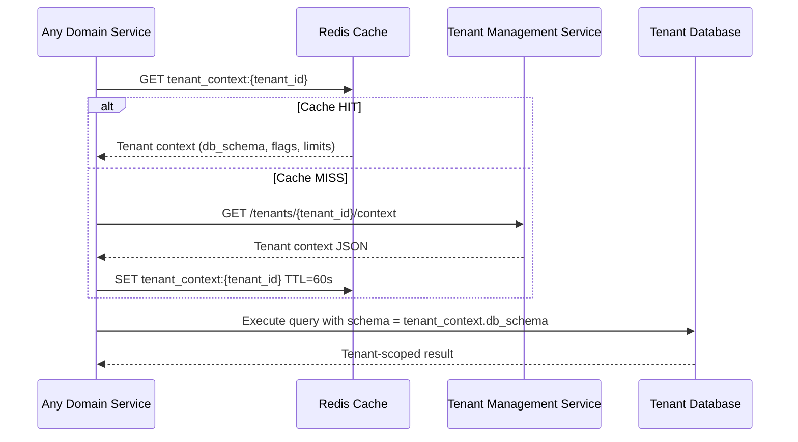

# Tenant Management Service — API Design
## Corporate Learning SaaS — Multi-Tenant Platform

### Document Version: 1.0
### Date: February 2026

---

## 1. Service Overview

The Tenant Management Service (TMS) is the **central control plane** of the SaaS platform. It owns:
- Tenant onboarding and provisioning
- Subscription plan management
- Feature flag configuration
- Tenant-level settings (branding, locale, timezone)
- Billing and usage metering
- Tenant lifecycle (suspend, upgrade, deprovision)

All other microservices query TMS (or its Redis-cached config) to resolve tenant context on every request.

---

## 2. Base URL & Versioning

```
Base URL:  https://api.learntrack.io/tms/v1
Auth:      Bearer token (platform admin JWT) or Service-to-service API key
Headers:
  Content-Type:   application/json
  Authorization:  Bearer <token>
  X-Request-ID:   <uuid>        (for distributed tracing)
```

---

## 3. API Endpoints

---

### 3.1 Tenant Registration & Provisioning

---

#### `POST /tenants` — Register & Provision a New Tenant

Registers a new corporate organisation and automatically provisions their isolated environment.

**Request Body:**
```json
{
  "tenant_name":       "Acme Corp",
  "tenant_type":       "corporate",
  "plan":              "pro",
  "admin_user": {
    "first_name":      "Jane",
    "last_name":       "Doe",
    "email":           "ld.admin@acmecorp.com",
    "phone":           "+1-555-000-1234"
  },
  "organisation": {
    "address":         "100 Corporate Blvd, Chicago, IL 60601",
    "country":         "US",
    "timezone":        "America/Chicago",
    "locale":          "en-US",
    "industry":        "Corporate_LD"
  },
  "billing": {
    "billing_email":   "billing@acmecorp.com",
    "payment_method":  "invoice",
    "billing_cycle":   "annual"
  }
}
```

**Response: `201 Created`**
```json
{
  "tenant_id":         "tenant_acme_corp_a1b2",
  "tenant_name":       "Acme Corp",
  "tenant_type":       "corporate",
  "plan":              "pro",
  "status":            "provisioning",
  "isolation_model":   "schema_per_tenant",
  "db_schema":         "tenant_acme_corp_a1b2",
  "region":            "us-east-1",
  "portal_url":        "https://acmecorp.learntrack.io",
  "admin_user": {
    "user_id":         "USR_admin_001",
    "email":           "ld.admin@acmecorp.com",
    "temp_password":   "REDACTED — sent via email",
    "must_change_pwd": true
  },
  "provisioning_job_id": "prov_job_xyz123",
  "estimated_ready_in":  "PT5M",
  "created_at":          "2026-02-04T12:00:00Z"
}
```

**Provisioning Steps (async, tracked by `provisioning_job_id`):**
1. Create DB schema / dedicated DB
2. Run schema migrations
3. Seed reference data (default rules, report templates)
4. Create admin user in Auth Service
5. Configure feature flags per plan
6. Set up Kafka topics
7. Send welcome email to admin
8. Mark tenant as `active`

---

#### `GET /tenants/provisioning/{job_id}` — Check Provisioning Status

```json
{
  "job_id":    "prov_job_xyz123",
  "tenant_id": "tenant_acme_corp_a1b2",
  "status":    "in_progress",
  "steps": [
    { "step": "create_db_schema",       "status": "completed", "completed_at": "2026-02-04T12:00:10Z" },
    { "step": "run_migrations",         "status": "completed", "completed_at": "2026-02-04T12:00:25Z" },
    { "step": "seed_reference_data",    "status": "completed", "completed_at": "2026-02-04T12:00:40Z" },
    { "step": "create_admin_user",      "status": "in_progress", "completed_at": null },
    { "step": "configure_feature_flags","status": "pending",   "completed_at": null },
    { "step": "setup_kafka_topics",     "status": "pending",   "completed_at": null },
    { "step": "send_welcome_email",     "status": "pending",   "completed_at": null }
  ],
  "started_at":  "2026-02-04T12:00:00Z",
  "completed_at": null
}
```

---

### 3.2 Tenant Retrieval

---

#### `GET /tenants` — List All Tenants *(Platform Admin only)*

**Query Parameters:**

| Parameter | Type | Description |
|---|---|---|
| `status` | string | Filter by: `active`, `suspended`, `provisioning`, `deprovisioned` |
| `plan` | string | Filter by: `starter`, `pro`, `enterprise` |
| `tenant_type` | string | Filter by: `corporate`, `training_provider` |
| `page` | integer | Page number (default: 1) |
| `page_size` | integer | Results per page (default: 20, max: 100) |

**Response: `200 OK`**
```json
{
  "total":    145,
  "page":     1,
  "page_size": 20,
  "tenants": [
    {
      "tenant_id":      "tenant_acme_corp_a1b2",
      "tenant_name":    "Acme Corp",
      "tenant_type":    "corporate",
      "plan":           "pro",
      "status":         "active",
      "employee_count": 1240,
      "region":       "us-east-1",
      "created_at":   "2026-02-04T12:00:00Z"
    }
  ]
}
```

---

#### `GET /tenants/{tenant_id}` — Get Tenant Detail

**Response: `200 OK`**
```json
{
  "tenant_id":       "tenant_acme_corp_a1b2",
  "tenant_name":     "Acme Corp",
  "tenant_type":     "corporate",
  "plan":            "pro",
  "status":          "active",
  "isolation_model": "schema_per_tenant",
  "db_schema":       "tenant_acme_corp_a1b2",
  "region":          "us-east-1",
  "portal_url":      "https://acmecorp.learntrack.io",
  "organisation": {
    "address":       "100 Corporate Blvd, Chicago, IL 60601",
    "country":       "US",
    "timezone":      "America/Chicago",
    "locale":        "en-US",
    "industry":      "Corporate_LD"
  },
  "subscription": {
    "plan":              "pro",
    "billing_cycle":     "annual",
    "renewal_date":      "2027-02-04",
    "max_employees":     5000,
    "current_employees": 1240,
    "max_rules":      50,
    "current_rules":  18
  },
  "feature_flags": {
    "ml_risk_scoring":       false,
    "employee_self_service": true,
    "compliance_reporting":  true,
    "custom_branding":       true,
    "sso_integration":       false,
    "api_access":            true,
    "white_label":           false
  },
  "branding": {
    "logo_url":      "https://cdn.learntrack.io/tenants/acmecorp/logo.png",
    "primary_color": "#003366",
    "favicon_url":   "https://cdn.learntrack.io/tenants/acmecorp/favicon.ico",
    "custom_domain": "learn.acmecorp.com"
  },
  "usage": {
    "employees_active_30d":  1100,
    "api_calls_30d":          48200,
    "storage_used_gb":        2.4,
    "reports_generated_30d":  12
  },
  "created_at":  "2026-02-04T12:00:00Z",
  "updated_at":  "2026-02-10T08:30:00Z"
}
```

---

### 3.3 Tenant Configuration

---

#### `PATCH /tenants/{tenant_id}` — Update Tenant Settings

**Request Body (partial update — only include fields to change):**
```json
{
  "organisation": {
    "timezone": "America/New_York"
  },
  "branding": {
    "primary_color": "#0055AA",
    "logo_url":      "https://cdn.learntrack.io/tenants/acmecorp/logo-v2.png"
  }
}
```

**Response: `200 OK`** — returns updated tenant object.

---

#### `PUT /tenants/{tenant_id}/feature-flags` — Update Feature Flags

**Request Body:**
```json
{
  "ml_risk_scoring":       true,
  "employee_self_service": true,
  "white_label":           false
}
```

**Response: `200 OK`**
```json
{
  "tenant_id": "tenant_acme_corp_a1b2",
  "feature_flags": {
    "ml_risk_scoring":       true,
    "employee_self_service": true,
    "compliance_reporting": true,
    "custom_branding":      true,
    "sso_integration":      false,
    "api_access":           true,
    "white_label":          false
  },
  "updated_at": "2026-02-04T14:00:00Z"
}
```

> Changes are published as `tenant.config.updated` event — all services refresh their cached config within 30 seconds.

---

### 3.4 Subscription & Plan Management

---

#### `POST /tenants/{tenant_id}/subscription/upgrade` — Upgrade Plan

**Request Body:**
```json
{
  "new_plan":        "enterprise",
  "effective_date":  "2026-03-01",
  "billing_cycle":   "annual",
  "notes":           "Customer requested upgrade — approved by sales"
}
```

**Response: `200 OK`**
```json
{
  "tenant_id":       "tenant_acme_corp_a1b2",
  "previous_plan":   "pro",
  "new_plan":        "enterprise",
  "effective_date":  "2026-03-01",
  "migration_job_id": "mig_job_abc456",
  "migration_tasks": [
    "provision_dedicated_database",
    "migrate_data_to_dedicated_db",
    "provision_dedicated_k8s_namespace",
    "enable_enterprise_feature_flags",
    "update_billing"
  ],
  "estimated_migration_time": "PT30M"
}
```

---

#### `POST /tenants/{tenant_id}/subscription/downgrade` — Downgrade Plan

**Request Body:**
```json
{
  "new_plan":       "pro",
  "effective_date": "2026-04-01",
  "reason":         "budget_reduction"
}
```

**Response: `200 OK`** — returns downgrade schedule and any feature flags that will be disabled.

---

#### `GET /tenants/{tenant_id}/usage` — Get Current Usage Metrics

**Response: `200 OK`**
```json
{
  "tenant_id":    "tenant_acme_corp_a1b2",
  "period_start": "2026-02-01",
  "period_end":   "2026-02-04",
  "usage": {
    "employees": {
      "total_active":     1240,
      "plan_limit":       5000,
      "utilisation_pct":  24.8
    },
    "risk_rules": {
      "total_active":     18,
      "plan_limit":       50,
      "utilisation_pct":  36.0
    },
    "api_calls": {
      "total_30d":        48200,
      "plan_limit":       500000,
      "utilisation_pct":  9.6
    },
    "storage": {
      "used_gb":          2.4,
      "plan_limit_gb":    50,
      "utilisation_pct":  4.8
    },
    "reports_generated":  12,
    "interventions_active": 34
  },
  "billing": {
    "current_period_cost": 299.00,
    "currency":            "USD",
    "next_invoice_date":   "2026-03-01"
  }
}
```

---

### 3.5 Tenant Lifecycle Management

---

#### `POST /tenants/{tenant_id}/suspend` — Suspend a Tenant

Disables all access for the tenant (e.g. non-payment).

**Request Body:**
```json
{
  "reason":           "payment_overdue",
  "notify_admin":     true,
  "grace_period_days": 7
}
```

**Response: `200 OK`**
```json
{
  "tenant_id":          "tenant_acme_corp_a1b2",
  "status":             "suspended",
  "suspension_reason":  "payment_overdue",
  "reactivation_url":   "https://billing.learntrack.io/reactivate/tenant_acme_corp_a1b2",
  "auto_deprovision_at": "2026-03-11T00:00:00Z",
  "suspended_at":        "2026-03-04T00:00:00Z"
}
```

---

#### `POST /tenants/{tenant_id}/reactivate` — Reactivate a Suspended Tenant

```json
{
  "reactivated_by": "PLATFORM_ADMIN_001",
  "reason":         "payment_received"
}
```

**Response: `200 OK`** — tenant status returns to `active`.

---

#### `DELETE /tenants/{tenant_id}` — Deprovision a Tenant

**Request Body:**
```json
{
  "reason":           "contract_ended",
  "data_action":      "archive",
  "archive_retention_days": 90,
  "confirmed_by":     "PLATFORM_ADMIN_001"
}
```

**Response: `202 Accepted`**
```json
{
  "tenant_id":          "tenant_acme_corp_a1b2",
  "status":             "deprovisioning",
  "data_action":        "archive",
  "archive_location":   "s3://cold-archive/tenant_acme_corp_a1b2/",
  "purge_after":        "2026-05-04",
  "deprovision_job_id": "deprov_job_def789",
  "initiated_at":       "2026-02-04T00:00:00Z"
}
```

---

### 3.6 SSO Configuration *(Enterprise Plan Only)*

---

#### `PUT /tenants/{tenant_id}/sso` — Configure SSO / SAML

**Request Body:**
```json
{
  "sso_type":        "saml",
  "idp_metadata_url": "https://idp.acmecorp.com/saml/metadata",
  "attribute_mapping": {
    "email":      "http://schemas.xmlsoap.org/ws/2005/05/identity/claims/emailaddress",
    "first_name": "http://schemas.xmlsoap.org/ws/2005/05/identity/claims/givenname",
    "last_name":  "http://schemas.xmlsoap.org/ws/2005/05/identity/claims/surname",
    "role":       "http://schemas.microsoft.com/ws/2008/06/identity/claims/role"
  },
  "default_role":    "trainer",
  "auto_provision":  true
}
```

**Response: `200 OK`**
```json
{
  "tenant_id":       "tenant_acme_corp_a1b2",
  "sso_enabled":     true,
  "sso_type":        "saml",
  "sp_metadata_url": "https://api.learntrack.io/auth/saml/tenant_acme_corp_a1b2/metadata",
  "sp_acs_url":      "https://api.learntrack.io/auth/saml/tenant_acme_corp_a1b2/acs",
  "test_url":        "https://api.learntrack.io/auth/saml/tenant_acme_corp_a1b2/test",
  "configured_at":   "2026-02-04T15:00:00Z"
}
```

---

### 3.7 Custom Domain Management

---

#### `POST /tenants/{tenant_id}/custom-domain` — Register Custom Domain

**Request Body:**
```json
{
  "custom_domain": "learn.acmecorp.com"
}
```

**Response: `200 OK`**
```json
{
  "tenant_id":      "tenant_acme_corp_a1b2",
  "custom_domain":  "learn.acmecorp.com",
  "status":         "pending_verification",
  "dns_records_required": [
    {
      "type":  "CNAME",
      "name":  "learn.acmecorp.com",
      "value": "tenant_acme_corp_a1b2.learntrack.io"
    },
    {
      "type":  "TXT",
      "name":  "_learntrack-verify.acmecorp.com",
      "value": "learntrack-verify=abc123xyz"
    }
  ],
  "ssl_status":        "provisioning",
  "verification_expires_at": "2026-02-11T15:00:00Z"
}
```

---

### 3.8 Service-to-Service Tenant Resolution

Used internally by all microservices to resolve tenant context on every inbound request.

---

#### `GET /tenants/{tenant_id}/context` — Resolve Tenant Context *(Internal S2S only)*

**Response: `200 OK`** *(cached in Redis, TTL: 60 seconds)*
```json
{
  "tenant_id":       "tenant_acme_corp_a1b2",
  "status":          "active",
  "isolation_model": "schema_per_tenant",
  "db_schema":       "tenant_acme_corp_a1b2",
  "db_host":         "pg-cluster-us-east-1.internal",
  "region":          "us-east-1",
  "plan":            "pro",
  "feature_flags": {
    "ml_risk_scoring":       false,
    "employee_self_service": true,
    "compliance_reporting":  true,
    "custom_branding":       true,
    "sso_integration":       false,
    "api_access":            true,
    "white_label":           false
  },
  "limits": {
    "max_employees": 5000,
    "max_rules":    50
  },
  "timezone":  "America/Chicago",
  "locale":    "en-US",
  "cached_at": "2026-02-04T10:29:00Z"
}
```

> All domain services call this endpoint (or read from Redis cache) at the start of every request to obtain the correct DB schema and feature flags for the tenant.

---

## 4. Error Responses

All errors follow a consistent format:

```json
{
  "error": {
    "code":       "TENANT_NOT_FOUND",
    "message":    "No tenant found with ID: tenant_xyz",
    "request_id": "req_uuid_abc123",
    "timestamp":  "2026-02-04T12:00:00Z",
    "docs_url":   "https://docs.learntrack.io/errors/TENANT_NOT_FOUND"
  }
}
```

| HTTP Status | Error Code | Meaning |
|---|---|---|
| 400 | `INVALID_REQUEST` | Malformed request body |
| 401 | `UNAUTHORIZED` | Missing or invalid token |
| 403 | `FORBIDDEN` | Insufficient permissions |
| 404 | `TENANT_NOT_FOUND` | Tenant ID does not exist |
| 409 | `TENANT_ALREADY_EXISTS` | Duplicate tenant name or domain |
| 422 | `PLAN_LIMIT_EXCEEDED` | Operation would breach plan limits |
| 423 | `TENANT_SUSPENDED` | Tenant account is suspended |
| 429 | `RATE_LIMIT_EXCEEDED` | Too many requests |
| 500 | `INTERNAL_ERROR` | Unexpected server error |
| 503 | `PROVISIONING_IN_PROGRESS` | Tenant not yet ready |

---

## 5. Tenant Context Resolution Flow (All Microservices)



---

## 6. Plan Limits Enforcement

Every domain service MUST enforce plan limits **before** performing write operations:

```
Before creating a new employee  → check current_employees < max_employees
Before creating a new rule      → check current_rules < max_rules
Before enabling a feature       → check feature_flags[feature] == true
Before accepting an API call    → check api_calls_30d < api_call_limit
```

If a limit is breached, return **`422 PLAN_LIMIT_EXCEEDED`** with a link to the upgrade page.
