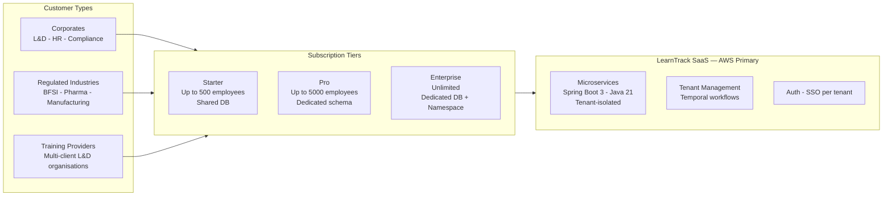

# Executive Summary

## Corporate Learning Progress, Intervention & Compliance Tracking System
### Production-Ready Architecture — v2.0

> **Change log from v1.0:** Stack consolidated (single backend / single frontend), compliance scope extended to US / Canada / Europe / India, transactional outbox + Temporal workflows + CDC pipeline added, consent management and right-to-erasure designed, per-tenant KMS and hash-chained audit log specified. See [`L-D/ARCHITECTURE_REVIEW.md`](../L-D/ARCHITECTURE_REVIEW.md) for full gap analysis that drove these changes.

---

## Project Overview

The **Corporate Learning Progress, Intervention & Compliance Tracking System** is a **multi-tenant SaaS platform** that consolidates fragmented employee learning data — training attendance, assessment results, and competency milestones — into a single, actionable system. It enables organisations to proactively identify employees who are falling behind on required competencies, assign targeted interventions, and produce compliance-ready reports for regulatory bodies and industry standards authorities.

The platform is **not** a full corporate LMS. It is a lightweight aggregation, analytics, and workflow layer that sits on top of existing LMS platforms, assessment systems, and HR systems. It is delivered as a **microservices-based SaaS** offering on AWS, with cloud-agnostic abstractions so workloads can migrate to Azure or GCP without architecture rewrites.

---

## SaaS Delivery Model

---

## Business Objectives

| Objective | Target |
|---|---|
| Early risk detection | Identify at-risk employees 4–6 weeks before compliance failure |
| Intervention effectiveness | 70% of employees show measurable competency improvement |
| Training completion rate improvement | +25% year-over-year |
| Compliance reporting | 100% on-time, accurate submissions to regulatory bodies |
| Tenant onboarding speed | New organisation live in < 5 minutes (Temporal-orchestrated) |
| Platform availability | 99.9% uptime (Enterprise) · 99.5% (Pro / Starter) |
| User adoption per tenant | 90% of target users active within first month |
| Right-to-erasure SLA | Complete cross-service PII deletion within 30 days of request |
| WCAG 2.1 AA | All user-facing portals compliant at GA |

---

## Key Capabilities

- **Multi-tenant isolation** — row-level, schema-per-tenant, or dedicated DB based on plan
- **Automated tenant provisioning** — Temporal-orchestrated saga, live in < 5 minutes with full compensation on failure
- **Employee learning profile aggregation** — consolidates training attendance, assessment scores, and competency milestones per employee
- **Configurable rule-based risk engine** — per-organisation JSON/YAML rules on attendance %, score thresholds, and competency progression
- **Automated at-risk classification** — four severity levels: Critical, High, Medium, Low
- **Intervention lifecycle management** — Temporal workflows for remedial training, coaching & mentoring assignment, session tracking, outcome measurement
- **Compliance & audit reporting** — templated, scheduled, with immutable hash-chained audit trail; human-review gate for GDPR Article 22 / CCPA automated-profiling obligations
- **Consent management** — per-employee consent capture, storage, opt-out, and audit for GDPR / DPDP / CCPA / PIPEDA
- **Right-to-erasure** — cross-service PII erasure saga with signed deletion certificate
- **Role-based dashboards** — Trainers, L&D Administrators, L&D Managers, and Employees
- **Reliable event delivery** — transactional outbox + Debezium CDC; DLQ + retry topics for all Kafka consumers
- **Real-time notifications** — WebSocket / SSE gateway for live at-risk alerts and dashboard updates
- **White-label branding** — custom domain, logo, and colours per organisation (Pro / Enterprise)
- **SSO / SAML integration** — per-tenant corporate identity provider (Enterprise)
- **Metered billing** — usage tracked per tenant, integrated with Stripe

---

## Microservices Architecture Summary

| Service | Responsibility | Own Database |
|---|---|---|
| **Tenant Management** | Onboarding, config, billing, feature flags; Temporal workflows for provisioning & plan changes | `tenant-db` |
| **Auth / Identity** | OAuth2, JWT (JWKS-signed), SSO, RBAC | `auth-db` |
| **Ingestion** | Raw staging of training attendance, assessment scores, competency milestones; idempotent ingest | `ingestion-db` (raw staging only) |
| **Employee Profile** | Curated learning profile aggregation from `data.ingested` events; competency analytics; trend calculation | `profile-db` |
| **Risk Engine** | Rule execution, at-risk classification, alerts; human-review gate for automated profiling | `risk-db` |
| **Rule Management** | Rule CRUD, versioning, test sandbox, activation | `rules-db` |
| **Intervention** | Temporal-backed remedial training & coaching workflow, session tracking, outcomes | `intervention-db` |
| **Reporting** | Compliance reports, L&D dashboards, exports, compliance calendar | `reporting-db` (CDC-fed read model) |
| **Notification** | Email, SMS, in-app, WebSocket push — stateless dispatcher | None |
| **Audit** | Immutable hash-chained event log; S3 Object Lock archive | `audit-db` |
| **Consent** | Per-employee consent records, opt-out flags, consent history | `consent-db` |

---

## Technology Stack

> **Guiding principles:** Cloud-agnostic abstractions first (interfaces, config-driven endpoints); AWS services are defaults. Polyglot backends eliminated — Spring Boot 3 is the sole primary. Frontend framework unified on React 18.

| Layer | Technology | Notes |
|---|---|---|
| **Backend services** | Spring Boot 3.x (Java 21) | Single primary; FastAPI considered only for future ML microservice |
| **Workflow engine** | Temporal OSS | Tenant provisioning, plan change, intervention, erasure sagas |
| **Primary database** | PostgreSQL 16+ (JSONB for rule definitions) | Per-service isolation |
| **Caching** | Redis 7.x (AWS ElastiCache or self-hosted) | Tenant context, profile snapshots, sessions; Redis Sentinel / Cluster HA |
| **Event bus** | Apache Kafka (AWS MSK or self-hosted Confluent) | Tenant-scoped topics; outbox → Debezium CDC producer |
| **Event schema** | Confluent Schema Registry + Protobuf (FULL compatibility) | Backward/forward compatible event contracts |
| **CDC / outbox** | Debezium (PostgreSQL → Kafka) | Outbox table per service → exactly-once delivery |
| **Search** | Amazon OpenSearch (or self-hosted OpenSearch) | Deferred to P1; PostgreSQL full-text sufficient for MVP |
| **Frontend** | React 18 + TypeScript + Vite + TanStack Query + shadcn/ui + Tailwind CSS | Single framework; design system shared across all portals |
| **Charting** | ApexCharts (default) + D3.js (custom visualisations only) | Chart.js dropped |
| **Real-time push** | WebSocket (Spring Boot STOMP) + SSE fallback | Live dashboard updates, at-risk alerts |
| **API Gateway** | Kong Gateway OSS (self-hosted, K8s-native, config-as-code) | AWS API Gateway as alternative for pure-AWS deployments |
| **Service mesh** | Istio | mTLS, circuit breakers, retries, timeouts, traffic splitting — all declarative via VirtualService/DestinationRule |
| **Container orchestration** | Kubernetes (Amazon EKS) | Multi-namespace per tenant tier |
| **CI/CD** | GitHub Actions + ArgoCD (GitOps) | Environments: dev → test → staging → production |
| **Secrets management** | HashiCorp Vault | Per-tenant namespace; transit engine for DEK generation |
| **KMS / encryption** | AWS KMS + per-tenant Data Encryption Keys (DEK) via Vault transit | Envelope encryption for PII columns and S3 objects |
| **Observability (metrics)** | OpenTelemetry Collector → Prometheus + Grafana | Unified OTel standard; Grafana Cloud or self-hosted |
| **Observability (traces)** | OpenTelemetry → Grafana Tempo | Distributed tracing across all Spring Boot services |
| **Observability (logs)** | OpenTelemetry → Grafana Loki (structured, tenant-tagged) | Replaces ELK for log aggregation |
| **Error tracking** | Sentry (self-hosted or cloud) | Code-level errors, performance monitoring; distinct from APM |
| **Feature flags** | Unleash OSS (self-hosted) | Release-time flags + tenant-level flags; not just config |
| **Object storage** | AWS S3 with Object Lock (WORM) | Compliance reports, audit archives, evidence uploads; Object Lock for immutability |
| **File / evidence service** | Internal service backed by S3 + ClamAV scanning | Trainer notes, certificates, regulator acknowledgements |
| **Backups** | pgBackRest (PostgreSQL) + Velero (K8s manifests + PVs) | Continuous WAL archiving + nightly full |
| **Billing** | Stripe (metered usage) | Usage tracked per tenant; invoice per plan |
| **Email delivery** | Amazon SES (or SendGrid as alternative) | Transactional + notification emails |
| **SMS** | Amazon SNS (or Twilio as alternative) | Pro/Enterprise tier SMS alerts |

### Future scope (not MVP)
| Layer | Technology | When |
|---|---|---|
| Analytics / OLAP | ClickHouse (self-hosted) or Snowflake (managed) | P2 — required for trend benchmarks, cross-tenant analytics |
| ML risk scoring | MLflow + feature store (Feast) on top of OLAP | P2 — Enterprise tier feature |
| E-signature | DocuSign or Adobe Sign | P1 — required for 21 CFR Part 11 Pharma tenants |
| Developer portal | Stoplight / readme.io | P2 — Public API for Pro/Enterprise |

---

## Subscription Plans

| Feature | Starter | Pro | Enterprise |
|---|:---:|:---:|:---:|
| Max employees | 500 | 5,000 | Unlimited |
| DB isolation | Shared — row-level | Schema-per-tenant | Dedicated DB instance |
| K8s isolation | Shared namespace | Shared namespace | Dedicated namespace |
| Custom competency rules | 5 | 50 | Unlimited |
| Notification channels | Email only | Email + SMS + In-app | All channels + WebSocket |
| Compliance reporting | Standard | Custom templates | Full suite |
| Employee self-service portal | No | Yes | Yes |
| White-label branding | No | Yes | Yes |
| Custom domain | No | Yes | Yes |
| SSO / SAML | No | No | Yes |
| API access | No | Yes (rate-limited) | Yes (dedicated quota) |
| ML-based risk scoring | No | No | P2 scope |
| Consent management | Yes (all tiers) | Yes | Yes |
| Right-to-erasure API | Yes (all tiers) | Yes | Yes |
| WCAG 2.1 AA | Yes (all tiers) | Yes | Yes |
| SLA guarantee | 99.5% | 99.5% | 99.9% |
| Support | Community | Business hours | 24/7 dedicated |

---

## Compliance Scope — Target Regions at GA

| Region | Regulations addressed |
|---|---|
| **Europe (EU + UK)** | GDPR, UK GDPR, European Accessibility Act (EAA / WCAG 2.1 AA) |
| **United States** | SOC 2 Type II, CCPA/CPRA, ADA / Section 508 (accessibility) |
| **Canada** | PIPEDA, Quebec Law 25 |
| **India** | DPDP Act 2023 |

Key cross-cutting compliance controls:
- Per-employee erasure and portability API (all regions)
- Consent capture, opt-out, and audit (GDPR, DPDP, CCPA, PIPEDA)
- Human-review gate on automated risk profiling (GDPR Art. 22, CCPA/CPRA, Law 25)
- Data residency pinning per tenant: `eu-west-1` (EU), `ap-south-1` (India)
- Immutable audit log with S3 Object Lock

---

## Key System Performance Targets

| Metric | Target |
|---|---|
| API response time (P95) | < 200 ms |
| Dashboard load time | < 2 s |
| Employee profile generation | < 500 ms per employee |
| Risk engine batch (1,000 employees) | < 2 min |
| Compliance report generation | < 30 s |
| Tenant provisioning (Temporal saga) | < 5 min |
| Training data sync latency | < 1 hour |
| Tenant context resolution (cached) | < 5 ms |
| Right-to-erasure completion | < 30 days (regulated); target < 72 hours |
| DLQ alert threshold | Depth > 0 triggers PagerDuty within 5 min |

---

## Terminology Reference

| Corporate L&D Term | Replaced |
|---|---|
| Employee | ~~Student~~ |
| Trainer | ~~Teacher~~ |
| L&D Administrator | ~~School Administrator~~ |
| L&D Manager | ~~Counsellor / Dean~~ |
| Line Manager | ~~Parent~~ |
| Department / Business Unit | ~~Grade level / Class~~ |
| Competency milestone | ~~Curriculum milestone~~ |
| Training module / Course | ~~Subject~~ |
| Competency score | ~~GPA / Grade~~ |
| Regulatory body / Industry standards | ~~Education board~~ |
| GDPR / DPDP / CCPA / PIPEDA | ~~FERPA~~ |

---

## Project Delivery Timeline (20 Weeks)

| Phase | Weeks | Focus |
|---|---|---|
| Phase 1 | 1 – 4 | Foundation: Tenant provisioning (Temporal), Auth (JWKS), DB isolation, Kafka + outbox |
| Phase 2 | 5 – 8 | Ingestion adapters (REST + file upload), Employee Profile Service, Risk Engine |
| Phase 3 | 9 – 12 | Intervention Service (Temporal workflow), Consent Service, Notification + WebSocket |
| Phase 4 | 13 – 16 | Compliance Reporting (CDC read model), Audit Service (hash-chained + S3 Object Lock), Dashboards |
| Phase 5 | 17 – 20 | Right-to-erasure saga, compliance controls (GDPR/DPDP/CCPA/PIPEDA), WCAG 2.1 AA, load + pen testing, go-live |
