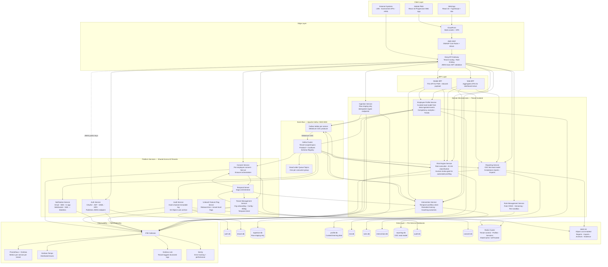
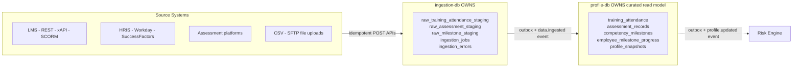
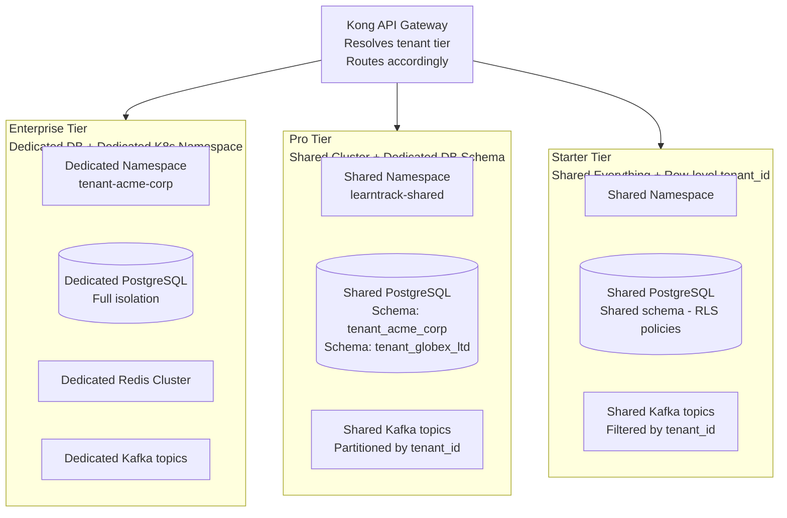
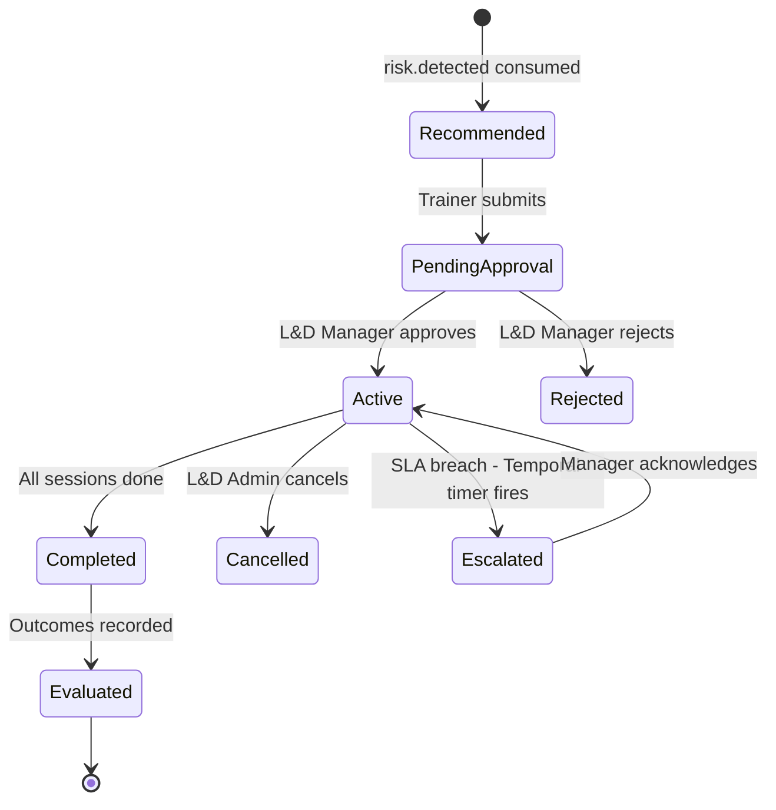
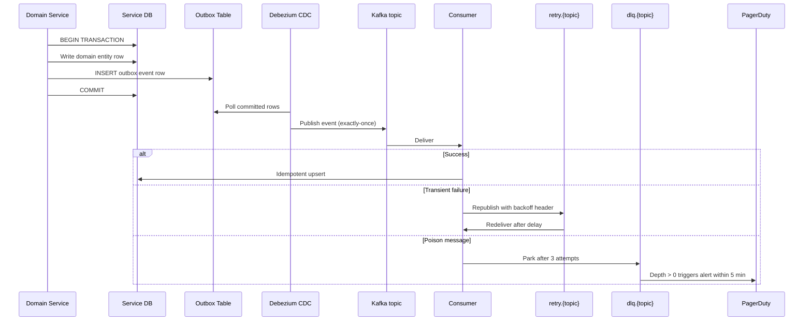
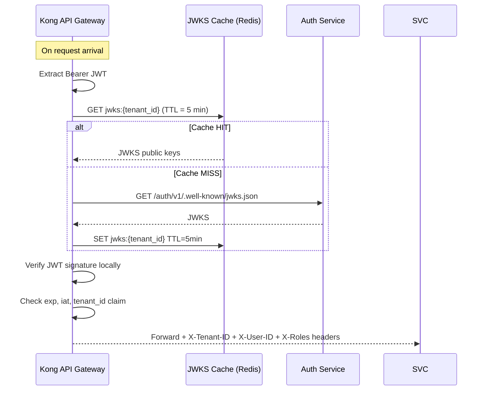
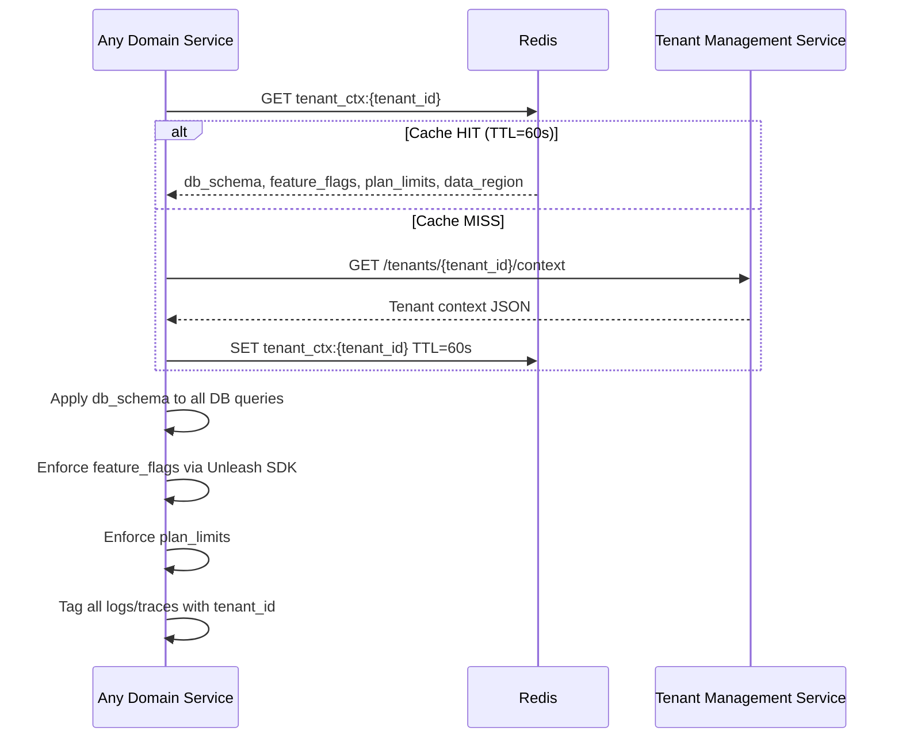

# System Architecture

## Corporate L&D SaaS — Multi-Tenant Microservices (Production-Ready v2.0)

> **Changes from v1.0:** Fixed data ownership boundary (Ingestion = raw staging only; Profile = curated read model). Added transactional outbox + Debezium CDC. Added DLQ / retry topics. Added Consent Service. Added BFF layer. Added WebSocket/SSE gateway. Gateway-local JWT validation via JWKS. Istio service mesh with explicit circuit breaker / retry / timeout policy. Temporal workflow engine for sagas. See [`L-D/ARCHITECTURE_REVIEW.md`](../L-D/ARCHITECTURE_REVIEW.md) for gap analysis.

---

## High-Level Architecture



---

## Data Ownership Boundary (Corrected)

> **Critical fix from v1.0:** The original documents placed `training_attendance`, `assessment_records`, and `competency_milestones` in both `ingestion-db` and `profile-db`. The correct boundary is:



**Rule:** Ingestion Service owns raw + staging. Employee Profile Service owns curated learning data and builds it exclusively from `data.ingested` Kafka events. Neither service reads from the other's database.

---

## Tenant Isolation Models



| Isolation Aspect | Starter | Pro | Enterprise |
|---|---|---|---|
| Database | Shared — PostgreSQL RLS | Shared DB — dedicated schema | Dedicated DB instance |
| Kubernetes | Shared namespace | Shared namespace | Dedicated namespace |
| Kafka topics | Shared — filtered by `tenant_id` | Shared — partitioned by `tenant_id` | Dedicated topics |
| Redis keyspace | Prefixed by `tenant_id` | Prefixed by `tenant_id` | Dedicated Redis cluster |
| KMS / encryption | Shared DEK per tenant via Vault transit | Dedicated DEK per tenant | Dedicated DEK + KMS key alias |
| Data breach blast radius | Shared tier (RLS boundary) | Schema-level | Fully isolated |

---

## Service Responsibilities & Ownership

### Auth / Identity Service
**Owns:** Users, roles, sessions, SSO configurations per organisation
**Key capability (v2):** Publishes JWKS endpoint — API Gateway validates JWTs locally using cached public keys. Auth Service is no longer on the hot path of every request; only called for refresh and revocation checks.

---

### Tenant Management Service
**Owns:** Organisation registry, subscription plans, feature flags, branding, usage metering
**v2 change:** Acts as Temporal workflow client — tenant provisioning and plan upgrades run as Temporal sagas with full compensation on failure. Domain services read tenant context from Redis cache (60 s TTL).

---

### Ingestion Service
**Owns:** Raw validated staging records only (`ingestion-db`)
**Data accepted:**
- Employee training attendance records (REST API — JSON batches)
- Periodic assessment scores (REST API)
- Competency-level learning milestones (REST API)
- CSV / SFTP file upload (converted to same staging schema)

**Key rules:**
- All endpoints require `Idempotency-Key` header — duplicate submissions are detected via `ingestion_jobs.idempotency_key` index and return `200 Already Processed`
- Never calls Employee Profile Service directly — publishes `data.ingested` event via outbox only
- Validates schema, completeness, duplicates before staging

---

### Employee Profile Service
**Owns:** Curated learning profiles in `profile-db` — built exclusively from `data.ingested` events
**v2 change:** No longer referenced by `ingestion-db`. Consumes events, builds its own aggregated view.

**Calculated metrics per employee:**
- Training attendance percentage (rolling 30-day, current period, all-time)
- Assessment average per competency / training module
- Score trend direction (improving / stable / declining)
- Competency milestone completion rate
- Days since last milestone progress

---

### Risk Engine Service
**Owns:** Risk assessment records, risk scoring
**v2 addition:** Human-review gate — before `CRITICAL` risk notifications are sent, a human-review record is created in `risk-db`. A Trainer or L&D Manager must acknowledge or override the automated classification. This satisfies GDPR Article 22, CCPA/CPRA, and DPDP Act automated-profiling obligations.

| Rule Type | Example |
|---|---|
| Attendance-based | Training attendance < 75% in last 30 days |
| Score-based | Two consecutive failing assessments |
| Trend-based | 20% score decline over 60 days |
| Milestone-based | Required competency milestone overdue > 14 days |
| Composite | Low attendance AND low assessment scores |
| Compliance deadline | Incomplete mandatory training within 7 days of deadline |

---

### Rule Management Service
**Owns:** Competency risk rule definitions, versions, test runs
Separated from Risk Engine — L&D Administrators edit, test, and version rules without touching execution.

**Sample rule definition (Protobuf-serialised, JSON representation):**
```json
{
  "ruleId": "COMP_001",
  "ruleName": "Composite High-Risk Competency Factors",
  "severity": "CRITICAL",
  "priority": 5,
  "version": "1.0",
  "effectiveFrom": "2026-01-01",
  "conditions": {
    "operator": "AND",
    "criteria": [
      { "metric": "training_attendance_percentage", "period": "30_days", "operator": "less_than", "value": 80 },
      { "metric": "competency_average_score", "period": "30_days", "operator": "less_than", "value": 60 }
    ]
  },
  "actions": {
    "setRiskLevel": "CRITICAL",
    "alert": ["trainer", "ld_manager", "line_manager"],
    "intervention": ["remedial_training", "coaching_assignment"],
    "requireHumanReview": true
  },
  "applicableTo": { "departments": "all", "competencies": "all" }
}
```

---

### Intervention Service
**Owns:** Interventions, training sessions, coaching assignments, outcomes
**v2 change:** Core workflow (assign → approve → session-log → complete → evaluate) now runs as a **Temporal workflow** — durable, resumable, observable. Intervention Service holds domain state; Temporal handles process orchestration.

Intervention state machine:


---

### Reporting Service
**Owns:** Compliance report templates, generated report metadata, L&D reporting aggregates
**v2 change:** `reporting-db` is now a **CDC-fed CQRS read model** — Debezium captures changes from `profile-db`, `risk-db`, `intervention-db` → Kafka CDC topics → Reporting consumer builds denormalised aggregates. No dual-write or manual sync.

Reports available:
- Employee competency progress reports
- At-risk employee watchlist (with rules triggered and human-review status)
- Intervention effectiveness summary (remedial training vs coaching)
- Training attendance compliance reports
- Competency achievement reports by department / role
- Regulatory certification readiness reports
- Executive L&D performance summary

---

### Consent Service (new in v2)
**Owns:** Per-employee consent records, opt-out flags, consent change history
**Purpose:** Satisfies GDPR, DPDP Act 2023, CCPA, and PIPEDA requirements for documented consent and opt-out from automated risk profiling.
**Key APIs:**
- `POST /consents` — record employee consent for a specific purpose (analytics, risk profiling, benchmarking)
- `DELETE /consents/{employee_id}/purpose/{purpose}` — opt-out; triggers downstream suppression
- `GET /consents/{employee_id}` — consent audit trail
- Integrates with Erasure Saga — on employee erasure request, consent records are exported then purged

---

### Audit Service
**Owns:** Immutable compliance audit log
**v2 changes:**
- Each audit entry is **hash-chained**: `entry.hash = SHA-256(entry.payload + previous_entry.hash)`
- Periodic batch export to **AWS S3 with Object Lock (WORM)** — prevents post-hoc tampering
- Supports tamper-evidence verification API: `GET /audit/verify/{tenant_id}?from={date}&to={date}`

---

## Reliable Event Delivery (Outbox + DLQ)



DLQ naming convention: `dlq.{service}.{event-type}` — e.g. `dlq.profile.data-ingested`

---

## Cross-Cutting Concerns

### API Gateway — JWKS-local JWT Validation



Auth Service is only called on key rotation or on first cache miss. It is **not on the hot path** of every request.

---

### Tenant Context Resolution



---

### Security Architecture

| Layer | Control |
|---|---|
| Edge | AWS WAF (OWASP Core Rules + managed IP reputation), AWS Shield Standard, CloudFront, TLS 1.3 |
| API Gateway | JWKS-local JWT validation, tenant resolution, per-tenant rate limiting (Kong rate-limit plugin) |
| Service-to-service | Istio mTLS (mutual TLS); circuit breaker and retry via DestinationRule / VirtualService |
| Database | Schema-level or row-level isolation (PostgreSQL RLS), pgaudit extension for SQL audit |
| Data at rest | AES-256; PII columns use envelope encryption (Vault transit DEK + AWS KMS CMK) |
| Secrets | HashiCorp Vault — per-tenant namespace; no secrets in env vars or Kubernetes ConfigMaps |
| Compliance | GDPR · UK GDPR · CCPA · PIPEDA / Law 25 · DPDP Act 2023 · SOC 2 Type II |
| Accessibility | WCAG 2.1 AA · European Accessibility Act (EAA) |

---

### Istio Service Mesh — Defaults

All services are enrolled in Istio service mesh. Baseline policies applied via `DestinationRule` and `VirtualService`:

| Policy | Default Setting |
|---|---|
| mTLS | `STRICT` on all service-to-service |
| Circuit breaker | 5 consecutive errors → open; 30 s half-open probe |
| Retry | 3 attempts; retryOn: `5xx,reset,connect-failure`; per-try timeout 2 s |
| Timeout | 10 s global; report generation endpoint: 60 s |
| Egress | Allow only to registered external services (SMTP, Stripe, Temporal, Vault) |

---

### Role Permissions Matrix

| Feature | Trainer | L&D Administrator | L&D Manager | Employee |
|---|:---:|:---:|:---:|:---:|
| View own employees' profiles | Yes | Yes | Yes | Yes (own only) |
| View all employee profiles | Yes | Yes | Yes | No |
| Define / edit competency risk rules | No | Yes | No | No |
| Assign remedial training / coaching | Yes | Yes | Yes | No |
| Approve interventions | No | Yes | Yes | No |
| Acknowledge automated risk assessment (GDPR Art.22 gate) | Yes | Yes | Yes | No |
| Generate compliance reports | No | Yes | No | No |
| View L&D dashboards | Yes | Yes | Yes | Yes (limited) |
| Manage users / roles | No | Yes | No | No |
| Manage consent records | No | Yes | No | Yes (own only) |
| Request own data erasure | No | No | No | Yes |
| Configure tenant settings | No | Yes | No | No |
