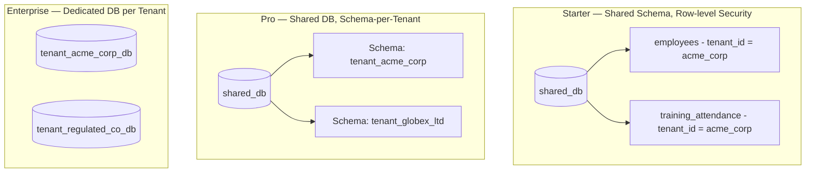
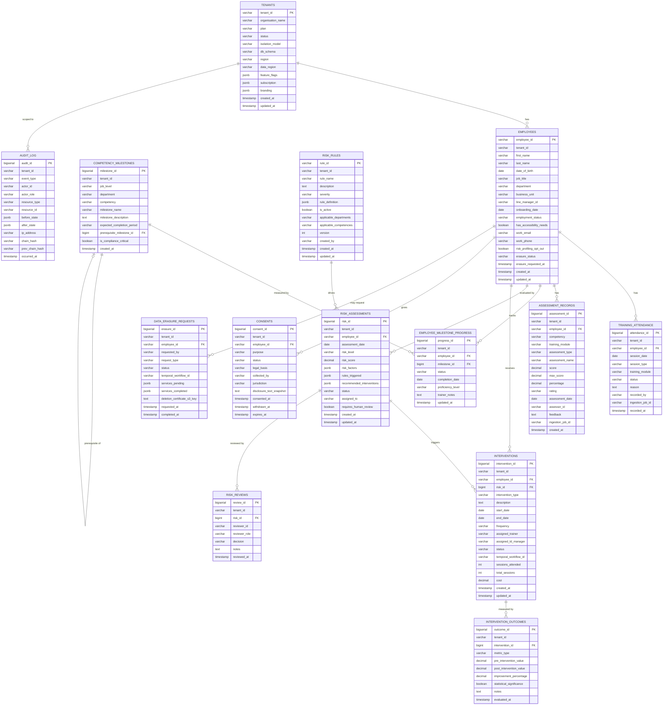
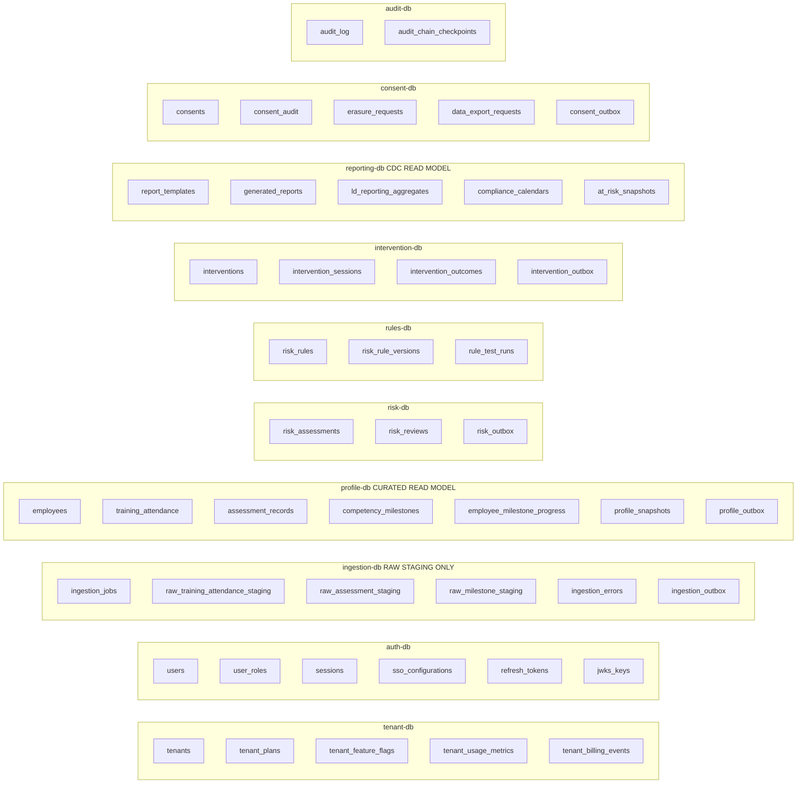
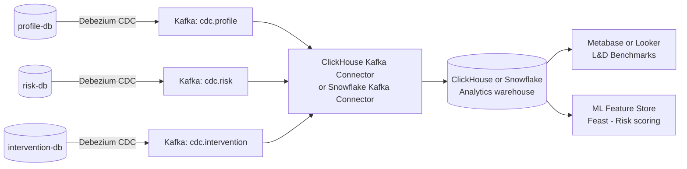

# Database & Data Structure

## Corporate L&D SaaS — Multi-Tenant (Production-Ready v2.0)

> **Changes from v1.0:** Corrected data ownership — `training_attendance`, `assessment_records`, `competency_milestones` moved from `ingestion-db` to `profile-db` (curated read model). Added `consent-db` and consent tables. Added `PII_CLASSIFICATION` column annotations. Added erasure tracking tables. Updated `RISK_REVIEWS` table for human-review gate. Added `DATA_ERASURE_REQUESTS` table. Added future-scope OLAP section.

---

## Multi-Tenant Database Strategy



---

## Data Classification Policy

All columns containing personal data are annotated below with their classification level. This drives encryption choices, retention, and erasure scope.

| Classification | Examples | Controls |
|---|---|---|
| `PII_STANDARD` | Name, email, phone, job title | AES-256 at rest; column-level encryption for email/phone |
| `PII_SENSITIVE` | Assessment scores linked to competency gaps, risk classifications | Envelope encryption (Vault DEK + AWS KMS); pseudonymised in reports |
| `PII_IDENTIFIER` | employee_id (internal), work_email | Hashed in analytics aggregates |
| `INTERNAL` | Department, business unit, training module | Standard encryption at rest |
| `SYSTEM` | IDs, timestamps, status codes | Standard encryption at rest |

---

## Entity-Relationship Diagram (Per-Tenant Schema)



---

## Database-per-Service Ownership



---

## Key Table Notes

### `employees` (profile-db)
Central master record per tenant. `risk_profiling_opt_out` flag supports CCPA/CPRA automated-profiling opt-out. `erasure_status` tracks erasure request lifecycle (`NONE` / `PENDING` / `IN_PROGRESS` / `COMPLETED`).

### `training_attendance` (profile-db)
Curated from `data.ingested` events. `ingestion_job_id` preserves lineage to the source ingestion batch.

### `assessment_records` (profile-db)
Stores every scored assessment normalised to a `percentage` column. `rating` values: `Exceeds_Expectations`, `Meets_Expectations`, `Needs_Improvement`, `Unsatisfactory`.

### `risk_assessments` (risk-db)
`requires_human_review = TRUE` is set for all `CRITICAL` and `HIGH` risk assessments. A corresponding `RISK_REVIEWS` row must be created before the notification is dispatched to satisfy GDPR Article 22 / CCPA automated-profiling obligations.

### `risk_reviews` (risk-db)
Records the human-review decision: `CONFIRMED` (agreed with automated classification), `OVERRIDDEN` (changed risk level), `DISMISSED` (false positive). Stored in audit trail for regulatory evidence.

### `interventions` (intervention-db)
`temporal_workflow_id` links to the running Temporal workflow instance for intervention lifecycle. Enables workflow inspection, resume, and cancellation via Temporal Web UI or API.

### `consents` (consent-db)
One row per employee-purpose pair. `purpose` values: `risk_profiling`, `anonymised_benchmarking`, `ml_scoring`, `trainer_notes`, `third_party_sharing`. `legal_basis` values: `consent`, `legitimate_interest`, `contract`, `legal_obligation`. `jurisdiction` drives which regulations apply.

### `data_erasure_requests` (consent-db)
Tracks a cross-service erasure saga. `services_pending` / `services_completed` are JSON arrays listing each service that must confirm PII deletion. `deletion_certificate_s3_key` is set when all services confirm and a signed certificate is uploaded to S3 (Object Lock).

### `audit_log` (audit-db)
`chain_hash = SHA-256(event_type + resource_id + occurred_at + before_state + after_state + prev_chain_hash)`. `audit_chain_checkpoints` stores periodic signed snapshots exported to S3 Object Lock for WORM compliance.

---

## Tenant Isolation at Query Level

### Starter — Row-Level Security (PostgreSQL RLS)
```sql
ALTER TABLE employees ENABLE ROW LEVEL SECURITY;

CREATE POLICY tenant_isolation ON employees
    USING (tenant_id = current_setting('app.current_tenant_id'));

SET app.current_tenant_id = 'tenant_acme_corp';
```

### Pro — Schema-per-Tenant
```sql
CREATE SCHEMA tenant_acme_corp;
CREATE TABLE tenant_acme_corp.employees ( ... );
SET search_path TO tenant_acme_corp;
```

### Enterprise — Dedicated Database
```
Host:     pg-tenant-acme-corp.internal (RDS instance or self-managed)
Database: tenant_acme_corp_db
User:     svc_acme_corp_app
Vault:    transit/encrypt/tenant-acme-corp  (per-tenant DEK)
```

---

## Key Indexes

```sql
-- profile-db
CREATE INDEX idx_employees_tenant            ON employees                   (tenant_id, employment_status, erasure_status);
CREATE INDEX idx_attendance_tenant           ON training_attendance          (tenant_id, employee_id, session_date);
CREATE INDEX idx_assessments_tenant          ON assessment_records           (tenant_id, employee_id, competency, assessment_date);
CREATE INDEX idx_milestones_tenant           ON competency_milestones        (tenant_id, job_level, department, is_compliance_critical);
CREATE INDEX idx_milestone_progress          ON employee_milestone_progress  (tenant_id, employee_id, status);

-- risk-db
CREATE INDEX idx_risk_tenant                 ON risk_assessments             (tenant_id, employee_id, risk_level, assessment_date);
CREATE INDEX idx_risk_review                 ON risk_reviews                 (tenant_id, risk_id, decision);

-- intervention-db
CREATE INDEX idx_interventions_tenant        ON interventions                (tenant_id, employee_id, status);

-- rules-db
CREATE INDEX idx_rules_tenant                ON risk_rules                   (tenant_id, is_active, severity);

-- consent-db
CREATE INDEX idx_consents_employee           ON consents                     (tenant_id, employee_id, purpose, status);
CREATE INDEX idx_erasure_status              ON data_erasure_requests        (tenant_id, status, requested_at);

-- audit-db
CREATE INDEX idx_audit_tenant                ON audit_log                    (tenant_id, occurred_at DESC);
CREATE UNIQUE INDEX idx_audit_chain          ON audit_log                    (tenant_id, audit_id);

-- ingestion-db
CREATE UNIQUE INDEX idx_ingest_idempotency   ON ingestion_jobs               (tenant_id, idempotency_key);
```

---

## Redis Keyspace Design

| Key Pattern | TTL | Content |
|---|---|---|
| `tenant_ctx:{tenant_id}` | 60 s | Tenant context (db_schema, flags, limits, data_region) |
| `profile:{tenant_id}:{employee_id}` | 1 hr | Aggregated employee learning profile snapshot |
| `rules:{tenant_id}:active` | 5 min | Active competency risk rules list |
| `dash:{tenant_id}:{role}:{hash}` | 5 min | L&D dashboard aggregate cache |
| `session:{token_hash}` | JWT expiry | User session data |
| `ratelimit:{tenant_id}:{endpoint}` | 1 min | API rate limit counter |
| `jwks:{tenant_id}` | 5 min | Cached JWKS public keys per tenant |
| `consent:{tenant_id}:{employee_id}` | 15 min | Active consent flags for hot-path checks |

---

## Data Retention Policy

| Table | Active Retention | Archive After | Purge After | Regulations |
|---|---|---|---|---|
| `training_attendance` | Current training year | 3 years | Per org contract | GDPR, DPDP |
| `assessment_records` | Current training year | 5 years | Per org contract | GDPR, DPDP |
| `employee_milestone_progress` | Employment lifetime | 5 years | Per org contract | GDPR, DPDP |
| `risk_assessments` | 2 years | 5 years | Per org contract | GDPR Art.22, CCPA |
| `risk_reviews` | 2 years | 5 years | Per org contract | GDPR Art.22, CCPA |
| `interventions` | 2 years | 5 years | Per org contract | GDPR, DPDP |
| `intervention_outcomes` | 3 years | 5 years | Per org contract | GDPR |
| `consents` | Until withdrawn + 1 year | 5 years | Per org contract | GDPR, DPDP, CCPA, PIPEDA |
| `data_erasure_requests` | Permanent (audit) | — | Never | GDPR, DPDP |
| `risk_rules` (versions) | Forever | — | — | Audit |
| `audit_log` | 7 years | Cold storage (S3 Object Lock) | Per regulation | SOC 2, GDPR |
| `profile_snapshots` | 3 years | Cold storage | Per org contract | GDPR |

**Right-to-erasure scope (GDPR / DPDP / CCPA):** On erasure request, a Temporal-orchestrated erasure saga runs across all services. PII fields are overwritten with anonymised tokens; linkage keys are destroyed. The `audit_log` retains pseudonymised event records for the legally required period (regulatory evidence).

---

## Outbox Tables (Per-Service)

Each service that publishes events has an `{service}_outbox` table:

```sql
CREATE TABLE profile_outbox (
    outbox_id     BIGSERIAL PRIMARY KEY,
    tenant_id     VARCHAR NOT NULL,
    aggregate_id  VARCHAR NOT NULL,
    event_type    VARCHAR NOT NULL,
    payload       BYTEA   NOT NULL,  -- Protobuf-serialised
    created_at    TIMESTAMP NOT NULL DEFAULT now(),
    published_at  TIMESTAMP,
    CONSTRAINT uq_outbox_event UNIQUE (aggregate_id, event_type, created_at)
);
CREATE INDEX idx_outbox_unpublished ON profile_outbox (published_at) WHERE published_at IS NULL;
```

Debezium reads the outbox table using the **Outbox Event Router** transformation and publishes to the corresponding Kafka topic. `published_at` is set by the CDC sink after successful publish.

---

## OLAP / Analytics — Future Scope

> **MVP decision:** PostgreSQL materialised views are sufficient for Phase 1–5 reporting. OLAP is a P2 item.

**Materialised views (MVP):**
```sql
CREATE MATERIALIZED VIEW mv_tenant_risk_summary AS
SELECT
    tenant_id,
    DATE_TRUNC('day', assessment_date) AS day,
    COUNT(*) FILTER (WHERE risk_level = 'CRITICAL') AS critical_count,
    COUNT(*) FILTER (WHERE risk_level = 'HIGH')     AS high_count,
    COUNT(*) FILTER (WHERE risk_level = 'MEDIUM')   AS medium_count,
    COUNT(*) FILTER (WHERE risk_level = 'LOW')      AS low_count,
    COUNT(*) FILTER (WHERE status = 'RESOLVED')     AS resolved_count
FROM risk_assessments
GROUP BY tenant_id, DATE_TRUNC('day', assessment_date);

REFRESH MATERIALIZED VIEW CONCURRENTLY mv_tenant_risk_summary;
```

**P2 analytics pipeline (when cross-tenant benchmarks and ML scoring are required):**



Target OLAP: **ClickHouse** (self-hosted on K8s, low cost) for teams with ops capacity; **Snowflake** (managed) for teams prioritising zero ops. Decision deferred to P2 based on customer demand and team capacity.
