# Technical Flows

## Corporate L&D SaaS — Multi-Tenant (Production-Ready v2.0)

> **Changes from v1.0:** Tenant provisioning replaced with Temporal saga (with compensation). JWT validation moved to Gateway-local JWKS. Ingestion flow adds `Idempotency-Key` handling. Training data ingestion now uses outbox + Debezium CDC. Employee risk detection adds human-review gate (GDPR Art.22). Intervention lifecycle uses Temporal workflow. New flows: Right-to-erasure saga, Consent capture, Automated plan upgrade saga. Reporting read model populated via CDC.

---

## 1. Tenant Provisioning — Temporal Saga

> **v2 change:** Eight side-effecting steps are now orchestrated by a **Temporal workflow** with compensating actions. Partial failure at any step triggers rollback of completed steps.

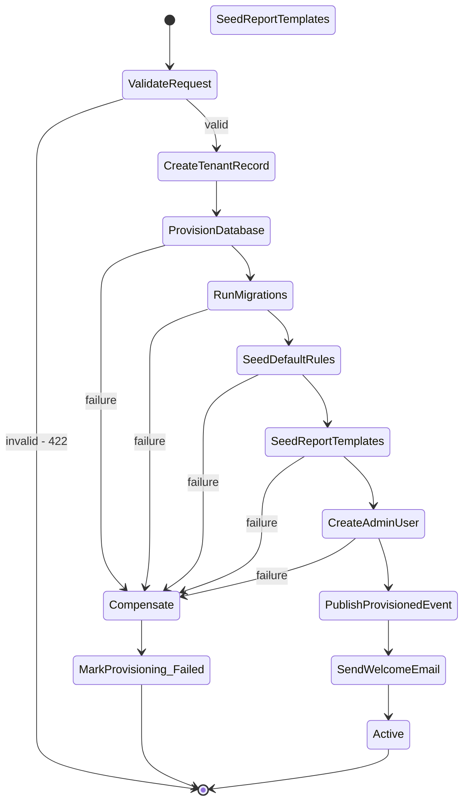

**Sequence (happy path):**

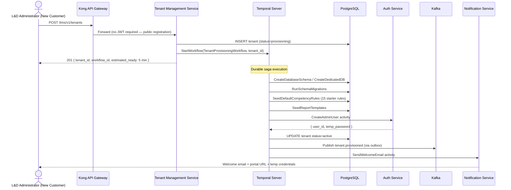

---

## 2. Multi-Tenant Request Routing — JWKS-Local JWT Validation

> **v2 change:** Gateway validates JWT locally using cached JWKS. Auth Service is no longer called on every request.

```mermaid
sequenceDiagram
    actor User as Trainer / L&D Admin / Employee
    participant GW as Kong API Gateway
    participant REDIS as Redis Cache
    participant AUTH as Auth Service
    participant SVC as Domain Service
    participant DB as Tenant Database

    User->>GW: GET /api/v1/employees + Bearer JWT
    GW->>GW: Extract tenant_id claim from JWT (unverified)
    GW->>REDIS: GET jwks:{tenant_id} (TTL=5min)

    alt JWKS Cache HIT
        REDIS-->>GW: JWKS public keys
    else JWKS Cache MISS
        GW->>AUTH: GET /auth/v1/.well-known/jwks.json?tenant={tenant_id}
        AUTH-->>GW: JWKS
        GW->>REDIS: SET jwks:{tenant_id} TTL=5min
    end

    GW->>GW: Verify JWT signature, exp, iat locally
    GW->>REDIS: GET tenant_ctx:{tenant_id} (TTL=60s)

    alt Tenant Context HIT
        REDIS-->>GW: db_schema, feature_flags, plan_limits
    else Tenant Context MISS
        GW->>TMS: GET /tenants/{tenant_id}/context
        GW->>REDIS: SET tenant_ctx:{tenant_id} TTL=60s
    end

    GW->>GW: Check feature_flag for endpoint (via Unleash SDK)
    GW->>GW: Check per-tenant rate limit

    alt Enabled and within rate limit
        GW->>SVC: Forward + X-Tenant-ID + X-DB-Schema + X-User-ID + X-Roles
        SVC->>DB: SET search_path = {db_schema}; execute query
        SVC-->>User: 200 OK
    else Feature disabled for plan
        GW-->>User: 403 Forbidden { upgrade_url }
    else Rate limit exceeded
        GW-->>User: 429 Too Many Requests { retry_after }
    end
```

---

## 3. Training Data Ingestion — Idempotent + Outbox

> **v2 changes:** `Idempotency-Key` header required. Duplicate detection via `ingestion_jobs.idempotency_key`. Outbox + Debezium replaces direct Kafka publish.

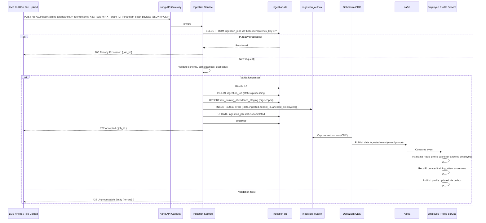

**Three ingestion endpoints (all require `Idempotency-Key`):**

| Endpoint | Data Type | Formats |
|---|---|---|
| `POST /api/v1/ingest/training-attendance` | Employee training attendance records | JSON batch, CSV multipart |
| `POST /api/v1/ingest/assessments` | Periodic assessment scores | JSON batch, CSV multipart |
| `POST /api/v1/ingest/competency-milestones` | Competency milestone updates | JSON batch |

---

## 4. Employee Risk Detection — With Human-Review Gate

> **v2 change:** CRITICAL and HIGH risk assessments require a human-review record before notifications are dispatched (GDPR Art.22, CCPA/CPRA, DPDP opt-out).

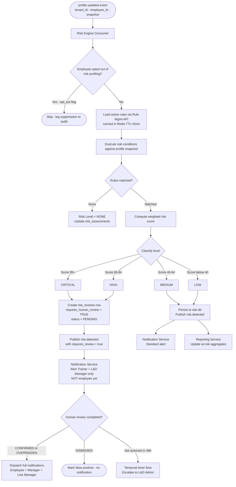

---

## 5. Intervention Lifecycle — Temporal Workflow

> **v2 change:** Core workflow now runs as a Temporal durable workflow. Service holds domain state; Temporal handles orchestration, timers, and escalation.

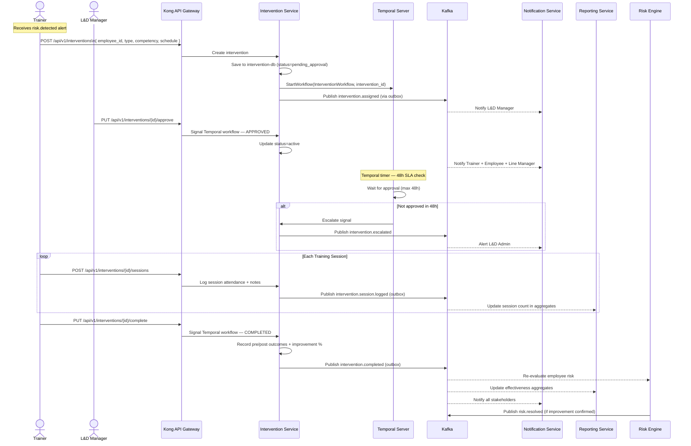

---

## 6. Compliance Report Generation — CDC-Backed

> **v2 change:** `reporting-db` is now a CDC-fed read model. Report data is always fresh without polling or manual refresh.

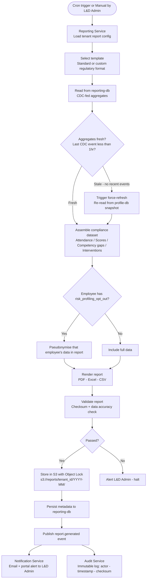

**CDC pipeline feeding reporting-db:**

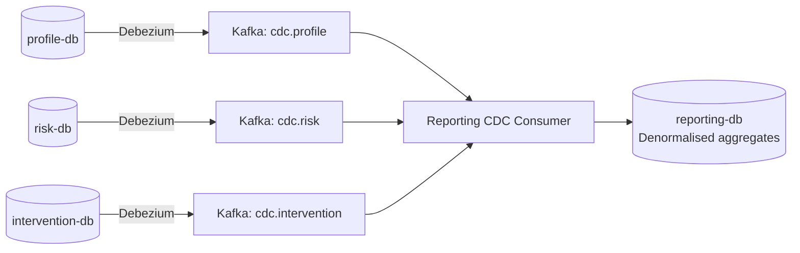

---

## 7. Right-to-Erasure Saga — Temporal Workflow

> **New in v2.** Satisfies GDPR Art.17, CCPA right-to-delete, DPDP erasure rights. Orchestrated by Temporal. Each service must confirm erasure before the signed deletion certificate is issued.

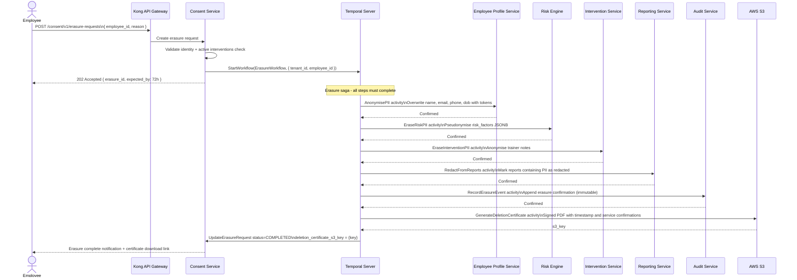

**Notes:**
- Audit log entries for the erased employee are retained (legally required) but `before_state` / `after_state` JSONB fields are tokenised — linkage to the natural person is destroyed
- If any service fails to confirm within the Temporal activity timeout, the saga retries with backoff; after max retries, it alerts the L&D Admin and DPO email on file

---

## 8. Consent Capture & Opt-Out Flow

> **New in v2.** Satisfies GDPR, DPDP Act 2023, CCPA automated-profiling opt-out, PIPEDA consent obligations.

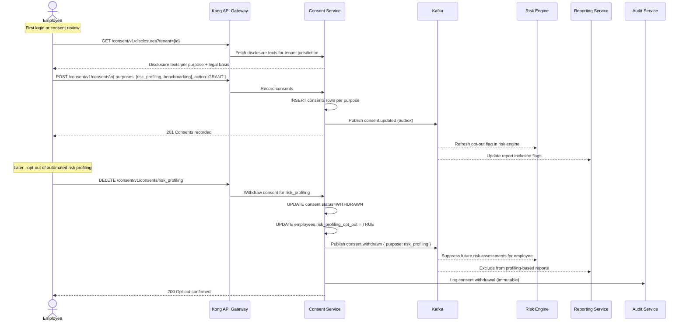

---

## 9. Competency Rule Authoring & Activation Flow

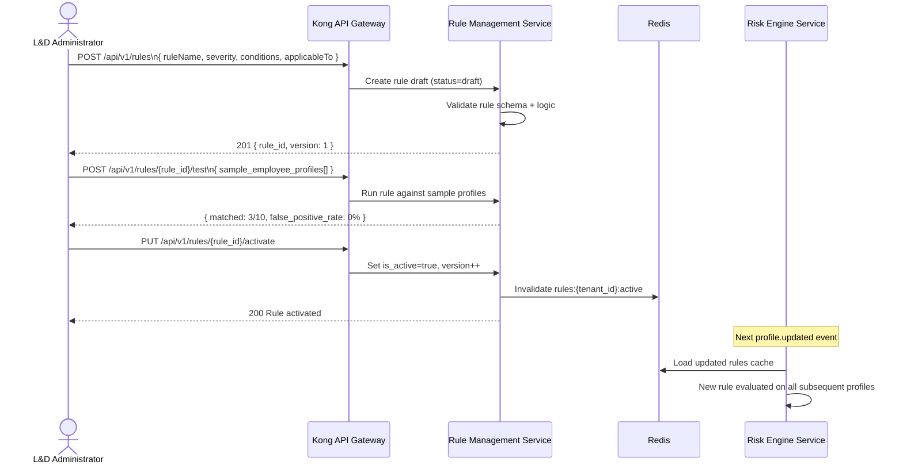

---

## 10. Plan Upgrade — Temporal Saga

> **v2 change:** Plan upgrade is now a Temporal saga with data validation and compensation.

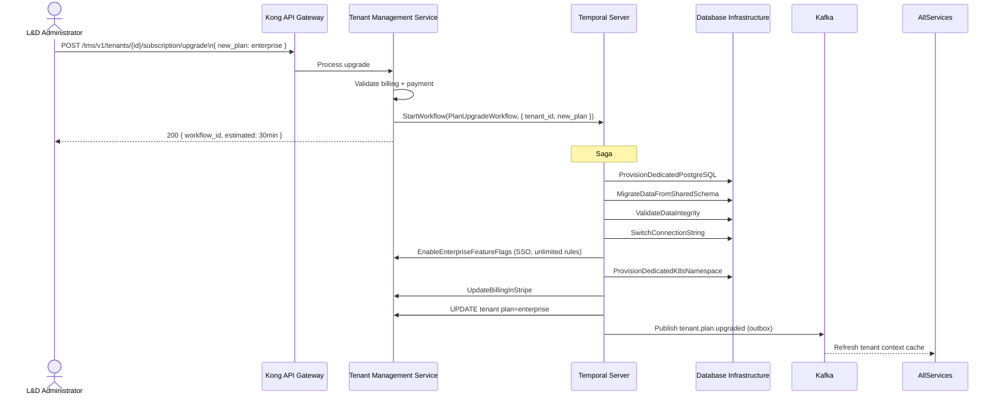

---

## 11. SSO Authentication Flow (Enterprise)

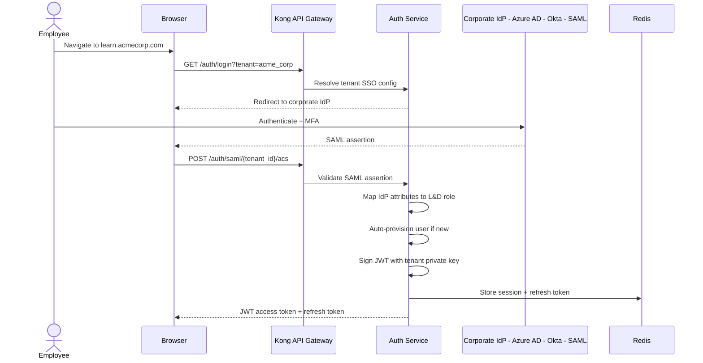
