# User Journeys

## Corporate L&D SaaS — Multi-Tenant (Production-Ready v2.0)

> **Changes from v1.0:** Added Consent Capture journey (GDPR / DPDP / CCPA / PIPEDA). Added Right-to-Erasure request journey. Added Human-Review gate in Trainer journey (GDPR Art.22). Added Accessibility compliance notes throughout. WebSocket live alerts referenced in dashboards.

---

## Role Overview

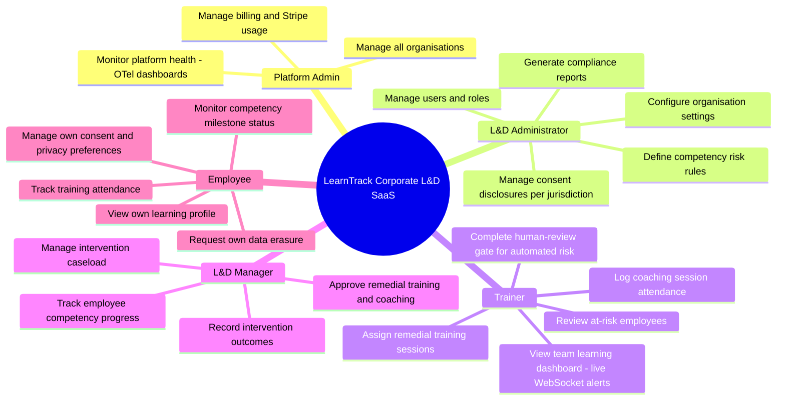

---

## Accessibility Standards Baseline

All user-facing portals (Trainer, L&D Admin, L&D Manager, Employee) must meet:

| Standard | Requirement |
|---|---|
| WCAG 2.1 Level AA | All web content (EU, UK, US, Canada, India) |
| European Accessibility Act (EAA) / EN 301 549 | Required for EU market access (enforcement active since 28 June 2025) |
| Section 508 | US federal tenant customers |
| ADA digital | US-based tenants (case-law applies to SaaS) |

**Accessibility principles applied to all journeys below:**
- All interactive controls reachable via keyboard (Tab / Shift+Tab / Enter / Space / Arrow keys)
- All charts and data visualisations have accessible text alternatives or data tables
- Colour alone is never the sole indicator (risk badges use colour + icon + text)
- Form errors announced to screen readers via `aria-live` and `aria-describedby`
- WCAG contrast ratio: minimum 4.5:1 for normal text, 3:1 for large text
- Focus indicators visible at all times (not suppressed by CSS `outline: none`)

---

## Journey 1 — New Corporate Customer Onboards as a SaaS Tenant

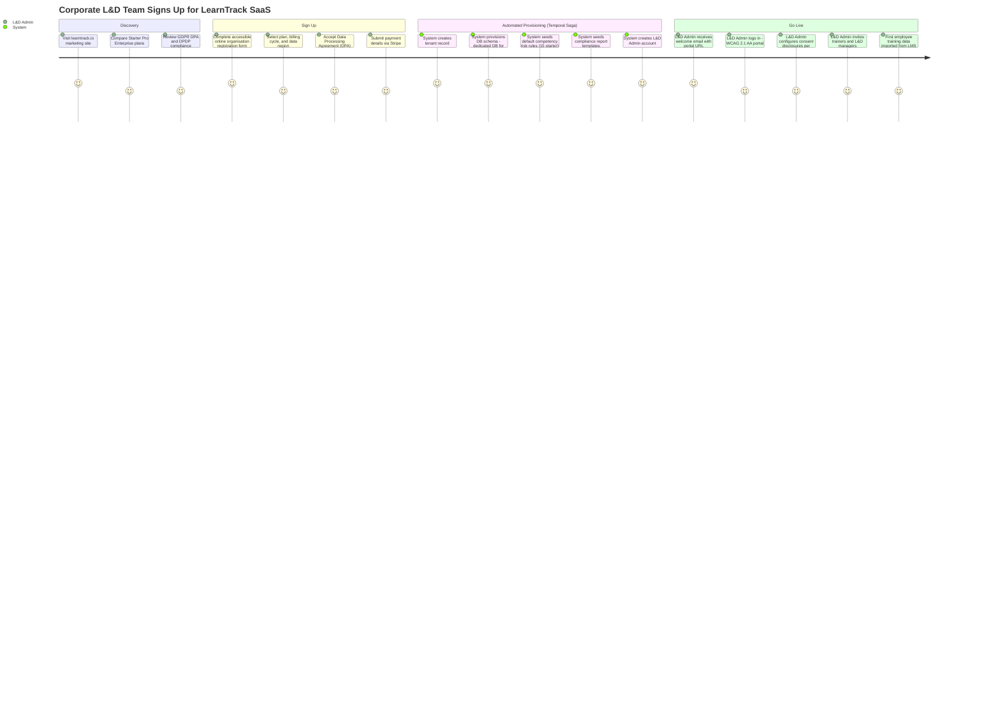

---

## Journey 2 — Employee Completes Consent Capture (GDPR / DPDP / CCPA / PIPEDA)

> **New in v2.** Triggered on first login or when tenant adds a new processing purpose.

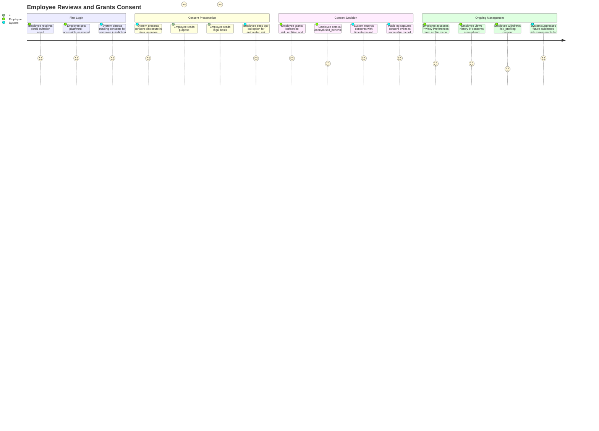

---

## Journey 3 — Trainer Identifies and Acts on At-Risk Employee (with Human-Review Gate)

> **v2 change:** Trainer must acknowledge the automated risk classification before employee notification is sent (GDPR Art.22 human-review gate).

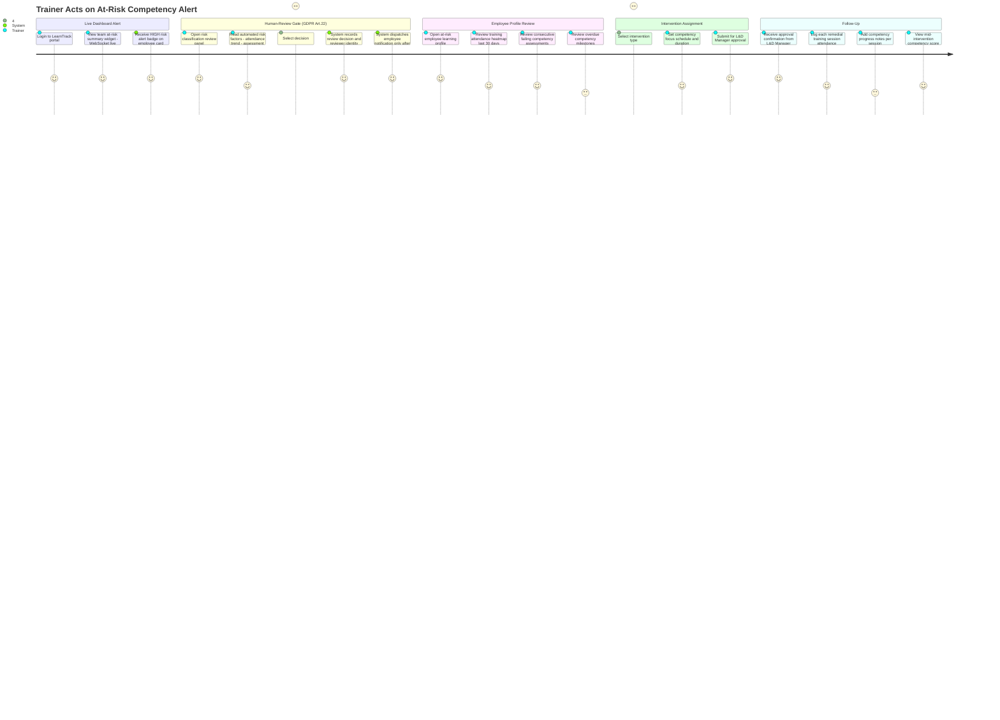

---

## Journey 4 — L&D Manager Manages Intervention Lifecycle

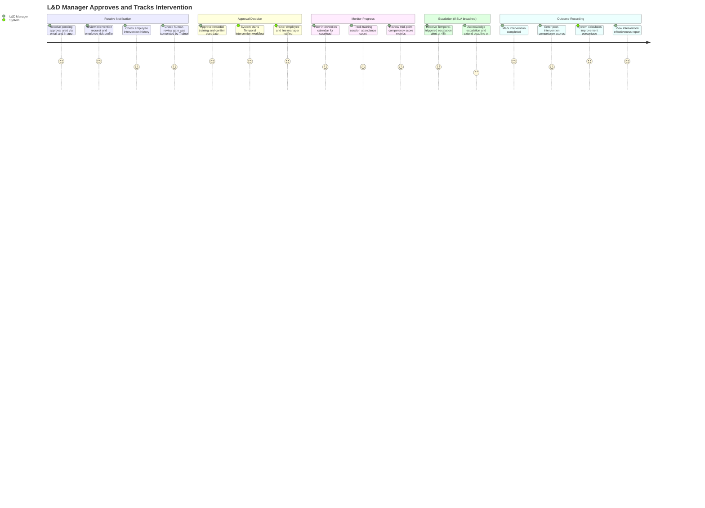

---

## Journey 5 — L&D Administrator Generates Compliance Report

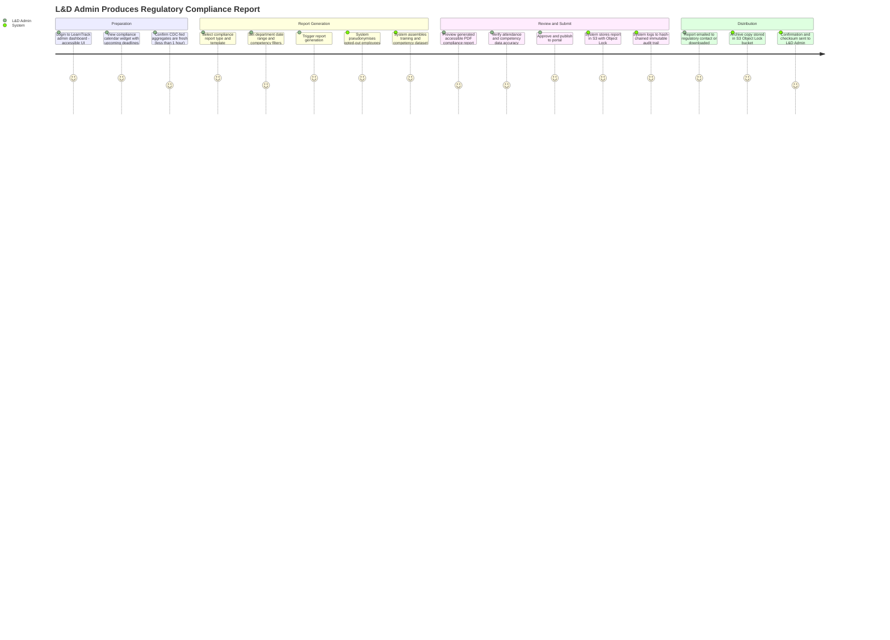

---

## Journey 6 — Employee Monitors Own Learning Progress

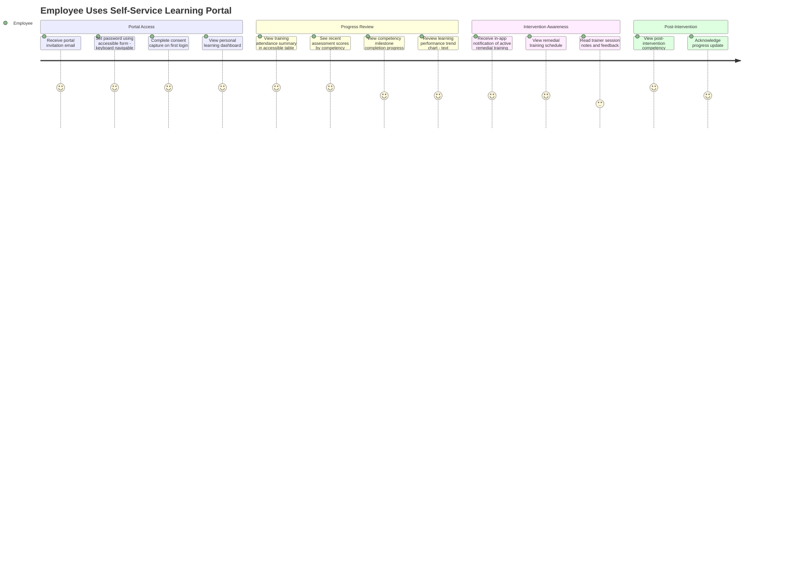

---

## Journey 7 — Employee Requests Own Data Erasure (GDPR / DPDP / CCPA)

> **New in v2.** Supports right-to-erasure obligations across all target compliance regions.

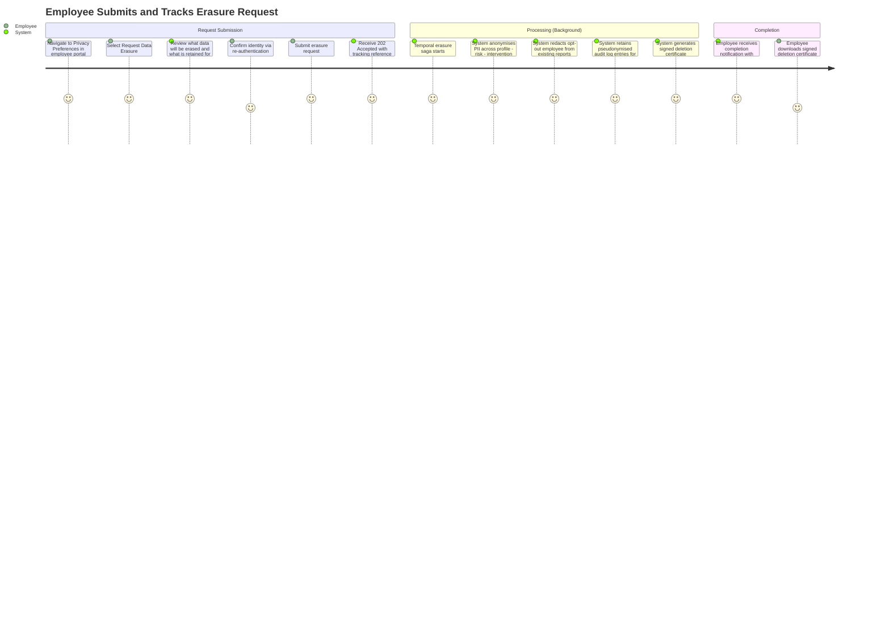

---

## Journey 8 — L&D Administrator Configures a New Competency Risk Rule

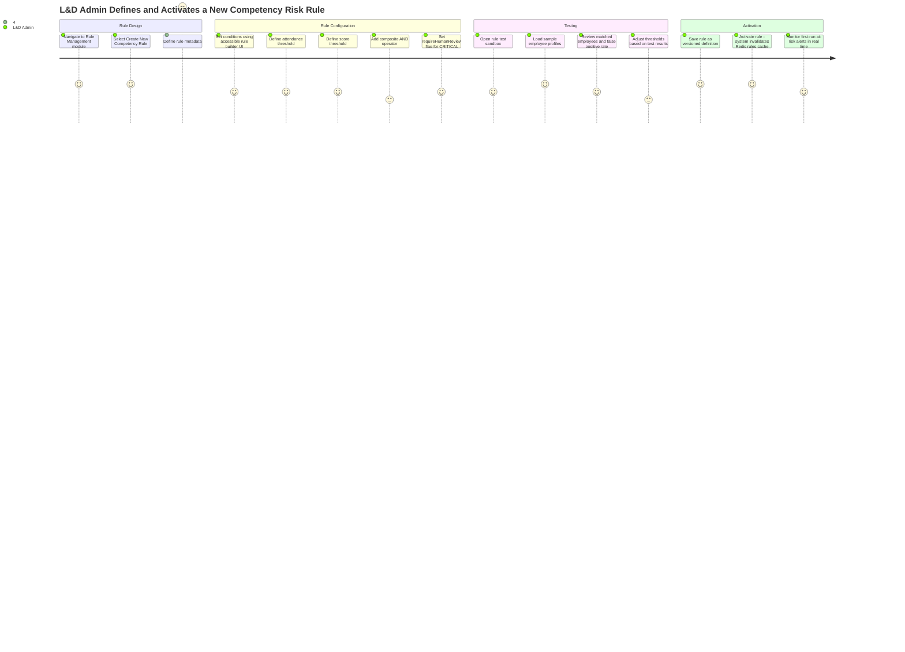

---

## Role-Based Dashboard Layouts

### Trainer Dashboard

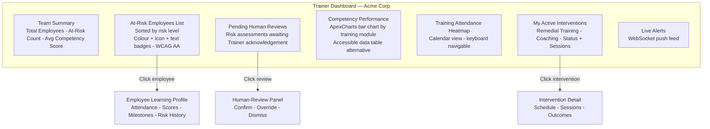

### L&D Administrator Dashboard

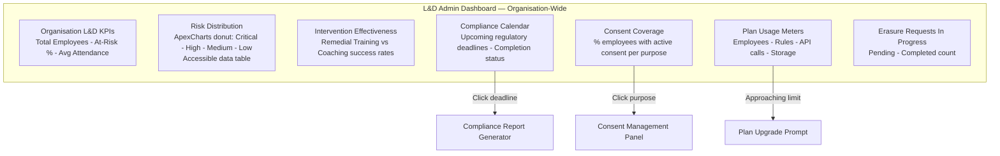

### L&D Manager Dashboard

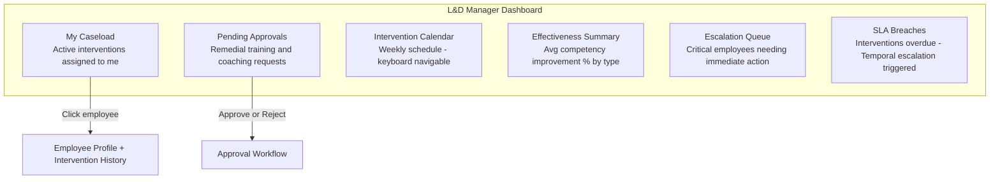

### Employee Self-Service Portal

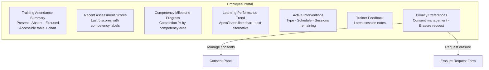

---

## Notification Touch-Points

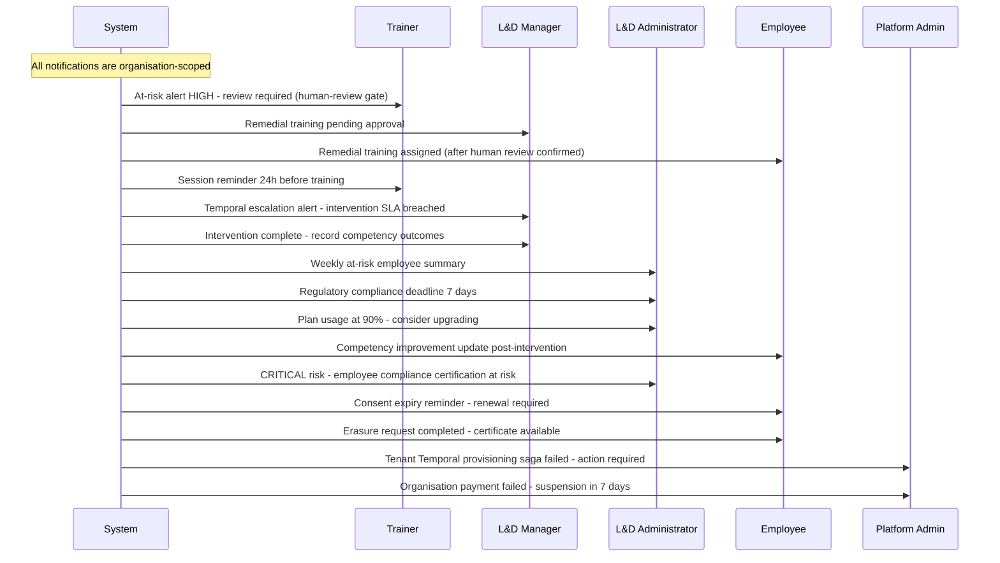
