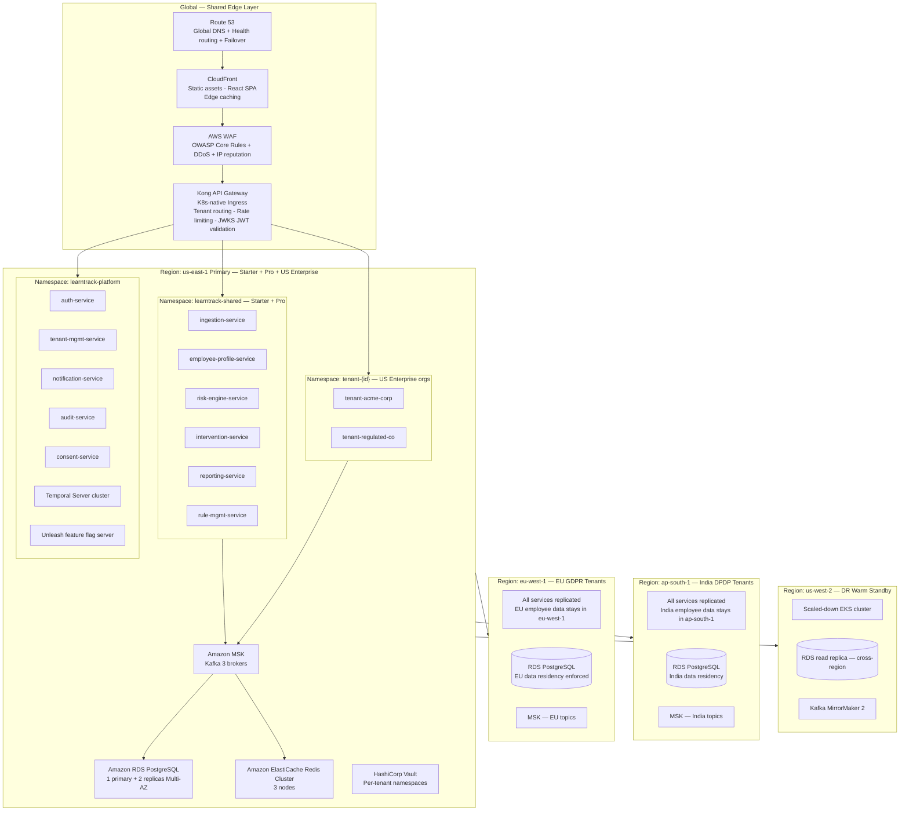
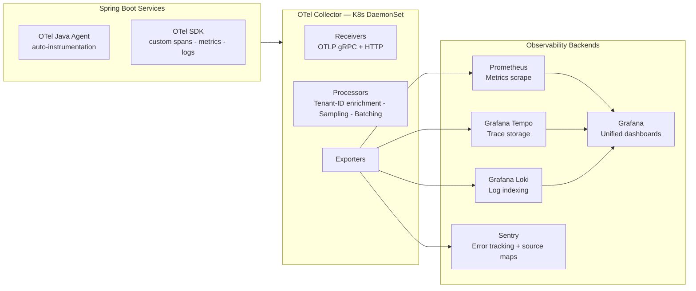
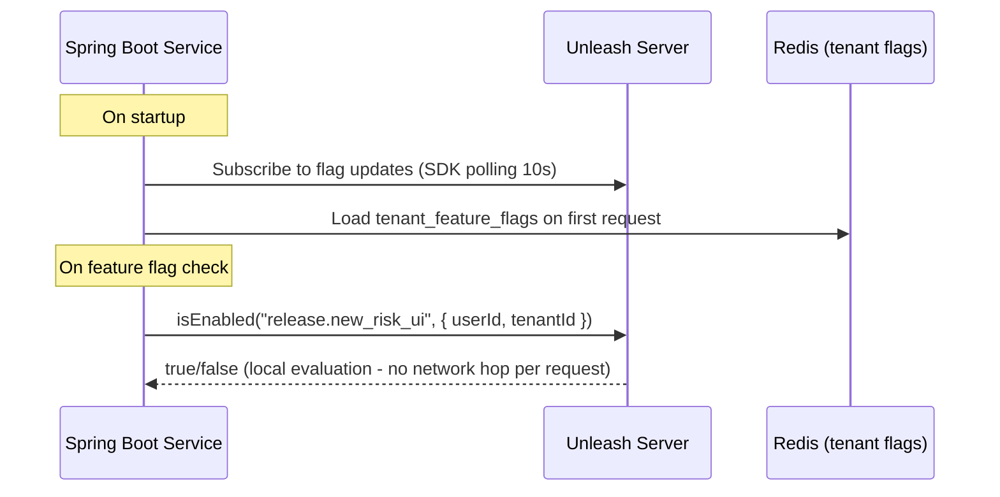
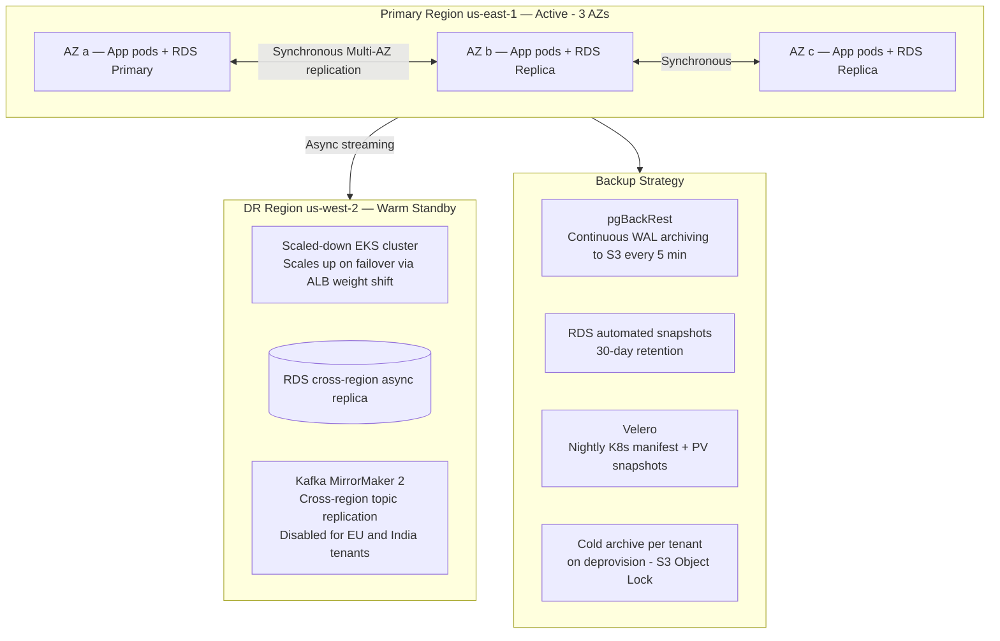
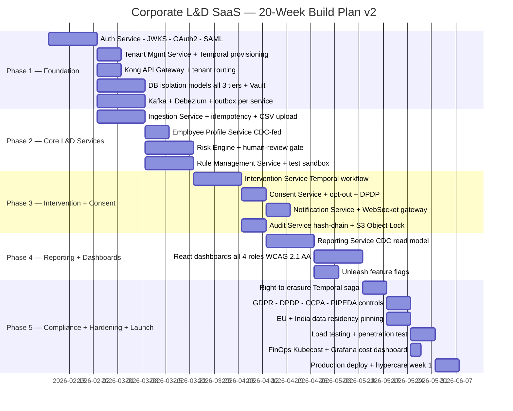

# Deployment Architecture

## Corporate L&D SaaS — Multi-Tenant (Production-Ready v2.0)

> **Changes from v1.0:** AWS primary with cloud-agnostic abstractions. OpenTelemetry unified observability replaces ELK-only stack. Added Grafana Loki + Tempo + Sentry. Added Unleash feature flag server. Added FinOps / cost-per-tenant monitoring. Extended compliance-driven region pinning (EU, India, US, Canada). pgBackRest + Velero added for backup. Istio policy defaults documented. Temporal deployment added. Added compliance regions table for US, Canada, EU, India.

---

## Cloud Strategy

- **Primary cloud:** AWS
- **Guiding principle:** Cloud-agnostic abstractions — all infrastructure accessed via interfaces (Spring Cloud AWS, Testcontainers, S3-compatible API, SMTP abstraction) so the platform can be migrated to Azure or GCP without architecture rewrites
- **Managed services used:** Amazon EKS, Amazon MSK (Kafka), Amazon ElastiCache (Redis), Amazon RDS (PostgreSQL), Amazon SES, Amazon SNS, Amazon S3, Amazon CloudFront, AWS WAF, AWS KMS
- **Self-hosted on K8s:** Kong, Temporal, Unleash, HashiCorp Vault, Prometheus, Grafana, Tempo, Loki, Sentry

---

## Global Infrastructure Overview



---

## Compliance-Driven Region Pinning

| Tenant region | AWS Region | Regulation | Data stays in |
|---|---|---|---|
| Europe (EU + UK tenants) | `eu-west-1` (Ireland) or `eu-central-1` (Frankfurt) | GDPR, UK GDPR, EAA | EU / UK only |
| India | `ap-south-1` (Mumbai) | DPDP Act 2023 | India only |
| United States | `us-east-1` (primary) | SOC 2, CCPA | US |
| Canada | `ca-central-1` (Montreal) | PIPEDA, Law 25 | Canada (Quebec requirement) |
| Multi-region tenants | Selected at onboarding | All applicable | Per `data_region` in tenant config |

`data_region` field in `TENANTS` table controls which region handles a tenant's traffic. Kong API Gateway routes based on this field. Cross-region Kafka replication is disabled for EU and India tenants — events are produced and consumed within the home region.

---

## Kubernetes Cluster Topology (Per Region)

```mermaid
graph TD
    subgraph CLUSTER["Amazon EKS Cluster — Per Region"]

        subgraph NS_PLATFORM["Namespace: learntrack-platform"]
            D_AUTH[auth-service\nreplicas: 3  HPA: 3–8]
            D_TMS[tenant-mgmt-service\nreplicas: 2  HPA: 2–6]
            D_NOTIF[notification-service\nreplicas: 2  HPA: 2–8]
            D_AUDIT[audit-service\nreplicas: 2  HPA: 2–4]
            D_CONSENT[consent-service\nreplicas: 2  HPA: 2–4]
            D_TEMPORAL[Temporal Server\n3 frontend + 3 history + 3 matching]
            D_UNLEASH[Unleash Server\nreplicas: 2]
        end

        subgraph NS_SHARED["Namespace: learntrack-shared — Starter + Pro"]
            D_ING[ingestion-service\nreplicas: 2  HPA: 2–10]
            D_PROF[employee-profile-service\nreplicas: 3  HPA: 3–10]
            D_RISK[risk-engine-service\nreplicas: 2  HPA: 2–8]
            D_RULE[rule-mgmt-service\nreplicas: 2  HPA: 2–4]
            D_INT[intervention-service\nreplicas: 2  HPA: 2–6]
            D_RPT[reporting-service\nreplicas: 2  HPA: 2–6]
            D_DBZ[Debezium Connect\nCDC cluster - 2 workers]
        end

        subgraph NS_ENT["Namespace: tenant-{id} — Enterprise orgs"]
            E_SVC[Dedicated pods per service\nHPA scaled independently]
        end

        subgraph NS_DATA["Namespace: learntrack-data"]
            STS_VAULT[Vault cluster\n3 nodes - Raft storage]
        end

        subgraph NS_OBS["Namespace: learntrack-observability"]
            OTEL_COL[OpenTelemetry Collector\nDaemonSet per node]
            PROM[Prometheus\nPer-tenant metric labels]
            GRAF[Grafana\nDashboards per service + per tenant]
            TEMPO[Grafana Tempo\nTrace backend]
            LOKI[Grafana Loki\nLog aggregation]
            SENTRY[Sentry\nError tracking per service]
        end

        INGRESS[ALB Ingress Controller\nTLS 1.3 - Tenant routing]
    end

    INGRESS --> NS_PLATFORM & NS_SHARED & NS_ENT
    NS_SHARED & NS_ENT --> NS_DATA
    NS_PLATFORM & NS_SHARED & NS_ENT --> NS_OBS
```



---

## Resource Sizing Per Service

| Service | Replicas (min–max) | CPU Request | CPU Limit | RAM Request | RAM Limit |
|---|---|---|---|---|---|
| Auth Service | 3 – 8 | 250m | 1000m | 512 Mi | 2 Gi |
| Tenant Mgmt Service | 2 – 6 | 250m | 1000m | 512 Mi | 2 Gi |
| Ingestion Service | 2 – 10 | 500m | 2000m | 1 Gi | 4 Gi |
| Employee Profile Service | 3 – 10 | 500m | 2000m | 1 Gi | 4 Gi |
| Risk Engine Service | 2 – 8 | 500m | 2000m | 1 Gi | 4 Gi |
| Rule Management Service | 2 – 4 | 250m | 1000m | 512 Mi | 2 Gi |
| Intervention Service | 2 – 6 | 250m | 1000m | 512 Mi | 2 Gi |
| Reporting Service | 2 – 6 | 500m | 2000m | 1 Gi | 4 Gi |
| Notification Service | 2 – 8 | 100m | 500m | 256 Mi | 1 Gi |
| Consent Service | 2 – 4 | 250m | 500m | 256 Mi | 1 Gi |
| Audit Service | 2 – 4 | 250m | 500m | 512 Mi | 1 Gi |
| Temporal Frontend | 3 | 250m | 1000m | 512 Mi | 2 Gi |
| Temporal History | 3 | 500m | 2000m | 1 Gi | 4 Gi |
| Debezium Connect | 2 | 500m | 1000m | 1 Gi | 2 Gi |
| Unleash Server | 2 | 100m | 500m | 256 Mi | 1 Gi |
| RDS PostgreSQL Primary | Fixed: 1 (db.r6g.2xlarge) | — | — | 8 Gi | 64 Gi |
| ElastiCache Redis Node | Fixed: 3 (cache.r6g.large) | — | — | 4 Gi | 16 Gi |
| MSK Kafka Broker | Fixed: 3 | — | — | 4 Gi | 16 Gi |
| Vault Node | Fixed: 3 | 500m | 1000m | 1 Gi | 4 Gi |

---

## CI/CD Pipeline

```mermaid
flowchart LR
    subgraph Source["Source Control (GitHub)"]
        GIT[Git monorepo or per-service repos\nProtected main branch]
    end

    subgraph CI["GitHub Actions — per service on PR merge"]
        LINT[Checkstyle + SpotBugs\nSpring Boot static analysis]
        UT[JUnit 5 Unit Tests\nMin 80% coverage - JaCoCo]
        IT[Integration Tests\nTestcontainers - PostgreSQL + Kafka]
        SAST[Security Scan\nSnyk SCA + OWASP Dependency-Check]
        BUILD[Build Docker image\npush to Amazon ECR]
        HELM[Package Helm chart\nversion-tagged]
    end

    subgraph CD["ArgoCD GitOps — per environment"]
        DEV[dev namespace\nAuto-deploy on main merge]
        TEST[test namespace\nSmoke + regression tests]
        STG[staging namespace\nPerf tests + UAT]
        GATE{Manual approval\nRelease Manager}
        PROD[production namespaces\nRolling update - zero downtime]
    end

    subgraph POST["Post-Deploy"]
        SMOKE[Smoke Tests\nCritical L&D API endpoints]
        MON[15 min observation window\nOTel metrics + Sentry errors]
        ROLL[Auto-rollback\nif P95 latency spiked or error rate above 1%]
    end

    GIT -->|PR merge| LINT --> UT --> IT --> SAST --> BUILD --> HELM
    HELM --> DEV --> TEST --> STG --> GATE --> PROD --> SMOKE --> MON
    MON -->|Error rate above 1%| ROLL
```



---

## Observability Stack — OpenTelemetry Unified

> **v2 change:** All services emit traces, metrics, and logs via OpenTelemetry SDK. OTel Collector routes to backend stores. This replaces the ELK-only approach and provides correlated observability across all layers.



### Key Metrics per Service

| Metric | Target | Alert Threshold |
|---|---|---|
| API latency P95 | < 200 ms | > 500 ms for 5 min |
| API error rate | < 0.1% | > 1% for 2 min |
| Dashboard load time | < 2 s | > 4 s for 3 min |
| Risk engine batch 1k employees | < 2 min | > 3 min |
| Report generation | < 30 s | > 60 s |
| Kafka consumer lag | < 1000 msgs | > 5000 for 5 min |
| DLQ depth | 0 | > 0 for 5 min |
| DB replication lag | < 5 s | > 60 s |
| Temporal workflow error rate | < 0.1% | > 1% for 5 min |

### Log Structure (All Services)
```json
{
  "timestamp": "2026-05-28T08:00:00Z",
  "level": "INFO",
  "service": "employee-profile-service",
  "trace_id": "abc123",
  "span_id": "def456",
  "tenant_id": "tenant_acme_corp",
  "user_id": "usr_789",
  "event": "profile.updated",
  "message": "Profile rebuilt for employee emp_456"
}
```

All logs are tagged with `tenant_id` for per-tenant log filtering and cross-service trace correlation via `trace_id`.

---

## Feature Flags — Unleash

Two types of flags coexist:

| Flag type | Storage | Purpose | Example |
|---|---|---|---|
| **Tenant plan flags** | `tenant_feature_flags` in tenant-db (Redis-cached) | Plan gating — what a tenant can access | `feature.ml_risk_scoring = false` for Starter |
| **Release flags** | Unleash OSS server | Safe progressive delivery, kill switches, A/B | `release.new_risk_ui = enabled for 20% of tenants` |



---

## High Availability & Disaster Recovery



| DR Metric | Starter / Pro | Enterprise |
|---|---|---|
| Recovery Time Objective (RTO) | < 4 hours | < 1 hour |
| Recovery Point Objective (RPO) | < 1 hour | < 15 minutes |
| DB backup frequency | Continuous WAL + daily snapshot | Continuous WAL + hourly snapshot |
| Kafka replication | MirrorMaker 2 (US only) | MirrorMaker 2 (US only) |
| DR test frequency | Quarterly | Monthly |
| SLA uptime guarantee | 99.5% | 99.9% |

**Failover procedure (documented runbook):**
1. Route 53 health check detects primary region unhealthy
2. DNS weight shifts to DR region (Route 53 failover routing)
3. DR EKS cluster scales up via Karpenter node auto-provisioner
4. RDS cross-region replica promoted to writable primary
5. Kafka MirrorMaker 2 topic offsets reconciled on first consumer start
6. Temporal workflows resume from last checkpoint (durable by design)
7. Smoke tests validate critical endpoints
8. L2/L3 on-call acknowledged via PagerDuty

---

## Security Controls

| Control | Implementation |
|---|---|
| Tenant data isolation | RLS (Starter) · Schema separation (Pro) · Dedicated DB (Enterprise) |
| Network isolation | Kubernetes NetworkPolicy — services cannot cross namespace boundaries |
| Istio mTLS | STRICT mode; circuit breaker 5 errors → open; 3 retries with backoff |
| Secrets management | HashiCorp Vault — per-tenant namespace; auto-rotated DEKs; no secrets in K8s ConfigMaps |
| KMS | AWS KMS CMK per region; Vault transit wraps DEKs; envelope encryption for PII columns + S3 |
| API rate limiting | Kong rate-limit plugin — per-tenant per-endpoint; 429 with Retry-After |
| Container security | Non-root containers, read-only root filesystem, seccomp + AppArmor profiles |
| Image scanning | Amazon ECR image scanning (Basic) + Snyk in CI — blocks on CRITICAL CVEs |
| WAF | AWS WAF OWASP Core Rule Set — blocks SQLi, XSS, CSRF; AWS Shield Standard for DDoS |
| PII column encryption | AES-256 via Vault transit; envelope encrypted columns: email, phone, dob, name fields |
| Audit trail immutability | Hash-chained audit_log table + periodic S3 Object Lock export |
| Penetration testing | Quarterly external pentest + annual red-team exercise |
| Compliance | GDPR · UK GDPR · CCPA/CPRA · PIPEDA / Law 25 · DPDP Act 2023 · SOC 2 Type II |
| Accessibility | WCAG 2.1 AA · EAA (EN 301 549) |
| Data residency | EU tenants pinned to eu-west-1; India tenants pinned to ap-south-1; Kafka not cross-region |

---

## FinOps — Cost-per-Tenant Monitoring

> **New in v2.** Cost allocation per tenant is required to defend gross margin as Pro/Enterprise tenants scale.

```mermaid
graph LR
    subgraph Sources["Cost Signal Sources"]
        K8S_TAGS[K8s pods tagged\ntenant_id + tier]
        RDS_TAGS[RDS instances tagged]
        MSK_TAGS[MSK clusters tagged]
        S3_TAGS[S3 bucket tags]
    end

    subgraph Collection["Collection"]
        CUR[AWS Cost and Usage Report\nS3 export]
        KUBECOST[Kubecost\nK8s namespace cost allocation]
    end

    subgraph Dashboard["FinOps Dashboard — Grafana"]
        COST_TENANT[Cost per tenant per month]
        COST_TIER[Cost per plan tier]
        MARGIN[Gross margin per tenant]
        ALERT[Alert: cost spike above 20% month-over-month]
    end

    Sources --> Collection --> Dashboard
```



All K8s pods carry labels: `tenant_id`, `tier` (starter/pro/enterprise), `service`. AWS resource tags mirror these. Kubecost aggregates K8s compute cost; AWS CUR provides storage and managed service costs. Grafana dashboard surfaces cost per tenant for Sales and Finance.

---

## SaaS Go-Live Checklist

### Platform Readiness

| Item | Owner | Status |
|---|---|---|
| All 11 services deployed and health-checked in production | DevOps | |
| Temporal cluster healthy (Frontend + History + Matching) | DevOps | |
| Multi-region failover tested end-to-end (runbook validated) | DevOps | |
| AWS WAF rules validated against OWASP test suite | Security | |
| Tenant provisioning Temporal saga tested < 5 min | Engineering | |
| Billing integration (Stripe) tested with live keys | Finance / Engineering | |
| Unleash feature flag server operational | Engineering | |
| OpenTelemetry traces visible in Grafana Tempo | DevOps | |
| Sentry project per service receiving test errors | DevOps | |
| All PagerDuty alerts configured and tested | DevOps | |
| Penetration test completed and findings remediated | Security | |
| SOC 2 Type II controls documented | Security / Compliance | |
| WCAG 2.1 AA audit completed on all portals | UX / Engineering | |
| DPA template published and linked at tenant sign-up | Legal / Product | |
| Data residency pinning tested for EU and India regions | Engineering | |
| pgBackRest WAL archiving confirmed to S3 | DevOps | |
| Velero K8s backup confirmed with restore test | DevOps | |

### First Corporate Customer Readiness

| Item | Owner |
|---|---|
| Default competency risk rule library ready (min 15 rules) | L&D Product |
| Default compliance report templates validated (GDPR, DPDP, SOC 2) | Compliance Officer |
| LMS / HRIS API connectors tested (REST + CSV upload) | Engineering |
| Consent disclosure texts reviewed by legal per jurisdiction | Legal |
| WCAG 2.1 AA accessibility statement published | UX |
| User documentation and help centre live | Product |
| In-app onboarding walkthrough (keyboard-accessible) | UX / Engineering |
| Support ticketing system configured per org tier | Support |

---

## 20-Week Build & Launch Roadmap


