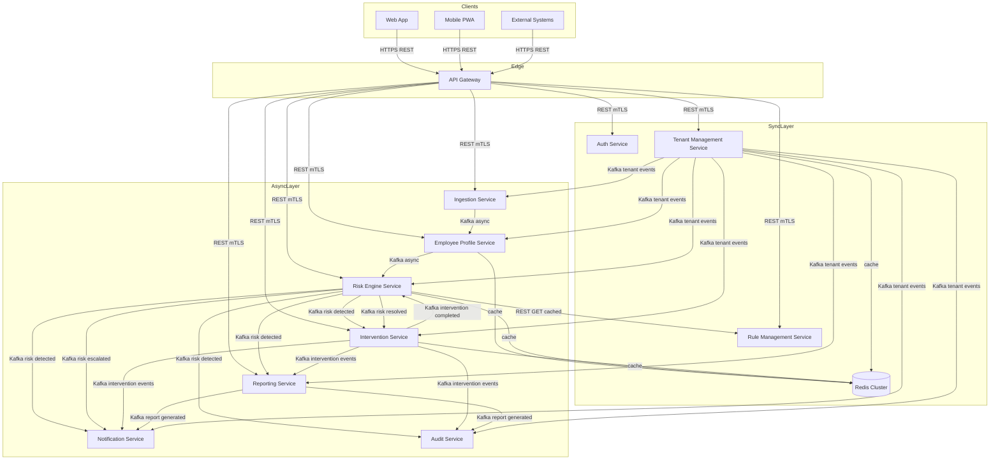

# Microservice Communication Architecture
## Corporate L&D Progress, Intervention & Compliance Tracking SaaS

### Document Version: 1.0
### Date: February 2026

---

## 1. Overview

This document describes the communication architecture adopted across all microservices in the Corporate L&D SaaS platform. The system uses a **hybrid communication model** — not a single protocol for all interactions. The choice between asynchronous event-driven communication (Apache Kafka) and synchronous REST over mTLS is deliberate and driven by the nature of each interaction, the coupling tolerance between services, and the operational characteristics required (latency, reliability, fan-out, auditability).

---

## 2. Communication Model Summary

| Communication Path | Mechanism | Pattern |
|---|---|---|
| Client (Web / Mobile) → API Gateway | HTTPS / REST | Synchronous |
| API Gateway → Domain Services | REST via Kong / AWS API GW | Synchronous |
| Ingestion → Employee Profile | Kafka (`data.ingested`) | Asynchronous |
| Employee Profile → Risk Engine | Kafka (`profile.updated`) | Asynchronous |
| Risk Engine → Intervention, Notification, Reporting, Audit | Kafka (`risk.detected`, `risk.escalated`, `risk.resolved`) | Asynchronous |
| Intervention → Reporting, Notification, Audit, Risk Engine | Kafka (`intervention.*`) | Asynchronous |
| Reporting → Notification, Audit | Kafka (`report.generated`) | Asynchronous |
| Tenant Management → All Domain Services | Kafka (`tenant.provisioned`, `tenant.plan.upgraded`, `tenant.deprovisioned`) | Asynchronous |
| Any Service → Redis | Direct cache read/write | Synchronous |
| Any Service → Tenant Management Service (cache miss) | REST HTTP GET | Synchronous |
| Risk Engine → Rule Management API | REST HTTP GET (Redis-cached, TTL=5min) | Synchronous |
| Service-to-service (general) | mTLS via Istio / Linkerd service mesh | Synchronous |

---

## 3. Communication Flow Diagram



---

## 4. Asynchronous Communication — Apache Kafka

### 4.1 Where It Is Used

Kafka is the event bus for all **domain-to-domain, downstream fan-out communication**:

| Event | Publisher | Consumers |
|---|---|---|
| `data.ingested` | Ingestion Service | Employee Profile Service |
| `profile.updated` | Employee Profile Service | Risk Engine Service |
| `profile.created` | Employee Profile Service | Risk Engine, Audit Service |
| `risk.detected` | Risk Engine | Intervention, Notification, Reporting, Audit |
| `risk.escalated` | Risk Engine | Notification, Audit |
| `risk.resolved` | Risk Engine | Intervention, Notification, Reporting |
| `intervention.assigned` | Intervention Service | Notification, Audit, Reporting |
| `intervention.approved` | Intervention Service | Notification, Audit |
| `intervention.session.logged` | Intervention Service | Reporting, Audit |
| `intervention.completed` | Intervention Service | Risk Engine, Reporting, Notification, Audit |
| `report.generated` | Reporting Service | Notification, Audit |
| `tenant.provisioned` | Tenant Management | All domain services |
| `tenant.plan.upgraded` | Tenant Management | All domain services |
| `tenant.deprovisioned` | Tenant Management | All domain services |

### 4.2 Justification

#### ✅ Decoupling of Domain Services
Domain services (Ingestion, Profile, Risk, Intervention, Reporting) operate in distinct bounded contexts. Kafka ensures producers have **zero knowledge of their consumers** — the Ingestion Service publishes `data.ingested` and never needs to know whether the Employee Profile Service is healthy, scaled up, or temporarily unavailable. This eliminates tight compile-time and runtime coupling across domain boundaries.

#### ✅ Fan-Out to Multiple Consumers
Several events (notably `risk.detected`) are consumed by **four independent services** simultaneously — Intervention, Notification, Reporting, and Audit. Kafka's publish-subscribe model handles this naturally with consumer groups. A synchronous approach would require the Risk Engine to make four sequential or parallel HTTP calls, introducing cascading failure risk and coupling the Risk Engine's response time to the slowest downstream service.

#### ✅ Resilience and Temporal Decoupling
Kafka persists events durably on disk. If a downstream consumer (e.g., the Notification Service) is temporarily unavailable due to a deployment or failure, it will consume the buffered events upon recovery with no data loss. Synchronous calls would require complex retry logic and circuit breakers at every hop to achieve the same resilience.

#### ✅ Event Sourcing and Audit Trail
All domain events flow through Kafka and are consumed by the Audit Service, which writes an immutable compliance log. This event-sourced audit trail is a natural by-product of the Kafka-based architecture — every state change in the system is captured as an event with a standard envelope including `event_id`, `correlation_id`, `timestamp`, and `tenant_id`.

#### ✅ Multi-Tenancy at Scale
Kafka topics are namespaced by `tenant_id` (`{tenant_id}.{domain}.{event_type}`). Enterprise tenants receive dedicated topics; shared-tier tenants share topics partitioned by `tenant_id`. This means tenant isolation is maintained at the messaging layer without requiring separate brokers.

#### ✅ Backpressure and Load Buffering
Data ingestion events can arrive in large batches (e.g., 150 attendance records at once triggering 150 `profile.updated` events). Kafka acts as a buffer between the high-throughput Ingestion Service and the computationally heavier Risk Engine, preventing burst traffic from overwhelming downstream services.

#### ✅ Replay and Recovery
The Dead Letter Queue (DLQ) strategy — routing failed messages to `{tenant_id}.dlq.{service_name}` after 3 retries with exponential back-off — enables operational teams to replay failed events without data loss or manual re-ingestion.

---

## 5. Synchronous Communication — REST over mTLS

### 5.1 Where It Is Used

| Path | Protocol | Reason |
|---|---|---|
| Client → API Gateway | HTTPS REST | Standard external API contract |
| API Gateway → Domain Services | REST via service mesh | Request/response semantics required |
| Any Service → Tenant Management (cache miss) | HTTP GET | Blocking context needed before query execution |
| Risk Engine → Rule Management API | HTTP GET (Redis-cached) | Rules must be loaded before evaluation begins |
| Any Service → Redis | Native Redis protocol | Low-latency cache read/write |
| All service-to-service calls | mTLS via Istio / Linkerd | Zero-trust security across the mesh |

### 5.2 Justification

#### ✅ Request / Response Semantics Are Required
Client-facing operations — viewing a dashboard, generating a report on demand, submitting a rule — require an **immediate response**. These interactions cannot be deferred asynchronously. A user submitting a new competency rule via `POST /api/v1/rules` must receive a `201 Created` response with the `rule_id` before the session ends. Kafka would introduce unacceptable latency and complexity for these interactions.

#### ✅ Tenant Context Resolution Must Be Synchronous
Every domain service must resolve the tenant's database schema, feature flags, and plan limits **before executing any query**. This is achieved via a Redis cache (`tenant_ctx:{tenant_id}`, TTL=60s) with a synchronous fallback to the Tenant Management Service on cache miss. Making this asynchronous would require every service to block on a Kafka reply topic — equivalent complexity with worse latency and no resilience benefit.

#### ✅ Rule Loading Is a Blocking Prerequisite
The Risk Engine cannot begin rule evaluation until it has loaded the active competency rules for the organisation. This is a **prerequisite, not a side-effect** — it must complete before processing proceeds. Synchronous HTTP GET to the Rule Management API (cached in Redis with a 5-minute TTL) provides the correct semantic. An event-driven approach here would invert the dependency model unnecessarily.

#### ✅ mTLS Provides Zero-Trust Security Across All Synchronous Calls
All service-to-service REST calls traverse the Istio / Linkerd service mesh with mutual TLS. This means every caller is authenticated, every channel is encrypted in transit, and no service can be reached without a valid certificate — regardless of whether the call originates inside or outside the cluster. This satisfies the SOC 2 Type II and GDPR requirements without adding application-layer auth logic to every service.

---

## 6. Broker Flexibility — Kafka vs RabbitMQ

The Event Contracts specification notes the event bus as **"Kafka / RabbitMQ"**, indicating the broker has not been fully locked in at the contract level. The following table compares the two options in the context of this platform:

| Criteria | Apache Kafka | RabbitMQ |
|---|---|---|
| Message retention | Durable, configurable retention (days/weeks) | Messages deleted after consumption by default |
| Replay capability | Native — consumers can rewind offset | Requires additional tooling or dead-letter queues |
| Throughput | Very high (millions of msgs/sec) | Moderate (tens of thousands/sec) |
| Fan-out (pub/sub) | Native with consumer groups | Supported via exchanges and bindings |
| Multi-tenancy isolation | Topic-per-tenant or partition-by-tenant | Virtual host or exchange per tenant |
| Operational complexity | Higher — requires ZooKeeper or KRaft | Lower — simpler to operate |
| Best fit | High-volume event streaming, audit logs, replay | Task queues, RPC-style messaging, simpler workflows |

**Recommendation:** Given the platform's requirements for **durable audit logs, high-volume ingestion events, event replay via DLQ, and multi-tenant topic isolation**, Apache Kafka is the preferred broker. RabbitMQ should be considered only for lower-volume, internal task-queue use cases if they arise (e.g., scheduled report generation jobs).

---

## 7. Decision Summary — When to Use Each Pattern

| Use This | When |
|---|---|
| **Kafka (Async)** | The producer does not need an immediate response |
| **Kafka (Async)** | Multiple independent services need to react to the same event |
| **Kafka (Async)** | The operation may need to be replayed or audited |
| **Kafka (Async)** | Downstream processing is long-running or computationally heavy |
| **Kafka (Async)** | Temporal decoupling is acceptable (consumer can be briefly unavailable) |
| **REST / mTLS (Sync)** | The caller needs an immediate response before proceeding |
| **REST / mTLS (Sync)** | The operation is a user-facing request/response interaction |
| **REST / mTLS (Sync)** | The result is a blocking prerequisite for subsequent logic |
| **Redis (Sync Cache)** | Frequently-read, low-churn data needing sub-millisecond access |

---

## 8. Event Envelope Standard

All Kafka events conform to a standard envelope to ensure consistency, traceability, and tenant isolation:

```json
{
  "event_id":       "uuid-v4",
  "event_type":     "risk.detected",
  "event_version":  "v1",
  "tenant_id":      "tenant_acme_corp",
  "source_service": "risk-engine-service",
  "timestamp":      "2026-02-04T10:30:00Z",
  "correlation_id": "trace-uuid",
  "payload":        {}
}
```

| Field | Purpose |
|---|---|
| `event_id` | Idempotency — consumers deduplicate on this |
| `event_type` | Consumer routing and schema selection |
| `event_version` | Schema versioning — consumers reject unknown versions |
| `tenant_id` | Mandatory tenant filter — consumers MUST validate before processing |
| `source_service` | Observability and debugging |
| `correlation_id` | Distributed tracing across the full event chain |

---

## 9. Failure Handling

### Kafka — Dead Letter Queue Strategy

| Scenario | Behaviour |
|---|---|
| Consumer throws exception | Retry up to 3 times with exponential back-off (1s → 4s → 16s) |
| All retries exhausted | Route to `{tenant_id}.dlq.{service_name}` topic |
| DLQ message received | Alert on-call engineer + log to Audit Service |
| Manual recovery | Admin replays DLQ messages via Ops API |

### Synchronous REST — Resilience Patterns

| Pattern | Applied Where |
|---|---|
| Redis cache (TTL=60s) | Tenant context resolution — reduces TMS load and latency |
| Redis cache (TTL=5min) | Rule loading by Risk Engine — prevents rule DB hammering |
| Circuit breaker | All synchronous service-to-service calls via service mesh |
| mTLS mutual authentication | All intra-cluster REST calls — zero-trust enforcement |

---

## 10. Schema Versioning Policy

| Rule | Detail |
|---|---|
| `event_version` field | Always present in every event envelope |
| Backward-compatible changes | Add optional fields only — never remove or rename existing fields |
| Breaking changes | Bump version (`v1` → `v2`) — run both versions in parallel during migration |
| Deprecation window | Old version supported for a minimum of 90 days post new version release |
| Schema registry | All schemas registered in Confluent Schema Registry / AWS Glue |

---

*Document generated from architecture review of the Corporate L&D SaaS platform. Cross-references: `01-architecture.md`, `SaaS_Event_Contracts.md`, `03-technical-flows.md`.*
